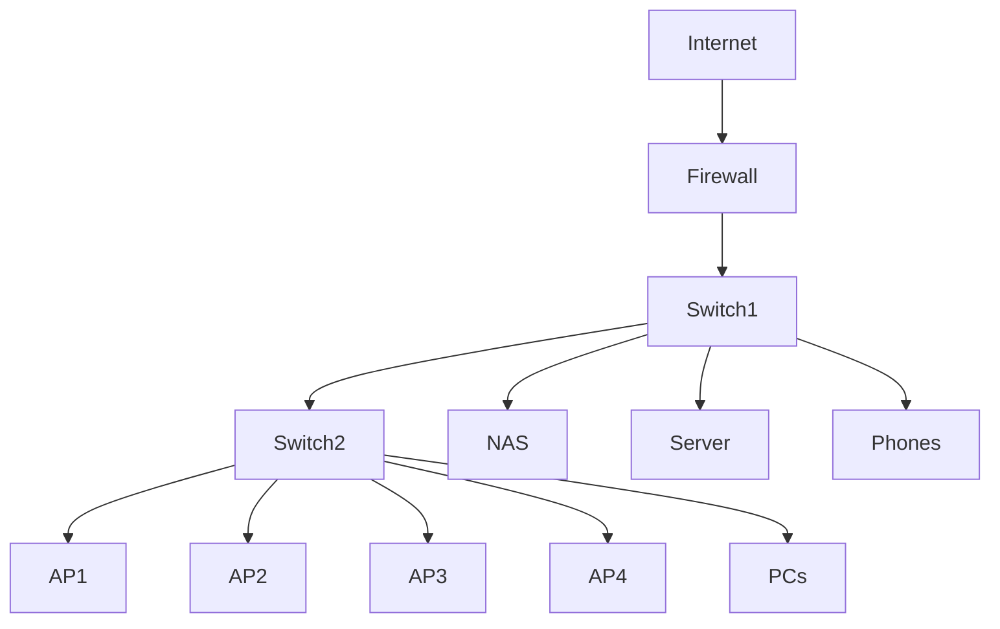
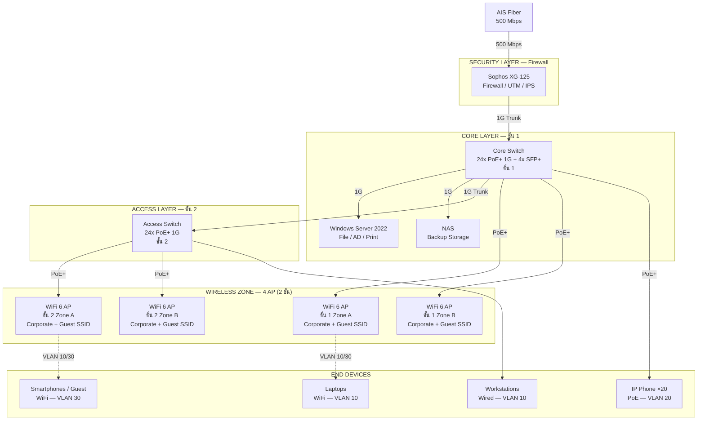

# Before → After: SMB Diagram Rough to Pragma Style

> ตัวอย่างการเอา diagram คร่าวๆ จากลูกค้า แล้วให้ Claude แปลงเป็น Pragma Style

---

## 🔴 Before — ข้อมูลที่ลูกค้าส่งมา

ลูกค้าส่ง spec มาในอีเมลแบบนี้:

```
ต้องการ network ใหม่สำหรับออฟฟิศครับ
- คน 45 คน
- Internet AIS Fiber 500 Mbps
- Firewall Sophos XG-125
- Switch PoE 2 ตัว (ชั้น 1 กับ ชั้น 2)
- WiFi 4 จุด
- Server room ชั้น 1 มี NAS + Windows Server 1 ตัว
- IP Phone 20 เครื่อง
```

และแนบ diagram มาแบบนี้ (Mermaid คร่าวๆ):



---

## 💬 Prompt ที่ใช้

```
ใช้ template smb-single-site.md แบบ Pragma Style
ปรับสำหรับลูกค้า (ลบชื่อ):
- Users: 45 คน, 2 ชั้น
- Internet: AIS Fiber 500 Mbps (ไม่มี backup ตอนนี้)
- Firewall: Sophos XG-125
- Core Switch: 1 ตัว (ชั้น 1, PoE+ 24-port)
- Access Switch: 1 ตัว (ชั้น 2, PoE+ 24-port)
- WiFi: 4 AP กระจาย 2 ชั้น (vendor TBD)
- Server: Windows Server 2022 + NAS (ชั้น 1)
- VoIP: IP Phone 20 เครื่อง (PoE)
- แยก VLAN: Corporate, VoIP, Guest WiFi
```

---

## 🟢 After — Pragma Style Output

### Mermaid (สำหรับ review / share ง่าย)



### Draw.io XML (Pragma Dark Style)

```xml
<mxfile host="app.diagrams.net" version="24.0.0">
  <diagram name="SMB 45 Users — 2 Floors — Pragma Style">
    <mxGraphModel dx="1400" dy="1000" grid="0" background="#1a1a2e">
      <root>
        <mxCell id="0"/><mxCell id="1" parent="0"/>

        <mxCell id="title" value="SMB Network — 45 Users, 2 Floors" style="text;html=1;strokeColor=none;fillColor=none;align=center;fontSize=20;fontStyle=1;fontColor=#ffffff;" vertex="1" parent="1">
          <mxGeometry x="100" y="20" width="800" height="36" as="geometry"/>
        </mxCell>

        <!-- INTERNET LAYER -->
        <mxCell id="L1" value="INTERNET / ISP" style="swimlane;startSize=30;fillColor=#1a2a4a;strokeColor=#4a90d9;fontColor=#ffffff;fontSize=13;fontStyle=1;html=1;" vertex="1" parent="1">
          <mxGeometry x="40" y="66" width="920" height="100" as="geometry"/>
        </mxCell>
        <mxCell id="isp" value="AIS Fiber&#xa;500 Mbps" style="sketch=0;html=1;fillColor=#036897;strokeColor=#ffffff;strokeWidth=2;verticalLabelPosition=bottom;verticalAlign=top;align=center;outlineConnect=0;shape=mxgraph.cisco.routers.atm_router;fontColor=#ffffff;fontSize=11;" vertex="1" parent="L1">
          <mxGeometry x="390" y="18" width="78" height="53" as="geometry"/>
        </mxCell>

        <!-- SECURITY LAYER -->
        <mxCell id="L2" value="SECURITY LAYER — Firewall / UTM / IPS" style="swimlane;startSize=30;fillColor=#2d1a0e;strokeColor=#8b3a0f;fontColor=#ffffff;fontSize=13;fontStyle=1;html=1;" vertex="1" parent="1">
          <mxGeometry x="40" y="196" width="920" height="120" as="geometry"/>
        </mxCell>
        <mxCell id="fw" value="Sophos XG-125&#xa;Firewall / UTM / IPS&#xa;500 Mbps" style="sketch=0;points=[[0.015,0.015,0],[0.985,0.015,0],[0.985,0.985,0],[0.015,0.985,0],[0.25,0,0],[0.5,0,0],[0.75,0,0],[1,0.25,0],[1,0.5,0],[1,0.75,0],[0.75,1,0],[0.5,1,0],[0.25,1,0],[0,0.75,0],[0,0.5,0],[0,0.25,0]];verticalLabelPosition=bottom;html=1;verticalAlign=top;aspect=fixed;align=center;shape=mxgraph.cisco19.rect;prIcon=firewall;fillColor=#8b3a0f;strokeColor=#ff9800;fontColor=#ffffff;fontSize=10;" vertex="1" parent="L2">
          <mxGeometry x="396" y="20" width="128" height="60" as="geometry"/>
        </mxCell>

        <!-- CORE LAYER -->
        <mxCell id="L3" value="CORE LAYER — ชั้น 1 (Server Room)" style="swimlane;startSize=30;fillColor=#0d2b1a;strokeColor=#2e7d32;fontColor=#ffffff;fontSize=13;fontStyle=1;html=1;" vertex="1" parent="1">
          <mxGeometry x="40" y="346" width="920" height="140" as="geometry"/>
        </mxCell>
        <mxCell id="core" value="Core Switch&#xa;24x PoE+ 1G + 4x SFP+&#xa;ชั้น 1" style="strokeColor=#ffffff;sketch=0;html=1;fillColor=#2e7d32;strokeWidth=2;verticalLabelPosition=bottom;verticalAlign=top;align=center;outlineConnect=0;shape=mxgraph.cisco.switches.layer_3_switch;fontColor=#ffffff;fontSize=10;" vertex="1" parent="L3">
          <mxGeometry x="390" y="28" width="64" height="64" as="geometry"/>
        </mxCell>
        <mxCell id="winsrv" value="Windows Server 2022&#xa;File / AD / Print" style="shape=mxgraph.cisco.servers.standard_server;sketch=0;html=1;fillColor=#2e7d32;strokeColor=#ffffff;fontColor=#ffffff;fontSize=10;verticalLabelPosition=bottom;verticalAlign=top;align=center;" vertex="1" parent="L3">
          <mxGeometry x="180" y="25" width="50" height="65" as="geometry"/>
        </mxCell>
        <mxCell id="nas" value="NAS&#xa;Backup Storage" style="shape=cylinder3;whiteSpace=wrap;html=1;fillColor=#2e7d32;strokeColor=#ffffff;fontColor=#ffffff;fontSize=10;verticalLabelPosition=bottom;verticalAlign=top;" vertex="1" parent="L3">
          <mxGeometry x="660" y="20" width="60" height="70" as="geometry"/>
        </mxCell>

        <!-- ACCESS LAYER -->
        <mxCell id="L4" value="ACCESS LAYER — ชั้น 2" style="swimlane;startSize=30;fillColor=#1a0d2b;strokeColor=#6a1b9a;fontColor=#ffffff;fontSize=13;fontStyle=1;html=1;" vertex="1" parent="1">
          <mxGeometry x="40" y="516" width="920" height="110" as="geometry"/>
        </mxCell>
        <mxCell id="acc" value="Access Switch&#xa;24x PoE+ 1G&#xa;ชั้น 2" style="strokeColor=#ffffff;sketch=0;html=1;fillColor=#6a1b9a;strokeWidth=2;verticalLabelPosition=bottom;verticalAlign=top;align=center;outlineConnect=0;shape=mxgraph.cisco.switches.layer_2_remote_switch;fontColor=#ffffff;fontSize=10;" vertex="1" parent="L4">
          <mxGeometry x="390" y="30" width="101" height="50" as="geometry"/>
        </mxCell>

        <!-- WIRELESS ZONE -->
        <mxCell id="L5" value="WIRELESS ZONE — 4x WiFi 6 AP (PoE+) | VLAN 10 Corporate / VLAN 30 Guest" style="swimlane;startSize=30;fillColor=#0d1f2b;strokeColor=#0288d1;fontColor=#ffffff;fontSize=13;fontStyle=1;html=1;" vertex="1" parent="1">
          <mxGeometry x="40" y="656" width="920" height="120" as="geometry"/>
        </mxCell>
        <mxCell id="ap1" value="WiFi 6 AP&#xa;ชั้น 1 Zone A" style="points=[[0.03,0.36,0],[0.18,0,0],[0.5,0.34,0],[0.82,0,0],[0.97,0.36,0],[1,0.67,0],[0.975,0.975,0],[0.5,1,0],[0.025,0.975,0],[0,0.67,0]];verticalLabelPosition=bottom;sketch=0;html=1;verticalAlign=top;aspect=fixed;align=center;shape=mxgraph.cisco19.wireless_access_point2;fillColor=#0288d1;strokeColor=#ffffff;fontColor=#ffffff;fontSize=10;" vertex="1" parent="L5">
          <mxGeometry x="130" y="25" width="50" height="50" as="geometry"/>
        </mxCell>
        <mxCell id="ap2" value="WiFi 6 AP&#xa;ชั้น 1 Zone B" style="points=[[0.03,0.36,0],[0.18,0,0],[0.5,0.34,0],[0.82,0,0],[0.97,0.36,0],[1,0.67,0],[0.975,0.975,0],[0.5,1,0],[0.025,0.975,0],[0,0.67,0]];verticalLabelPosition=bottom;sketch=0;html=1;verticalAlign=top;aspect=fixed;align=center;shape=mxgraph.cisco19.wireless_access_point2;fillColor=#0288d1;strokeColor=#ffffff;fontColor=#ffffff;fontSize=10;" vertex="1" parent="L5">
          <mxGeometry x="330" y="25" width="50" height="50" as="geometry"/>
        </mxCell>
        <mxCell id="ap3" value="WiFi 6 AP&#xa;ชั้น 2 Zone A" style="points=[[0.03,0.36,0],[0.18,0,0],[0.5,0.34,0],[0.82,0,0],[0.97,0.36,0],[1,0.67,0],[0.975,0.975,0],[0.5,1,0],[0.025,0.975,0],[0,0.67,0]];verticalLabelPosition=bottom;sketch=0;html=1;verticalAlign=top;aspect=fixed;align=center;shape=mxgraph.cisco19.wireless_access_point2;fillColor=#0288d1;strokeColor=#ffffff;fontColor=#ffffff;fontSize=10;" vertex="1" parent="L5">
          <mxGeometry x="540" y="25" width="50" height="50" as="geometry"/>
        </mxCell>
        <mxCell id="ap4" value="WiFi 6 AP&#xa;ชั้น 2 Zone B" style="points=[[0.03,0.36,0],[0.18,0,0],[0.5,0.34,0],[0.82,0,0],[0.97,0.36,0],[1,0.67,0],[0.975,0.975,0],[0.5,1,0],[0.025,0.975,0],[0,0.67,0]];verticalLabelPosition=bottom;sketch=0;html=1;verticalAlign=top;aspect=fixed;align=center;shape=mxgraph.cisco19.wireless_access_point2;fillColor=#0288d1;strokeColor=#ffffff;fontColor=#ffffff;fontSize=10;" vertex="1" parent="L5">
          <mxGeometry x="720" y="25" width="50" height="50" as="geometry"/>
        </mxCell>

        <!-- END DEVICES -->
        <mxCell id="L6" value="END DEVICES | VLAN 10: Corporate | VLAN 20: VoIP | VLAN 30: Guest" style="swimlane;startSize=30;fillColor=#1a1a1a;strokeColor=#424242;fontColor=#ffffff;fontSize=13;fontStyle=1;html=1;" vertex="1" parent="1">
          <mxGeometry x="40" y="806" width="920" height="130" as="geometry"/>
        </mxCell>
        <mxCell id="pc" value="Workstations&#xa;Wired — VLAN 10" style="fontColor=#ffffff;verticalAlign=top;verticalLabelPosition=bottom;align=center;html=1;fillColor=#aaaaaa;strokeColor=#ffffff;strokeWidth=2;shape=mxgraph.networks.desktop_pc;fontSize=10;" vertex="1" parent="L6">
          <mxGeometry x="80" y="20" width="30" height="60" as="geometry"/>
        </mxCell>
        <mxCell id="laptop" value="Laptops&#xa;WiFi — VLAN 10" style="verticalLabelPosition=bottom;html=1;verticalAlign=top;align=center;shape=mxgraph.floorplan.laptop;fillColor=#aaaaaa;strokeColor=#ffffff;fontColor=#ffffff;fontSize=10;" vertex="1" parent="L6">
          <mxGeometry x="280" y="20" width="60" height="53" as="geometry"/>
        </mxCell>
        <mxCell id="phone" value="IP Phone ×20&#xa;PoE — VLAN 20" style="sketch=0;html=1;fillColor=#aaaaaa;strokeColor=#ffffff;strokeWidth=2;verticalLabelPosition=bottom;verticalAlign=top;align=center;outlineConnect=0;shape=mxgraph.cisco.modems_and_phones.ip_phone;fontColor=#ffffff;fontSize=10;" vertex="1" parent="L6">
          <mxGeometry x="480" y="15" width="53" height="70" as="geometry"/>
        </mxCell>
        <mxCell id="guest" value="Smartphones / Guest&#xa;WiFi — VLAN 30" style="sketch=0;verticalLabelPosition=bottom;aspect=fixed;html=1;verticalAlign=top;strokeColor=#ffffff;fillColor=#aaaaaa;align=center;outlineConnect=0;shape=mxgraph.citrix2.mobile;fontColor=#ffffff;fontSize=10;" vertex="1" parent="L6">
          <mxGeometry x="700" y="20" width="25" height="50" as="geometry"/>
        </mxCell>

        <!-- EDGES -->
        <mxCell id="e1" value="500 Mbps" style="edgeStyle=orthogonalEdgeStyle;rounded=1;html=1;strokeColor=#4a90d9;strokeWidth=2;fontColor=#ffffff;fontSize=10;" edge="1" parent="1" source="isp" target="fw"><mxGeometry relative="1" as="geometry"/></mxCell>
        <mxCell id="e2" value="1G Trunk" style="edgeStyle=orthogonalEdgeStyle;rounded=1;html=1;strokeColor=#2e7d32;strokeWidth=2;fontColor=#ffffff;fontSize=10;" edge="1" parent="1" source="fw" target="core"><mxGeometry relative="1" as="geometry"/></mxCell>
        <mxCell id="e3" value="1G" style="edgeStyle=orthogonalEdgeStyle;rounded=1;html=1;strokeColor=#2e7d32;strokeWidth=2;fontColor=#ffffff;fontSize=10;" edge="1" parent="1" source="core" target="winsrv"><mxGeometry relative="1" as="geometry"/></mxCell>
        <mxCell id="e4" value="1G" style="edgeStyle=orthogonalEdgeStyle;rounded=1;html=1;strokeColor=#2e7d32;strokeWidth=2;fontColor=#ffffff;fontSize=10;" edge="1" parent="1" source="core" target="nas"><mxGeometry relative="1" as="geometry"/></mxCell>
        <mxCell id="e5" value="1G Trunk" style="edgeStyle=orthogonalEdgeStyle;rounded=1;html=1;strokeColor=#6a1b9a;strokeWidth=2;fontColor=#ffffff;fontSize=10;" edge="1" parent="1" source="core" target="acc"><mxGeometry relative="1" as="geometry"/></mxCell>
        <mxCell id="e6" value="PoE+" style="edgeStyle=orthogonalEdgeStyle;rounded=1;html=1;strokeColor=#0288d1;strokeWidth=2;fontColor=#ffffff;fontSize=10;" edge="1" parent="1" source="core" target="ap1"><mxGeometry relative="1" as="geometry"/></mxCell>
        <mxCell id="e7" value="PoE+" style="edgeStyle=orthogonalEdgeStyle;rounded=1;html=1;strokeColor=#0288d1;strokeWidth=2;fontColor=#ffffff;fontSize=10;" edge="1" parent="1" source="core" target="ap2"><mxGeometry relative="1" as="geometry"/></mxCell>
        <mxCell id="e8" value="PoE+" style="edgeStyle=orthogonalEdgeStyle;rounded=1;html=1;strokeColor=#0288d1;strokeWidth=2;fontColor=#ffffff;fontSize=10;" edge="1" parent="1" source="acc" target="ap3"><mxGeometry relative="1" as="geometry"/></mxCell>
        <mxCell id="e9" value="PoE+" style="edgeStyle=orthogonalEdgeStyle;rounded=1;html=1;strokeColor=#0288d1;strokeWidth=2;fontColor=#ffffff;fontSize=10;" edge="1" parent="1" source="acc" target="ap4"><mxGeometry relative="1" as="geometry"/></mxCell>
        <mxCell id="e10" value="PoE+" style="edgeStyle=orthogonalEdgeStyle;rounded=1;html=1;strokeColor=#aaaaaa;strokeWidth=2;fontColor=#ffffff;fontSize=10;" edge="1" parent="1" source="core" target="phone"><mxGeometry relative="1" as="geometry"/></mxCell>
        <mxCell id="e11" style="edgeStyle=orthogonalEdgeStyle;rounded=1;html=1;strokeColor=#aaaaaa;strokeWidth=2;" edge="1" parent="1" source="acc" target="pc"><mxGeometry relative="1" as="geometry"/></mxCell>
        <mxCell id="e12" style="edgeStyle=orthogonalEdgeStyle;rounded=1;html=1;strokeColor=#aaaaaa;strokeWidth=2;dashed=1;" edge="1" parent="1" source="ap1" target="laptop"><mxGeometry relative="1" as="geometry"/></mxCell>
        <mxCell id="e13" style="edgeStyle=orthogonalEdgeStyle;rounded=1;html=1;strokeColor=#aaaaaa;strokeWidth=2;dashed=1;" edge="1" parent="1" source="ap3" target="guest"><mxGeometry relative="1" as="geometry"/></mxCell>
      </root>
    </mxGraphModel>
  </diagram>
</mxfile>
```

---

## 📊 ผลลัพธ์เทียบกัน

| | Before | After |
|---|---|---|
| เวลาที่ใช้ | — | ~8 นาที (prompt + review) |
| Layer ชัดเจน | ❌ | ✅ Pragma 6 layers |
| VLAN labeling | ❌ | ✅ VLAN 10/20/30 |
| Vendor ระบุ | ❌ | ✅ Sophos XG-125 |
| PoE labeling | ❌ | ✅ ทุก link |
| พร้อมส่งลูกค้า | ❌ | ✅ |

---

## 💡 สิ่งที่ต้อง review ก่อนส่ง

- [ ] ยืนยัน IP plan กับลูกค้า (VLAN ID อาจต้องปรับ)
- [ ] ตรวจ PoE budget: Core switch ต้องรองรับ 4 AP + 20 phones
- [ ] ถ้า IP Phone ใช้ SRTP → เพิ่ม QoS policy ใน Firewall
- [ ] ตรวจ throughput Sophos XG-125 ว่าพอกับ 45 users + IPS enabled
