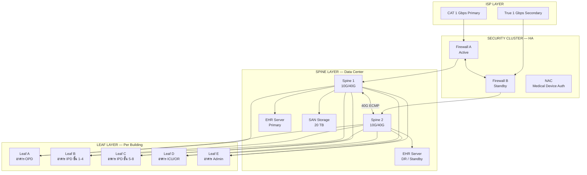
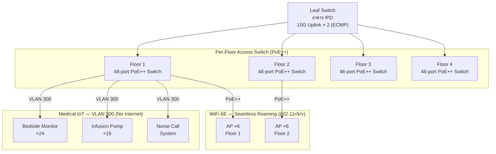

# Case Study: Hospital Network Upgrade — Clinical + IoT Segmentation

> ข้อมูลลูกค้า mask แล้ว — ใช้เป็น reference สำหรับโปรเจกต์ Healthcare / regulated environment

---

## 📋 Background

| | รายละเอียด |
|---|---|
| **ประเภทธุรกิจ** | โรงพยาบาลเอกชน |
| **ขนาด** | 5 อาคาร, 8 ชั้น, ~600 endpoints |
| **Users** | แพทย์ 80 คน, พยาบาล 200 คน, Admin 120 คน |
| **ระยะเวลาโปรเจกต์** | 5 เดือน |
| **Phase** | Design → Deployment → Handover |
| **Compliance** | PDPA, internal security policy |

---

## 🎯 โจทย์ของลูกค้า

- Network เดิมแบน (flat network) ไม่แยก clinical กับ IoT
- อุปกรณ์การแพทย์ (bedside monitor, infusion pump) อยู่ network เดียวกับ PC staff
- WiFi อ่อน บางห้อง dead zone → แพทย์ใช้ app บน iPad ไม่ได้
- ต้องการ HA — downtime ไม่ยอมรับ แม้แต่ maintenance window
- Electronic Health Record (EHR) ใหม่ต้องการ latency < 20ms

---

## 🏗️ Solution ที่ Propose

ใช้ template `vlan-segmentation.md` + `enterprise-wifi-deployment.md` เป็นฐาน:

- **Core**: Spine-Leaf ระหว่างอาคาร (ใช้ template `spine-leaf-fabric.md` ย่อส่วน)
- **Security**: Firewall HA + IPS + NAC สำหรับ medical device onboarding
- **WiFi**: WiFi 6E, high-density deployment, seamless roaming (802.11r)
- **VLAN**: 8 zones แยกตาม security + compliance requirement
- **IoT**: Medical device VLAN แยกขาด ไม่ route ออก internet

---

## 🗺️ Architecture Diagram

### Core — Inter-Building Spine-Leaf

### Per-Floor Access (ตัวอย่าง อาคาร IPD)

---

## 📐 VLAN Design

| VLAN | ชื่อ | Subnet | อธิบาย | Internet |
|---|---|---|---|---|
| 10 | Clinical Staff | 10.1.10.0/22 | PC แพทย์/พยาบาล + EHR access | ✅ Filtered |
| 20 | Admin | 10.1.20.0/23 | PC admin, billing | ✅ |
| 30 | VoIP | 10.1.30.0/24 | IP Phone ทั่วอาคาร (DSCP EF) | ❌ |
| 100 | Clinical WiFi | 10.1.100.0/22 | iPad แพทย์ + Nurse tablet | ✅ Filtered |
| 200 | Guest WiFi | 172.16.1.0/22 | ผู้ป่วย/ญาติ | ✅ (Internet only) |
| 300 | Medical IoT | 10.1.200.0/22 | Bedside monitor, pump (no route out) | ❌ Isolated |
| 400 | CCTV | 10.1.210.0/23 | Camera → NVR (local only) | ❌ Isolated |
| 500 | Management | 10.1.250.0/24 | OOB management ทุก device | ❌ Jump host only |

---

## 📡 WiFi Design

| Zone | AP จำนวน | Standard | SSID | Roaming |
|---|---|---|---|---|
| OPD | 18 AP | WiFi 6E | Clinical, Guest | 802.11r Fast BSS |
| IPD ชั้น 1-4 | 24 AP | WiFi 6E | Clinical, Guest | 802.11r Fast BSS |
| IPD ชั้น 5-8 | 24 AP | WiFi 6E | Clinical, Guest | 802.11r Fast BSS |
| ICU / OR | 12 AP | WiFi 6E | Clinical only | 802.11r + 802.11k |
| Admin | 8 AP | WiFi 6 | Staff, Guest | Standard |
| **รวม** | **86 AP** | | | |

> ICU/OR ใช้ 802.11k (Neighbor Report) เพิ่มเติมเพราะแพทย์เดินระหว่าง OR ถี่มาก

---

## 🔒 Security Policy สำคัญ

| Policy | รายละเอียด |
|---|---|
| Medical IoT (VLAN 300) | Isolated — ไม่มี route ออก internet, NAC auth ก่อน join |
| EHR Server access | Whitelist IP เท่านั้น (Clinical VLAN 10 + 100) |
| Guest WiFi | DNS sinkhole + content filter, max 10 Mbps/user |
| CCTV | Isolated, NVR อยู่ใน VLAN เดียวกัน, ไม่ expose ออกนอก |
| Management VLAN 500 | Jump host only, MFA required |

---

## 📊 ผลลัพธ์โปรเจกต์

| Metric | Before | After |
|---|---|---|
| Network incident (clinical) | 4-6 ครั้ง/เดือน | 0 ครั้ง/เดือน (3 เดือนแรก) |
| WiFi dead zone | ~30% พื้นที่ | < 2% (measured -65 dBm threshold) |
| EHR latency | 80-200ms | < 15ms |
| Medical device isolation | ❌ flat network | ✅ VLAN 300 isolated |
| NAC onboarding | manual | Auto (MAC + certificate) |

---

## ⏱️ เวลาที่ Claude ช่วยประหยัด

| งาน | เวลาเดิม | เวลาที่ใช้จริง |
|---|---|---|
| วาด Spine-Leaf diagram | 5-6 ชม. | 25 นาที |
| VLAN design document | 2-3 ชม. | 15 นาที |
| WiFi placement table | 2 ชม. | 20 นาที |
| Security policy matrix | 3 ชม. | 20 นาที |
| As-Built (5 อาคาร) | 15-20 ชม. | 2 ชม. |
| **รวม** | **~30 ชม.** | **~3 ชม.** |

---

## 💡 Lessons Learned

- **Medical IoT isolation ต้องทำตั้งแต่ design** — เพิ่มภายหลังยากมาก device vendor ไม่ support VLAN tagging บางรุ่น
- **PoE++ (802.3bt) จำเป็นสำหรับ WiFi 6E AP** ที่ใช้ 2 radio พร้อมกัน บาง AP กิน 30-40W
- **Seamless roaming 802.11r ต้อง test จริงใน OR** — interference จากอุปกรณ์การแพทย์ (2.4GHz) ทำให้ roaming miss บางครั้ง → แก้ด้วยการ disable 2.4GHz ใน OR
- **NAC กับ Medical Device** — MAC address randomization ใน iOS/Android ทำให้ NAC พัง → ต้องให้ device medical fixed MAC หรือใช้ certificate แทน

---

## 📌 Related Templates

- Spine-Leaf core → [`spine-leaf-fabric.md`](../../templates/design/spine-leaf-fabric.md)
- VLAN segmentation → [`vlan-segmentation.md`](../../templates/design/vlan-segmentation.md)
- Enterprise WiFi → [`enterprise-wifi-deployment.md`](../../templates/design/enterprise-wifi-deployment.md)
- Incident response → [`incident-response.md`](../../templates/handover/incident-response.md)
