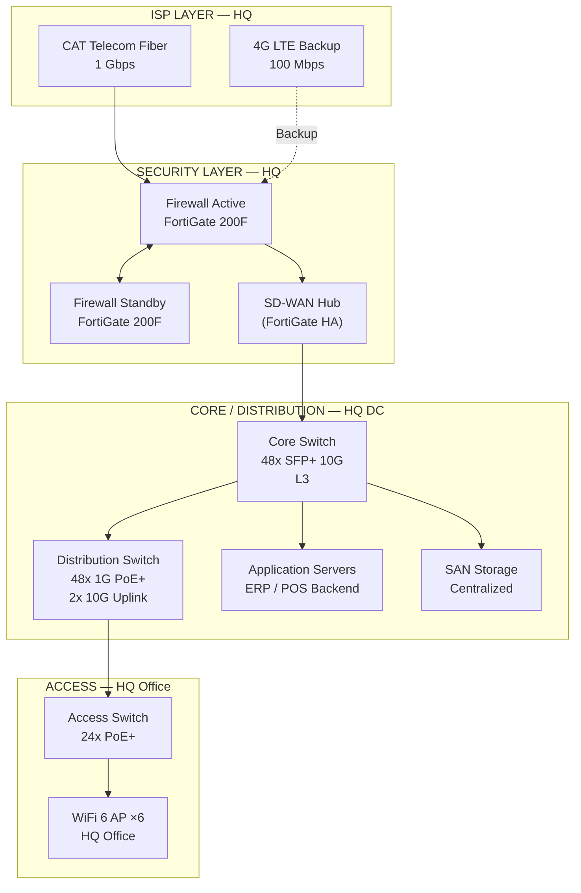
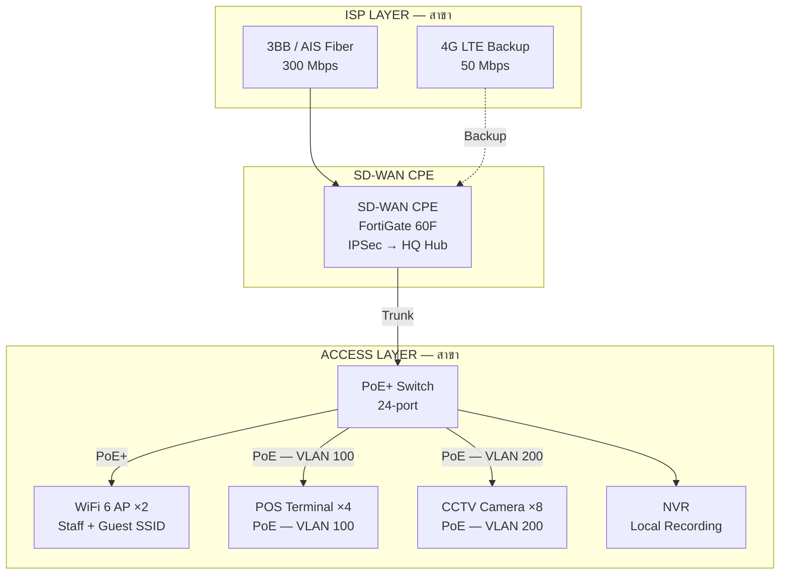
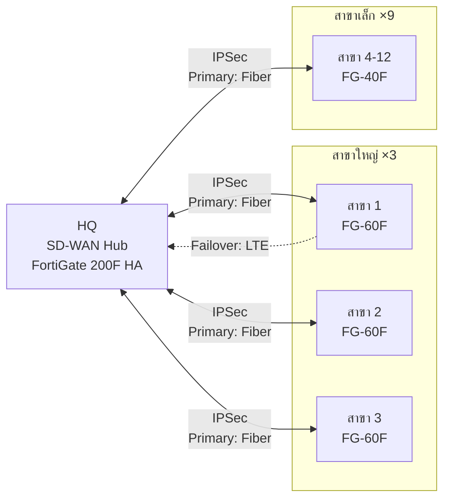

# Case Study: Retail Chain — SD-WAN Multi-Branch

> ข้อมูลลูกค้า mask แล้ว — ใช้เป็น reference สำหรับโปรเจกต์ SD-WAN ลักษณะเดียวกัน

---

## 📋 Background

| | รายละเอียด |
|---|---|
| **ประเภทธุรกิจ** | ร้านค้าปลีก (Retail) |
| **ขนาด** | 1 HQ + 12 สาขา |
| **Users รวม** | ~280 คน |
| **ระยะเวลาโปรเจกต์** | 3 เดือน |
| **Phase** | Pre-Sales → Design → Deployment |

---

## 🎯 โจทย์ของลูกค้า

- สาขาเก่าใช้ MPLS ราคาแพง ต้องการลด cost
- Internet แต่ละสาขาไม่เสถียร ไม่มี failover
- ระบบ POS ต้องการ latency ต่ำ (back to HQ datacenter)
- IT ดูแลคนเดียวไม่ไหว ต้องการ centralized management
- แต่ละสาขามี CCTV + Guest WiFi ที่ต้องแยกจาก POS network

---

## 🏗️ Solution ที่ Propose

ใช้ template `sd-wan-multi-site.md` เป็นฐาน แล้วปรับ:

- **HQ**: Firewall HA pair + SD-WAN Hub + Core/Distribution/Access
- **สาขาใหญ่** (3 สาขา, 30+ users): SD-WAN CPE + PoE switch + WiFi
- **สาขาเล็ก** (9 สาขา, 10-20 users): SD-WAN CPE + PoE switch รวม
- **Underlay**: Fiber primary + 4G LTE backup ทุกสาขา
- **Overlay**: IPSec tunnel back to HQ, QoS policy แยก POS / VoIP / Data

---

## 🗺️ Architecture Diagram

### HQ Network

### Branch Network (สาขาใหญ่)

### Overlay SD-WAN (All Sites)

---

## 📐 VLAN Design

| VLAN | ชื่อ | Subnet | Traffic |
|---|---|---|---|
| 10 | Staff | 10.x.10.0/24 | User laptops, workstations |
| 20 | VoIP | 10.x.20.0/24 | IP Phone (QoS DSCP EF) |
| 100 | POS | 10.x.100.0/24 | POS terminal (ลัด HQ เท่านั้น) |
| 200 | CCTV | 10.x.200.0/24 | Camera → NVR (local only) |
| 999 | Guest | 172.16.x.0/24 | Guest WiFi (Internet only) |

> `x` = Branch ID (01-12), HQ = 00

---

## 🔧 QoS Policy

| Traffic | DSCP | Bandwidth Guarantee | Priority |
|---|---|---|---|
| POS (VLAN 100) | EF (46) | 20% reserved | Highest |
| VoIP (VLAN 20) | EF (46) | 15% reserved | High |
| Staff (VLAN 10) | AF21 | Best effort | Normal |
| CCTV (VLAN 200) | CS1 | Max 10 Mbps | Low |
| Guest (VLAN 999) | BE | Max 20 Mbps | Lowest |

---

## 📊 ผลลัพธ์โปรเจกต์

| Metric | Before | After |
|---|---|---|
| Monthly MPLS cost | ~120,000 บาท/เดือน | ~45,000 บาท/เดือน |
| Network downtime (branch) | 3-5 ครั้ง/เดือน | < 1 ครั้ง/เดือน (failover ≤ 30 วินาที) |
| POS transaction timeout | 5-8% | < 0.5% |
| IT management | manual per-site | Centralized FortiManager |

---

## ⏱️ เวลาที่ Claude ช่วยประหยัด

| งาน | เวลาเดิม | เวลาที่ใช้จริง |
|---|---|---|
| วาด HQ diagram | 3-4 ชม. | 20 นาที |
| วาด Branch diagram × 12 | 6-8 ชม. | 30 นาที (batch) |
| VLAN table | 1 ชม. | 10 นาที |
| QoS policy doc | 2 ชม. | 15 นาที |
| **รวม** | **~12-15 ชม.** | **~1.25 ชม.** |

---

## 💡 Lessons Learned

- **PoE budget คือจุดที่มักพลาด** — CCTV 8 กล้อง + 4 POS + 2 AP กิน budget เกือบเต็ม switch 24-port PoE+ (370W) → ต้องตรวจก่อนเสมอ
- **LTE backup latency** — บาง POS vendor ไม่ยอม latency > 80ms → ต้องเลือก carrier ที่ดีในพื้นที่
- **CCTV VLAN แยกออกมา** ทำให้ IT ไม่ต้องกังวลเรื่อง bandwidth กิน staff network อีกต่อไป
- **FortiManager ช่วยลด onboarding branch ใหม่** จาก 2 วัน เหลือ 2 ชั่วโมง

---

## 📌 Related Templates

- SD-WAN topology → [`sd-wan-multi-site.md`](../../templates/pre-sales/sd-wan-multi-site.md)
- VLAN design → [`vlan-segmentation.md`](../../templates/design/vlan-segmentation.md)
- CCTV/IoT zone → ดู Notes ใน `smb-single-site.md`
