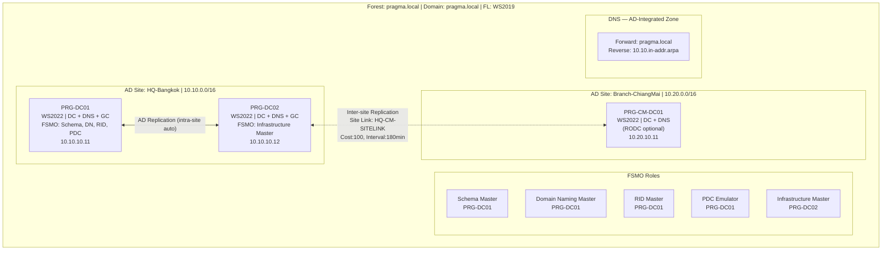

# Active Directory DS Topology

> AD DS multi-site — Domain Controllers, FSMO roles, replication, DNS, Sites & Subnets

## 📋 ใช้ตอนไหน

- ✅ ออกแบบหรือ document AD DS topology ที่มี DC หลาย site
- ✅ HLD / LLD สำหรับ Windows Server environment ที่มี AD
- ✅ โปรเจกต์ที่ย้าย DC, เพิ่ม site ใหม่, หรือ migrate domain
- ✅ ใช้คู่กับ firewall-dmz-zones.md เมื่อต้องเปิด AD port ข้าม site
- ❌ **ไม่เหมาะกับ**: Azure AD / Entra ID only (cloud-native), single-site single DC

---

## 🎨 Pragma Style Diagram (Draw.io XML)

```xml
<mxfile host="app.diagrams.net" version="24.0.0">
  <diagram name="AD DS Topology — Pragma Style">
    <mxGraphModel dx="1400" dy="900" grid="0" background="#1a1a2e">
      <root>
        <mxCell id="0"/><mxCell id="1" parent="0"/>
        <mxCell id="title" value="Active Directory DS Topology — Multi-Site" style="text;html=1;strokeColor=none;fillColor=none;align=center;fontSize=22;fontStyle=1;fontColor=#ffffff;" vertex="1" parent="1">
          <mxGeometry x="100" y="20" width="900" height="40" as="geometry"/>
        </mxCell>

        <mxCell id="forest_label" value="Forest: pragma.local     Domain: pragma.local     Functional Level: Windows Server 2019" style="text;html=1;strokeColor=none;fillColor=none;align=center;fontSize=12;fontColor=#aaaaff;" vertex="1" parent="1">
          <mxGeometry x="100" y="65" width="900" height="25" as="geometry"/>
        </mxCell>

        <mxCell id="fsmo_box" value="FSMO Roles" style="swimlane;startSize=30;fillColor=#1a2a4a;strokeColor=#4a90d9;fontColor=#ffffff;fontSize=13;fontStyle=1;html=1;" vertex="1" parent="1">
          <mxGeometry x="40" y="100" width="1020" height="100" as="geometry"/>
        </mxCell>
        <mxCell id="fsmo1" value="Schema Master&#xa;PRG-DC01 (HQ)" style="rounded=1;whiteSpace=wrap;html=1;fillColor=#1a3a5c;strokeColor=#4a90d9;fontColor=#ffffff;fontSize=10;" vertex="1" parent="fsmo_box">
          <mxGeometry x="20" y="25" width="160" height="50" as="geometry"/>
        </mxCell>
        <mxCell id="fsmo2" value="Domain Naming Master&#xa;PRG-DC01 (HQ)" style="rounded=1;whiteSpace=wrap;html=1;fillColor=#1a3a5c;strokeColor=#4a90d9;fontColor=#ffffff;fontSize=10;" vertex="1" parent="fsmo_box">
          <mxGeometry x="200" y="25" width="160" height="50" as="geometry"/>
        </mxCell>
        <mxCell id="fsmo3" value="RID Master&#xa;PRG-DC01 (HQ)" style="rounded=1;whiteSpace=wrap;html=1;fillColor=#1a3a5c;strokeColor=#4a90d9;fontColor=#ffffff;fontSize=10;" vertex="1" parent="fsmo_box">
          <mxGeometry x="380" y="25" width="160" height="50" as="geometry"/>
        </mxCell>
        <mxCell id="fsmo4" value="PDC Emulator&#xa;PRG-DC01 (HQ)" style="rounded=1;whiteSpace=wrap;html=1;fillColor=#1a3a5c;strokeColor=#4a90d9;fontColor=#ffffff;fontSize=10;" vertex="1" parent="fsmo_box">
          <mxGeometry x="560" y="25" width="160" height="50" as="geometry"/>
        </mxCell>
        <mxCell id="fsmo5" value="Infrastructure Master&#xa;PRG-DC02 (HQ)" style="rounded=1;whiteSpace=wrap;html=1;fillColor=#0d2b1a;strokeColor=#2e7d32;fontColor=#ffffff;fontSize=10;" vertex="1" parent="fsmo_box">
          <mxGeometry x="740" y="25" width="240" height="50" as="geometry"/>
        </mxCell>

        <mxCell id="L_hq" value="AD Site: HQ-Bangkok     Subnet: 10.10.0.0/16     Site Link: DEFAULTIPSITELINK" style="swimlane;startSize=30;fillColor=#0d2b1a;strokeColor=#2e7d32;fontColor=#ffffff;fontSize=11;fontStyle=1;html=1;" vertex="1" parent="1">
          <mxGeometry x="40" y="230" width="480" height="220" as="geometry"/>
        </mxCell>
        <mxCell id="dc01" value="PRG-DC01&#xa;Windows Server 2022&#xa;DC + DNS + GC&#xa;FSMO: Schema, DN, RID, PDC&#xa;10.10.10.11" style="rounded=1;whiteSpace=wrap;html=1;fillColor=#1a4a1a;strokeColor=#66bb6a;fontColor=#ffffff;fontSize=10;" vertex="1" parent="L_hq">
          <mxGeometry x="60" y="50" width="170" height="130" as="geometry"/>
        </mxCell>
        <mxCell id="dc02" value="PRG-DC02&#xa;Windows Server 2022&#xa;DC + DNS + GC&#xa;FSMO: Infrastructure Master&#xa;10.10.10.12" style="rounded=1;whiteSpace=wrap;html=1;fillColor=#1a4a1a;strokeColor=#66bb6a;fontColor=#ffffff;fontSize=10;" vertex="1" parent="L_hq">
          <mxGeometry x="260" y="50" width="170" height="130" as="geometry"/>
        </mxCell>
        <mxCell id="hq_repl" value="AD Replication&#xa;(same site — auto)" style="edgeStyle=orthogonalEdgeStyle;rounded=1;html=1;strokeColor=#66bb6a;strokeWidth=2;fontColor=#66bb6a;fontSize=9;" edge="1" parent="L_hq" source="dc01" target="dc02">
          <mxGeometry relative="1" as="geometry"/>
        </mxCell>

        <mxCell id="L_br1" value="AD Site: Branch-ChiangMai     Subnet: 10.20.0.0/16     Site Link: HQ-CM-SITELINK" style="swimlane;startSize=30;fillColor=#1a2a4a;strokeColor=#4a90d9;fontColor=#ffffff;fontSize=11;fontStyle=1;html=1;" vertex="1" parent="1">
          <mxGeometry x="580" y="230" width="480" height="220" as="geometry"/>
        </mxCell>
        <mxCell id="dc03" value="PRG-CM-DC01&#xa;Windows Server 2022&#xa;DC + DNS (RODC optional)&#xa;No FSMO roles&#xa;10.20.10.11" style="rounded=1;whiteSpace=wrap;html=1;fillColor=#1a3a5c;strokeColor=#4a90d9;fontColor=#ffffff;fontSize=10;" vertex="1" parent="L_br1">
          <mxGeometry x="150" y="50" width="180" height="130" as="geometry"/>
        </mxCell>

        <mxCell id="L_dns" value="DNS — AD-Integrated Zone     Primary: pragma.local     Replication: All DCs in Domain" style="swimlane;startSize=30;fillColor=#1a1a0d;strokeColor=#f9a825;fontColor=#ffffff;fontSize=11;fontStyle=1;html=1;" vertex="1" parent="1">
          <mxGeometry x="40" y="490" width="480" height="90" as="geometry"/>
        </mxCell>
        <mxCell id="dns1" value="Forward Zone: pragma.local&#xa;Reverse Zone: 10.10.in-addr.arpa&#xa;Scavenging: 7/7 days" style="rounded=1;whiteSpace=wrap;html=1;fillColor=#5d4037;strokeColor=#f9a825;fontColor=#ffffff;fontSize=10;" vertex="1" parent="L_dns">
          <mxGeometry x="60" y="25" width="360" height="45" as="geometry"/>
        </mxCell>

        <mxCell id="L_sitelink" value="Site Link: HQ-CM-SITELINK     Cost: 100     Replication Interval: 180 min     Schedule: 24×7" style="swimlane;startSize=30;fillColor=#1a0d2b;strokeColor=#6a1b9a;fontColor=#ffffff;fontSize=11;fontStyle=1;html=1;" vertex="1" parent="1">
          <mxGeometry x="580" y="490" width="480" height="90" as="geometry"/>
        </mxCell>
        <mxCell id="sitelink_det" value="Protocol: IP (RPC over IP)&#xa;Bridge all site links: Yes&#xa;KCC auto-generated connections" style="rounded=1;whiteSpace=wrap;html=1;fillColor=#4a0e8f;strokeColor=#ce93d8;fontColor=#ffffff;fontSize=10;" vertex="1" parent="L_sitelink">
          <mxGeometry x="60" y="25" width="360" height="45" as="geometry"/>
        </mxCell>

        <mxCell id="repl_cross" value="Inter-site Replication&#xa;(compressed, scheduled)" style="edgeStyle=orthogonalEdgeStyle;rounded=1;html=1;strokeColor=#ce93d8;strokeWidth=2;dashed=1;fontColor=#ce93d8;fontSize=9;" edge="1" parent="1" source="dc02" target="dc03">
          <mxGeometry relative="1" as="geometry"/>
        </mxCell>
      </root>
    </mxGraphModel>
  </diagram>
</mxfile>
```

---

## 🌊 Mermaid Template



---

## 📊 ตารางข้อมูล AD DS (copy ใส่เอกสารได้เลย)

### Domain Controllers

| Hostname | Site | OS | Role | FSMO | IP | GC |
|---|---|---|---|---|---|---|
| PRG-DC01 | HQ-Bangkok | WS 2022 | DC + DNS | Schema, DN, RID, PDC | 10.10.10.11 | ✅ |
| PRG-DC02 | HQ-Bangkok | WS 2022 | DC + DNS | Infrastructure Master | 10.10.10.12 | ✅ |
| PRG-CM-DC01 | Branch-ChiangMai | WS 2022 | DC + DNS | — | 10.20.10.11 | ✅ |

### AD Sites & Subnets

| Site Name | Subnet | DCs | Site Link | Cost | Replication Interval |
|---|---|---|---|---|---|
| HQ-Bangkok | 10.10.0.0/16 | DC01, DC02 | — (hub) | — | ทันที (intra-site) |
| Branch-ChiangMai | 10.20.0.0/16 | CM-DC01 | HQ-CM-SITELINK | 100 | 180 นาที |

### FSMO Role Holders

| FSMO Role | Holder | Scope |
|---|---|---|
| Schema Master | PRG-DC01 | Forest |
| Domain Naming Master | PRG-DC01 | Forest |
| RID Master | PRG-DC01 | Domain |
| PDC Emulator | PRG-DC01 | Domain |
| Infrastructure Master | PRG-DC02 | Domain |

---

## 💡 Prompt ตัวอย่าง

### แบบ A: ออกแบบ AD DS topology ใหม่
```
ใช้ template ad-ds-topology.md แบบ Pragma Style
ออกแบบ AD DS สำหรับ [ชื่อลูกค้า]:
- Domain name: [domain.local]
- Sites: [รายชื่อ site + subnet]
- จำนวน DC ต่อ site: [n]
- OS: Windows Server [2019/2022]
- FSMO placement: [DC หลัก]
- RODC ต้องการไหม: [Yes/No]
- DNS: [AD-Integrated / Standalone]
```

### แบบ B: Document AD DS ที่มีอยู่แล้ว
```
ใช้ template ad-ds-topology.md แบบ Pragma Style
วาด AD DS topology จากข้อมูลนี้:
- Domain: [domain.local]
- DC1: [hostname, IP, FSMO roles]
- DC2: [hostname, IP]
- Sites: [site A subnet], [site B subnet]
- Site Link: [cost, interval]
```

---

## 🔧 Parameters ที่ปรับได้

| Parameter | Default | ทางเลือก |
|---|---|---|
| จำนวน site | 2 (HQ + 1 Branch) | เพิ่ม site box ได้ไม่จำกัด |
| DC ต่อ site | HQ=2, Branch=1 | Branch ใหญ่ = 2 DC |
| RODC | ไม่ใช้ | ใช้ที่ Branch ที่ physical security ต่ำ |
| Functional Level | Windows Server 2019 | 2016, 2022 |
| FSMO placement | DC01 ถือทั้งหมด (ยกเว้น Infra) | กระจายตาม best practice |
| DNS | AD-Integrated | Primary/Secondary แยก |
| Site Link cost | 100 | ปรับตาม bandwidth จริง |
| Replication interval | 180 นาที | 15 นาที (WAN เร็ว), 8 ชั่วโมง (เส้นช้า) |

---

## 📌 Notes สำหรับ SI

- **PDC Emulator = DC หลัก**: เป็น DC ที่ client ดึง password change, time sync, group policy — ควรอยู่ที่ HQ เสมอ
- **Infrastructure Master ≠ GC**: ถ้า domain มี GC เดียว ให้ Infra Master อยู่คนละ DC กับ GC ไม่เช่นนั้น Infra Master จะไม่ทำงาน
- **RODC สำหรับ Branch**: Read-Only DC เหมาะกับ branch ที่ physical access ไม่ปลอดภัย — รหัสผ่านไม่ cache โดย default
- **Site Link cost**: ยิ่ง cost ต่ำ = KCC เลือก path นั้นก่อน — ใช้ inverse bandwidth เป็น cost reference
- **DNS Scavenging**: เปิดเสมอ (7/7 days default) เพื่อป้องกัน stale record
- **Port AD replication**: TCP/UDP 389 (LDAP), 636 (LDAPS), 3268 (GC), 445 (SMB), 49152-65535 (RPC dynamic)

### Related Templates
- Firewall rules สำหรับ AD port → `firewall-dmz-zones.md`
- VLAN Management network → `vlan-segmentation.md`
- Hyper-V host สำหรับ DC VM → `hyper-v-failover-cluster.md`

**อัพเดตล่าสุด**: 2026-06-27 — initial template
