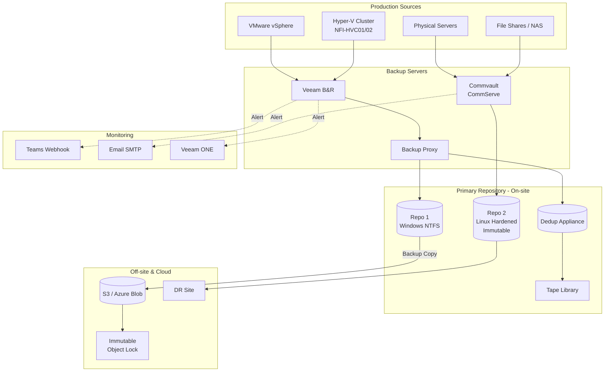

# Backup Architecture

> Enterprise backup topology — Veeam / Commvault สำหรับ VMware + Hyper-V + Physical servers

## 📋 ใช้ตอนไหน

- ✅ ออกแบบ backup architecture ให้ลูกค้า
- ✅ Veeam B&R หรือ Commvault environment
- ✅ Mixed environment (VMware + Hyper-V + Physical)
- ✅ ต้องการ Off-site / Cloud backup
- ❌ **ไม่เหมาะกับ**: File-level backup เดี่ยวๆ

---

## 🎨 Pragma Style Diagram (Draw.io XML)

```xml
<mxfile host="app.diagrams.net" version="24.0.0">
  <diagram name="Backup Architecture — Pragma Style">
    <mxGraphModel dx="1400" dy="900" grid="0" background="#1a1a2e">
      <root>
        <mxCell id="0"/><mxCell id="1" parent="0"/>
        <mxCell id="title" value="Enterprise Backup Architecture — Veeam / Commvault" style="text;html=1;strokeColor=none;fillColor=none;align=center;fontSize=20;fontStyle=1;fontColor=#ffffff;" vertex="1" parent="1">
          <mxGeometry x="80" y="20" width="900" height="40" as="geometry"/>
        </mxCell>
        <mxCell id="L_prod" value="PRODUCTION — Sources to Protect" style="swimlane;startSize=30;fillColor=#1a0d2b;strokeColor=#6a1b9a;fontColor=#ffffff;fontSize=13;fontStyle=1;html=1;" vertex="1" parent="1">
          <mxGeometry x="40" y="70" width="960" height="130" as="geometry"/>
        </mxCell>
        <mxCell id="vmware" value="VMware vSphere&#xa;ESXi Hosts&#xa;VM Workloads" style="rounded=1;whiteSpace=wrap;html=1;fillColor=#4a0e8f;strokeColor=#b39ddb;fontColor=#ffffff;fontSize=10;" vertex="1" parent="L_prod">
          <mxGeometry x="60" y="30" width="160" height="70" as="geometry"/>
        </mxCell>
        <mxCell id="hyperv" value="Hyper-V Cluster&#xa;NFI-HVC01 / HVC02&#xa;CSV Volumes" style="rounded=1;whiteSpace=wrap;html=1;fillColor=#4a0e8f;strokeColor=#b39ddb;fontColor=#ffffff;fontSize=10;" vertex="1" parent="L_prod">
          <mxGeometry x="280" y="30" width="160" height="70" as="geometry"/>
        </mxCell>
        <mxCell id="phys" value="Physical Servers&#xa;File / DB / App&#xa;Windows / Linux" style="rounded=1;whiteSpace=wrap;html=1;fillColor=#4a0e8f;strokeColor=#b39ddb;fontColor=#ffffff;fontSize=10;" vertex="1" parent="L_prod">
          <mxGeometry x="500" y="30" width="160" height="70" as="geometry"/>
        </mxCell>
        <mxCell id="nas" value="NAS / File Share&#xa;SMB / NFS&#xa;Department Data" style="rounded=1;whiteSpace=wrap;html=1;fillColor=#4a0e8f;strokeColor=#b39ddb;fontColor=#ffffff;fontSize=10;" vertex="1" parent="L_prod">
          <mxGeometry x="720" y="30" width="160" height="70" as="geometry"/>
        </mxCell>
        <mxCell id="L_bkp" value="BACKUP SERVER — Control Plane" style="swimlane;startSize=30;fillColor=#0d2b1a;strokeColor=#2e7d32;fontColor=#ffffff;fontSize=13;fontStyle=1;html=1;" vertex="1" parent="1">
          <mxGeometry x="40" y="230" width="960" height="130" as="geometry"/>
        </mxCell>
        <mxCell id="vbr" value="Veeam Backup &amp; Replication&#xa;Backup Server&#xa;Job Scheduler / Console" style="rounded=1;whiteSpace=wrap;html=1;fillColor=#1a4a1a;strokeColor=#66bb6a;fontColor=#ffffff;fontSize=10;" vertex="1" parent="L_bkp">
          <mxGeometry x="80" y="25" width="220" height="80" as="geometry"/>
        </mxCell>
        <mxCell id="cvlt" value="Commvault CommServe&#xa;Command Center&#xa;Policy / Alert Manager" style="rounded=1;whiteSpace=wrap;html=1;fillColor=#1a4a1a;strokeColor=#66bb6a;fontColor=#ffffff;fontSize=10;" vertex="1" parent="L_bkp">
          <mxGeometry x="380" y="25" width="220" height="80" as="geometry"/>
        </mxCell>
        <mxCell id="proxy" value="Backup Proxy&#xa;Data Mover&#xa;(VMware / HyperV)" style="rounded=1;whiteSpace=wrap;html=1;fillColor=#2e7d32;strokeColor=#a5d6a7;fontColor=#ffffff;fontSize=10;" vertex="1" parent="L_bkp">
          <mxGeometry x="680" y="25" width="180" height="80" as="geometry"/>
        </mxCell>
        <mxCell id="L_repo" value="PRIMARY REPOSITORY — On-site Backup Storage" style="swimlane;startSize=30;fillColor=#1a1a0d;strokeColor=#f9a825;fontColor=#ffffff;fontSize=13;fontStyle=1;html=1;" vertex="1" parent="1">
          <mxGeometry x="40" y="390" width="960" height="150" as="geometry"/>
        </mxCell>
        <mxCell id="repo1" value="Backup Repository 1&#xa;Windows NTFS&#xa;Full + Incremental" style="shape=cylinder3;whiteSpace=wrap;html=1;fillColor=#5d4037;strokeColor=#f9a825;fontColor=#ffffff;fontSize=10;verticalLabelPosition=bottom;verticalAlign=top;" vertex="1" parent="L_repo">
          <mxGeometry x="80" y="20" width="130" height="90" as="geometry"/>
        </mxCell>
        <mxCell id="repo2" value="Backup Repository 2&#xa;Linux XFS (Hardened)&#xa;Immutable Backups" style="shape=cylinder3;whiteSpace=wrap;html=1;fillColor=#5d4037;strokeColor=#ff9800;fontColor=#ffffff;fontSize=10;verticalLabelPosition=bottom;verticalAlign=top;" vertex="1" parent="L_repo">
          <mxGeometry x="290" y="20" width="130" height="90" as="geometry"/>
        </mxCell>
        <mxCell id="dedup" value="Dedup Appliance&#xa;Dell DataDomain&#xa;/ HPE StoreOnce" style="shape=cylinder3;whiteSpace=wrap;html=1;fillColor=#4e342e;strokeColor=#f9a825;fontColor=#ffffff;fontSize=10;verticalLabelPosition=bottom;verticalAlign=top;" vertex="1" parent="L_repo">
          <mxGeometry x="500" y="20" width="130" height="90" as="geometry"/>
        </mxCell>
        <mxCell id="tape" value="Tape Library&#xa;LTO-8 / LTO-9&#xa;Long-term Archive" style="rounded=1;whiteSpace=wrap;html=1;fillColor=#2a2a0d;strokeColor=#cddc39;fontColor=#ffffff;fontSize=10;" vertex="1" parent="L_repo">
          <mxGeometry x="720" y="30" width="170" height="70" as="geometry"/>
        </mxCell>
        <mxCell id="L_offsite" value="OFF-SITE &amp; CLOUD — 3-2-1 Rule Compliance" style="swimlane;startSize=30;fillColor=#1a2a4a;strokeColor=#4a90d9;fontColor=#ffffff;fontSize=13;fontStyle=1;html=1;" vertex="1" parent="1">
          <mxGeometry x="40" y="570" width="960" height="140" as="geometry"/>
        </mxCell>
        <mxCell id="s3" value="Cloud Object Storage&#xa;AWS S3 / Azure Blob&#xa;Backup Copy Job" style="shape=cylinder3;whiteSpace=wrap;html=1;fillColor=#1a3a5c;strokeColor=#4a90d9;fontColor=#ffffff;fontSize=10;verticalLabelPosition=bottom;verticalAlign=top;" vertex="1" parent="L_offsite">
          <mxGeometry x="80" y="20" width="140" height="80" as="geometry"/>
        </mxCell>
        <mxCell id="dr_site" value="DR Site&#xa;Remote Repository&#xa;Veeam Cloud Connect" style="rounded=1;whiteSpace=wrap;html=1;fillColor=#1a2a4a;strokeColor=#4a90d9;fontColor=#ffffff;fontSize=10;" vertex="1" parent="L_offsite">
          <mxGeometry x="310" y="25" width="180" height="80" as="geometry"/>
        </mxCell>
        <mxCell id="immutable" value="Immutable Cloud Backup&#xa;S3 Object Lock&#xa;Air-gap Protection" style="rounded=1;whiteSpace=wrap;html=1;fillColor=#0d1f2b;strokeColor=#00bcd4;fontColor=#ffffff;fontSize=10;" vertex="1" parent="L_offsite">
          <mxGeometry x="580" y="25" width="200" height="80" as="geometry"/>
        </mxCell>
        <mxCell id="L_mon" value="MONITORING &amp; ALERTING" style="swimlane;startSize=30;fillColor=#0d1f2b;strokeColor=#0288d1;fontColor=#ffffff;fontSize=13;fontStyle=1;html=1;" vertex="1" parent="1">
          <mxGeometry x="40" y="740" width="960" height="110" as="geometry"/>
        </mxCell>
        <mxCell id="teams" value="Microsoft Teams&#xa;Webhook Alerts&#xa;Job Success / Fail" style="rounded=1;whiteSpace=wrap;html=1;fillColor=#01579b;strokeColor=#4fc3f7;fontColor=#ffffff;fontSize=10;" vertex="1" parent="L_mon">
          <mxGeometry x="80" y="20" width="180" height="70" as="geometry"/>
        </mxCell>
        <mxCell id="email" value="Email Alerts&#xa;SMTP&#xa;Daily Summary" style="rounded=1;whiteSpace=wrap;html=1;fillColor=#01579b;strokeColor=#4fc3f7;fontColor=#ffffff;fontSize=10;" vertex="1" parent="L_mon">
          <mxGeometry x="320" y="20" width="180" height="70" as="geometry"/>
        </mxCell>
        <mxCell id="siem" value="Veeam ONE&#xa;Dashboard&#xa;SLA Reporting" style="rounded=1;whiteSpace=wrap;html=1;fillColor=#01579b;strokeColor=#4fc3f7;fontColor=#ffffff;fontSize=10;" vertex="1" parent="L_mon">
          <mxGeometry x="560" y="20" width="180" height="70" as="geometry"/>
        </mxCell>
        <mxCell id="e1" value="Backup Job" style="edgeStyle=orthogonalEdgeStyle;rounded=1;html=1;strokeColor=#6a1b9a;strokeWidth=2;fontColor=#b39ddb;fontSize=10;" edge="1" parent="1" source="vmware" target="vbr"><mxGeometry relative="1" as="geometry"/></mxCell>
        <mxCell id="e2" value="Backup Job" style="edgeStyle=orthogonalEdgeStyle;rounded=1;html=1;strokeColor=#6a1b9a;strokeWidth=2;fontColor=#b39ddb;fontSize=10;" edge="1" parent="1" source="hyperv" target="vbr"><mxGeometry relative="1" as="geometry"/></mxCell>
        <mxCell id="e3" value="" style="edgeStyle=orthogonalEdgeStyle;rounded=1;html=1;strokeColor=#66bb6a;strokeWidth=2;" edge="1" parent="1" source="phys" target="cvlt"><mxGeometry relative="1" as="geometry"/></mxCell>
        <mxCell id="e4" value="" style="edgeStyle=orthogonalEdgeStyle;rounded=1;html=1;strokeColor=#66bb6a;strokeWidth=2;" edge="1" parent="1" source="nas" target="cvlt"><mxGeometry relative="1" as="geometry"/></mxCell>
        <mxCell id="e5" value="via Proxy" style="edgeStyle=orthogonalEdgeStyle;rounded=1;html=1;strokeColor=#2e7d32;strokeWidth=2;fontColor=#a5d6a7;fontSize=10;" edge="1" parent="1" source="vbr" target="repo1"><mxGeometry relative="1" as="geometry"/></mxCell>
        <mxCell id="e6" value="" style="edgeStyle=orthogonalEdgeStyle;rounded=1;html=1;strokeColor=#2e7d32;strokeWidth=2;" edge="1" parent="1" source="cvlt" target="repo2"><mxGeometry relative="1" as="geometry"/></mxCell>
        <mxCell id="e7" value="" style="edgeStyle=orthogonalEdgeStyle;rounded=1;html=1;strokeColor=#f9a825;strokeWidth=2;" edge="1" parent="1" source="vbr" target="dedup"><mxGeometry relative="1" as="geometry"/></mxCell>
        <mxCell id="e8" value="Archive" style="edgeStyle=orthogonalEdgeStyle;rounded=1;html=1;strokeColor=#cddc39;strokeWidth=2;dashed=1;fontColor=#cddc39;fontSize=10;" edge="1" parent="1" source="dedup" target="tape"><mxGeometry relative="1" as="geometry"/></mxCell>
        <mxCell id="e9" value="Backup Copy" style="edgeStyle=orthogonalEdgeStyle;rounded=1;html=1;strokeColor=#4a90d9;strokeWidth=2;fontColor=#90caf9;fontSize=10;" edge="1" parent="1" source="repo1" target="s3"><mxGeometry relative="1" as="geometry"/></mxCell>
        <mxCell id="e10" value="" style="edgeStyle=orthogonalEdgeStyle;rounded=1;html=1;strokeColor=#4a90d9;strokeWidth=2;" edge="1" parent="1" source="repo2" target="dr_site"><mxGeometry relative="1" as="geometry"/></mxCell>
        <mxCell id="e11" value="Object Lock" style="edgeStyle=orthogonalEdgeStyle;rounded=1;html=1;strokeColor=#00bcd4;strokeWidth=2;dashed=1;fontColor=#00bcd4;fontSize=10;" edge="1" parent="1" source="s3" target="immutable"><mxGeometry relative="1" as="geometry"/></mxCell>
        <mxCell id="e12" value="Webhook" style="edgeStyle=orthogonalEdgeStyle;rounded=1;html=1;strokeColor=#0288d1;strokeWidth=2;dashed=1;fontColor=#4fc3f7;fontSize=10;" edge="1" parent="1" source="vbr" target="teams"><mxGeometry relative="1" as="geometry"/></mxCell>
        <mxCell id="e13" value="" style="edgeStyle=orthogonalEdgeStyle;rounded=1;html=1;strokeColor=#0288d1;strokeWidth=2;dashed=1;" edge="1" parent="1" source="cvlt" target="email"><mxGeometry relative="1" as="geometry"/></mxCell>
      </root>
    </mxGraphModel>
  </diagram>
</mxfile>
```

---

## 🌊 Mermaid Template



---

## 💡 Prompt ตัวอย่าง

### แบบ A: Veeam-only
```
ใช้ template backup-architecture.md แบบ Pragma Style
ปรับสำหรับ [ชื่อลูกค้า] — Veeam only:
- Sources: VMware [version] + Hyper-V
- Backup Server: [hostname]
- Primary Repo: [path, size, disk type]
- Off-site: [AWS S3 / DR site]
- Alert: Teams + Email
- Retention: Full [X] weeks + Incremental [Y] days
```

### แบบ B: NFI — Commvault + Veeam
```
ใช้ template backup-architecture.md แบบ Pragma Style
ปรับสำหรับ NFI:
- Veeam B&R: Hyper-V Cluster (NFI-HVC01/02)
- Commvault: Phase 2 (File servers, Physical)
- Alert: Teams webhook ผ่าน Power Automate
- Primary storage: MD3820
- Off-site: TBD
```

---

## 🔧 Parameters ที่ปรับได้

| Parameter | Default | ทางเลือก |
|---|---|---|
| Backup Software | Veeam B&R | Commvault, Acronis, Nakivo |
| Sources | VMware + Hyper-V | Physical, NAS, Cloud |
| Primary Repo | Windows NTFS | Linux XFS Hardened, Dedup |
| Immutability | Linux Hardened | S3 Object Lock, DataDomain |
| Off-site | S3 / Azure Blob | Veeam Cloud Connect, tape |
| Alert | Teams Webhook + Email | PagerDuty, SIEM |

---

## 📌 Notes สำหรับ SI / Admin

- **3-2-1 Rule**: 3 copies, 2 different media, 1 off-site — ต้องมีทุก enterprise
- **Immutable Backup**: ป้องกัน ransomware — แนะนำ Linux Hardened Repo หรือ S3 Object Lock
- **Backup Proxy**: แยก VM สำหรับ data mover เพิ่ม throughput ลด load backup server
- **Commvault + Teams**: ต่อ webhook ผ่าน Power Automate → Post to Teams channel
- **Backup Network**: ควรแยก VLAN 50 ไม่กระทบ production — 1GbE = ~125 MB/s (bottleneck บน 8TB+)
- **RPO/RTO**: กำหนดให้ชัดก่อน design — ส่งผลต่อ retention policy และ repo sizing

### Related Templates
- Hyper-V cluster → `hyper-v-failover-cluster.md`
- Network / VLAN → `vlan-segmentation.md`
- SD-WAN off-site link → `sd-wan-multi-site.md`

**อัพเดตล่าสุด**: 2026-05-07 — initial template, NFI Veeam + Commvault environment
