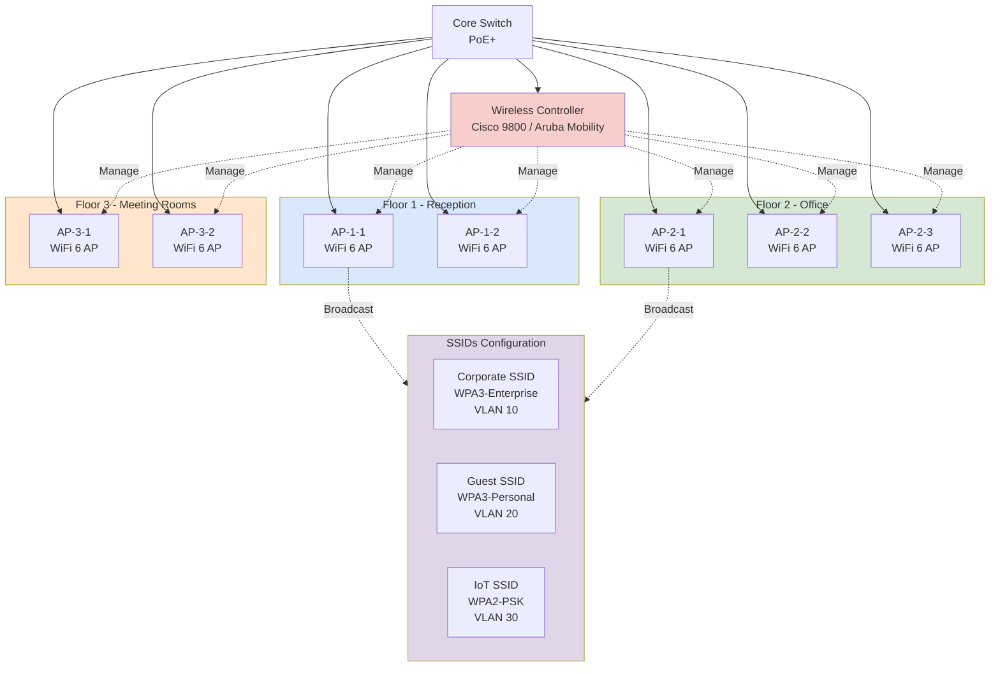

# Enterprise WiFi 6 Deployment

> WiFi 6 (802.11ax) deployment สำหรับ enterprise — coverage, capacity, roaming

## 📋 ใช้ตอนไหน

- ✅ Enterprise ออฟฟิศ 50+ users
- ✅ ต้องการ WiFi 6 (802.11ax) high performance
- ✅ Seamless roaming (ไม่หลุด connection)
- ✅ Multiple SSIDs (Corporate, Guest, IoT)
- ✅ Vendor: Cisco, Aruba, Ruckus, Ubiquiti
- ❌ **ไม่เหมาะกับ**: SMB < 20 users (ใช้ consumer AP พอ), outdoor stadium (ใช้ outdoor-specific)

---

## 🖼️ Preview

```
   [Controller]
        │
   ┌────┼────┐
 [AP1] [AP2] [AP3]
   │     │     │
 Floor1 Floor2 Floor3
```

---

## 🌊 Mermaid Template



---

## 📝 Draw.io XML Template

```xml
<mxfile host="app.diagrams.net" modified="2026-04-24T00:00:00.000Z" version="24.0.0">
  <diagram name="Enterprise WiFi" id="wifi-enterprise">
    <mxGraphModel dx="1400" dy="900" grid="1" gridSize="10" guides="1" tooltips="1" connect="1" arrows="1" fold="1" page="1" pageScale="1" pageWidth="1400" pageHeight="1000">
      <root>
        <mxCell id="0" />
        <mxCell id="1" parent="0" />
        
        <mxCell id="core" value="Core Switch&#10;PoE+ 802.3at" style="rounded=1;whiteSpace=wrap;html=1;fillColor=#dae8fc;strokeColor=#6c8ebf;" vertex="1" parent="1">
          <mxGeometry x="600" y="40" width="200" height="80" as="geometry" />
        </mxCell>
        
        <mxCell id="wlc" value="Wireless Controller&#10;Cisco 9800 / Aruba" style="rounded=1;whiteSpace=wrap;html=1;fillColor=#f8cecc;strokeColor=#b85450;" vertex="1" parent="1">
          <mxGeometry x="600" y="180" width="200" height="80" as="geometry" />
        </mxCell>
        
        <mxCell id="fl1" value="Floor 1 - Reception" style="swimlane;startSize=30;fillColor=#dae8fc;strokeColor=#6c8ebf;html=1;" vertex="1" parent="1">
          <mxGeometry x="40" y="320" width="380" height="180" as="geometry" />
        </mxCell>
        <mxCell id="ap1_1" value="AP-1-1&#10;WiFi 6 AP" style="ellipse;whiteSpace=wrap;html=1;fillColor=#d5e8d4;strokeColor=#82b366;" vertex="1" parent="fl1">
          <mxGeometry x="40" y="60" width="120" height="80" as="geometry" />
        </mxCell>
        <mxCell id="ap1_2" value="AP-1-2&#10;WiFi 6 AP" style="ellipse;whiteSpace=wrap;html=1;fillColor=#d5e8d4;strokeColor=#82b366;" vertex="1" parent="fl1">
          <mxGeometry x="220" y="60" width="120" height="80" as="geometry" />
        </mxCell>
        
        <mxCell id="fl2" value="Floor 2 - Office" style="swimlane;startSize=30;fillColor=#d5e8d4;strokeColor=#82b366;html=1;" vertex="1" parent="1">
          <mxGeometry x="460" y="320" width="560" height="180" as="geometry" />
        </mxCell>
        <mxCell id="ap2_1" value="AP-2-1&#10;WiFi 6 AP" style="ellipse;whiteSpace=wrap;html=1;fillColor=#d5e8d4;strokeColor=#82b366;" vertex="1" parent="fl2">
          <mxGeometry x="40" y="60" width="120" height="80" as="geometry" />
        </mxCell>
        <mxCell id="ap2_2" value="AP-2-2&#10;WiFi 6 AP" style="ellipse;whiteSpace=wrap;html=1;fillColor=#d5e8d4;strokeColor=#82b366;" vertex="1" parent="fl2">
          <mxGeometry x="220" y="60" width="120" height="80" as="geometry" />
        </mxCell>
        <mxCell id="ap2_3" value="AP-2-3&#10;WiFi 6 AP" style="ellipse;whiteSpace=wrap;html=1;fillColor=#d5e8d4;strokeColor=#82b366;" vertex="1" parent="fl2">
          <mxGeometry x="400" y="60" width="120" height="80" as="geometry" />
        </mxCell>
        
        <mxCell id="fl3" value="Floor 3 - Meeting Rooms" style="swimlane;startSize=30;fillColor=#ffe6cc;strokeColor=#d79b00;html=1;" vertex="1" parent="1">
          <mxGeometry x="1060" y="320" width="300" height="180" as="geometry" />
        </mxCell>
        <mxCell id="ap3_1" value="AP-3-1&#10;WiFi 6 AP" style="ellipse;whiteSpace=wrap;html=1;fillColor=#d5e8d4;strokeColor=#82b366;" vertex="1" parent="fl3">
          <mxGeometry x="30" y="60" width="120" height="80" as="geometry" />
        </mxCell>
        <mxCell id="ap3_2" value="AP-3-2&#10;WiFi 6 AP" style="ellipse;whiteSpace=wrap;html=1;fillColor=#d5e8d4;strokeColor=#82b366;" vertex="1" parent="fl3">
          <mxGeometry x="160" y="60" width="120" height="80" as="geometry" />
        </mxCell>
        
        <mxCell id="ssid_box" value="SSIDs Configuration" style="rounded=0;whiteSpace=wrap;html=1;verticalAlign=top;fillColor=#e1d5e7;strokeColor=#9673a6;fontStyle=1;" vertex="1" parent="1">
          <mxGeometry x="40" y="560" width="1320" height="120" as="geometry" />
        </mxCell>
        <mxCell id="ssid_corp" value="Corporate SSID&#10;WPA3-Enterprise&#10;VLAN 10" style="rounded=1;whiteSpace=wrap;html=1;" vertex="1" parent="1">
          <mxGeometry x="80" y="600" width="180" height="60" as="geometry" />
        </mxCell>
        <mxCell id="ssid_guest" value="Guest SSID&#10;WPA3-Personal&#10;VLAN 20" style="rounded=1;whiteSpace=wrap;html=1;" vertex="1" parent="1">
          <mxGeometry x="300" y="600" width="180" height="60" as="geometry" />
        </mxCell>
        <mxCell id="ssid_iot" value="IoT SSID&#10;WPA2-PSK&#10;VLAN 30" style="rounded=1;whiteSpace=wrap;html=1;" vertex="1" parent="1">
          <mxGeometry x="520" y="600" width="180" height="60" as="geometry" />
        </mxCell>
        
        <mxCell id="e_core_wlc" style="edgeStyle=orthogonalEdgeStyle;rounded=1;html=1;" edge="1" parent="1" source="core" target="wlc">
          <mxGeometry relative="1" as="geometry" />
        </mxCell>
        
        <mxCell id="e_core_ap11" style="edgeStyle=orthogonalEdgeStyle;rounded=1;html=1;" edge="1" parent="1" source="core" target="ap1_1">
          <mxGeometry relative="1" as="geometry" />
        </mxCell>
        <mxCell id="e_core_ap12" style="edgeStyle=orthogonalEdgeStyle;rounded=1;html=1;" edge="1" parent="1" source="core" target="ap1_2">
          <mxGeometry relative="1" as="geometry" />
        </mxCell>
        <mxCell id="e_core_ap21" style="edgeStyle=orthogonalEdgeStyle;rounded=1;html=1;" edge="1" parent="1" source="core" target="ap2_1">
          <mxGeometry relative="1" as="geometry" />
        </mxCell>
        <mxCell id="e_core_ap22" style="edgeStyle=orthogonalEdgeStyle;rounded=1;html=1;" edge="1" parent="1" source="core" target="ap2_2">
          <mxGeometry relative="1" as="geometry" />
        </mxCell>
        <mxCell id="e_core_ap23" style="edgeStyle=orthogonalEdgeStyle;rounded=1;html=1;" edge="1" parent="1" source="core" target="ap2_3">
          <mxGeometry relative="1" as="geometry" />
        </mxCell>
        <mxCell id="e_core_ap31" style="edgeStyle=orthogonalEdgeStyle;rounded=1;html=1;" edge="1" parent="1" source="core" target="ap3_1">
          <mxGeometry relative="1" as="geometry" />
        </mxCell>
        <mxCell id="e_core_ap32" style="edgeStyle=orthogonalEdgeStyle;rounded=1;html=1;" edge="1" parent="1" source="core" target="ap3_2">
          <mxGeometry relative="1" as="geometry" />
        </mxCell>
        
        <mxCell id="e_wlc_ap11" value="Manage" style="edgeStyle=orthogonalEdgeStyle;rounded=1;html=1;dashed=1;" edge="1" parent="1" source="wlc" target="ap1_1">
          <mxGeometry relative="1" as="geometry" />
        </mxCell>
        <mxCell id="e_wlc_ap21" value="Manage" style="edgeStyle=orthogonalEdgeStyle;rounded=1;html=1;dashed=1;" edge="1" parent="1" source="wlc" target="ap2_1">
          <mxGeometry relative="1" as="geometry" />
        </mxCell>
      </root>
    </mxGraphModel>
  </diagram>
</mxfile>
```

---

## 💡 Prompt ตัวอย่าง

### แบบ A: ใช้ template พื้นฐาน

```
ใช้ template enterprise-wifi-deployment.md
ปรับเป็น WiFi สำหรับออฟฟิศ [ชื่อบริษัท]:
- พื้นที่: [จำนวน ตร.ม.]
- Floors: [จำนวน]
- Users: [จำนวน]
- Vendor: [Cisco/Aruba/Ruckus/Ubiquiti]
- SSIDs: [Corporate, Guest, IoT]
```

### แบบ B: High-density

```
ใช้ template enterprise-wifi-deployment.md
แต่เป็น high-density environment:
- Conference hall 500 คน
- Stadium seating 2000 คน
- AP spacing 10-15 เมตร
- Channel planning 5GHz only
```

### แบบ C: Outdoor + Indoor

```
ใช้ template enterprise-wifi-deployment.md
เพิ่ม outdoor coverage:
- Parking lot
- Garden area
- Loading dock
ใช้ outdoor-rated APs (IP67)
```

---

## 🔧 Parameters ที่ควรปรับ

| Parameter | Default | ทางเลือก |
|---|---|---|
| AP count | 7 (3 floors) | ตาม site survey |
| WiFi standard | WiFi 6 (802.11ax) | WiFi 6E, WiFi 7 |
| SSIDs | 3 (Corp, Guest, IoT) | 2-8 SSIDs |
| Controller | Hardware | Cloud-managed, Virtual |
| Frequency | 2.4 + 5 GHz | 5 GHz only, 6 GHz (WiFi 6E) |
| PoE | 802.3at (PoE+) | 802.3bt (PoE++) สำหรับ WiFi 6E |

---

## 📌 Notes

### WiFi 6 Benefits
- **Speed**: ถึง 9.6 Gbps (vs WiFi 5: 3.5 Gbps)
- **Capacity**: MU-MIMO, OFDMA — รองรับ clients เยอะพร้อมกัน
- **Efficiency**: Target Wake Time — ประหยัดแบตเตอรี่
- **Security**: WPA3 mandatory

### AP Placement Guidelines
- **Coverage**: 1 AP ต่อ 100-150 ตร.ม. (office environment)
- **Capacity**: 1 AP ต่อ 25-30 concurrent users
- **Height**: 2.5-3 เมตร จากพื้น
- **Overlap**: 15-20% coverage overlap สำหรับ roaming

### SSID Best Practices
| SSID | Security | VLAN | Use Case |
|---|---|---|---|
| Corporate | WPA3-Enterprise (RADIUS) | 10 | Employees only |
| Guest | WPA3-Personal (PSK) | 20 | Isolated, captive portal |
| IoT | WPA2-PSK | 30 | Printers, sensors |
| VoIP | WPA3-Enterprise | 40 | IP Phones (QoS priority) |

### Channel Planning
- **2.4 GHz**: ใช้ channel 1, 6, 11 (non-overlapping)
- **5 GHz**: ใช้ DFS channels ถ้าได้ (เยอะกว่า, แทรกน้อยกว่า)
- **Auto channel**: ให้ controller เลือกอัตโนมัติ

### Roaming
- **802.11r**: Fast roaming (< 50ms handoff)
- **802.11k**: Neighbor report
- **802.11v**: BSS transition management

### Related Templates
- สำหรับ firewall + guest WiFi → ดู `firewall-dmz-zones.md`
- สำหรับ site-to-site → ดู `sd-wan-multi-site.md`
