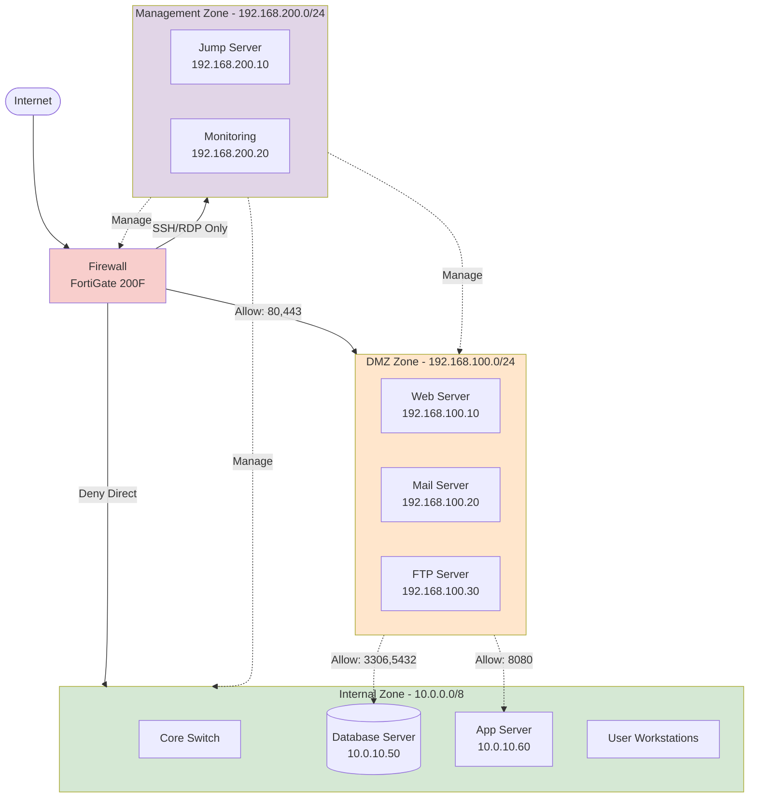

# Firewall DMZ Zones

> Standard firewall topology พร้อม DMZ zones สำหรับ enterprise security

## 📋 ใช้ตอนไหน

- ✅ Enterprise ที่ต้องการ security zones ชัดเจน
- ✅ มี public-facing services (web, mail, FTP)
- ✅ ต้องการแยก internal network ออกจาก public
- ✅ Compliance requirements (PCI-DSS, ISO 27001)
- ✅ Firewall: Fortinet, Palo Alto, Cisco Firepower, Check Point
- ❌ **ไม่เหมาะกับ**: SMB ที่ไม่มี public services (ใช้ firewall ง่ายๆ พอ)

---

## 🖼️ Preview

```
Internet → Firewall → DMZ (Web/Mail/FTP)
                   → Internal (Users/DB)
```

---

## 🌊 Mermaid Template



---

## 📝 Draw.io XML Template

```xml
<mxfile host="app.diagrams.net" modified="2026-04-24T00:00:00.000Z" version="24.0.0">
  <diagram name="Firewall DMZ" id="fw-dmz">
    <mxGraphModel dx="1200" dy="800" grid="1" gridSize="10" guides="1" tooltips="1" connect="1" arrows="1" fold="1" page="1" pageScale="1" pageWidth="1400" pageHeight="900">
      <root>
        <mxCell id="0" />
        <mxCell id="1" parent="0" />
        
        <mxCell id="inet" value="Internet" style="ellipse;whiteSpace=wrap;html=1;fillColor=#dae8fc;strokeColor=#6c8ebf;" vertex="1" parent="1">
          <mxGeometry x="600" y="40" width="200" height="80" as="geometry" />
        </mxCell>
        
        <mxCell id="fw" value="Firewall&#10;FortiGate 200F" style="rounded=1;whiteSpace=wrap;html=1;fillColor=#f8cecc;strokeColor=#b85450;" vertex="1" parent="1">
          <mxGeometry x="600" y="180" width="200" height="80" as="geometry" />
        </mxCell>
        
        <mxCell id="dmz_zone" value="DMZ Zone - 192.168.100.0/24" style="swimlane;startSize=30;fillColor=#ffe6cc;strokeColor=#d79b00;html=1;" vertex="1" parent="1">
          <mxGeometry x="40" y="340" width="460" height="200" as="geometry" />
        </mxCell>
        <mxCell id="web" value="Web Server&#10;192.168.100.10" style="rounded=1;whiteSpace=wrap;html=1;" vertex="1" parent="dmz_zone">
          <mxGeometry x="40" y="60" width="120" height="60" as="geometry" />
        </mxCell>
        <mxCell id="mail" value="Mail Server&#10;192.168.100.20" style="rounded=1;whiteSpace=wrap;html=1;" vertex="1" parent="dmz_zone">
          <mxGeometry x="180" y="60" width="120" height="60" as="geometry" />
        </mxCell>
        <mxCell id="ftp" value="FTP Server&#10;192.168.100.30" style="rounded=1;whiteSpace=wrap;html=1;" vertex="1" parent="dmz_zone">
          <mxGeometry x="320" y="60" width="120" height="60" as="geometry" />
        </mxCell>
        
        <mxCell id="int_zone" value="Internal Zone - 10.0.0.0/8" style="swimlane;startSize=30;fillColor=#d5e8d4;strokeColor=#82b366;html=1;" vertex="1" parent="1">
          <mxGeometry x="560" y="340" width="480" height="200" as="geometry" />
        </mxCell>
        <mxCell id="core" value="Core Switch" style="rounded=1;whiteSpace=wrap;html=1;" vertex="1" parent="int_zone">
          <mxGeometry x="40" y="60" width="120" height="60" as="geometry" />
        </mxCell>
        <mxCell id="db" value="Database&#10;10.0.10.50" style="shape=cylinder3;whiteSpace=wrap;html=1;fillColor=#fff2cc;strokeColor=#d6b656;" vertex="1" parent="int_zone">
          <mxGeometry x="180" y="60" width="120" height="70" as="geometry" />
        </mxCell>
        <mxCell id="app" value="App Server&#10;10.0.10.60" style="rounded=1;whiteSpace=wrap;html=1;" vertex="1" parent="int_zone">
          <mxGeometry x="320" y="60" width="120" height="60" as="geometry" />
        </mxCell>
        
        <mxCell id="mgt_zone" value="Management Zone - 192.168.200.0/24" style="swimlane;startSize=30;fillColor=#e1d5e7;strokeColor=#9673a6;html=1;" vertex="1" parent="1">
          <mxGeometry x="1100" y="340" width="260" height="200" as="geometry" />
        </mxCell>
        <mxCell id="jump" value="Jump Server&#10;192.168.200.10" style="rounded=1;whiteSpace=wrap;html=1;" vertex="1" parent="mgt_zone">
          <mxGeometry x="40" y="60" width="180" height="60" as="geometry" />
        </mxCell>
        <mxCell id="mon" value="Monitoring&#10;192.168.200.20" style="rounded=1;whiteSpace=wrap;html=1;" vertex="1" parent="mgt_zone">
          <mxGeometry x="40" y="130" width="180" height="50" as="geometry" />
        </mxCell>
        
        <mxCell id="e_inet_fw" style="edgeStyle=orthogonalEdgeStyle;rounded=1;html=1;" edge="1" parent="1" source="inet" target="fw">
          <mxGeometry relative="1" as="geometry" />
        </mxCell>
        
        <mxCell id="e_fw_dmz" value="Allow:&#10;80,443,25,587" style="edgeStyle=orthogonalEdgeStyle;rounded=1;html=1;" edge="1" parent="1" source="fw" target="dmz_zone">
          <mxGeometry relative="1" as="geometry" />
        </mxCell>
        
        <mxCell id="e_fw_int" value="Deny Direct" style="edgeStyle=orthogonalEdgeStyle;rounded=1;html=1;" edge="1" parent="1" source="fw" target="int_zone">
          <mxGeometry relative="1" as="geometry" />
        </mxCell>
        
        <mxCell id="e_fw_mgt" value="SSH/RDP&#10;Only" style="edgeStyle=orthogonalEdgeStyle;rounded=1;html=1;" edge="1" parent="1" source="fw" target="mgt_zone">
          <mxGeometry relative="1" as="geometry" />
        </mxCell>
        
        <mxCell id="e_web_db" value="3306,5432" style="edgeStyle=orthogonalEdgeStyle;rounded=1;html=1;dashed=1;" edge="1" parent="1" source="web" target="db">
          <mxGeometry relative="1" as="geometry" />
        </mxCell>
        
        <mxCell id="e_web_app" value="8080" style="edgeStyle=orthogonalEdgeStyle;rounded=1;html=1;dashed=1;" edge="1" parent="1" source="web" target="app">
          <mxGeometry relative="1" as="geometry" />
        </mxCell>
      </root>
    </mxGraphModel>
  </diagram>
</mxfile>
```

---

## 💡 Prompt ตัวอย่าง

### แบบ A: ใช้ template พื้นฐาน

```
ใช้ template firewall-dmz-zones.md
ปรับเป็น network ของบริษัท [ชื่อบริษัท]:
- Firewall: [Fortinet/Palo Alto/Cisco]
- DMZ services: [Web, Mail, VPN gateway]
- Internal: [จำนวน users, servers]
- Compliance: [PCI-DSS/ISO 27001/HIPAA]
```

### แบบ B: เพิ่ม zones

```
ใช้ template firewall-dmz-zones.md
เพิ่ม zones:
- IoT Zone (CCTV, Access Control)
- Guest WiFi Zone (isolated)
- Partner Zone (VPN access only)
แสดง traffic flow ระหว่าง zones
```

### แบบ C: High Availability

```
ใช้ template firewall-dmz-zones.md
แต่เป็น HA setup:
- Firewall 2 ตัว (Active-Passive)
- Redundant links
- Failover time < 3 seconds
```

---

## 🔧 Parameters ที่ควรปรับ

| Parameter | Default | ทางเลือก |
|---|---|---|
| Zones | 3 (DMZ, Internal, Mgmt) | 4-8 zones ตาม security model |
| Firewall | Single | HA pair, Cluster |
| DMZ services | Web, Mail, FTP | VPN, Proxy, API Gateway |
| Internal subnets | Single /8 | Multiple VLANs |
| Rules | Basic allow/deny | Application-aware, IPS/IDS |

---

## 📌 Notes

### Security Best Practices
- **Least Privilege**: อนุญาตแค่ port ที่จำเป็น
- **No Direct Access**: Internet ไม่ควรถึง Internal ตรงๆ
- **DMZ Isolation**: DMZ ไม่ควรเห็น Internal ทั้งหมด
- **Management Separate**: Mgmt zone แยกออกมา

### Traffic Flow Rules
```
Internet → DMZ: Allow (80, 443, 25, 587, 21)
DMZ → Internal: Allow (specific DB ports only)
Internet → Internal: Deny All
Internal → Internet: NAT + Filter
Management → All: SSH/RDP/HTTPS (MFA required)
```

### Common Zones
| Zone | Purpose | IP Range Example |
|---|---|---|
| DMZ | Public services | 192.168.100.0/24 |
| Internal | Users, Apps | 10.0.0.0/8 |
| Management | Admin access | 192.168.200.0/24 |
| Guest WiFi | Visitors | 172.16.0.0/16 |
| IoT | Devices | 192.168.150.0/24 |

### Related Templates
- สำหรับ SD-WAN + Firewall → ดู `sd-wan-multi-site.md`
- สำหรับ WiFi security → ดู `enterprise-wifi-deployment.md`
