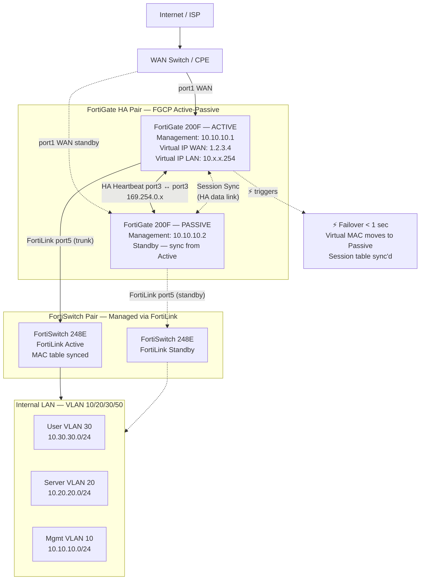

# FortiGate HA (Active-Passive)

> FortiGate HA Active-Passive — HA heartbeat link, FortiLink, sync, failover path

## 📋 ใช้ตอนไหน

- ✅ ออกแบบ FortiGate HA pair (Active-Passive) สำหรับ enterprise / mid-size
- ✅ HLD / LLD ที่ต้องการ firewall redundancy โดยไม่ใช้ ECMP
- ✅ Environment ที่ใช้ FortiSwitch (FortiLink) เชื่อมต่อจาก FortiGate
- ✅ ใช้คู่กับ vlan-segmentation.md และ firewall-dmz-zones.md
- ❌ **ไม่เหมาะกับ**: FortiGate VDOM ซับซ้อน, FortiGate HA Active-Active (FGCP A-A), Palo Alto / Cisco ASA HA

---

## 🎨 Pragma Style Diagram (Draw.io XML)

```xml
<mxfile host="app.diagrams.net" version="24.0.0">
  <diagram name="FortiGate HA Active-Passive — Pragma Style">
    <mxGraphModel dx="1400" dy="900" grid="0" background="#1a1a2e">
      <root>
        <mxCell id="0"/><mxCell id="1" parent="0"/>
        <mxCell id="title" value="FortiGate HA Active-Passive — Pragma Style" style="text;html=1;strokeColor=none;fillColor=none;align=center;fontSize=22;fontStyle=1;fontColor=#ffffff;" vertex="1" parent="1">
          <mxGeometry x="100" y="20" width="900" height="40" as="geometry"/>
        </mxCell>

        <mxCell id="isp" value="Internet / ISP&#xa;WAN uplink" style="strokeColor=#ffffff;sketch=0;html=1;fillColor=#036897;strokeWidth=2;verticalLabelPosition=bottom;verticalAlign=top;align=center;outlineConnect=0;shape=mxgraph.cisco.routers.atm_router;fontColor=#ffffff;fontSize=11;" vertex="1" parent="1">
          <mxGeometry x="530" y="30" width="78" height="53" as="geometry"/>
        </mxCell>

        <mxCell id="fgt_act" value="FortiGate 200F — ACTIVE&#xa;Primary Unit&#xa;Management IP: 10.10.10.1&#xa;WAN: 1.2.3.4 (Virtual IP)&#xa;LAN: 10.10.10.254 (Virtual IP)" style="sketch=0;points=[[0.015,0.015,0],[0.985,0.015,0],[0.985,0.985,0],[0.015,0.985,0],[0.25,0,0],[0.5,0,0],[0.75,0,0],[1,0.25,0],[1,0.5,0],[1,0.75,0],[0.75,1,0],[0.5,1,0],[0.25,1,0],[0,0.75,0],[0,0.5,0],[0,0.25,0]];verticalLabelPosition=bottom;html=1;verticalAlign=top;aspect=fixed;align=center;shape=mxgraph.cisco19.rect;prIcon=firewall;fillColor=#1a4a1a;strokeColor=#66bb6a;fontColor=#ffffff;fontSize=9;" vertex="1" parent="1">
          <mxGeometry x="300" y="150" width="120" height="60" as="geometry"/>
        </mxCell>

        <mxCell id="fgt_pas" value="FortiGate 200F — PASSIVE&#xa;Secondary Unit (Standby)&#xa;Management IP: 10.10.10.2&#xa;Sync from Active unit" style="sketch=0;points=[[0.015,0.015,0],[0.985,0.015,0],[0.985,0.985,0],[0.015,0.985,0],[0.25,0,0],[0.5,0,0],[0.75,0,0],[1,0.25,0],[1,0.5,0],[1,0.75,0],[0.75,1,0],[0.5,1,0],[0.25,1,0],[0,0.75,0],[0,0.5,0],[0,0.25,0]];verticalLabelPosition=bottom;html=1;verticalAlign=top;aspect=fixed;align=center;shape=mxgraph.cisco19.rect;prIcon=firewall;fillColor=#3a1010;strokeColor=#e53935;fontColor=#ffffff;fontSize=9;" vertex="1" parent="1">
          <mxGeometry x="720" y="150" width="120" height="60" as="geometry"/>
        </mxCell>

        <mxCell id="ha_hb" value="HA Heartbeat&#xa;port3 ↔ port3&#xa;169.254.0.x (link-local)" style="edgeStyle=orthogonalEdgeStyle;rounded=1;html=1;strokeColor=#f9a825;strokeWidth=3;fontColor=#f9a825;fontSize=9;" edge="1" parent="1" source="fgt_act" target="fgt_pas">
          <mxGeometry relative="1" as="geometry"><Array as="points"><mxPoint x="460" y="180"/><mxPoint x="680" y="180"/></Array></mxGeometry>
        </mxCell>

        <mxCell id="ha_sync" value="Session Sync&#xa;(HA data link)" style="edgeStyle=orthogonalEdgeStyle;rounded=1;html=1;strokeColor=#cddc39;strokeWidth=2;dashed=1;fontColor=#cddc39;fontSize=9;" edge="1" parent="1" source="fgt_act" target="fgt_pas">
          <mxGeometry relative="1" as="geometry"><Array as="points"><mxPoint x="460" y="220"/><mxPoint x="680" y="220"/></Array></mxGeometry>
        </mxCell>

        <mxCell id="wan_sw" value="WAN Switch / CPE&#xa;ISP router" style="sketch=0;html=1;verticalLabelPosition=bottom;verticalAlign=top;align=center;shape=mxgraph.cisco.routers.router;fillColor=#036897;strokeColor=#4a90d9;fontColor=#ffffff;fontSize=10;" vertex="1" parent="1">
          <mxGeometry x="490" y="120" width="60" height="60" as="geometry"/>
        </mxCell>
        <mxCell id="e_isp_wan" value="" style="edgeStyle=orthogonalEdgeStyle;rounded=1;html=1;strokeColor=#4a90d9;strokeWidth=2;" edge="1" parent="1" source="isp" target="wan_sw"><mxGeometry relative="1" as="geometry"/></mxCell>
        <mxCell id="e_wan_act" value="port1 WAN" style="edgeStyle=orthogonalEdgeStyle;rounded=1;html=1;strokeColor=#4a90d9;strokeWidth=2;fontColor=#4a90d9;fontSize=9;" edge="1" parent="1" source="wan_sw" target="fgt_act"><mxGeometry relative="1" as="geometry"/></mxCell>
        <mxCell id="e_wan_pas" value="port1 WAN" style="edgeStyle=orthogonalEdgeStyle;rounded=1;html=1;strokeColor=#e53935;strokeWidth=2;dashed=1;fontColor=#e53935;fontSize=9;" edge="1" parent="1" source="wan_sw" target="fgt_pas"><mxGeometry relative="1" as="geometry"/></mxCell>

        <mxCell id="fswA" value="FortiSwitch 248E&#xa;FortiLink Port&#xa;VLAN trunk จาก Active&#xa;MAC table sync" style="sketch=0;html=1;verticalLabelPosition=bottom;verticalAlign=top;align=center;shape=mxgraph.cisco.switches.layer_3_switch;fillColor=#2e7d32;strokeColor=#66bb6a;fontColor=#ffffff;fontSize=10;" vertex="1" parent="1">
          <mxGeometry x="300" y="360" width="64" height="64" as="geometry"/>
        </mxCell>
        <mxCell id="fswB" value="FortiSwitch 248E&#xa;FortiLink Port&#xa;VLAN trunk จาก Passive&#xa;(standby link)" style="sketch=0;html=1;verticalLabelPosition=bottom;verticalAlign=top;align=center;shape=mxgraph.cisco.switches.layer_3_switch;fillColor=#2a1a0d;strokeColor=#ff9800;fontColor=#ffffff;fontSize=10;" vertex="1" parent="1">
          <mxGeometry x="720" y="360" width="64" height="64" as="geometry"/>
        </mxCell>

        <mxCell id="e_act_fswA" value="FortiLink&#xa;port5 (trunk)" style="edgeStyle=orthogonalEdgeStyle;rounded=1;html=1;strokeColor=#66bb6a;strokeWidth=2;fontColor=#66bb6a;fontSize=9;" edge="1" parent="1" source="fgt_act" target="fswA"><mxGeometry relative="1" as="geometry"/></mxCell>
        <mxCell id="e_pas_fswB" value="FortiLink&#xa;port5 (trunk)" style="edgeStyle=orthogonalEdgeStyle;rounded=1;html=1;strokeColor=#e53935;strokeWidth=2;dashed=1;fontColor=#e53935;fontSize=9;" edge="1" parent="1" source="fgt_pas" target="fswB"><mxGeometry relative="1" as="geometry"/></mxCell>

        <mxCell id="failover_label" value="⚡ Failover &lt; 1s&#xa;Virtual MAC ย้ายไป Passive&#xa;Session table sync'd" style="text;html=1;strokeColor=#f9a825;fillColor=#1a1a0d;align=center;fontSize=10;fontColor=#f9a825;rounded=1;" vertex="1" parent="1">
          <mxGeometry x="450" y="280" width="240" height="60" as="geometry"/>
        </mxCell>

        <mxCell id="L_lan" value="Internal LAN — VLAN 10-50     Managed by FortiSwitch via FortiLink     Policy pushed from FortiGate active" style="swimlane;startSize=30;fillColor=#0d2b1a;strokeColor=#2e7d32;fontColor=#ffffff;fontSize=11;fontStyle=1;html=1;" vertex="1" parent="1">
          <mxGeometry x="280" y="490" width="520" height="100" as="geometry"/>
        </mxCell>
        <mxCell id="lan_user" value="User VLAN 30&#xa;10.30.30.0/24" style="rounded=1;whiteSpace=wrap;html=1;fillColor=#2e7d32;strokeColor=#81c784;fontColor=#ffffff;fontSize=10;" vertex="1" parent="L_lan">
          <mxGeometry x="40" y="25" width="130" height="50" as="geometry"/>
        </mxCell>
        <mxCell id="lan_srv" value="Server VLAN 20&#xa;10.20.20.0/24" style="rounded=1;whiteSpace=wrap;html=1;fillColor=#1a4a1a;strokeColor=#66bb6a;fontColor=#ffffff;fontSize=10;" vertex="1" parent="L_lan">
          <mxGeometry x="200" y="25" width="130" height="50" as="geometry"/>
        </mxCell>
        <mxCell id="lan_mgmt" value="Mgmt VLAN 10&#xa;10.10.10.0/24" style="rounded=1;whiteSpace=wrap;html=1;fillColor=#1a3a5c;strokeColor=#4a90d9;fontColor=#ffffff;fontSize=10;" vertex="1" parent="L_lan">
          <mxGeometry x="360" y="25" width="130" height="50" as="geometry"/>
        </mxCell>

        <mxCell id="e_fswA_lan" value="trunk" style="edgeStyle=orthogonalEdgeStyle;rounded=1;html=1;strokeColor=#66bb6a;strokeWidth=2;fontColor=#66bb6a;fontSize=9;" edge="1" parent="1" source="fswA" target="L_lan"><mxGeometry relative="1" as="geometry"/></mxCell>
        <mxCell id="e_fswB_lan" value="trunk" style="edgeStyle=orthogonalEdgeStyle;rounded=1;html=1;strokeColor=#ff9800;strokeWidth=2;dashed=1;fontColor=#ff9800;fontSize=9;" edge="1" parent="1" source="fswB" target="L_lan"><mxGeometry relative="1" as="geometry"/></mxCell>
      </root>
    </mxGraphModel>
  </diagram>
</mxfile>
```

---

## 🌊 Mermaid Template



---

## 📊 ตารางข้อมูล HA (copy ใส่เอกสารได้เลย)

### FortiGate HA Configuration

| Parameter | Value |
|---|---|
| Model | FortiGate 200F × 2 |
| HA Mode | Active-Passive (FGCP) |
| HA Group ID | 1 |
| HA Password | [กำหนดเอง] |
| Heartbeat Interface | port3 (dedicated) |
| Session Sync | เปิด (port3 หรือ dedicated) |
| Failover Detection | HA heartbeat + link monitor |
| Priority Unit 1 (Active) | 128 (สูงกว่า) |
| Priority Unit 2 (Passive) | 100 |
| Failover Time | < 1 วินาที |

### Virtual IP & Management IP

| | Active Unit | Passive Unit | Virtual (Cluster) IP |
|---|---|---|---|
| WAN (port1) | 1.2.3.5/30 | 1.2.3.6/30 | 1.2.3.4 |
| LAN Management | 10.10.10.1/24 | 10.10.10.2/24 | 10.10.10.254 |

### FortiLink (FortiSwitch)

| FortiGate | Port | FortiSwitch | Role |
|---|---|---|---|
| Active | port5 | FortiSwitch 248E (SW-A) | Active FortiLink trunk |
| Passive | port5 | FortiSwitch 248E (SW-B) | Standby FortiLink trunk |

---

## 💡 Prompt ตัวอย่าง

### แบบ A: ออกแบบ FortiGate HA ใหม่
```
ใช้ template fortigate-ha.md แบบ Pragma Style
ออกแบบ FortiGate HA สำหรับ [ชื่อลูกค้า]:
- Model: FortiGate [model] × 2
- WAN: [ISP, Mbps]
- LAN VLAN: [รายการ VLAN + subnet]
- FortiSwitch: [model] ใช้/ไม่ใช้
- FortiLink: [Yes/No]
- Management subnet: [subnet]
- Virtual IP (cluster): [IP]
```

### แบบ B: Document FortiGate HA ที่ติดตั้งแล้ว
```
ใช้ template fortigate-ha.md แบบ Pragma Style
วาด HA diagram จากข้อมูลนี้:
- Active unit: [hostname, mgmt IP]
- Passive unit: [hostname, mgmt IP]
- Cluster IP: [WAN VIP], [LAN VIP]
- Heartbeat port: [port name]
- FortiSwitch: [model, มี/ไม่มี]
- VLANs: [รายการ]
```

---

## 🔧 Parameters ที่ปรับได้

| Parameter | Default | ทางเลือก |
|---|---|---|
| Model | FortiGate 200F | 100F, 400F, 600F, 1800F |
| HA Mode | Active-Passive | Active-Active (FGCP A-A) |
| Heartbeat interface | port3 (dedicated) | HA reserved interface |
| FortiSwitch | FortiSwitch 248E × 2 | ไม่ใช้ (ต่อ switch ทั่วไปแทน) |
| FortiLink | ใช้ (VDOM link) | ไม่ใช้ (switch เป็น unmanaged) |
| WAN | Single ISP | Dual ISP (SD-WAN / failover policy) |
| Priority difference | 28 (128 vs 100) | ปรับตาม preference |
| Session sync | เปิด | ปิด (ลด sync overhead แต่ failover หาย session) |

---

## 📌 Notes สำหรับ SI

- **HA Heartbeat Dedicated**: ควรใช้ port แยกสำหรับ heartbeat เท่านั้น — ห้ามใช้ port ที่มี production traffic
- **Virtual MAC**: เมื่อ failover เกิด Passive unit จะรับ virtual MAC ของ cluster — ARP ไม่ต้อง flush แต่ switch MAC table ต้องอัปเดต
- **FortiLink HA**: ถ้าใช้ FortiSwitch ทั้งคู่ — FortiSwitch จะ sync MAC table ผ่าน FortiLink ทั้งสอง unit ป้องกัน loop
- **Firmware Sync**: HA pair ต้องใช้ FortiOS version เดียวกัน — อัปเดต passive ก่อน แล้วค่อย failover มาอัปเดต primary
- **Monitor Interface**: เปิด port monitor บน WAN interface — ถ้า WAN link down ให้ trigger failover แม้ heartbeat ยังดีอยู่
- **Priority ≠ Preempt**: ถ้าปิด preemption — หลัง passive กลับมา จะไม่แย่ง active คืนอัตโนมัติ (แนะนำสำหรับ production stability)

### Related Templates
- VLAN บน FortiSwitch → `vlan-segmentation.md`
- DMZ zones บน FortiGate → `firewall-dmz-zones.md`
- SD-WAN หลาย site → `sd-wan-multi-site.md`

**อัพเดตล่าสุด**: 2026-06-27 — initial template
