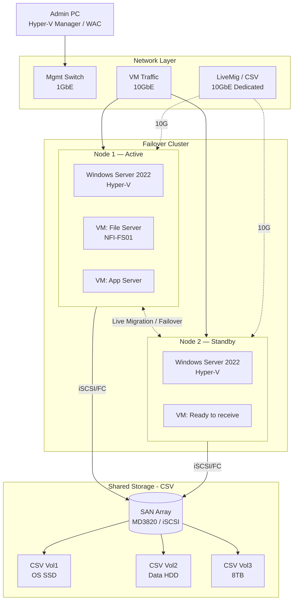

# Hyper-V Failover Cluster

> Windows Server Failover Cluster บน Hyper-V — HA VM hosting, Cluster Shared Volumes, Live Migration

## 📋 ใช้ตอนไหน

- ✅ Windows Server Hyper-V HA environment
- ✅ Failover Cluster 2 nodes ขึ้นไป
- ✅ มี Cluster Shared Volumes (CSV) จาก SAN/iSCSI/SMB
- ✅ ต้องการ Live Migration / Quick Migration
- ❌ **ไม่เหมาะกับ**: VMware vSphere (ใช้ 3-tier-data-center.md แทน), single node Hyper-V

---

## 🎨 Pragma Style Diagram (Draw.io XML)

```xml
<mxfile host="app.diagrams.net" version="24.0.0">
  <diagram name="Hyper-V Failover Cluster — Pragma Style">
    <mxGraphModel dx="1400" dy="900" grid="0" background="#1a1a2e">
      <root>
        <mxCell id="0"/><mxCell id="1" parent="0"/>
        <mxCell id="title" value="Hyper-V Failover Cluster" style="text;html=1;strokeColor=none;fillColor=none;align=center;fontSize=22;fontStyle=1;fontColor=#ffffff;" vertex="1" parent="1">
          <mxGeometry x="100" y="20" width="800" height="40" as="geometry"/>
        </mxCell>
        <mxCell id="L_mgmt" value="MANAGEMENT" style="swimlane;startSize=30;fillColor=#1a2a4a;strokeColor=#4a90d9;fontColor=#ffffff;fontSize=13;fontStyle=1;html=1;" vertex="1" parent="1">
          <mxGeometry x="40" y="70" width="960" height="110" as="geometry"/>
        </mxCell>
        <mxCell id="admpc" value="Admin PC&#xa;Hyper-V Manager&#xa;RSAT" style="shape=mxgraph.cisco.computers_and_peripherals.pc;strokeColor=#ffffff;fillColor=#aaaaaa;fontColor=#ffffff;fontSize=10;verticalLabelPosition=bottom;verticalAlign=top;html=1;" vertex="1" parent="L_mgmt">
          <mxGeometry x="100" y="20" width="60" height="55" as="geometry"/>
        </mxCell>
        <mxCell id="scvmm" value="SCVMM&#xa;System Center VMM&#xa;(Optional)" style="rounded=1;whiteSpace=wrap;html=1;fillColor=#1a3a5c;strokeColor=#4a90d9;fontColor=#ffffff;fontSize=10;" vertex="1" parent="L_mgmt">
          <mxGeometry x="380" y="20" width="180" height="60" as="geometry"/>
        </mxCell>
        <mxCell id="wsus" value="Windows Admin Center&#xa;/ WSUS" style="rounded=1;whiteSpace=wrap;html=1;fillColor=#1a3a5c;strokeColor=#4a90d9;fontColor=#ffffff;fontSize=10;" vertex="1" parent="L_mgmt">
          <mxGeometry x="680" y="20" width="180" height="60" as="geometry"/>
        </mxCell>
        <mxCell id="L_net" value="NETWORK — Management / VM / LiveMigration / CSV" style="swimlane;startSize=30;fillColor=#0d2b1a;strokeColor=#2e7d32;fontColor=#ffffff;fontSize=13;fontStyle=1;html=1;" vertex="1" parent="1">
          <mxGeometry x="40" y="210" width="960" height="110" as="geometry"/>
        </mxCell>
        <mxCell id="sw_mgmt" value="Management Switch&#xa;1GbE / VLAN Mgmt" style="strokeColor=#ffffff;sketch=0;html=1;fillColor=#2e7d32;strokeWidth=2;verticalLabelPosition=bottom;verticalAlign=top;align=center;outlineConnect=0;shape=mxgraph.cisco.switches.layer_2_remote_switch;fontColor=#ffffff;fontSize=10;" vertex="1" parent="L_net">
          <mxGeometry x="100" y="20" width="101" height="50" as="geometry"/>
        </mxCell>
        <mxCell id="sw_vm" value="VM Traffic Switch&#xa;10GbE / VLAN Prod" style="strokeColor=#ffffff;sketch=0;html=1;fillColor=#2e7d32;strokeWidth=2;verticalLabelPosition=bottom;verticalAlign=top;align=center;outlineConnect=0;shape=mxgraph.cisco.switches.layer_3_switch;fontColor=#ffffff;fontSize=10;" vertex="1" parent="L_net">
          <mxGeometry x="380" y="15" width="64" height="64" as="geometry"/>
        </mxCell>
        <mxCell id="sw_lm" value="LiveMig / CSV Switch&#xa;10GbE / Dedicated" style="strokeColor=#ffffff;sketch=0;html=1;fillColor=#1a5c2a;strokeWidth=2;verticalLabelPosition=bottom;verticalAlign=top;align=center;outlineConnect=0;shape=mxgraph.cisco.switches.layer_3_switch;fontColor=#ffffff;fontSize=10;" vertex="1" parent="L_net">
          <mxGeometry x="680" y="15" width="64" height="64" as="geometry"/>
        </mxCell>
        <mxCell id="L_cluster" value="FAILOVER CLUSTER — Windows Server 2022" style="swimlane;startSize=30;fillColor=#1a0d2b;strokeColor=#6a1b9a;fontColor=#ffffff;fontSize=13;fontStyle=1;html=1;" vertex="1" parent="1">
          <mxGeometry x="40" y="350" width="960" height="260" as="geometry"/>
        </mxCell>
        <mxCell id="node1_box" value="HVC Node 1 (Active Owner)" style="swimlane;startSize=25;fillColor=#2d1a4a;strokeColor=#9c27b0;fontColor=#ffffff;fontSize=11;fontStyle=1;html=1;" vertex="1" parent="L_cluster">
          <mxGeometry x="30" y="40" width="400" height="200" as="geometry"/>
        </mxCell>
        <mxCell id="n1_cpu" value="Host&#xa;Windows Server 2022&#xa;Hyper-V Role" style="rounded=1;whiteSpace=wrap;html=1;fillColor=#4a1a6a;strokeColor=#ce93d8;fontColor=#ffffff;fontSize=10;" vertex="1" parent="node1_box">
          <mxGeometry x="15" y="35" width="150" height="60" as="geometry"/>
        </mxCell>
        <mxCell id="n1_vm1" value="VM: File Server&#xa;NFI-FS01&#xa;192.168.22.244" style="rounded=1;whiteSpace=wrap;html=1;fillColor=#6a1b9a;strokeColor=#e040fb;fontColor=#ffffff;fontSize=10;" vertex="1" parent="node1_box">
          <mxGeometry x="200" y="35" width="170" height="55" as="geometry"/>
        </mxCell>
        <mxCell id="n1_vm2" value="VM: App Server&#xa;NFI-APP01" style="rounded=1;whiteSpace=wrap;html=1;fillColor=#6a1b9a;strokeColor=#e040fb;fontColor=#ffffff;fontSize=10;" vertex="1" parent="node1_box">
          <mxGeometry x="200" y="105" width="170" height="55" as="geometry"/>
        </mxCell>
        <mxCell id="n1_nic" value="NIC Team (LACP) — Mgmt | VM | LiveMig | CSV" style="rounded=1;whiteSpace=wrap;html=1;fillColor=#1a0d2b;strokeColor=#6a1b9a;fontColor=#aaaaaa;fontSize=9;" vertex="1" parent="node1_box">
          <mxGeometry x="15" y="150" width="350" height="35" as="geometry"/>
        </mxCell>
        <mxCell id="node2_box" value="HVC Node 2 (Standby)" style="swimlane;startSize=25;fillColor=#1a2a1a;strokeColor=#388e3c;fontColor=#ffffff;fontSize=11;fontStyle=1;html=1;" vertex="1" parent="L_cluster">
          <mxGeometry x="530" y="40" width="400" height="200" as="geometry"/>
        </mxCell>
        <mxCell id="n2_cpu" value="Host&#xa;Windows Server 2022&#xa;Hyper-V Role" style="rounded=1;whiteSpace=wrap;html=1;fillColor=#1a4a1a;strokeColor=#81c784;fontColor=#ffffff;fontSize=10;" vertex="1" parent="node2_box">
          <mxGeometry x="15" y="35" width="150" height="60" as="geometry"/>
        </mxCell>
        <mxCell id="n2_vm1" value="VM: (Failed Over)&#xa;Ready to receive" style="rounded=1;whiteSpace=wrap;html=1;fillColor=#2e3a2e;strokeColor=#81c784;fontColor=#aaaaaa;fontSize=10;dashed=1;" vertex="1" parent="node2_box">
          <mxGeometry x="200" y="35" width="170" height="55" as="geometry"/>
        </mxCell>
        <mxCell id="n2_nic" value="NIC Team (LACP) — Mgmt | VM | LiveMig | CSV" style="rounded=1;whiteSpace=wrap;html=1;fillColor=#0d2b0d;strokeColor=#388e3c;fontColor=#aaaaaa;fontSize=9;" vertex="1" parent="node2_box">
          <mxGeometry x="15" y="150" width="350" height="35" as="geometry"/>
        </mxCell>
        <mxCell id="lm_arrow" value="Live Migration / Failover" style="edgeStyle=orthogonalEdgeStyle;rounded=1;html=1;strokeColor=#00bcd4;strokeWidth=3;dashed=1;fontColor=#00bcd4;fontSize=11;fontStyle=1;" edge="1" parent="L_cluster" source="node1_box" target="node2_box">
          <mxGeometry relative="1" as="geometry"/>
        </mxCell>
        <mxCell id="L_storage" value="SHARED STORAGE — Cluster Shared Volumes (CSV)" style="swimlane;startSize=30;fillColor=#1a1a0d;strokeColor=#f9a825;fontColor=#ffffff;fontSize=13;fontStyle=1;html=1;" vertex="1" parent="1">
          <mxGeometry x="40" y="640" width="960" height="150" as="geometry"/>
        </mxCell>
        <mxCell id="san" value="SAN / Storage Array&#xa;MD3820 / Dell PowerVault&#xa;FC / iSCSI" style="shape=cylinder3;whiteSpace=wrap;html=1;fillColor=#5d4037;strokeColor=#f9a825;fontColor=#ffffff;fontSize=10;verticalLabelPosition=bottom;verticalAlign=top;" vertex="1" parent="L_storage">
          <mxGeometry x="100" y="20" width="130" height="90" as="geometry"/>
        </mxCell>
        <mxCell id="csv1" value="CSV Volume 1&#xa;C:\ClusterStorage\Volume1&#xa;OS Disks (SSD)" style="rounded=1;whiteSpace=wrap;html=1;fillColor=#5d4037;strokeColor=#f9a825;fontColor=#ffffff;fontSize=10;" vertex="1" parent="L_storage">
          <mxGeometry x="310" y="30" width="180" height="60" as="geometry"/>
        </mxCell>
        <mxCell id="csv2" value="CSV Volume 2&#xa;C:\ClusterStorage\Volume2&#xa;Data Disks (HDD)" style="rounded=1;whiteSpace=wrap;html=1;fillColor=#4e342e;strokeColor=#f9a825;fontColor=#ffffff;fontSize=10;" vertex="1" parent="L_storage">
          <mxGeometry x="510" y="30" width="180" height="60" as="geometry"/>
        </mxCell>
        <mxCell id="csv3" value="CSV Volume 3&#xa;C:\ClusterStorage\Volume3&#xa;MD3820-HDD (8TB)" style="rounded=1;whiteSpace=wrap;html=1;fillColor=#4e342e;strokeColor=#ff9800;fontColor=#ffffff;fontSize=10;" vertex="1" parent="L_storage">
          <mxGeometry x="710" y="30" width="200" height="60" as="geometry"/>
        </mxCell>
        <mxCell id="e_sw_n1" value="" style="edgeStyle=orthogonalEdgeStyle;rounded=1;html=1;strokeColor=#2e7d32;strokeWidth=2;" edge="1" parent="1" source="sw_vm" target="node1_box"><mxGeometry relative="1" as="geometry"/></mxCell>
        <mxCell id="e_sw_n2" value="" style="edgeStyle=orthogonalEdgeStyle;rounded=1;html=1;strokeColor=#2e7d32;strokeWidth=2;" edge="1" parent="1" source="sw_vm" target="node2_box"><mxGeometry relative="1" as="geometry"/></mxCell>
        <mxCell id="e_lm_n1" value="10G" style="edgeStyle=orthogonalEdgeStyle;rounded=1;html=1;strokeColor=#00bcd4;strokeWidth=2;dashed=1;fontColor=#00bcd4;fontSize=10;" edge="1" parent="1" source="sw_lm" target="node1_box"><mxGeometry relative="1" as="geometry"/></mxCell>
        <mxCell id="e_lm_n2" value="10G" style="edgeStyle=orthogonalEdgeStyle;rounded=1;html=1;strokeColor=#00bcd4;strokeWidth=2;dashed=1;fontColor=#00bcd4;fontSize=10;" edge="1" parent="1" source="sw_lm" target="node2_box"><mxGeometry relative="1" as="geometry"/></mxCell>
        <mxCell id="e_n1_san" value="iSCSI / FC" style="edgeStyle=orthogonalEdgeStyle;rounded=1;html=1;strokeColor=#f9a825;strokeWidth=2;fontColor=#f9a825;fontSize=10;" edge="1" parent="1" source="node1_box" target="san"><mxGeometry relative="1" as="geometry"/></mxCell>
        <mxCell id="e_n2_san" value="iSCSI / FC" style="edgeStyle=orthogonalEdgeStyle;rounded=1;html=1;strokeColor=#f9a825;strokeWidth=2;fontColor=#f9a825;fontSize=10;" edge="1" parent="1" source="node2_box" target="san"><mxGeometry relative="1" as="geometry"/></mxCell>
        <mxCell id="e_san_csv1" value="" style="edgeStyle=orthogonalEdgeStyle;rounded=1;html=1;strokeColor=#f9a825;strokeWidth=2;" edge="1" parent="1" source="san" target="csv1"><mxGeometry relative="1" as="geometry"/></mxCell>
        <mxCell id="e_san_csv2" value="" style="edgeStyle=orthogonalEdgeStyle;rounded=1;html=1;strokeColor=#f9a825;strokeWidth=2;" edge="1" parent="1" source="san" target="csv2"><mxGeometry relative="1" as="geometry"/></mxCell>
        <mxCell id="e_san_csv3" value="" style="edgeStyle=orthogonalEdgeStyle;rounded=1;html=1;strokeColor=#ff9800;strokeWidth=2;" edge="1" parent="1" source="san" target="csv3"><mxGeometry relative="1" as="geometry"/></mxCell>
        <mxCell id="e_adm_sw" value="" style="edgeStyle=orthogonalEdgeStyle;rounded=1;html=1;strokeColor=#4a90d9;strokeWidth=2;" edge="1" parent="1" source="admpc" target="sw_mgmt"><mxGeometry relative="1" as="geometry"/></mxCell>
      </root>
    </mxGraphModel>
  </diagram>
</mxfile>
```

---

## 🌊 Mermaid Template



---

## 💡 Prompt ตัวอย่าง

### แบบ A: 2-Node Cluster มาตรฐาน
```
ใช้ template hyper-v-failover-cluster.md แบบ Pragma Style
ปรับสำหรับ [ชื่อลูกค้า]:
- Node 1: [hostname] — [CPU/RAM spec]
- Node 2: [hostname] — [CPU/RAM spec]
- Storage: [SAN model / iSCSI target]
- CSV Volumes: [จำนวน + ขนาด]
- VM ที่รันอยู่: [รายการ VM]
- Network: [Management VLAN / VM VLAN]
```

### แบบ B: NFI Production Environment
```
ใช้ template hyper-v-failover-cluster.md แบบ Pragma Style
ปรับตาม NFI environment:
- Node 1: NFI-HVC01
- Node 2: NFI-HVC02
- Storage: MD3820 (CSV Volume3 = MD3820-HDD, 8TB)
- VM หลัก: NFI-FS01 (192.168.22.244) — File Server
- Backup: Veeam Backup & Replication
- SMB Shares: Department-share, ISO-Document, Transfer
```

### แบบ C: เพิ่ม Veeam Backup layer
```
ใช้ template hyper-v-failover-cluster.md แบบ Pragma Style
เพิ่ม Backup Layer:
- Veeam Backup Server
- Backup Repository (separate storage)
- Job: Full Weekly + Incremental Daily
- Retention: 14 restore points
```

---

## 🔧 Parameters ที่ปรับได้

| Parameter | Default | ทางเลือก |
|---|---|---|
| Nodes | 2 nodes | 3-16 nodes |
| OS | Windows Server 2022 | 2019 |
| Storage | SAN iSCSI | FC SAN, SMB 3.0 (S2D) |
| Network | 4 vNIC (Mgmt/VM/LM/CSV) | 2 vNIC Converged |
| Migration | Live Migration | Quick Migration |
| Quorum | File Share Witness | Disk Witness, Cloud Witness |

---

## 📌 Notes สำหรับ SI / Admin

- **NIC Teaming**: แนะนำ SET (Switch Embedded Teaming) บน Server 2022
- **CSV Network**: แยก NIC dedicated สำหรับ CSV I/O เพื่อ performance
- **Live Migration Network**: ควรเป็น 10GbE dedicated — ห้ามใช้ NIC เดียวกับ VM traffic
- **Quorum**: 2 nodes ควรใช้ File Share Witness หรือ Cloud Witness (Azure)
- **Cluster Validation**: รัน `Test-Cluster` ก่อน deploy จริงทุกครั้ง
- **Anti-affinity**: ตั้ง preferred owners ให้ VM กระจายทั้งสอง node
- **Backup speed**: 1GbE = ~125 MB/s bottleneck — แนะนำ 10GbE สำหรับ 8TB+ workload

### Related Templates
- VMware environment → `3-tier-data-center.md`
- Backup topology → `backup-architecture.md`
- Network design → `vlan-segmentation.md`

**อัพเดตล่าสุด**: 2026-05-07 — initial template, based on NFI production DR scenario (NFI-HVC01/02, MD3820, NFI-FS01)
