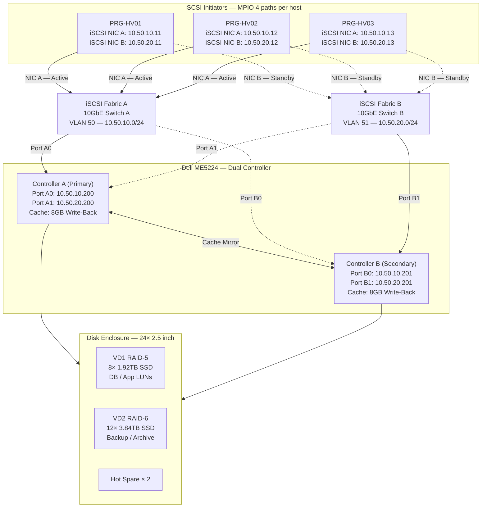

# iSCSI SAN Multipath

> iSCSI SAN (Dell ME5224 dual-controller), MPIO multipath, redundant fabric, host ↔ controller path

## 📋 ใช้ตอนไหน

- ✅ ออกแบบ iSCSI SAN ให้กับ Hyper-V Failover Cluster, VMware, หรือ physical host
- ✅ LLD สำหรับ Dell PowerVault ME5/ME4 หรือ HPE MSA dual-controller
- ✅ Project ที่ต้องการ MPIO multipath เพื่อ redundancy และ throughput
- ✅ ใช้คู่กับ hyper-v-failover-cluster.md หรือ vsan-cluster.md
- ❌ **ไม่เหมาะกับ**: FC SAN (Fibre Channel), NFS/SMB storage, vSAN (built-in storage)

---

## 🎨 Pragma Style Diagram (Draw.io XML)

```xml
<mxfile host="app.diagrams.net" version="24.0.0">
  <diagram name="iSCSI SAN Multipath — Pragma Style">
    <mxGraphModel dx="1400" dy="900" grid="0" background="#1a1a2e">
      <root>
        <mxCell id="0"/><mxCell id="1" parent="0"/>
        <mxCell id="title" value="iSCSI SAN Multipath — Dell ME5224 Dual-Controller" style="text;html=1;strokeColor=none;fillColor=none;align=center;fontSize=22;fontStyle=1;fontColor=#ffffff;" vertex="1" parent="1">
          <mxGeometry x="100" y="20" width="900" height="40" as="geometry"/>
        </mxCell>

        <!-- HOSTS -->
        <mxCell id="L_hosts" value="iSCSI Initiators — Hosts     MPIO: 4 paths per host (2 NIC × 2 Controller port)" style="swimlane;startSize=30;fillColor=#1a0d2b;strokeColor=#6a1b9a;fontColor=#ffffff;fontSize=11;fontStyle=1;html=1;" vertex="1" parent="1">
          <mxGeometry x="40" y="80" width="1020" height="140" as="geometry"/>
        </mxCell>
        <mxCell id="host1" value="PRG-HV01&#xa;Hyper-V Node 1&#xa;iSCSI NIC A: 10.50.10.11&#xa;iSCSI NIC B: 10.50.20.11" style="rounded=1;whiteSpace=wrap;html=1;fillColor=#4a0e8f;strokeColor=#ce93d8;fontColor=#ffffff;fontSize=10;" vertex="1" parent="L_hosts">
          <mxGeometry x="60" y="30" width="200" height="85" as="geometry"/>
        </mxCell>
        <mxCell id="host2" value="PRG-HV02&#xa;Hyper-V Node 2&#xa;iSCSI NIC A: 10.50.10.12&#xa;iSCSI NIC B: 10.50.20.12" style="rounded=1;whiteSpace=wrap;html=1;fillColor=#4a0e8f;strokeColor=#ce93d8;fontColor=#ffffff;fontSize=10;" vertex="1" parent="L_hosts">
          <mxGeometry x="320" y="30" width="200" height="85" as="geometry"/>
        </mxCell>
        <mxCell id="host3" value="PRG-HV03&#xa;Hyper-V Node 3&#xa;iSCSI NIC A: 10.50.10.13&#xa;iSCSI NIC B: 10.50.20.13" style="rounded=1;whiteSpace=wrap;html=1;fillColor=#4a0e8f;strokeColor=#ce93d8;fontColor=#ffffff;fontSize=10;" vertex="1" parent="L_hosts">
          <mxGeometry x="580" y="30" width="200" height="85" as="geometry"/>
        </mxCell>

        <!-- FABRIC A -->
        <mxCell id="fabA" value="iSCSI Fabric A&#xa;10GbE Switch A&#xa;VLAN 50 — 10.50.10.0/24&#xa;Dedicated (no other traffic)" style="sketch=0;html=1;verticalLabelPosition=bottom;verticalAlign=top;align=center;shape=mxgraph.cisco.switches.workgroup_switch;fillColor=#8b3a0f;strokeColor=#ff9800;fontColor=#ffffff;fontSize=10;" vertex="1" parent="1">
          <mxGeometry x="220" y="300" width="64" height="64" as="geometry"/>
        </mxCell>

        <!-- FABRIC B -->
        <mxCell id="fabB" value="iSCSI Fabric B&#xa;10GbE Switch B&#xa;VLAN 51 — 10.50.20.0/24&#xa;Dedicated (no other traffic)" style="sketch=0;html=1;verticalLabelPosition=bottom;verticalAlign=top;align=center;shape=mxgraph.cisco.switches.workgroup_switch;fillColor=#8b3a0f;strokeColor=#ff9800;fontColor=#ffffff;fontSize=10;" vertex="1" parent="1">
          <mxGeometry x="820" y="300" width="64" height="64" as="geometry"/>
        </mxCell>

        <!-- CONTROLLER A -->
        <mxCell id="ctlA" value="Controller A (Primary)&#xa;Dell ME5224&#xa;iSCSI Port A0: 10.50.10.200&#xa;iSCSI Port A1: 10.50.20.200&#xa;Cache: 8 GB Write-Back" style="rounded=1;whiteSpace=wrap;html=1;fillColor=#1a4a1a;strokeColor=#66bb6a;fontColor=#ffffff;fontSize=10;" vertex="1" parent="1">
          <mxGeometry x="280" y="480" width="220" height="100" as="geometry"/>
        </mxCell>

        <!-- CONTROLLER B -->
        <mxCell id="ctlB" value="Controller B (Secondary)&#xa;Dell ME5224&#xa;iSCSI Port B0: 10.50.10.201&#xa;iSCSI Port B1: 10.50.20.201&#xa;Cache: 8 GB Write-Back" style="rounded=1;whiteSpace=wrap;html=1;fillColor=#1a4a1a;strokeColor=#66bb6a;fontColor=#ffffff;fontSize=10;" vertex="1" parent="1">
          <mxGeometry x="600" y="480" width="220" height="100" as="geometry"/>
        </mxCell>

        <!-- CACHE MIRROR -->
        <mxCell id="cache_link" value="Cache Mirror&#xa;(dedicated link)" style="edgeStyle=orthogonalEdgeStyle;rounded=1;html=1;strokeColor=#66bb6a;strokeWidth=3;fontColor=#66bb6a;fontSize=9;" edge="1" parent="1" source="ctlA" target="ctlB">
          <mxGeometry relative="1" as="geometry"/>
        </mxCell>

        <!-- DISK ENCLOSURE -->
        <mxCell id="L_disks" value="Disk Enclosure — Dell ME5224     24× 2.5&quot; SAS/SSD     RAID Groups: VD1 (RAID-5 DB), VD2 (RAID-6 Backup)" style="swimlane;startSize=30;fillColor=#1a1a0d;strokeColor=#f9a825;fontColor=#ffffff;fontSize=11;fontStyle=1;html=1;" vertex="1" parent="1">
          <mxGeometry x="280" y="640" width="540" height="100" as="geometry"/>
        </mxCell>
        <mxCell id="vd1" value="VD1 — RAID-5&#xa;DB / App LUNs&#xa;8× 1.92TB SSD" style="shape=cylinder3;whiteSpace=wrap;html=1;fillColor=#5d4037;strokeColor=#f9a825;fontColor=#ffffff;fontSize=10;verticalLabelPosition=bottom;verticalAlign=top;" vertex="1" parent="L_disks">
          <mxGeometry x="60" y="20" width="120" height="60" as="geometry"/>
        </mxCell>
        <mxCell id="vd2" value="VD2 — RAID-6&#xa;Backup / Archive&#xa;12× 3.84TB SSD" style="shape=cylinder3;whiteSpace=wrap;html=1;fillColor=#5d4037;strokeColor=#ff9800;fontColor=#ffffff;fontSize=10;verticalLabelPosition=bottom;verticalAlign=top;" vertex="1" parent="L_disks">
          <mxGeometry x="280" y="20" width="120" height="60" as="geometry"/>
        </mxCell>
        <mxCell id="hs" value="Hot Spare × 2" style="rounded=1;whiteSpace=wrap;html=1;fillColor=#2a2a0d;strokeColor=#cddc39;fontColor=#ffffff;fontSize=10;" vertex="1" parent="L_disks">
          <mxGeometry x="430" y="30" width="90" height="45" as="geometry"/>
        </mxCell>

        <!-- MPIO PATHS — HOST1 -->
        <mxCell id="p1_fabA" value="Path 1A (NIC A→FabA→CtlA)" style="edgeStyle=orthogonalEdgeStyle;rounded=1;html=1;strokeColor=#ff9800;strokeWidth=2;fontColor=#ff9800;fontSize=8;" edge="1" parent="1" source="host1" target="fabA"><mxGeometry relative="1" as="geometry"/></mxCell>
        <mxCell id="p1_fabB" value="Path 1B (NIC B→FabB→CtlA)" style="edgeStyle=orthogonalEdgeStyle;rounded=1;html=1;strokeColor=#ff9800;strokeWidth=2;dashed=1;fontColor=#ff9800;fontSize=8;" edge="1" parent="1" source="host1" target="fabB"><mxGeometry relative="1" as="geometry"/></mxCell>

        <!-- FABRIC → CONTROLLERS -->
        <mxCell id="fA_ctlA" value="Port A0" style="edgeStyle=orthogonalEdgeStyle;rounded=1;html=1;strokeColor=#f9a825;strokeWidth=2;fontColor=#f9a825;fontSize=9;" edge="1" parent="1" source="fabA" target="ctlA"><mxGeometry relative="1" as="geometry"/></mxCell>
        <mxCell id="fA_ctlB" value="Port B0" style="edgeStyle=orthogonalEdgeStyle;rounded=1;html=1;strokeColor=#f9a825;strokeWidth=2;dashed=1;fontColor=#f9a825;fontSize=9;" edge="1" parent="1" source="fabA" target="ctlB"><mxGeometry relative="1" as="geometry"/></mxCell>
        <mxCell id="fB_ctlA" value="Port A1" style="edgeStyle=orthogonalEdgeStyle;rounded=1;html=1;strokeColor=#f9a825;strokeWidth=2;dashed=1;fontColor=#f9a825;fontSize=9;" edge="1" parent="1" source="fabB" target="ctlA"><mxGeometry relative="1" as="geometry"/></mxCell>
        <mxCell id="fB_ctlB" value="Port B1" style="edgeStyle=orthogonalEdgeStyle;rounded=1;html=1;strokeColor=#f9a825;strokeWidth=2;fontColor=#f9a825;fontSize=9;" edge="1" parent="1" source="fabB" target="ctlB"><mxGeometry relative="1" as="geometry"/></mxCell>

        <!-- CONTROLLERS → DISKS -->
        <mxCell id="ctlA_disk" value="" style="edgeStyle=orthogonalEdgeStyle;rounded=1;html=1;strokeColor=#66bb6a;strokeWidth=3;" edge="1" parent="1" source="ctlA" target="L_disks"><mxGeometry relative="1" as="geometry"/></mxCell>
        <mxCell id="ctlB_disk" value="" style="edgeStyle=orthogonalEdgeStyle;rounded=1;html=1;strokeColor=#66bb6a;strokeWidth=3;" edge="1" parent="1" source="ctlB" target="L_disks"><mxGeometry relative="1" as="geometry"/></mxCell>
      </root>
    </mxGraphModel>
  </diagram>
</mxfile>
```

---

## 🌊 Mermaid Template



---

## 📊 ตารางข้อมูล iSCSI SAN (copy ใส่เอกสารได้เลย)

### iSCSI Target Ports

| Controller | Port | VLAN/Fabric | IP Address | จุดประสงค์ |
|---|---|---|---|---|
| Controller A | A0 | Fabric A (VLAN 50) | 10.50.10.200 | Primary path — Fabric A |
| Controller A | A1 | Fabric B (VLAN 51) | 10.50.20.200 | Secondary path — Fabric B |
| Controller B | B0 | Fabric A (VLAN 50) | 10.50.10.201 | Secondary path — Fabric A |
| Controller B | B1 | Fabric B (VLAN 51) | 10.50.20.201 | Primary path — Fabric B |

### iSCSI Initiator NICs (per host)

| Host | NIC A (Fabric A) | NIC B (Fabric B) | MPIO Policy |
|---|---|---|---|
| PRG-HV01 | 10.50.10.11 | 10.50.20.11 | Round Robin |
| PRG-HV02 | 10.50.10.12 | 10.50.20.12 | Round Robin |
| PRG-HV03 | 10.50.10.13 | 10.50.20.13 | Round Robin |

### LUN Mapping

| LUN | Volume | RAID | Disk | ขนาด | Map to |
|---|---|---|---|---|---|
| LUN 1 | VD1-DB | RAID-5 | 8× 1.92TB SSD | ~12 TB usable | ทุก host (Cluster Disk) |
| LUN 2 | VD1-APP | RAID-5 | (shared VD1) | ~4 TB usable | ทุก host (Cluster Disk) |
| LUN 3 | VD2-BACKUP | RAID-6 | 12× 3.84TB SSD | ~34 TB usable | PRG-HV01 (Backup target) |

---

## 💡 Prompt ตัวอย่าง

### แบบ A: ออกแบบ iSCSI SAN ใหม่
```
ใช้ template iscsi-san-multipath.md แบบ Pragma Style
ออกแบบ iSCSI SAN สำหรับ [ชื่อลูกค้า]:
- SAN model: [Dell ME5224 / HPE MSA 2060]
- Hosts: [จำนวน + hostname]
- iSCSI Switch: [model A], [model B]
- VLAN iSCSI Fabric A: [subnet]
- VLAN iSCSI Fabric B: [subnet]
- LUNs: [รายการ + ขนาด + RAID]
- MPIO policy: [Round Robin / Least Queue Depth]
```

### แบบ B: Document iSCSI ที่มีอยู่แล้ว
```
ใช้ template iscsi-san-multipath.md แบบ Pragma Style
วาด iSCSI diagram จากข้อมูลนี้:
- SAN: [model + controller IPs]
- Hosts: [hostname list + NIC IPs]
- Fabric A VLAN: [ID + subnet]
- Fabric B VLAN: [ID + subnet]
- LUNs: [รายการ]
```

---

## 🔧 Parameters ที่ปรับได้

| Parameter | Default | ทางเลือก |
|---|---|---|
| SAN model | Dell ME5224 | Dell ME4024, HPE MSA 2060, Pure FA-C |
| จำนวน host | 3 | 1-16 (เพิ่ม host box) |
| iSCSI speed | 10GbE | 25GbE |
| Fabric | 2 (A+B แยก switch) | 1 fabric (lower cost, less redundant) |
| MPIO policy | Round Robin | Least Queue Depth, Failover Only |
| VLAN iSCSI | 50/51 | ปรับตาม scheme ลูกค้า |
| RAID (VD1) | RAID-5 | RAID-10 (performance), RAID-6 (large drives) |
| Cache | Write-Back 8 GB | Write-Through (ปลอดภัยกว่า ถ้าไม่มี BBU) |

---

## 📌 Notes สำหรับ SI

- **iSCSI VLAN Dedicated**: ห้ามรวม iSCSI traffic กับ production VLAN — ป้องกัน broadcast/congestion กระทบ storage latency
- **Jumbo Frame MTU 9000**: เปิด Jumbo Frame บน iSCSI VLAN ทั้ง switch และ NIC — ลด CPU overhead ได้ 20-30%
- **MPIO Round Robin**: ใช้ได้กับ dual-controller แบบ Active/Active — กระจาย I/O ไปทั้งสอง controller
- **iSCSI Initiator Name (IQN)**: ต้อง map IQN ของแต่ละ host เข้า LUN masking บน controller — ป้องกัน host อื่นเห็น LUN ไม่ควร
- **Cache Battery (BBU)**: Write-Back cache ปลอดภัยก็ต่อเมื่อมี BBU — ถ้าไม่มีให้ใช้ Write-Through แทน
- **RAID rebuild time**: RAID-5 บน SSD ขนาดใหญ่ rebuild นาน — พิจารณา RAID-6 หรือ RAID-10 สำหรับ critical data

### Related Templates
- Hyper-V ใช้ iSCSI → `hyper-v-failover-cluster.md`
- VLAN สำหรับ iSCSI Fabric → `vlan-segmentation.md`
- Backup จาก LUN → `backup-architecture.md`

**อัพเดตล่าสุด**: 2026-06-27 — initial template
