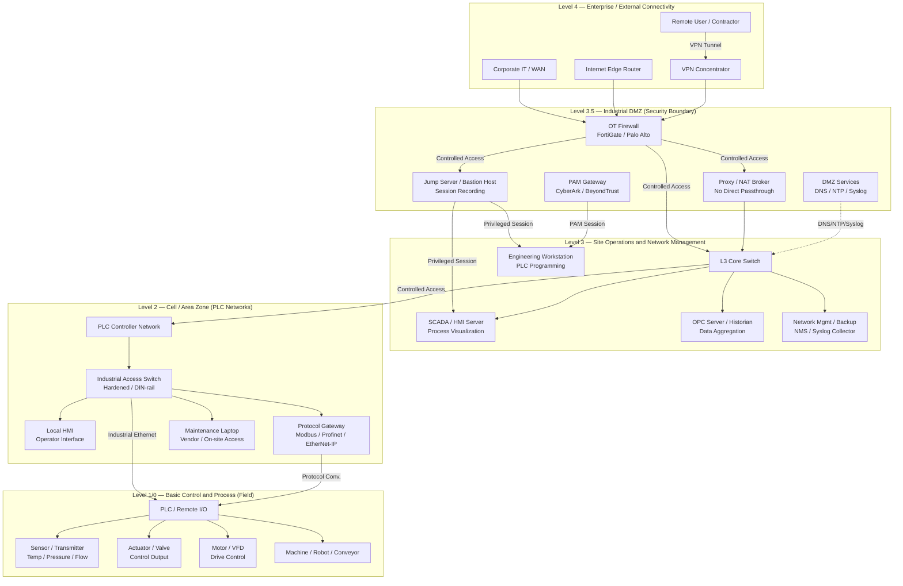

# OT/ICS Network — Purdue Model

> OT/ICS network design ตาม Purdue Reference Model — แบ่ง 5 ระดับ (L0–L4) + Industrial DMZ (L3.5) สำหรับ manufacturing plant, utility, critical infrastructure

## 📋 ใช้ตอนไหน

- ✅ ออกแบบ OT/ICS network สำหรับ manufacturing / utility / critical infrastructure
- ✅ แยก IT-OT boundary ตามมาตรฐาน IEC 62443 / NIST SP 800-82
- ✅ วางแผน Industrial DMZ (L3.5) และ OT firewall policy
- ✅ Project ที่มี PLC / SCADA / DCS / Historian และต้องเชื่อมต่อกับ corporate network
- ✅ ใช้คู่กับ firewall-dmz-zones.md สำหรับรายละเอียด security zone
- ❌ **ไม่เหมาะกับ**: IT network ทั่วไป (ใช้ vlan-segmentation.md แทน), home/SMB network ที่ไม่มี OT, pure cloud IIoT architecture

---

## 🎨 Pragma Style Diagram (Draw.io XML)

```xml
<mxfile host="app.diagrams.net" version="24.0.0">
  <diagram name="OT/ICS Purdue Model — Pragma Style">
    <mxGraphModel dx="1400" dy="900" grid="0" background="#1a1a2e">
      <root>
        <mxCell id="0"/><mxCell id="1" parent="0"/>
        <mxCell id="title" value="OT/ICS Network — Purdue Reference Model (Level 0–4)" style="text;html=1;strokeColor=none;fillColor=none;align=center;fontSize=20;fontStyle=1;fontColor=#ffffff;" vertex="1" parent="1">
          <mxGeometry x="80" y="20" width="1000" height="40" as="geometry"/>
        </mxCell>
        <mxCell id="L4" value="Level 4 — Enterprise / External Connectivity" style="swimlane;startSize=30;fillColor=#1a2a4a;strokeColor=#4a90d9;fontColor=#ffffff;fontSize=13;fontStyle=1;html=1;" vertex="1" parent="1">
          <mxGeometry x="40" y="70" width="1120" height="130" as="geometry"/>
        </mxCell>
        <mxCell id="l4_corp" value="Corporate IT / WAN&#xa;Enterprise Network&#xa;ERP / AD / Email" style="rounded=1;whiteSpace=wrap;html=1;fillColor=#1a3a5c;strokeColor=#4a90d9;fontColor=#ffffff;fontSize=10;" vertex="1" parent="L4">
          <mxGeometry x="60" y="33" width="200" height="68" as="geometry"/>
        </mxCell>
        <mxCell id="l4_edge" value="Internet Edge Router&#xa;WAN / ISP Link&#xa;BGP / MPLS" style="rounded=1;whiteSpace=wrap;html=1;fillColor=#1a3a5c;strokeColor=#4a90d9;fontColor=#ffffff;fontSize=10;" vertex="1" parent="L4">
          <mxGeometry x="310" y="33" width="200" height="68" as="geometry"/>
        </mxCell>
        <mxCell id="l4_vpn" value="VPN Concentrator&#xa;Remote Access Gateway&#xa;SSL / IPsec" style="rounded=1;whiteSpace=wrap;html=1;fillColor=#1a3a5c;strokeColor=#4a90d9;fontColor=#ffffff;fontSize=10;" vertex="1" parent="L4">
          <mxGeometry x="560" y="33" width="200" height="68" as="geometry"/>
        </mxCell>
        <mxCell id="l4_remote" value="Remote User /&#xa;Contractor Endpoint&#xa;MFA + Approval" style="rounded=1;whiteSpace=wrap;html=1;fillColor=#1a3a5c;strokeColor=#4a90d9;fontColor=#ffffff;fontSize=10;" vertex="1" parent="L4">
          <mxGeometry x="810" y="33" width="200" height="68" as="geometry"/>
        </mxCell>
        <mxCell id="L35" value="Level 3.5 — Industrial DMZ / Security Boundary   ⚡ CHOKE POINT — L4 ห้ามข้ามมา L2/L1/0 โดยตรง" style="swimlane;startSize=30;fillColor=#2d1a0e;strokeColor=#ff9800;fontColor=#ff9800;fontSize=13;fontStyle=1;html=1;" vertex="1" parent="1">
          <mxGeometry x="40" y="215" width="1120" height="145" as="geometry"/>
        </mxCell>
        <mxCell id="l35_fw" value="OT Firewall&#xa;FortiGate / Palo Alto&#xa;Whitelist-based policy" style="rounded=1;whiteSpace=wrap;html=1;fillColor=#3d2200;strokeColor=#ff9800;fontColor=#ffffff;fontSize=10;" vertex="1" parent="L35">
          <mxGeometry x="50" y="38" width="170" height="80" as="geometry"/>
        </mxCell>
        <mxCell id="l35_jump" value="Jump Server /&#xa;Bastion Host&#xa;Session Recording" style="rounded=1;whiteSpace=wrap;html=1;fillColor=#3d2200;strokeColor=#ff9800;fontColor=#ffffff;fontSize=10;" vertex="1" parent="L35">
          <mxGeometry x="260" y="38" width="170" height="80" as="geometry"/>
        </mxCell>
        <mxCell id="l35_pam" value="PAM Gateway&#xa;CyberArk / BeyondTrust&#xa;Privileged Access Mgmt" style="rounded=1;whiteSpace=wrap;html=1;fillColor=#3d2200;strokeColor=#ff9800;fontColor=#ffffff;fontSize=10;" vertex="1" parent="L35">
          <mxGeometry x="470" y="38" width="170" height="80" as="geometry"/>
        </mxCell>
        <mxCell id="l35_proxy" value="Proxy / NAT Broker&#xa;Protocol Break&#xa;No Direct Passthrough" style="rounded=1;whiteSpace=wrap;html=1;fillColor=#3d2200;strokeColor=#ff9800;fontColor=#ffffff;fontSize=10;" vertex="1" parent="L35">
          <mxGeometry x="680" y="38" width="170" height="80" as="geometry"/>
        </mxCell>
        <mxCell id="l35_svc" value="DMZ Services&#xa;DNS / NTP / Syslog Relay&#xa;Patch Proxy" style="rounded=1;whiteSpace=wrap;html=1;fillColor=#3d2200;strokeColor=#ff9800;fontColor=#ffffff;fontSize=10;" vertex="1" parent="L35">
          <mxGeometry x="890" y="38" width="170" height="80" as="geometry"/>
        </mxCell>
        <mxCell id="L3" value="Level 3 — Site Operations &amp; Network Management" style="swimlane;startSize=30;fillColor=#0d2b1a;strokeColor=#2e7d32;fontColor=#ffffff;fontSize=13;fontStyle=1;html=1;" vertex="1" parent="1">
          <mxGeometry x="40" y="375" width="1120" height="130" as="geometry"/>
        </mxCell>
        <mxCell id="l3_sw" value="L3 Core Switch&#xa;OT Network Backbone&#xa;Managed / VLAN" style="rounded=1;whiteSpace=wrap;html=1;fillColor=#1a4a1a;strokeColor=#66bb6a;fontColor=#ffffff;fontSize=10;" vertex="1" parent="L3">
          <mxGeometry x="50" y="33" width="170" height="68" as="geometry"/>
        </mxCell>
        <mxCell id="l3_scada" value="SCADA / HMI Server&#xa;Process Visualization&#xa;Alarm Management" style="rounded=1;whiteSpace=wrap;html=1;fillColor=#1a4a1a;strokeColor=#66bb6a;fontColor=#ffffff;fontSize=10;" vertex="1" parent="L3">
          <mxGeometry x="260" y="33" width="170" height="68" as="geometry"/>
        </mxCell>
        <mxCell id="l3_opc" value="OPC Server / Historian&#xa;OSIsoft PI / OPC-UA&#xa;Long-term Logging" style="rounded=1;whiteSpace=wrap;html=1;fillColor=#1a4a1a;strokeColor=#66bb6a;fontColor=#ffffff;fontSize=10;" vertex="1" parent="L3">
          <mxGeometry x="470" y="33" width="170" height="68" as="geometry"/>
        </mxCell>
        <mxCell id="l3_eng" value="Engineering Workstation&#xa;PLC Programming&#xa;Config / Commissioning" style="rounded=1;whiteSpace=wrap;html=1;fillColor=#1a4a1a;strokeColor=#66bb6a;fontColor=#ffffff;fontSize=10;" vertex="1" parent="L3">
          <mxGeometry x="680" y="33" width="170" height="68" as="geometry"/>
        </mxCell>
        <mxCell id="l3_mgmt" value="Network Mgmt /&#xa;Backup Server&#xa;NMS / Syslog Collector" style="rounded=1;whiteSpace=wrap;html=1;fillColor=#1a4a1a;strokeColor=#66bb6a;fontColor=#ffffff;fontSize=10;" vertex="1" parent="L3">
          <mxGeometry x="890" y="33" width="170" height="68" as="geometry"/>
        </mxCell>
        <mxCell id="L2" value="Level 2 — Cell / Area Zone (PLC Networks)" style="swimlane;startSize=30;fillColor=#1a0d2b;strokeColor=#6a1b9a;fontColor=#ffffff;fontSize=13;fontStyle=1;html=1;" vertex="1" parent="1">
          <mxGeometry x="40" y="520" width="1120" height="130" as="geometry"/>
        </mxCell>
        <mxCell id="l2_plcnet" value="PLC Controller Network&#xa;Dedicated OT Segment&#xa;Air-gap Ready" style="rounded=1;whiteSpace=wrap;html=1;fillColor=#2d1a4a;strokeColor=#ab47bc;fontColor=#ffffff;fontSize=10;" vertex="1" parent="L2">
          <mxGeometry x="50" y="33" width="170" height="68" as="geometry"/>
        </mxCell>
        <mxCell id="l2_indsw" value="Industrial Access Switch&#xa;Hardened / DIN-rail&#xa;EtherNet/IP Ready" style="rounded=1;whiteSpace=wrap;html=1;fillColor=#2d1a4a;strokeColor=#ab47bc;fontColor=#ffffff;fontSize=10;" vertex="1" parent="L2">
          <mxGeometry x="260" y="33" width="170" height="68" as="geometry"/>
        </mxCell>
        <mxCell id="l2_lhmi" value="Local HMI&#xa;Panel / Touch Screen&#xa;Operator Interface" style="rounded=1;whiteSpace=wrap;html=1;fillColor=#2d1a4a;strokeColor=#ab47bc;fontColor=#ffffff;fontSize=10;" vertex="1" parent="L2">
          <mxGeometry x="470" y="33" width="170" height="68" as="geometry"/>
        </mxCell>
        <mxCell id="l2_gw" value="Protocol Gateway&#xa;Modbus / Profinet /&#xa;EtherNet-IP" style="rounded=1;whiteSpace=wrap;html=1;fillColor=#2d1a4a;strokeColor=#ab47bc;fontColor=#ffffff;fontSize=10;" vertex="1" parent="L2">
          <mxGeometry x="680" y="33" width="170" height="68" as="geometry"/>
        </mxCell>
        <mxCell id="l2_maint" value="Maintenance Laptop&#xa;Vendor / On-site Access&#xa;Controlled Entry" style="rounded=1;whiteSpace=wrap;html=1;fillColor=#2d1a4a;strokeColor=#ab47bc;fontColor=#ffffff;fontSize=10;" vertex="1" parent="L2">
          <mxGeometry x="890" y="33" width="170" height="68" as="geometry"/>
        </mxCell>
        <mxCell id="L10" value="Level 1/0 — Basic Control &amp; Process (Field Devices)" style="swimlane;startSize=30;fillColor=#1a2420;strokeColor=#546e7a;fontColor=#ffffff;fontSize=13;fontStyle=1;html=1;" vertex="1" parent="1">
          <mxGeometry x="40" y="665" width="1120" height="130" as="geometry"/>
        </mxCell>
        <mxCell id="l10_plc" value="PLC / Remote I/O&#xa;Controller Unit&#xa;Scan Cycle: 10–100ms" style="rounded=1;whiteSpace=wrap;html=1;fillColor=#263238;strokeColor=#90a4ae;fontColor=#ffffff;fontSize=10;" vertex="1" parent="L10">
          <mxGeometry x="50" y="33" width="170" height="68" as="geometry"/>
        </mxCell>
        <mxCell id="l10_sensor" value="Sensor / Transmitter&#xa;Temp / Pressure / Flow&#xa;4-20mA / HART" style="rounded=1;whiteSpace=wrap;html=1;fillColor=#263238;strokeColor=#90a4ae;fontColor=#ffffff;fontSize=10;" vertex="1" parent="L10">
          <mxGeometry x="260" y="33" width="170" height="68" as="geometry"/>
        </mxCell>
        <mxCell id="l10_act" value="Actuator / Valve&#xa;Control Output&#xa;On/Off / Modulating" style="rounded=1;whiteSpace=wrap;html=1;fillColor=#263238;strokeColor=#90a4ae;fontColor=#ffffff;fontSize=10;" vertex="1" parent="L10">
          <mxGeometry x="470" y="33" width="170" height="68" as="geometry"/>
        </mxCell>
        <mxCell id="l10_vfd" value="Motor / VFD&#xa;Drive Control&#xa;Speed / Torque" style="rounded=1;whiteSpace=wrap;html=1;fillColor=#263238;strokeColor=#90a4ae;fontColor=#ffffff;fontSize=10;" vertex="1" parent="L10">
          <mxGeometry x="680" y="33" width="170" height="68" as="geometry"/>
        </mxCell>
        <mxCell id="l10_mach" value="Machine / Robot /&#xa;Conveyor&#xa;Production Line" style="rounded=1;whiteSpace=wrap;html=1;fillColor=#263238;strokeColor=#90a4ae;fontColor=#ffffff;fontSize=10;" vertex="1" parent="L10">
          <mxGeometry x="890" y="33" width="170" height="68" as="geometry"/>
        </mxCell>
        <mxCell id="e_remote_vpn" value="Remote Access" style="edgeStyle=orthogonalEdgeStyle;rounded=1;html=1;strokeColor=#90caf9;strokeWidth=1;dashed=1;fontColor=#90caf9;fontSize=9;" edge="1" parent="1" source="l4_remote" target="l4_vpn">
          <mxGeometry relative="1" as="geometry"/>
        </mxCell>
        <mxCell id="e_corp_fw" value="WAN / VPN" style="edgeStyle=orthogonalEdgeStyle;rounded=1;html=1;strokeColor=#4a90d9;strokeWidth=2;fontColor=#4a90d9;fontSize=9;" edge="1" parent="1" source="l4_corp" target="l35_fw">
          <mxGeometry relative="1" as="geometry"/>
        </mxCell>
        <mxCell id="e_vpn_fw" value="VPN Tunnel" style="edgeStyle=orthogonalEdgeStyle;rounded=1;html=1;strokeColor=#4a90d9;strokeWidth=2;dashed=1;fontColor=#90caf9;fontSize=9;" edge="1" parent="1" source="l4_vpn" target="l35_fw">
          <mxGeometry relative="1" as="geometry"/>
        </mxCell>
        <mxCell id="e_fw_l3sw" value="Controlled Access" style="edgeStyle=orthogonalEdgeStyle;rounded=1;html=1;strokeColor=#ff9800;strokeWidth=3;fontColor=#ff9800;fontSize=9;" edge="1" parent="1" source="l35_fw" target="l3_sw">
          <mxGeometry relative="1" as="geometry"/>
        </mxCell>
        <mxCell id="e_jump_scada" value="Privileged Session" style="edgeStyle=orthogonalEdgeStyle;rounded=1;html=1;strokeColor=#ff9800;strokeWidth=2;dashed=1;fontColor=#ff9800;fontSize=9;" edge="1" parent="1" source="l35_jump" target="l3_scada">
          <mxGeometry relative="1" as="geometry"/>
        </mxCell>
        <mxCell id="e_pam_eng" value="PAM Session" style="edgeStyle=orthogonalEdgeStyle;rounded=1;html=1;strokeColor=#ff9800;strokeWidth=2;dashed=1;fontColor=#ff9800;fontSize=9;" edge="1" parent="1" source="l35_pam" target="l3_eng">
          <mxGeometry relative="1" as="geometry"/>
        </mxCell>
        <mxCell id="e_l3sw_scada" value="" style="edgeStyle=orthogonalEdgeStyle;rounded=1;html=1;strokeColor=#2e7d32;strokeWidth=2;" edge="1" parent="1" source="l3_sw" target="l3_scada">
          <mxGeometry relative="1" as="geometry"/>
        </mxCell>
        <mxCell id="e_scada_opc" value="OPC-UA" style="edgeStyle=orthogonalEdgeStyle;rounded=1;html=1;strokeColor=#2e7d32;strokeWidth=2;fontColor=#a5d6a7;fontSize=9;" edge="1" parent="1" source="l3_scada" target="l3_opc">
          <mxGeometry relative="1" as="geometry"/>
        </mxCell>
        <mxCell id="e_l3sw_l2" value="Controlled Access" style="edgeStyle=orthogonalEdgeStyle;rounded=1;html=1;strokeColor=#66bb6a;strokeWidth=2;fontColor=#a5d6a7;fontSize=9;" edge="1" parent="1" source="l3_sw" target="l2_plcnet">
          <mxGeometry relative="1" as="geometry"/>
        </mxCell>
        <mxCell id="e_l2net_indsw" value="" style="edgeStyle=orthogonalEdgeStyle;rounded=1;html=1;strokeColor=#6a1b9a;strokeWidth=2;" edge="1" parent="1" source="l2_plcnet" target="l2_indsw">
          <mxGeometry relative="1" as="geometry"/>
        </mxCell>
        <mxCell id="e_indsw_plc" value="Industrial Ethernet" style="edgeStyle=orthogonalEdgeStyle;rounded=1;html=1;strokeColor=#546e7a;strokeWidth=2;fontColor=#90a4ae;fontSize=9;" edge="1" parent="1" source="l2_indsw" target="l10_plc">
          <mxGeometry relative="1" as="geometry"/>
        </mxCell>
        <mxCell id="e_gw_plc" value="Protocol Conv." style="edgeStyle=orthogonalEdgeStyle;rounded=1;html=1;strokeColor=#546e7a;strokeWidth=2;dashed=1;fontColor=#90a4ae;fontSize=9;" edge="1" parent="1" source="l2_gw" target="l10_plc">
          <mxGeometry relative="1" as="geometry"/>
        </mxCell>
        <mxCell id="e_plc_sensor" value="" style="edgeStyle=orthogonalEdgeStyle;rounded=1;html=1;strokeColor=#546e7a;strokeWidth=1;" edge="1" parent="1" source="l10_plc" target="l10_sensor">
          <mxGeometry relative="1" as="geometry"/>
        </mxCell>
        <mxCell id="e_plc_act" value="" style="edgeStyle=orthogonalEdgeStyle;rounded=1;html=1;strokeColor=#546e7a;strokeWidth=1;" edge="1" parent="1" source="l10_plc" target="l10_act">
          <mxGeometry relative="1" as="geometry"/>
        </mxCell>
        <mxCell id="e_plc_vfd" value="" style="edgeStyle=orthogonalEdgeStyle;rounded=1;html=1;strokeColor=#546e7a;strokeWidth=1;" edge="1" parent="1" source="l10_plc" target="l10_vfd">
          <mxGeometry relative="1" as="geometry"/>
        </mxCell>
        <mxCell id="e_plc_mach" value="" style="edgeStyle=orthogonalEdgeStyle;rounded=1;html=1;strokeColor=#546e7a;strokeWidth=1;" edge="1" parent="1" source="l10_plc" target="l10_mach">
          <mxGeometry relative="1" as="geometry"/>
        </mxCell>
        <mxCell id="note_rule" value="⚠ L4 ห้ามคุย L2/L1/0 โดยตรง — ทุก traffic ต้องผ่าน L3.5 DMZ (IEC 62443)" style="text;html=1;strokeColor=#cc0000;fillColor=#2a0000;rounded=1;align=center;fontSize=10;fontColor=#ff6666;fontStyle=1;" vertex="1" parent="1">
          <mxGeometry x="40" y="808" width="720" height="24" as="geometry"/>
        </mxCell>
        <mxCell id="note_ref" value="Reference: IEC 62443 | NIST SP 800-82 | ISA-99" style="text;html=1;strokeColor=none;fillColor=none;align=right;fontSize=9;fontColor=#556677;" vertex="1" parent="1">
          <mxGeometry x="780" y="808" width="380" height="24" as="geometry"/>
        </mxCell>
      </root>
    </mxGraphModel>
  </diagram>
</mxfile>
```

---

## 🌊 Mermaid Template



---

## 📊 Network Data Table (Source of Truth)

> ทีมเก็บข้อมูลนี้ใน Excel — เป็น single source of truth สำหรับ generate/regen diagram ทุกครั้ง

| Purdue Level | VLAN ID | ชื่อ Network | Subnet | Gateway | อุปกรณ์หลัก | หมายเหตุ |
|---|---|---|---|---|---|---|
| L4 | 400 | Enterprise WAN | 10.40.0.0/24 | 10.40.0.1 | Edge Router, VPN Concentrator | ฝั่ง IT — ต้องผ่าน Firewall เสมอ |
| L3.5 | 35 | Industrial DMZ | 10.35.0.0/24 | 10.35.0.1 | OT Firewall, Jump Server, PAM Gateway | Security boundary — ห้าม bypass |
| L3.5 | 36 | DMZ Services | 10.35.1.0/24 | 10.35.1.1 | DNS Relay, NTP Relay, Syslog, Patch Proxy | Services แยก segment ออกจาก FW |
| L3 | 300 | Site Operations | 10.30.0.0/24 | 10.30.0.1 | SCADA Server, OPC Historian, Engineering WS | SCADA และ Historian อยู่ที่ Level นี้ |
| L3 | 310 | Network Management | 10.31.0.0/24 | 10.31.0.1 | NMS, Backup Server, Syslog Collector | OOB management ของ OT network |
| L2 | 200 | PLC Zone A | 10.20.0.0/24 | 10.20.0.1 | PLC Controller, Local HMI, Industrial Switch | Production line A |
| L2 | 210 | PLC Zone B | 10.21.0.0/24 | 10.21.0.1 | PLC Controller, Protocol Gateway | Production line B |
| L1/0 | 100 | Field Devices | 10.10.0.0/24 | 10.10.0.1 | PLC I/O, Sensor, Actuator, VFD | Physical process layer — isolated segment |

---

## 🔄 Workflow: แก้ Excel → อัปเดต Diagram

> ไม่ใช่ real-time auto-sync — แต่เป็น **regen ไม่ถึง 1 นาที** ได้ diagram ตรง Pragma Brand เป๊ะ ทุกครั้งที่ข้อมูลเปลี่ยน

1. **ทีมแก้ข้อมูลใน Excel** — เช่น เพิ่ม VLAN 220 สำหรับ PLC Zone C ที่ Level 2, เปลี่ยน subnet, อัปเดตชื่ออุปกรณ์
2. **Copy ตารางทั้งหมด** — Select header + data ทุกแถว → Copy (หรือ Export เป็น CSV)
3. **Paste ให้ Claude พร้อม prompt regen** — ใช้ Prompt แบบ B ด้านล่าง วาง table ทั้งหมดแนบไปด้วย
4. **Claude ตรวจสอบตาราง (Auto-Validation)** — Claude จะ validate ตามกฎในหัวข้อถัดไปก่อน generate เสมอ ถ้าพบปัญหาจะ flag สีแดงในไดอะแกรมและแสดง summary รายการปัญหาก่อนส่ง XML
5. **Claude สร้าง Pragma Style XML ใหม่** — ได้ Draw.io XML ตาม table ล่าสุด copy ไปวาง Draw.io ได้ทันที

---

## ✅ Auto-Validation Rules (บังคับเช็คก่อน Generate)

Claude ต้องตรวจสอบทุกกฎด้านล่างก่อน generate diagram จากตาราง **ทุกครั้ง** — ห้าม generate เงียบๆ ตามตารางดื้อๆ

ถ้าเจอปัญหา Claude ต้องทำสองสิ่งพร้อมกัน:
- **(ก)** ทำ node หรือ edge ที่มีปัญหาเป็น **สีแดง** + ใส่ label คำเตือนในไดอะแกรม
- **(ข)** สรุปรายการปัญหาเป็นข้อความแยกก่อนส่ง XML ให้ทีมเห็นชัดก่อนนำไปใช้

**กฎที่ต้องเช็ค:**

| # | กฎ | สิ่งที่ Claude เช็ค | ตัวอย่างปัญหา |
|---|---|---|---|
| 1 | **VLAN ID ซ้ำ** | ทุก VLAN ID ในตารางต้องไม่ซ้ำกัน | VLAN 200 ปรากฏทั้ง L4 และ L2 |
| 2 | **Subnet / Gateway ว่าง** | ทุกแถวต้องมี Subnet และ Gateway ครบ | L2 PLC Zone A ไม่มี Gateway |
| 3 | **Subnet ซ้อนทับ** | ห้าม subnet ของสอง network ทับกัน | 10.20.0.0/24 ใช้ทั้ง L2 และ L1/0 |
| 4 | **Link ข้าม Level** | ห้าม L4 เชื่อมตรงไป L2/L1/0 โดยไม่ผ่าน L3.5 | Corporate IT → PLC Zone A ตรงๆ |
| 5 | **Level ไม่ถูกต้อง** | ค่าในคอลัมน์ Purdue Level ต้องเป็น L4 / L3.5 / L3 / L2 / L1/0 เท่านั้น | typo เช่น "Level2", "l2", "LV2" |

---

### 🧪 ตัวอย่างตารางทดสอบ (มีปัญหา 3 แบบ)

> ตารางนี้มีปัญหาจงใจ — ดูผลลัพธ์ที่ได้ด้านล่างเพื่อเข้าใจว่า validation ทำงานยังไง โดยไม่ต้องลองเอง

| Purdue Level | VLAN ID | ชื่อ Network | Subnet | Gateway | อุปกรณ์หลัก | หมายเหตุ |
|---|---|---|---|---|---|---|
| L4 | 100 | Enterprise WAN | 10.40.0.0/24 | 10.40.0.1 | Edge Router | — |
| L4 | **200** | Remote Access VPN | 10.41.0.0/24 | 10.41.0.1 | VPN Concentrator | — |
| L3.5 | 35 | Industrial DMZ | 10.35.0.0/24 | 10.35.0.1 | OT Firewall, Jump Server | — |
| L3 | 300 | SCADA Network | 10.30.0.0/24 | 10.30.0.1 | SCADA Server, Historian | — |
| L2 | **200** | PLC Zone A | 10.20.0.0/24 | **(ว่าง)** | PLC Controller, Local HMI | ⚠ ดูปัญหา 1 + 2 |
| L1/0 | 110 | Field Devices | **10.20.0.0/24** | 10.20.0.254 | Sensor, Actuator, VFD | ⚠ ดูปัญหา 3 |

นอกจากตาราง ทีมยังระบุว่า: **"ต้องการ link ตรงจาก Corporate IT (L4) → PLC Zone A (L2)"** — นี่คือปัญหาข้อ 4

**ผลลัพธ์ที่ Claude ต้องแสดง (ก่อน generate XML):**

```
🚨 พบ 4 ปัญหาก่อน Generate — Claude จะ flag สีแดงในไดอะแกรมดังนี้:

  1. VLAN 200 ซ้ำ (กฎ 1)
     → "Remote Access VPN" (L4) และ "PLC Zone A" (L2) ใช้ VLAN 200 เหมือนกัน
     → ทั้งสอง node ขึ้นขอบแดง + label "⚠ VLAN 200 DUPLICATE"

  2. Gateway ว่าง (กฎ 2)
     → "PLC Zone A" (L2, VLAN 200) ไม่มี Gateway
     → node ขึ้น label เพิ่ม "⚠ GATEWAY MISSING"

  3. Subnet ซ้อนทับ (กฎ 3)
     → 10.20.0.0/24 ถูกใช้ทั้ง "PLC Zone A" (L2) และ "Field Devices" (L1/0)
     → "Field Devices" ขึ้นขอบแดง + label "⚠ SUBNET OVERLAP 10.20.0.0/24"

  4. Link ข้าม Level (กฎ 4)
     → Edge Corporate IT (L4) → PLC Zone A (L2) ข้าม L3.5 โดยตรง
     → Edge สีแดงหนา + label "🚫 PURDUE LEVEL SKIP — ต้องผ่าน L3.5"

❗ กรุณาแก้ไขตารางและ topology ก่อน — Claude พร้อม generate XML ใหม่หลังแก้ครบ
```

---

## 💡 Prompt ตัวอย่าง

### แบบ A: สร้าง OT diagram ใหม่จาก Data Table
```
ใช้ template ot-purdue-model.md แบบ Pragma Style
สร้าง OT/ICS Purdue Model diagram สำหรับ [ชื่อ plant / facility]:

[วาง Network Data Table ทั้งหมดที่นี่]

- OT Firewall: [FortiGate / Palo Alto / อื่นๆ]
- SCADA: [Wonderware / Ignition / WinCC]
- PLC: [Siemens S7 / Allen-Bradley / Mitsubishi]
- Protocol หลัก: [EtherNet/IP / Profinet / Modbus TCP]

ให้ validate ตาม Auto-Validation Rules ทุกข้อก่อน generate เสมอ
```

### แบบ B: Regen หลังแก้ Excel (เพิ่ม/ลบ VLAN)
```
ใช้ template ot-purdue-model.md แบบ Pragma Style
ตารางด้านล่างคือข้อมูลล่าสุดหลังแก้ Excel:

[วาง Network Data Table ที่แก้แล้วทั้งหมดที่นี่]

ขอให้:
1. Validate ตาม Auto-Validation Rules ทุกข้อก่อน generate
2. ถ้าพบปัญหา — flag สีแดงในไดอะแกรม + สรุปรายการปัญหาแยก
3. Generate Pragma Style XML ใหม่ทั้งหมดตาม table ล่าสุด
```

### แบบ C: Document จาก topology จริงที่มีอยู่ (ใส่ device + IP)
```
ใช้ template ot-purdue-model.md แบบ Pragma Style
วาด OT network diagram จาก topology ที่ติดตั้งจริงที่ [ชื่อลูกค้า]:

Level 4 (Enterprise):
- [model] — Edge Router — [IP]
- [model] — VPN Concentrator — [IP]

Level 3.5 (Industrial DMZ):
- [FortiGate / Palo Alto] — OT Firewall — [IP]
- [hostname] — Jump Host — [IP]
- [CyberArk / BeyondTrust] — PAM Gateway — [IP]

Level 3 (Site Operations):
- [model] — L3 Switch — [IP]
- [SCADA software] — SCADA Server — [hostname, IP]
- [Historian software] — OPC/Historian — [hostname, IP]
- [hostname] — Engineering WS — [IP]

Level 2 (PLC Zone A — Line 1):
- [model] — Industrial Switch — [IP]
- [PLC model] — PLC — [IP]
- [HMI model] — Local HMI — [IP]

Level 1/0 (Field):
- [จำนวน]x Sensor ([type, signal type])
- [จำนวน]x Actuator
- [จำนวน]x VFD ([model])

Protocol ที่ใช้: [OPC-UA / EtherNet/IP / Modbus TCP]
Validate ก่อน generate ตาม Auto-Validation Rules
```

---

## 🔧 Parameters ที่ปรับได้

| Parameter | Default | ทางเลือก |
|---|---|---|
| OT Firewall | FortiGate / Palo Alto | Cisco Firepower, Check Point, Claroty |
| PAM Solution | CyberArk / BeyondTrust | Wallix Bastion, HashiCorp Vault |
| SCADA Platform | Vendor-agnostic | Ignition, Wonderware, Siemens WinCC |
| Historian | OSIsoft PI / OPC-UA | Wonderware Historian, Ignition Historian |
| Field Protocol | EtherNet/IP | Profinet, Modbus TCP, DNP3 |
| Field Bus (L1/0) | Industrial Ethernet | Profibus, DeviceNet, Foundation Fieldbus |
| Air-gap Type | Firewall + Jump Host | Data Diode (Waterfall / Owl), Physical Air-gap |
| จำนวน PLC Zone (L2) | 2 (Zone A + B) | 1–10 zone ขึ้นกับสายการผลิต |

---

## 📌 Notes สำหรับ SI

- **L3.5 คือ mandatory** — L4 ต้องไม่มีทางเชื่อมตรงไป L2/L1/0 ได้เลย แม้แต่ ICMP ping — IEC 62443 กำหนดชัด
- **OT Firewall ต้อง whitelist-only** — default-deny ทุก connection แล้ว allow เฉพาะ protocol/port/IP ที่รู้แน่ว่าต้องใช้ (OPC-UA 4840, Modbus TCP 502, Profinet etc.)
- **Vendor remote access ผ่าน PAM เท่านั้น** — ห้าม vendor เอา VPN client เข้าถึง L2/L3 โดยตรง ทุก session ต้องผ่าน PAM / Jump Host และ record session
- **ห้ามสแกน OT ด้วย IT tool** — Nessus / nmap aggressive scan อาจทำให้ PLC หยุดทำงานหรือ trigger safety shutdown — ใช้ passive OT monitoring (Claroty, Dragos, Nozomi) แทน
- **Patch OT ระวัง downtime** — PLC / SCADA บางตัวมี maintenance window แคบมาก ต้องนัด production team ล่วงหน้า มี rollback plan ก่อน patch ทุกครั้ง
- **Engineering WS = high-risk endpoint** — laptop ที่ใช้ program PLC มักถูกเอา USB drive ต่อ — enforce USB policy เข้มงวด, scan device ก่อน connect ทุกครั้ง
- **Data Diode** — ระบบที่ต้องการ one-way data flow (เช่น water treatment, power grid) ใช้ data diode ระหว่าง L2 และ L3 เพื่อให้ข้อมูลไหลออกได้ทางเดียว ป้องกัน remote code execution จาก L3 ลงไป
- **Purdue Model = reference model** ไม่ใช่ physical topology บังคับ — บาง site อาจรวม L1/L2 ไว้ด้วยกันหรือแยก L3 เป็นหลาย zone ตาม plant layout ได้ แต่หลักการ DMZ และ choke point ต้องคงไว้

### Related Templates
- Security zone rule set → `firewall-dmz-zones.md`
- IT network VLAN → `vlan-segmentation.md`
- Enterprise WAN / SD-WAN → `sd-wan-multi-site.md`

**อัพเดตล่าสุด**: 2026-06-27 — initial OT Purdue template with auto-validation rules
