# OT/ICS Network — Purdue Model

> OT/ICS network architecture ตาม Purdue Reference Model — 5 ชั้น L0–L4 + Industrial DMZ, IEC 62443

## 📋 ใช้ตอนไหน

- ✅ ออกแบบหรือ document OT/ICS network สำหรับโรงงาน / utilities / critical infrastructure
- ✅ HLD / LLD โปรเจกต์ที่มี PLC, SCADA, Historian, OPC server ต้องแยกจาก IT network
- ✅ โปรเจกต์ที่ต้องแยก IT/OT ชัดเจน — ติดตั้ง OT firewall, jump server, PAM ตาม IEC 62443
- ✅ ใช้คู่กับ vlan-segmentation.md (VLAN design) และ firewall-dmz-zones.md (rule set)
- ❌ **ไม่เหมาะกับ**: IT network ทั่วไป (office, datacenter) → ใช้ vlan-segmentation.md แทน
- ❌ **ไม่เหมาะกับ**: Cloud-native IIoT / AWS Greengrass / Azure IoT Hub — architecture ต่างกันพื้นฐาน

---

## 🎨 Pragma Style Diagram (Draw.io XML)

```xml
<mxfile host="app.diagrams.net" version="24.0.0">
  <diagram name="OT/ICS Network — Purdue Model">
    <mxGraphModel dx="1400" dy="900" grid="0" background="#1a1a2e">
      <root>
        <mxCell id="0"/><mxCell id="1" parent="0"/>
        <mxCell id="title" value="OT/ICS Network — Purdue Model (IEC 62443)" style="text;html=1;strokeColor=none;fillColor=none;align=center;fontSize=22;fontStyle=1;fontColor=#ffffff;" vertex="1" parent="1">
          <mxGeometry x="60" y="15" width="1100" height="38" as="geometry"/>
        </mxCell>

        <mxCell id="L4" value="Level 4 — Enterprise / External Connectivity (Corporate IT / WAN)" style="swimlane;startSize=30;fillColor=#1a2a4a;strokeColor=#4a90d9;fontColor=#ffffff;fontSize=12;fontStyle=1;html=1;" vertex="1" parent="1">
          <mxGeometry x="60" y="60" width="1100" height="120" as="geometry"/>
        </mxCell>
        <mxCell id="l4_it" value="Corporate IT / WAN&#xa;ERP, Active Directory&#xa;Email, File Server" style="rounded=1;whiteSpace=wrap;html=1;fillColor=#1a3a5c;strokeColor=#4a90d9;fontColor=#ffffff;fontSize=10;" vertex="1" parent="L4">
          <mxGeometry x="90" y="35" width="170" height="68" as="geometry"/>
        </mxCell>
        <mxCell id="l4_router" value="Internet Edge Router&#xa;ISP / WAN uplink&#xa;BGP / MPLS" style="rounded=1;whiteSpace=wrap;html=1;fillColor=#1a3a5c;strokeColor=#4a90d9;fontColor=#ffffff;fontSize=10;" vertex="1" parent="L4">
          <mxGeometry x="340" y="35" width="170" height="68" as="geometry"/>
        </mxCell>
        <mxCell id="l4_vpn" value="VPN Concentrator&#xa;SSL/IPsec VPN&#xa;Remote access gateway" style="rounded=1;whiteSpace=wrap;html=1;fillColor=#1a3a5c;strokeColor=#4a90d9;fontColor=#ffffff;fontSize=10;" vertex="1" parent="L4">
          <mxGeometry x="590" y="35" width="170" height="68" as="geometry"/>
        </mxCell>
        <mxCell id="l4_remote" value="Remote User / Contractor&#xa;Laptop / Tablet&#xa;MFA + approval required" style="rounded=1;whiteSpace=wrap;html=1;fillColor=#1a2a3a;strokeColor=#4a90d9;fontColor=#aaaaff;fontSize=10;" vertex="1" parent="L4">
          <mxGeometry x="840" y="35" width="170" height="68" as="geometry"/>
        </mxCell>

        <mxCell id="L35" value="Level 3.5 — Industrial DMZ / Security Boundary (OT-IT Choke Point)" style="swimlane;startSize=30;fillColor=#2d1a0e;strokeColor=#ff9800;fontColor=#ffffff;fontSize=12;fontStyle=1;html=1;" vertex="1" parent="1">
          <mxGeometry x="60" y="195" width="1100" height="120" as="geometry"/>
        </mxCell>
        <mxCell id="l35_fw" value="OT Firewall&#xa;FortiGate / Palo Alto&#xa;Whitelist-based policy" style="rounded=1;whiteSpace=wrap;html=1;fillColor=#3d2200;strokeColor=#ff9800;fontColor=#ffffff;fontSize=10;" vertex="1" parent="L35">
          <mxGeometry x="40" y="35" width="170" height="68" as="geometry"/>
        </mxCell>
        <mxCell id="l35_jump" value="Jump Server / Bastion&#xa;Windows Server&#xa;Session recording" style="rounded=1;whiteSpace=wrap;html=1;fillColor=#3d2200;strokeColor=#ff9800;fontColor=#ffffff;fontSize=10;" vertex="1" parent="L35">
          <mxGeometry x="250" y="35" width="170" height="68" as="geometry"/>
        </mxCell>
        <mxCell id="l35_pam" value="PAM Gateway&#xa;CyberArk / Delinea&#xa;Privileged access mgmt" style="rounded=1;whiteSpace=wrap;html=1;fillColor=#3d2200;strokeColor=#ff9800;fontColor=#ffffff;fontSize=10;" vertex="1" parent="L35">
          <mxGeometry x="460" y="35" width="170" height="68" as="geometry"/>
        </mxCell>
        <mxCell id="l35_proxy" value="Proxy / NAT Broker&#xa;Application proxy&#xa;Protocol inspection" style="rounded=1;whiteSpace=wrap;html=1;fillColor=#3d2200;strokeColor=#ff9800;fontColor=#ffffff;fontSize=10;" vertex="1" parent="L35">
          <mxGeometry x="670" y="35" width="170" height="68" as="geometry"/>
        </mxCell>
        <mxCell id="l35_svc" value="DMZ Services&#xa;DNS / NTP / Syslog relay&#xa;Patch proxy / AV update" style="rounded=1;whiteSpace=wrap;html=1;fillColor=#3d2200;strokeColor=#ff9800;fontColor=#ffffff;fontSize=10;" vertex="1" parent="L35">
          <mxGeometry x="880" y="35" width="170" height="68" as="geometry"/>
        </mxCell>

        <mxCell id="L3" value="Level 3 — Site Operations &amp; Network Management (OT LAN)" style="swimlane;startSize=30;fillColor=#0d2b1a;strokeColor=#2e7d32;fontColor=#ffffff;fontSize=12;fontStyle=1;html=1;" vertex="1" parent="1">
          <mxGeometry x="60" y="330" width="1100" height="120" as="geometry"/>
        </mxCell>
        <mxCell id="l3_sw" value="L3 Core Switch&#xa;Managed / VLAN trunk&#xa;OSPF / STP" style="rounded=1;whiteSpace=wrap;html=1;fillColor=#1a4a1a;strokeColor=#66bb6a;fontColor=#ffffff;fontSize=10;" vertex="1" parent="L3">
          <mxGeometry x="40" y="35" width="170" height="68" as="geometry"/>
        </mxCell>
        <mxCell id="l3_scada" value="SCADA / HMI Server&#xa;Wonderware / Ignition&#xa;Process visualization" style="rounded=1;whiteSpace=wrap;html=1;fillColor=#1a4a1a;strokeColor=#66bb6a;fontColor=#ffffff;fontSize=10;" vertex="1" parent="L3">
          <mxGeometry x="250" y="35" width="170" height="68" as="geometry"/>
        </mxCell>
        <mxCell id="l3_opc" value="OPC Server / Historian&#xa;OSIsoft PI / OPC-UA&#xa;Production data archive" style="rounded=1;whiteSpace=wrap;html=1;fillColor=#1a4a1a;strokeColor=#66bb6a;fontColor=#ffffff;fontSize=10;" vertex="1" parent="L3">
          <mxGeometry x="460" y="35" width="170" height="68" as="geometry"/>
        </mxCell>
        <mxCell id="l3_eng" value="Engineering WS&#xa;PLC programming&#xa;Hardened, no internet" style="rounded=1;whiteSpace=wrap;html=1;fillColor=#1a4a1a;strokeColor=#66bb6a;fontColor=#ffffff;fontSize=10;" vertex="1" parent="L3">
          <mxGeometry x="670" y="35" width="170" height="68" as="geometry"/>
        </mxCell>
        <mxCell id="l3_mgmt" value="Network Mgmt / Backup&#xa;NMS / SIEM / Backup&#xa;OT asset inventory" style="rounded=1;whiteSpace=wrap;html=1;fillColor=#1a4a1a;strokeColor=#66bb6a;fontColor=#ffffff;fontSize=10;" vertex="1" parent="L3">
          <mxGeometry x="880" y="35" width="170" height="68" as="geometry"/>
        </mxCell>

        <mxCell id="L2" value="Level 2 — Cell / Area Zone (PLC Networks — Process Control)" style="swimlane;startSize=30;fillColor=#1a0d2b;strokeColor=#6a1b9a;fontColor=#ffffff;fontSize=12;fontStyle=1;html=1;" vertex="1" parent="1">
          <mxGeometry x="60" y="465" width="1100" height="120" as="geometry"/>
        </mxCell>
        <mxCell id="l2_plcnet" value="PLC Controller Network&#xa;EtherNet/IP / Profinet&#xa;Dedicated VLAN / segment" style="rounded=1;whiteSpace=wrap;html=1;fillColor=#2d1a4a;strokeColor=#ab47bc;fontColor=#ffffff;fontSize=10;" vertex="1" parent="L2">
          <mxGeometry x="40" y="35" width="170" height="68" as="geometry"/>
        </mxCell>
        <mxCell id="l2_sw" value="Industrial Access Switch&#xa;Hardened / DIN rail&#xa;IGMP snooping" style="rounded=1;whiteSpace=wrap;html=1;fillColor=#2d1a4a;strokeColor=#ab47bc;fontColor=#ffffff;fontSize=10;" vertex="1" parent="L2">
          <mxGeometry x="250" y="35" width="170" height="68" as="geometry"/>
        </mxCell>
        <mxCell id="l2_lhmi" value="Local HMI&#xa;Panel PC / Operator&#xa;Local process control" style="rounded=1;whiteSpace=wrap;html=1;fillColor=#2d1a4a;strokeColor=#ab47bc;fontColor=#ffffff;fontSize=10;" vertex="1" parent="L2">
          <mxGeometry x="460" y="35" width="170" height="68" as="geometry"/>
        </mxCell>
        <mxCell id="l2_gw" value="Protocol Gateway&#xa;Modbus / Profinet / DNP3&#xa;→ EtherNet-IP bridge" style="rounded=1;whiteSpace=wrap;html=1;fillColor=#2d1a4a;strokeColor=#ab47bc;fontColor=#ffffff;fontSize=10;" vertex="1" parent="L2">
          <mxGeometry x="670" y="35" width="170" height="68" as="geometry"/>
        </mxCell>
        <mxCell id="l2_maint" value="Maintenance Laptop&#xa;Offline / USB only&#xa;Vendor-specific tool" style="rounded=1;whiteSpace=wrap;html=1;fillColor=#1a0d2b;strokeColor=#ab47bc;fontColor=#aaaaaa;fontSize=10;" vertex="1" parent="L2">
          <mxGeometry x="880" y="35" width="170" height="68" as="geometry"/>
        </mxCell>

        <mxCell id="L10" value="Level 1/0 — Basic Control &amp; Process (Field Devices / Sensors / Actuators)" style="swimlane;startSize=30;fillColor=#0d1a0d;strokeColor=#558b2f;fontColor=#aaffaa;fontSize=12;fontStyle=1;html=1;" vertex="1" parent="1">
          <mxGeometry x="60" y="600" width="1100" height="120" as="geometry"/>
        </mxCell>
        <mxCell id="l10_plc" value="PLC / Remote I/O&#xa;Siemens S7 / Allen-Bradley&#xa;Safety PLC (SIL2+)" style="rounded=1;whiteSpace=wrap;html=1;fillColor=#1a3a0a;strokeColor=#8bc34a;fontColor=#ffffff;fontSize=10;" vertex="1" parent="L10">
          <mxGeometry x="40" y="35" width="170" height="68" as="geometry"/>
        </mxCell>
        <mxCell id="l10_sensor" value="Sensor / Transmitter&#xa;4-20mA / HART / Modbus&#xa;Temp, Pressure, Flow" style="rounded=1;whiteSpace=wrap;html=1;fillColor=#1a3a0a;strokeColor=#8bc34a;fontColor=#ffffff;fontSize=10;" vertex="1" parent="L10">
          <mxGeometry x="250" y="35" width="170" height="68" as="geometry"/>
        </mxCell>
        <mxCell id="l10_act" value="Actuator / Valve&#xa;Pneumatic / Electric&#xa;On-Off / Modulating" style="rounded=1;whiteSpace=wrap;html=1;fillColor=#1a3a0a;strokeColor=#8bc34a;fontColor=#ffffff;fontSize=10;" vertex="1" parent="L10">
          <mxGeometry x="460" y="35" width="170" height="68" as="geometry"/>
        </mxCell>
        <mxCell id="l10_vfd" value="Motor / VFD&#xa;Variable frequency drive&#xa;Speed / torque control" style="rounded=1;whiteSpace=wrap;html=1;fillColor=#1a3a0a;strokeColor=#8bc34a;fontColor=#ffffff;fontSize=10;" vertex="1" parent="L10">
          <mxGeometry x="670" y="35" width="170" height="68" as="geometry"/>
        </mxCell>
        <mxCell id="l10_mach" value="Machine / Robot / Conveyor&#xa;CNC / Robot arm&#xa;Line automation" style="rounded=1;whiteSpace=wrap;html=1;fillColor=#1a3a0a;strokeColor=#8bc34a;fontColor=#ffffff;fontSize=10;" vertex="1" parent="L10">
          <mxGeometry x="880" y="35" width="170" height="68" as="geometry"/>
        </mxCell>

        <mxCell id="e_l4_l35" value="IT/OT boundary&#xa;(OT Firewall)" style="edgeStyle=orthogonalEdgeStyle;rounded=1;html=1;strokeColor=#ff9800;strokeWidth=2;fontColor=#ff9800;fontSize=9;" edge="1" parent="1" source="l4_vpn" target="l35_fw">
          <mxGeometry relative="1" as="geometry"/>
        </mxCell>
        <mxCell id="e_l35_l3" value="Jump host / PAM only&#xa;(whitelist policy)" style="edgeStyle=orthogonalEdgeStyle;rounded=1;html=1;strokeColor=#66bb6a;strokeWidth=2;fontColor=#66bb6a;fontSize=9;" edge="1" parent="1" source="l35_jump" target="l3_scada">
          <mxGeometry relative="1" as="geometry"/>
        </mxCell>
        <mxCell id="e_l3_l2" value="OPC / EtherNet-IP&#xa;(firewall controlled)" style="edgeStyle=orthogonalEdgeStyle;rounded=1;html=1;strokeColor=#ab47bc;strokeWidth=2;fontColor=#ab47bc;fontSize=9;" edge="1" parent="1" source="l3_opc" target="l2_plcnet">
          <mxGeometry relative="1" as="geometry"/>
        </mxCell>
        <mxCell id="e_l2_l10" value="Field bus / I/O" style="edgeStyle=orthogonalEdgeStyle;rounded=1;html=1;strokeColor=#8bc34a;strokeWidth=2;fontColor=#8bc34a;fontSize=9;" edge="1" parent="1" source="l2_plcnet" target="l10_plc">
          <mxGeometry relative="1" as="geometry"/>
        </mxCell>

        <mxCell id="note_noskip" value="⚠️ L4 ห้ามคุย L2/L1 โดยตรง — ต้องผ่าน L3.5 DMZ เท่านั้น (IEC 62443 requirement)" style="text;html=1;strokeColor=#cc0000;fillColor=#2a0000;rounded=1;align=center;fontSize=10;fontColor=#ff6666;fontStyle=1;" vertex="1" parent="1">
          <mxGeometry x="60" y="735" width="700" height="22" as="geometry"/>
        </mxCell>
        <mxCell id="note_ref" value="Reference: IEC 62443 | NIST SP 800-82 | ISA-99" style="text;html=1;strokeColor=none;fillColor=none;align=right;fontSize=9;fontColor=#555577;" vertex="1" parent="1">
          <mxGeometry x="800" y="735" width="360" height="22" as="geometry"/>
        </mxCell>
      </root>
    </mxGraphModel>
  </diagram>
</mxfile>
```

---

## 🌊 Mermaid Template

```mermaid
flowchart TD
    subgraph L4["Level 4 — Enterprise / External Connectivity"]
        IT["Corporate IT / WAN\nERP, AD, Email"]
        Router["Internet Edge Router\nISP / WAN"]
        VPN["VPN Concentrator\nSSL/IPsec"]
        Remote["Remote User / Contractor\nMFA required"]
    end

    subgraph L35["Level 3.5 — Industrial DMZ (Choke Point)"]
        FW["OT Firewall\nFortiGate / Palo Alto"]
        Jump["Jump Server / Bastion\nSession recording"]
        PAM["PAM Gateway\nCyberArk / Delinea"]
        Proxy["Proxy / NAT Broker"]
        DMZSvc["DMZ Services\nDNS / NTP / Syslog relay"]
    end

    subgraph L3["Level 3 — Site Operations (OT LAN)"]
        CoreSW["L3 Core Switch\nManaged / VLAN"]
        SCADA["SCADA / HMI Server\nWonderware / Ignition"]
        OPC["OPC Server / Historian\nOSIsoft PI / OPC-UA"]
        EngWS["Engineering WS\nPLC programming"]
        NetMgmt["Network Mgmt / Backup\nNMS / SIEM"]
    end

    subgraph L2["Level 2 — Cell/Area Zone (PLC Networks)"]
        PLCNet["PLC Network\nEtherNet/IP / Profinet"]
        IndSW["Industrial Access Switch\nHardened"]
        LHMI["Local HMI\nOperator panel"]
        ProtoGW["Protocol Gateway\nModbus / DNP3"]
        MaintLap["Maintenance Laptop\nOffline / USB only"]
    end

    subgraph L10["Level 1/0 — Basic Control & Field Devices"]
        PLC["PLC / Remote I/O\nSiemens / Allen-Bradley"]
        Sensor["Sensor / Transmitter\n4-20mA / HART"]
        Act["Actuator / Valve\nPneumatic / Electric"]
        VFD["Motor / VFD\nSpeed control"]
        Mach["Machine / Robot / Conveyor"]
    end

    L4 -->|"IT/OT Boundary (OT Firewall)"| L35
    L35 -->|"Jump host / PAM only"| L3
    L3 -->|"OPC / EtherNet-IP (controlled)"| L2
    L2 -->|"Field bus / I/O"| L10
```



---

## 📊 Network Data Table (Source of Truth)

> ทีมเก็บข้อมูลใน Excel แล้วใช้ตารางนี้เป็น single source of truth ก่อน regen diagram — ดู section 🔄 Workflow ด้านล่าง

| Purdue Level | VLAN ID | ชื่อ Network | Subnet | Gateway | อุปกรณ์หลัก | หมายเหตุ |
|---|---|---|---|---|---|---|
| L4 — Enterprise | VLAN 10 | Corporate | 10.10.0.0/16 | 10.10.0.1 | AD, ERP, Email server | Standard IT network |
| L3.5 — Industrial DMZ | VLAN 50 | OT-DMZ | 10.50.0.0/24 | 10.50.0.1 | OT Firewall, Jump Server, PAM | Choke point IT/OT |
| L3.5 — Industrial DMZ | VLAN 51 | DMZ-Services | 10.51.0.0/24 | 10.51.0.1 | DNS relay, NTP relay, Syslog | Services แยก segment |
| L3 — Site Operations | VLAN 100 | OT-Ops | 10.100.0.0/24 | 10.100.0.1 | SCADA server, HMI, Historian | OT LAN หลัก |
| L3 — Site Operations | VLAN 101 | OT-Mgmt | 10.101.0.0/24 | 10.101.0.1 | NMS, Backup server, Eng WS | Management network |
| L2 — Cell/Area | VLAN 200 | PLC-Line1 | 10.200.1.0/24 | 10.200.1.1 | PLC, Local HMI, Protocol GW | สายการผลิตที่ 1 |
| L2 — Cell/Area | VLAN 201 | PLC-Line2 | 10.200.2.0/24 | 10.200.2.1 | PLC, Industrial switch | สายการผลิตที่ 2 |
| L1/0 — Field | — | Field Bus | 192.168.10.0/24 | — | Sensor, Actuator, VFD, PLC I/O | Isolated / air-gap zone |

---

## 🔄 Workflow: แก้ Excel → อัปเดต Diagram

> **ไม่ใช่ real-time auto-sync** — แต่เป็น regen flow ที่ใช้เวลาไม่ถึง 1 นาที ได้ diagram ตรง Pragma Brand เป๊ะ

**Step 1 — ทีมแก้ข้อมูลใน Excel**
แก้ตารางข้อมูล (เพิ่ม VLAN, เปลี่ยน subnet, เพิ่มอุปกรณ์, ย้าย level) ในไฟล์ Excel ของทีม

**Step 2 — Export/Copy ตาราง**
Select ตาราง Network Data Table ใน Excel ทั้งหมด → Copy (หรือ Save as CSV)

**Step 3 — Paste ให้ Claude พร้อม prompt regen**
วาง data ใน Claude แล้วใช้ prompt แบบ B ด้านล่าง:

```
ใช้ template ot-purdue-model.md จาก github.com/nutbadbot/diagram-templates
regen Purdue Model diagram ตาม Network Data Table นี้:

[วางตารางจาก Excel ที่นี่]

ใช้ Pragma Dark Style เดิม — แก้เฉพาะ node/label/VLAN ตามข้อมูลใหม่
```

**Step 4 — Claude สร้าง XML ใหม่**
Claude อ่าน table → map แต่ละแถวไปยัง Level ที่ถูกต้อง → สร้าง Pragma Style XML ใหม่ → copy เข้า Draw.io ได้ทันที

---

## 💡 Prompt ตัวอย่าง

### แบบ A: สร้าง OT diagram ใหม่จาก Data Table
```
ใช้ template ot-purdue-model.md จาก
github.com/nutbadbot/diagram-templates
สร้าง OT/ICS Purdue Model diagram สำหรับ [ชื่อลูกค้า / โรงงาน]:

Network Data:
| Level | VLAN | ชื่อ Network | Subnet | อุปกรณ์หลัก |
| L4 | 10 | Corporate | 10.10.0.0/16 | AD, ERP |
| L3.5 | 50 | OT-DMZ | 10.50.0.0/24 | OT FW, Jump Server |
| L3 | 100 | OT-Ops | 10.100.0.0/24 | SCADA, Historian |
| L2 | 200 | PLC-Area1 | 10.200.1.0/24 | PLC-01, Local HMI |
| L1/0 | — | Field | 192.168.10.0/24 | Sensor, VFD |

OT Firewall: [FortiGate 200F / Palo Alto PA-820]
SCADA: [Ignition 8.x / Wonderware System Platform]
PLC: [Siemens S7-1500 / Allen-Bradley ControlLogix]
```

### แบบ B: Regen หลังแก้ Excel (เพิ่ม/ลบ VLAN)
```
ใช้ template ot-purdue-model.md Pragma Style
regen Purdue diagram จาก table ที่อัปเดตแล้ว:

[วางตาราง Network Data Table จาก Excel]

การเปลี่ยนแปลง: [เช่น เพิ่ม VLAN 202 PLC-Area2 ที่ Level 2, ย้าย Historian ไป L3.5]
```

### แบบ C: Document OT topology จริงที่มีอยู่แล้ว
```
ใช้ template ot-purdue-model.md Pragma Style
วาด OT topology ตามที่ติดตั้งจริงที่ [ชื่อลูกค้า]:

Level 4: [อุปกรณ์ + IP]
Level 3.5 DMZ: OT FW = [model, IP], Jump Server = [IP]
Level 3: SCADA = [hostname, IP], Historian = [hostname, IP]
Level 2: PLC Network VLAN [n] = [subnet], อุปกรณ์ = [รายการ]
Level 1/0: Field devices = [ประเภท, จำนวน]

Protocol ที่ใช้: [OPC-DA / OPC-UA / Modbus TCP / EtherNet-IP]
```

---

## 🔧 Parameters ที่ปรับได้

| Parameter | Default | ทางเลือก |
|---|---|---|
| จำนวน Level 2 zone | 2 (Line1, Line2) | 1-10 zone ขึ้นกับสายการผลิต |
| OT Firewall | FortiGate / Palo Alto | Claroty, Cisco Industrial |
| SCADA/HMI | Wonderware / Ignition | FactoryTalk, WinCC, InTouch |
| PLC | Siemens S7 / Allen-Bradley | Mitsubishi, Omron, Schneider |
| Historian | OSIsoft PI / OPC-UA | AspenTech IP.21, Canary Labs |
| Industrial Protocol | EtherNet/IP | Profinet, Modbus TCP, DNP3 |
| DMZ depth | Single DMZ (L3.5) | Dual DMZ (เพิ่ม screening subnet) |
| Air-gap | ไม่ใช้ | Data diode (L2/L1 fully isolated) |

---

## 📌 Notes สำหรับ SI

- **Purdue Model ≠ optional**: IEC 62443 กำหนดให้แยก level ชัดเจน — L4 ห้าม reach L2/L1 โดยตรง ทุก traffic ต้องผ่าน L3.5 DMZ (OT Firewall + Jump Server)
- **OT Firewall policy = whitelist**: ต่างจาก IT firewall ที่ใช้ blacklist — OT firewall ควร default-deny ทุก connection แล้วค่อย allow เฉพาะ protocol/port/IP ที่รู้แน่ว่าต้องใช้
- **Jump Server บังคับสำหรับ remote access**: remote vendor/engineer เข้า OT network ต้องผ่าน Jump Server เสมอ — ห้าม VPN โดยตรงถึง PLC network
- **ห้ามสแกน OT มั่วพร้อย**: เครื่องมือ IT เช่น Nessus, nmap ที่ scan aggressive อาจทำให้ PLC/SCADA crash หรือ trigger safety system — ใช้ passive monitoring (Claroty, Dragos, Nozomi) แทน
- **Patch OT ระวัง downtime**: PLC/SCADA บางตัวมี maintenance window แคบมาก — test ใน staging ก่อน, มี rollback plan เสมอ
- **Engineering WS = high-risk endpoint**: laptop ที่ใช้ program PLC มักเอา USB drive มาต่อ — enforce USB policy เข้มงวด, scan ก่อน connect
- **Protocol Gateway**: ถ้า field device ใช้ legacy protocol (Modbus RTU, Profibus) ต้องผ่าน gateway แปลงก่อนเข้า EtherNet/IP network — อย่า expose legacy protocol โดยตรงใน IP network
- **Data Diode option**: ระบบที่ต้องการ one-way data flow สูงสุด (เช่น nuclear, water treatment) อาจใช้ data diode ระหว่าง L2 และ L3 — ข้อมูลไหลออกได้ทางเดียว ป้องกัน remote code execution

### Related Templates
- VLAN design สำหรับ OT network → `vlan-segmentation.md`
- Firewall rule set และ DMZ zone → `firewall-dmz-zones.md`
- Rack layout สำหรับ OT server room → `rack-elevation-42u.md`

**อัพเดตล่าสุด**: 2026-06-27 — initial OT Purdue template
