# Rack Elevation 42U

> Rack diagram มาตรฐาน 42U — แสดง front/rear view, U position, power, cable management

## 📋 ใช้ตอนไหน

- ✅ ออกแบบ rack layout ก่อนติดตั้งจริง
- ✅ เอกสาร as-built หลังติดตั้ง
- ✅ DC project ทุกขนาด — SMB ถึง Enterprise
- ✅ ใช้คู่กับ 3-tier-data-center.md
- ❌ **ไม่เหมาะกับ**: diagram แบบ logical/topology (ใช้ template อื่นแทน)

---

## 🎨 Pragma Style Diagram (Draw.io XML)

```xml
<mxfile host="app.diagrams.net" version="24.0.0">
  <diagram name="42U Rack Elevation — Pragma Style">
    <mxGraphModel dx="1400" dy="900" grid="0" background="#1a1a2e">
      <root>
        <mxCell id="0"/><mxCell id="1" parent="0"/>

        <mxCell id="title" value="42U Rack Elevation — Front View" style="text;html=1;strokeColor=none;fillColor=none;align=center;fontSize=20;fontStyle=1;fontColor=#ffffff;" vertex="1" parent="1">
          <mxGeometry x="60" y="20" width="400" height="35" as="geometry"/>
        </mxCell>

        <!-- U RULER (left side) -->
        <mxCell id="ruler_bg" value="" style="rounded=0;whiteSpace=wrap;html=1;fillColor=#0d0d1a;strokeColor=#333366;" vertex="1" parent="1">
          <mxGeometry x="40" y="60" width="30" height="840" as="geometry"/>
        </mxCell>

        <!-- RACK FRAME -->
        <mxCell id="rack_frame" value="" style="rounded=0;whiteSpace=wrap;html=1;fillColor=#111122;strokeColor=#4a4a88;strokeWidth=3;" vertex="1" parent="1">
          <mxGeometry x="70" y="60" width="360" height="840" as="geometry"/>
        </mxCell>

        <!-- U labels 1-42 (every 5U) -->
        <mxCell id="u42" value="42" style="text;html=1;strokeColor=none;fillColor=none;align=center;fontSize=9;fontColor=#888888;" vertex="1" parent="1"><mxGeometry x="40" y="62" width="30" height="20" as="geometry"/></mxCell>
        <mxCell id="u40" value="40" style="text;html=1;strokeColor=none;fillColor=none;align=center;fontSize=9;fontColor=#888888;" vertex="1" parent="1"><mxGeometry x="40" y="102" width="30" height="20" as="geometry"/></mxCell>
        <mxCell id="u35" value="35" style="text;html=1;strokeColor=none;fillColor=none;align=center;fontSize=9;fontColor=#888888;" vertex="1" parent="1"><mxGeometry x="40" y="202" width="30" height="20" as="geometry"/></mxCell>
        <mxCell id="u30" value="30" style="text;html=1;strokeColor=none;fillColor=none;align=center;fontSize=9;fontColor=#888888;" vertex="1" parent="1"><mxGeometry x="40" y="302" width="30" height="20" as="geometry"/></mxCell>
        <mxCell id="u25" value="25" style="text;html=1;strokeColor=none;fillColor=none;align=center;fontSize=9;fontColor=#888888;" vertex="1" parent="1"><mxGeometry x="40" y="402" width="30" height="20" as="geometry"/></mxCell>
        <mxCell id="u20" value="20" style="text;html=1;strokeColor=none;fillColor=none;align=center;fontSize=9;fontColor=#888888;" vertex="1" parent="1"><mxGeometry x="40" y="502" width="30" height="20" as="geometry"/></mxCell>
        <mxCell id="u15" value="15" style="text;html=1;strokeColor=none;fillColor=none;align=center;fontSize=9;fontColor=#888888;" vertex="1" parent="1"><mxGeometry x="40" y="602" width="30" height="20" as="geometry"/></mxCell>
        <mxCell id="u10" value="10" style="text;html=1;strokeColor=none;fillColor=none;align=center;fontSize=9;fontColor=#888888;" vertex="1" parent="1"><mxGeometry x="40" y="702" width="30" height="20" as="geometry"/></mxCell>
        <mxCell id="u5"  value="5"  style="text;html=1;strokeColor=none;fillColor=none;align=center;fontSize=9;fontColor=#888888;" vertex="1" parent="1"><mxGeometry x="40" y="802" width="30" height="20" as="geometry"/></mxCell>
        <mxCell id="u1"  value="1"  style="text;html=1;strokeColor=none;fillColor=none;align=center;fontSize=9;fontColor=#888888;" vertex="1" parent="1"><mxGeometry x="40" y="878" width="30" height="20" as="geometry"/></mxCell>

        <!-- ===== DEVICES (top to bottom = U42 to U1) ===== -->
        <!-- Each U = 20px height. U42 starts at y=70 -->

        <!-- U42: Cable Manager 1U -->
        <mxCell id="cm1" value="Cable Manager 1U" style="rounded=0;whiteSpace=wrap;html=1;fillColor=#1a1a2e;strokeColor=#555577;fontColor=#aaaaaa;fontSize=10;" vertex="1" parent="1">
          <mxGeometry x="75" y="70" width="350" height="20" as="geometry"/>
        </mxCell>

        <!-- U41: Patch Panel 1U -->
        <mxCell id="pp1" value="Patch Panel 24-port CAT6A  [U41]" style="rounded=0;whiteSpace=wrap;html=1;fillColor=#1a3a5c;strokeColor=#4a90d9;fontColor=#ffffff;fontSize=10;" vertex="1" parent="1">
          <mxGeometry x="75" y="90" width="350" height="20" as="geometry"/>
        </mxCell>

        <!-- U40: Cable Manager 1U -->
        <mxCell id="cm2" value="Cable Manager 1U" style="rounded=0;whiteSpace=wrap;html=1;fillColor=#1a1a2e;strokeColor=#555577;fontColor=#aaaaaa;fontSize=10;" vertex="1" parent="1">
          <mxGeometry x="75" y="110" width="350" height="20" as="geometry"/>
        </mxCell>

        <!-- U39-38: Core Switch 2U -->
        <mxCell id="core_sw" value="Core Switch  [U38-39]&#xa;Cisco Catalyst 9500 / Dell N3248  —  10GbE Uplink" style="rounded=0;whiteSpace=wrap;html=1;fillColor=#0d2b1a;strokeColor=#2e7d32;fontColor=#ffffff;fontSize=10;" vertex="1" parent="1">
          <mxGeometry x="75" y="130" width="350" height="40" as="geometry"/>
        </mxCell>

        <!-- U37: Cable Manager -->
        <mxCell id="cm3" value="Cable Manager 1U" style="rounded=0;whiteSpace=wrap;html=1;fillColor=#1a1a2e;strokeColor=#555577;fontColor=#aaaaaa;fontSize=10;" vertex="1" parent="1">
          <mxGeometry x="75" y="170" width="350" height="20" as="geometry"/>
        </mxCell>

        <!-- U36-35: Firewall HA 1U x2 -->
        <mxCell id="fw1" value="Firewall — Primary  [U36]&#xa;FortiGate 200F / Palo Alto PA-450  Active" style="rounded=0;whiteSpace=wrap;html=1;fillColor=#2d1a0e;strokeColor=#ff9800;fontColor=#ffffff;fontSize=10;" vertex="1" parent="1">
          <mxGeometry x="75" y="190" width="350" height="20" as="geometry"/>
        </mxCell>
        <mxCell id="fw2" value="Firewall — Standby  [U35]&#xa;FortiGate 200F / Palo Alto PA-450  Passive" style="rounded=0;whiteSpace=wrap;html=1;fillColor=#1a0e06;strokeColor=#ff9800;fontColor=#aaaaaa;fontSize=10;" vertex="1" parent="1">
          <mxGeometry x="75" y="210" width="350" height="20" as="geometry"/>
        </mxCell>

        <!-- U34: Cable Manager -->
        <mxCell id="cm4" value="Cable Manager 1U" style="rounded=0;whiteSpace=wrap;html=1;fillColor=#1a1a2e;strokeColor=#555577;fontColor=#aaaaaa;fontSize=10;" vertex="1" parent="1">
          <mxGeometry x="75" y="230" width="350" height="20" as="geometry"/>
        </mxCell>

        <!-- U33: Access Switch 1U -->
        <mxCell id="acc_sw1" value="Access Switch 1  [U33]  —  48x PoE+ 1GbE  Floor 1" style="rounded=0;whiteSpace=wrap;html=1;fillColor=#1a0d2b;strokeColor=#6a1b9a;fontColor=#ffffff;fontSize=10;" vertex="1" parent="1">
          <mxGeometry x="75" y="250" width="350" height="20" as="geometry"/>
        </mxCell>

        <!-- U32: Access Switch 2 -->
        <mxCell id="acc_sw2" value="Access Switch 2  [U32]  —  48x PoE+ 1GbE  Floor 2" style="rounded=0;whiteSpace=wrap;html=1;fillColor=#1a0d2b;strokeColor=#6a1b9a;fontColor=#ffffff;fontSize=10;" vertex="1" parent="1">
          <mxGeometry x="75" y="270" width="350" height="20" as="geometry"/>
        </mxCell>

        <!-- U31: Access Switch 3 -->
        <mxCell id="acc_sw3" value="Access Switch 3  [U31]  —  24x PoE+ 1GbE  Server Room" style="rounded=0;whiteSpace=wrap;html=1;fillColor=#1a0d2b;strokeColor=#6a1b9a;fontColor=#ffffff;fontSize=10;" vertex="1" parent="1">
          <mxGeometry x="75" y="290" width="350" height="20" as="geometry"/>
        </mxCell>

        <!-- U30: Cable Manager -->
        <mxCell id="cm5" value="Cable Manager 1U" style="rounded=0;whiteSpace=wrap;html=1;fillColor=#1a1a2e;strokeColor=#555577;fontColor=#aaaaaa;fontSize=10;" vertex="1" parent="1">
          <mxGeometry x="75" y="310" width="350" height="20" as="geometry"/>
        </mxCell>

        <!-- U29-26: Server 1 — 4U -->
        <mxCell id="srv1" value="Server 1  [U26-29]&#xa;Dell PowerEdge R750  —  2x Xeon / 256GB RAM&#xa;Hyper-V Node 1 (NFI-HVC01)" style="rounded=0;whiteSpace=wrap;html=1;fillColor=#2d1a4a;strokeColor=#9c27b0;fontColor=#ffffff;fontSize=10;" vertex="1" parent="1">
          <mxGeometry x="75" y="330" width="350" height="80" as="geometry"/>
        </mxCell>

        <!-- U25-22: Server 2 — 4U -->
        <mxCell id="srv2" value="Server 2  [U22-25]&#xa;Dell PowerEdge R750  —  2x Xeon / 256GB RAM&#xa;Hyper-V Node 2 (NFI-HVC02)" style="rounded=0;whiteSpace=wrap;html=1;fillColor=#1a2a1a;strokeColor=#388e3c;fontColor=#ffffff;fontSize=10;" vertex="1" parent="1">
          <mxGeometry x="75" y="410" width="350" height="80" as="geometry"/>
        </mxCell>

        <!-- U21: Cable Manager -->
        <mxCell id="cm6" value="Cable Manager 1U" style="rounded=0;whiteSpace=wrap;html=1;fillColor=#1a1a2e;strokeColor=#555577;fontColor=#aaaaaa;fontSize=10;" vertex="1" parent="1">
          <mxGeometry x="75" y="490" width="350" height="20" as="geometry"/>
        </mxCell>

        <!-- U20-17: NAS / Storage — 4U -->
        <mxCell id="storage" value="Storage Array  [U17-20]&#xa;Dell MD3820 / PowerVault  —  SAS/iSCSI&#xa;Cluster Shared Volumes" style="rounded=0;whiteSpace=wrap;html=1;fillColor=#1a1a0d;strokeColor=#f9a825;fontColor=#ffffff;fontSize=10;" vertex="1" parent="1">
          <mxGeometry x="75" y="510" width="350" height="80" as="geometry"/>
        </mxCell>

        <!-- U16: KVM -->
        <mxCell id="kvm" value="KVM Switch 1U  [U16]  —  8-port  HDMI/USB" style="rounded=0;whiteSpace=wrap;html=1;fillColor=#1a1a1a;strokeColor=#424242;fontColor=#aaaaaa;fontSize=10;" vertex="1" parent="1">
          <mxGeometry x="75" y="590" width="350" height="20" as="geometry"/>
        </mxCell>

        <!-- U15: Backup Server -->
        <mxCell id="bkp" value="Backup Server  [U15]  —  Veeam B&amp;R / Commvault" style="rounded=0;whiteSpace=wrap;html=1;fillColor=#1a1a0d;strokeColor=#ff9800;fontColor=#ffffff;fontSize=10;" vertex="1" parent="1">
          <mxGeometry x="75" y="610" width="350" height="20" as="geometry"/>
        </mxCell>

        <!-- U14-12: empty -->
        <mxCell id="empty1" value="— Empty  [U12-14] —" style="rounded=0;whiteSpace=wrap;html=1;fillColor=#111122;strokeColor=#333344;fontColor=#444466;fontSize=10;" vertex="1" parent="1">
          <mxGeometry x="75" y="630" width="350" height="60" as="geometry"/>
        </mxCell>

        <!-- U11: OOB Management -->
        <mxCell id="oob" value="OOB Management Switch  [U11]  —  iDRAC / iLO / IPMI" style="rounded=0;whiteSpace=wrap;html=1;fillColor=#1a2a4a;strokeColor=#4a90d9;fontColor=#ffffff;fontSize=10;" vertex="1" parent="1">
          <mxGeometry x="75" y="690" width="350" height="20" as="geometry"/>
        </mxCell>

        <!-- U10-8: empty -->
        <mxCell id="empty2" value="— Empty  [U8-10] —" style="rounded=0;whiteSpace=wrap;html=1;fillColor=#111122;strokeColor=#333344;fontColor=#444466;fontSize=10;" vertex="1" parent="1">
          <mxGeometry x="75" y="710" width="350" height="60" as="geometry"/>
        </mxCell>

        <!-- U7-5: UPS 3U -->
        <mxCell id="ups" value="UPS  [U5-7]&#xa;APC Smart-UPS 3000VA / Eaton 9PX&#xa;Runtime ~20 min @ full load" style="rounded=0;whiteSpace=wrap;html=1;fillColor=#2a1a0a;strokeColor=#ff6600;fontColor=#ffffff;fontSize=10;" vertex="1" parent="1">
          <mxGeometry x="75" y="770" width="350" height="60" as="geometry"/>
        </mxCell>

        <!-- U4-3: Cable Manager x2 -->
        <mxCell id="cm7" value="Cable Manager 1U  [U4]" style="rounded=0;whiteSpace=wrap;html=1;fillColor=#1a1a2e;strokeColor=#555577;fontColor=#aaaaaa;fontSize=10;" vertex="1" parent="1">
          <mxGeometry x="75" y="830" width="350" height="20" as="geometry"/>
        </mxCell>
        <mxCell id="cm8" value="Cable Manager 1U  [U3]" style="rounded=0;whiteSpace=wrap;html=1;fillColor=#1a1a2e;strokeColor=#555577;fontColor=#aaaaaa;fontSize=10;" vertex="1" parent="1">
          <mxGeometry x="75" y="850" width="350" height="20" as="geometry"/>
        </mxCell>

        <!-- U2-1: PDU vertical (shown as 2U) -->
        <mxCell id="pdu" value="PDU  [U1-2]  —  Vertical / Horizontal  20A" style="rounded=0;whiteSpace=wrap;html=1;fillColor=#1a0a0a;strokeColor=#cc0000;fontColor=#ffffff;fontSize=10;" vertex="1" parent="1">
          <mxGeometry x="75" y="870" width="350" height="20" as="geometry"/>
        </mxCell>

        <!-- LEGEND -->
        <mxCell id="leg_title" value="Legend" style="text;html=1;strokeColor=none;fillColor=none;align=left;fontSize=12;fontStyle=1;fontColor=#ffffff;" vertex="1" parent="1">
          <mxGeometry x="460" y="70" width="200" height="20" as="geometry"/>
        </mxCell>
        <mxCell id="leg1" value="Network / Switching" style="rounded=0;whiteSpace=wrap;html=1;fillColor=#0d2b1a;strokeColor=#2e7d32;fontColor=#ffffff;fontSize=10;" vertex="1" parent="1">
          <mxGeometry x="460" y="95" width="180" height="22" as="geometry"/>
        </mxCell>
        <mxCell id="leg2" value="Security / Firewall" style="rounded=0;whiteSpace=wrap;html=1;fillColor=#2d1a0e;strokeColor=#ff9800;fontColor=#ffffff;fontSize=10;" vertex="1" parent="1">
          <mxGeometry x="460" y="122" width="180" height="22" as="geometry"/>
        </mxCell>
        <mxCell id="leg3" value="Server / Compute" style="rounded=0;whiteSpace=wrap;html=1;fillColor=#2d1a4a;strokeColor=#9c27b0;fontColor=#ffffff;fontSize=10;" vertex="1" parent="1">
          <mxGeometry x="460" y="149" width="180" height="22" as="geometry"/>
        </mxCell>
        <mxCell id="leg4" value="Storage / NAS" style="rounded=0;whiteSpace=wrap;html=1;fillColor=#1a1a0d;strokeColor=#f9a825;fontColor=#ffffff;fontSize=10;" vertex="1" parent="1">
          <mxGeometry x="460" y="176" width="180" height="22" as="geometry"/>
        </mxCell>
        <mxCell id="leg5" value="Power / UPS" style="rounded=0;whiteSpace=wrap;html=1;fillColor=#2a1a0a;strokeColor=#ff6600;fontColor=#ffffff;fontSize=10;" vertex="1" parent="1">
          <mxGeometry x="460" y="203" width="180" height="22" as="geometry"/>
        </mxCell>
        <mxCell id="leg6" value="Patch Panel / Cable Mgmt" style="rounded=0;whiteSpace=wrap;html=1;fillColor=#1a2a4a;strokeColor=#4a90d9;fontColor=#ffffff;fontSize=10;" vertex="1" parent="1">
          <mxGeometry x="460" y="230" width="180" height="22" as="geometry"/>
        </mxCell>
        <mxCell id="leg7" value="Empty / Available" style="rounded=0;whiteSpace=wrap;html=1;fillColor=#111122;strokeColor=#333344;fontColor=#444466;fontSize=10;" vertex="1" parent="1">
          <mxGeometry x="460" y="257" width="180" height="22" as="geometry"/>
        </mxCell>

        <!-- SUMMARY BOX -->
        <mxCell id="sum_title" value="Rack Summary" style="text;html=1;strokeColor=none;fillColor=none;align=left;fontSize=12;fontStyle=1;fontColor=#ffffff;" vertex="1" parent="1">
          <mxGeometry x="460" y="310" width="200" height="20" as="geometry"/>
        </mxCell>
        <mxCell id="summary" value="Total: 42U&#xa;Used: 36U&#xa;Empty: 6U (U8-10, U12-14)&#xa;&#xa;Power: 2x PDU 20A&#xa;UPS: 3000VA (~20 min)&#xa;&#xa;Cooling: Front-to-Back&#xa;Weight: ~400kg est." style="rounded=1;whiteSpace=wrap;html=1;fillColor=#0d0d1a;strokeColor=#333366;fontColor=#aaaaaa;fontSize=10;align=left;spacingLeft=8;" vertex="1" parent="1">
          <mxGeometry x="460" y="335" width="200" height="140" as="geometry"/>
        </mxCell>

      </root>
    </mxGraphModel>
  </diagram>
</mxfile>
```

---

## 🌊 Mermaid Template (Quick Reference)

```mermaid
block-beta
  columns 1
  block:rack["42U Rack"]:1
    cm1["U42 — Cable Manager"]
    pp1["U41 — Patch Panel 24-port"]
    cm2["U40 — Cable Manager"]
    core["U38-39 — Core Switch\nCisco 9500 / Dell N3248"]
    cm3["U37 — Cable Manager"]
    fw1["U36 — Firewall Primary\nFortiGate 200F Active"]
    fw2["U35 — Firewall Standby\nFortiGate 200F Passive"]
    acc1["U33 — Access Sw 1  48x PoE+"]
    acc2["U32 — Access Sw 2  48x PoE+"]
    srv1["U26-29 — Server 1\nDell R750 Hyper-V Node1"]
    srv2["U22-25 — Server 2\nDell R750 Hyper-V Node2"]
    stor["U17-20 — Storage Array\nDell MD3820 iSCSI"]
    bkp["U15 — Backup Server"]
    oob["U11 — OOB Mgmt Switch"]
    ups["U5-7 — UPS 3000VA"]
    pdu["U1-2 — PDU 20A"]
  end
```



---

## 💡 Prompt ตัวอย่าง

### แบบ A: สร้าง Rack ใหม่จาก BOM
```
ช่วยหา template rack-elevation-42u.md จาก
github.com/nutbadbot/diagram-templates
แล้วสร้าง rack diagram สำหรับ [ชื่อลูกค้า]:

BOM:
- Firewall: [model] x[จำนวน] ([1U/2U])
- Core Switch: [model] x[จำนวน] ([1U/2U])
- Access Switch: [model] x[จำนวน] ([1U])
- Server: [model] x[จำนวน] ([2U/4U])
- Storage: [model] x[จำนวน] ([2U/4U])
- UPS: [model] x[จำนวน] ([2U/3U])
- Patch Panel: [จำนวน] x 1U
- Cable Manager: ทุก 4U

แสดง U position + legend + summary
```

### แบบ B: As-Built Rack เดิม
```
ช่วยหา template rack-elevation-42u.md จาก
github.com/nutbadbot/diagram-templates
สร้าง as-built rack diagram จากที่ติดตั้งจริง:
- U42-41: [อุปกรณ์]
- U40-39: [อุปกรณ์]
[ระบุทุก U ที่มีอุปกรณ์]
- U ที่ว่าง: [รายการ]
```

### แบบ C: NFI Production Rack
```
ช่วยหา template rack-elevation-42u.md จาก
github.com/nutbadbot/diagram-templates
สร้าง rack diagram สำหรับ NFI:
- Hyper-V Node 1 (NFI-HVC01): Dell R750 4U
- Hyper-V Node 2 (NFI-HVC02): Dell R750 4U
- Storage: Dell MD3820 4U
- Firewall HA pair: 1U x2
- Core Switch: 2U
- Backup Server: 1U
- UPS: 3U
- PDU: 2U vertical
```

---

## 🔧 Parameters ที่ปรับได้

| Parameter | Default | ทางเลือก |
|---|---|---|
| Rack size | 42U | 22U, 32U, 47U |
| Server size | 4U (2S) | 1U (dense), 2U, 4U |
| Firewall | 1U per unit | 2U (high-end) |
| UPS | 3U | 2U, 5U |
| View | Front | Rear, Both |
| Cable color | — | เพิ่ม color code ตาม VLAN |

---

## 📌 Notes สำหรับ SI

- **Cable Manager**: ใส่ทุก 4U เป็น best practice — ป้องกัน cable spaghetti
- **Patch Panel**: วางใกล้ switches เสมอ — ลด cable run
- **UPS**: คำนวณ load จาก nameplate รวม × 0.8 ก่อนเลือก VA
- **PDU**: vertical PDU ประหยัด U แต่ต้องการ side space
- **Cooling**: Front-to-Back airflow — servers หน้า cold aisle, หลัง hot aisle
- **Weight**: server 4U ≈ 25-35 kg, ตรวจ floor load capacity ก่อน
- **Empty U**: เพิ่ม blanking panel ทุก empty U เพื่อ airflow

### Related Templates
- Network topology → `3-tier-data-center.md`
- Virtualization → `hyper-v-failover-cluster.md`
- Backup → `backup-architecture.md`

**อัพเดตล่าสุด**: 2026-05-07 — initial template
