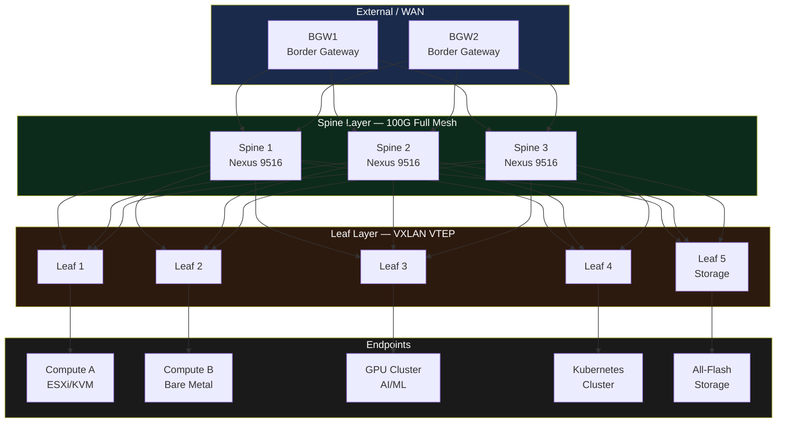

# Spine-Leaf Fabric

> Network topology แบบ Spine-Leaf (Clos fabric) สำหรับ Modern Data Center — ทดแทน 3-tier เมื่อต้องการ East-West traffic สูง, low latency, และ scale-out ง่าย

## 📋 ใช้ตอนไหน

- ✅ Data center ที่มี East-West traffic สูง (virtualization, microservices, big data)
- ✅ ต้องการ predictable latency (เดิน max 2 hops เสมอ)
- ✅ Scale-out ง่าย — เพิ่ม leaf ได้โดยไม่ re-architect
- ✅ เหมาะกับ Cisco Nexus, Arista, Juniper QFX
- ❌ **ไม่เหมาะกับ**: Campus network, ผู้ใช้ < 200 nodes, งบจำกัด (ค่า spine switch สูง)

---

## 🎨 Pragma Style Diagram (Draw.io XML)

```xml
<mxfile host="app.diagrams.net" version="24.0.0">
  <diagram name="Spine-Leaf Fabric — Pragma Style">
    <mxGraphModel dx="1400" dy="900" grid="0" background="#1a1a2e">
      <root>
        <mxCell id="0"/><mxCell id="1" parent="0"/>

        <mxCell id="title" value="Spine-Leaf Fabric (Clos Architecture)" style="text;html=1;strokeColor=none;fillColor=none;align=center;fontSize=22;fontStyle=1;fontColor=#ffffff;" vertex="1" parent="1">
          <mxGeometry x="100" y="16" width="900" height="40" as="geometry"/>
        </mxCell>

        <mxCell id="L0" value="EXTERNAL — Border / WAN" style="swimlane;startSize=30;fillColor=#1a2a4a;strokeColor=#4a90d9;fontColor=#ffffff;fontSize=13;fontStyle=1;html=1;" vertex="1" parent="1">
          <mxGeometry x="40" y="65" width="1020" height="110" as="geometry"/>
        </mxCell>
        <mxCell id="bgw1" value="Border Gateway 1&#xa;(BGP / EVPN)" style="sketch=0;points=[[0.015,0.015,0],[0.985,0.015,0],[0.985,0.985,0],[0.015,0.985,0],[0.25,0,0],[0.5,0,0],[0.75,0,0],[1,0.25,0],[1,0.5,0],[1,0.75,0],[0.75,1,0],[0.5,1,0],[0.25,1,0],[0,0.75,0],[0,0.5,0],[0,0.25,0]];verticalLabelPosition=bottom;html=1;verticalAlign=top;aspect=fixed;align=center;shape=mxgraph.cisco19.rect;prIcon=router;fillColor=#1a2a4a;strokeColor=#4a90d9;fontColor=#ffffff;fontSize=10;" vertex="1" parent="L0">
          <mxGeometry x="300" y="18" width="128" height="60" as="geometry"/>
        </mxCell>
        <mxCell id="bgw2" value="Border Gateway 2&#xa;(BGP / EVPN)" style="sketch=0;points=[[0.015,0.015,0],[0.985,0.015,0],[0.985,0.985,0],[0.015,0.985,0],[0.25,0,0],[0.5,0,0],[0.75,0,0],[1,0.25,0],[1,0.5,0],[1,0.75,0],[0.75,1,0],[0.5,1,0],[0.25,1,0],[0,0.75,0],[0,0.5,0],[0,0.25,0]];verticalLabelPosition=bottom;html=1;verticalAlign=top;aspect=fixed;align=center;shape=mxgraph.cisco19.rect;prIcon=router;fillColor=#1a2a4a;strokeColor=#4a90d9;fontColor=#ffffff;fontSize=10;" vertex="1" parent="L0">
          <mxGeometry x="570" y="18" width="128" height="60" as="geometry"/>
        </mxCell>

        <mxCell id="L1" value="SPINE LAYER — L3 Underlay (OSPF/IS-IS) + VXLAN Overlay (EVPN)" style="swimlane;startSize=30;fillColor=#0d2b1a;strokeColor=#2e7d32;fontColor=#ffffff;fontSize=13;fontStyle=1;html=1;" vertex="1" parent="1">
          <mxGeometry x="40" y="205" width="1020" height="140" as="geometry"/>
        </mxCell>
        <mxCell id="sp1" value="Spine 1&#xa;Cisco Nexus 9516&#xa;100G" style="strokeColor=#66bb6a;sketch=0;html=1;fillColor=#0d2b1a;strokeWidth=2;verticalLabelPosition=bottom;verticalAlign=top;align=center;outlineConnect=0;shape=mxgraph.cisco.switches.layer_3_switch;fontColor=#ffffff;fontSize=10;" vertex="1" parent="L1">
          <mxGeometry x="180" y="30" width="80" height="70" as="geometry"/>
        </mxCell>
        <mxCell id="sp2" value="Spine 2&#xa;Cisco Nexus 9516&#xa;100G" style="strokeColor=#66bb6a;sketch=0;html=1;fillColor=#0d2b1a;strokeWidth=2;verticalLabelPosition=bottom;verticalAlign=top;align=center;outlineConnect=0;shape=mxgraph.cisco.switches.layer_3_switch;fontColor=#ffffff;fontSize=10;" vertex="1" parent="L1">
          <mxGeometry x="440" y="30" width="80" height="70" as="geometry"/>
        </mxCell>
        <mxCell id="sp3" value="Spine 3&#xa;Cisco Nexus 9516&#xa;100G" style="strokeColor=#66bb6a;sketch=0;html=1;fillColor=#0d2b1a;strokeWidth=2;verticalLabelPosition=bottom;verticalAlign=top;align=center;outlineConnect=0;shape=mxgraph.cisco.switches.layer_3_switch;fontColor=#ffffff;fontSize=10;" vertex="1" parent="L1">
          <mxGeometry x="700" y="30" width="80" height="70" as="geometry"/>
        </mxCell>
        <mxCell id="sp_note" value="◄── Full Mesh iBGP / OSPF Area 0 ──►" style="text;html=1;strokeColor=none;fillColor=none;align=center;fontSize=10;fontStyle=2;fontColor=#66bb6a;" vertex="1" parent="L1">
          <mxGeometry x="150" y="108" width="700" height="20" as="geometry"/>
        </mxCell>

        <mxCell id="L2" value="LEAF LAYER — L2/L3 Edge (VXLAN VTEP)" style="swimlane;startSize=30;fillColor=#2d1a0e;strokeColor=#ff9800;fontColor=#ffffff;fontSize=13;fontStyle=1;html=1;" vertex="1" parent="1">
          <mxGeometry x="40" y="375" width="1020" height="150" as="geometry"/>
        </mxCell>
        <mxCell id="lf1" value="Leaf 1&#xa;Nexus 93180YC&#xa;25G Server" style="strokeColor=#ff9800;sketch=0;html=1;fillColor=#2d1a0e;strokeWidth=2;verticalLabelPosition=bottom;verticalAlign=top;align=center;outlineConnect=0;shape=mxgraph.cisco.switches.layer_3_switch;fontColor=#ffffff;fontSize=10;" vertex="1" parent="L2">
          <mxGeometry x="60" y="30" width="64" height="64" as="geometry"/>
        </mxCell>
        <mxCell id="lf2" value="Leaf 2&#xa;Nexus 93180YC&#xa;25G Server" style="strokeColor=#ff9800;sketch=0;html=1;fillColor=#2d1a0e;strokeWidth=2;verticalLabelPosition=bottom;verticalAlign=top;align=center;outlineConnect=0;shape=mxgraph.cisco.switches.layer_3_switch;fontColor=#ffffff;fontSize=10;" vertex="1" parent="L2">
          <mxGeometry x="260" y="30" width="64" height="64" as="geometry"/>
        </mxCell>
        <mxCell id="lf3" value="Leaf 3&#xa;Nexus 93180YC&#xa;25G Server" style="strokeColor=#ff9800;sketch=0;html=1;fillColor=#2d1a0e;strokeWidth=2;verticalLabelPosition=bottom;verticalAlign=top;align=center;outlineConnect=0;shape=mxgraph.cisco.switches.layer_3_switch;fontColor=#ffffff;fontSize=10;" vertex="1" parent="L2">
          <mxGeometry x="460" y="30" width="64" height="64" as="geometry"/>
        </mxCell>
        <mxCell id="lf4" value="Leaf 4&#xa;Nexus 93180YC&#xa;25G Server" style="strokeColor=#ff9800;sketch=0;html=1;fillColor=#2d1a0e;strokeWidth=2;verticalLabelPosition=bottom;verticalAlign=top;align=center;outlineConnect=0;shape=mxgraph.cisco.switches.layer_3_switch;fontColor=#ffffff;fontSize=10;" vertex="1" parent="L2">
          <mxGeometry x="660" y="30" width="64" height="64" as="geometry"/>
        </mxCell>
        <mxCell id="lf5" value="Leaf 5&#xa;Nexus 93180YC&#xa;Storage" style="strokeColor=#ff9800;sketch=0;html=1;fillColor=#2d1a0e;strokeWidth=2;verticalLabelPosition=bottom;verticalAlign=top;align=center;outlineConnect=0;shape=mxgraph.cisco.switches.layer_3_switch;fontColor=#ffffff;fontSize=10;" vertex="1" parent="L2">
          <mxGeometry x="860" y="30" width="64" height="64" as="geometry"/>
        </mxCell>

        <mxCell id="L3" value="ENDPOINTS — Servers / Storage / Hypervisors" style="swimlane;startSize=30;fillColor=#1a1a1a;strokeColor=#424242;fontColor=#ffffff;fontSize=13;fontStyle=1;html=1;" vertex="1" parent="1">
          <mxGeometry x="40" y="555" width="1020" height="140" as="geometry"/>
        </mxCell>
        <mxCell id="srv1" value="Compute Pod A&#xa;ESXi / KVM&#xa;(25G NIC x2)" style="shape=cylinder3;whiteSpace=wrap;html=1;fillColor=#1a1a1a;strokeColor=#aaaaaa;fontColor=#ffffff;fontSize=10;verticalLabelPosition=bottom;verticalAlign=top;" vertex="1" parent="L3">
          <mxGeometry x="60" y="20" width="70" height="70" as="geometry"/>
        </mxCell>
        <mxCell id="srv2" value="Compute Pod B&#xa;Bare Metal&#xa;(25G NIC x2)" style="shape=cylinder3;whiteSpace=wrap;html=1;fillColor=#1a1a1a;strokeColor=#aaaaaa;fontColor=#ffffff;fontSize=10;verticalLabelPosition=bottom;verticalAlign=top;" vertex="1" parent="L3">
          <mxGeometry x="280" y="20" width="70" height="70" as="geometry"/>
        </mxCell>
        <mxCell id="srv3" value="GPU Cluster&#xa;AI/ML Workload&#xa;(100G NIC)" style="shape=cylinder3;whiteSpace=wrap;html=1;fillColor=#1a1030;strokeColor=#7c4dff;fontColor=#ffffff;fontSize=10;verticalLabelPosition=bottom;verticalAlign=top;" vertex="1" parent="L3">
          <mxGeometry x="480" y="20" width="70" height="70" as="geometry"/>
        </mxCell>
        <mxCell id="srv4" value="Container Cluster&#xa;Kubernetes&#xa;(25G NIC x2)" style="shape=cylinder3;whiteSpace=wrap;html=1;fillColor=#1a1a1a;strokeColor=#aaaaaa;fontColor=#ffffff;fontSize=10;verticalLabelPosition=bottom;verticalAlign=top;" vertex="1" parent="L3">
          <mxGeometry x="680" y="20" width="70" height="70" as="geometry"/>
        </mxCell>
        <mxCell id="stor" value="All-Flash Storage&#xa;NetApp / Pure&#xa;(NVMe-oF)" style="shape=cylinder3;whiteSpace=wrap;html=1;fillColor=#0d1f2b;strokeColor=#0288d1;fontColor=#ffffff;fontSize=10;verticalLabelPosition=bottom;verticalAlign=top;" vertex="1" parent="L3">
          <mxGeometry x="880" y="20" width="70" height="70" as="geometry"/>
        </mxCell>

        <mxCell id="eb1" value="100G" style="edgeStyle=orthogonalEdgeStyle;rounded=1;html=1;strokeColor=#4a90d9;strokeWidth=2;fontColor=#4a90d9;fontSize=9;" edge="1" parent="1" source="bgw1" target="sp1"><mxGeometry relative="1" as="geometry"/></mxCell>
        <mxCell id="eb2" value="" style="edgeStyle=orthogonalEdgeStyle;rounded=1;html=1;strokeColor=#4a90d9;strokeWidth=2;" edge="1" parent="1" source="bgw1" target="sp2"><mxGeometry relative="1" as="geometry"/></mxCell>
        <mxCell id="eb3" value="" style="edgeStyle=orthogonalEdgeStyle;rounded=1;html=1;strokeColor=#4a90d9;strokeWidth=2;" edge="1" parent="1" source="bgw2" target="sp2"><mxGeometry relative="1" as="geometry"/></mxCell>
        <mxCell id="eb4" value="100G" style="edgeStyle=orthogonalEdgeStyle;rounded=1;html=1;strokeColor=#4a90d9;strokeWidth=2;fontColor=#4a90d9;fontSize=9;" edge="1" parent="1" source="bgw2" target="sp3"><mxGeometry relative="1" as="geometry"/></mxCell>

        <mxCell id="es11" value="100G" style="edgeStyle=orthogonalEdgeStyle;rounded=1;html=1;strokeColor=#2e7d32;strokeWidth=2;fontColor=#66bb6a;fontSize=9;" edge="1" parent="1" source="sp1" target="lf1"><mxGeometry relative="1" as="geometry"/></mxCell>
        <mxCell id="es12" style="edgeStyle=orthogonalEdgeStyle;rounded=1;html=1;strokeColor=#2e7d32;strokeWidth=1;dashed=1;" edge="1" parent="1" source="sp1" target="lf2"><mxGeometry relative="1" as="geometry"/></mxCell>
        <mxCell id="es13" style="edgeStyle=orthogonalEdgeStyle;rounded=1;html=1;strokeColor=#2e7d32;strokeWidth=1;dashed=1;" edge="1" parent="1" source="sp1" target="lf3"><mxGeometry relative="1" as="geometry"/></mxCell>
        <mxCell id="es14" style="edgeStyle=orthogonalEdgeStyle;rounded=1;html=1;strokeColor=#2e7d32;strokeWidth=1;dashed=1;" edge="1" parent="1" source="sp1" target="lf4"><mxGeometry relative="1" as="geometry"/></mxCell>
        <mxCell id="es15" style="edgeStyle=orthogonalEdgeStyle;rounded=1;html=1;strokeColor=#2e7d32;strokeWidth=1;dashed=1;" edge="1" parent="1" source="sp1" target="lf5"><mxGeometry relative="1" as="geometry"/></mxCell>
        <mxCell id="es21" style="edgeStyle=orthogonalEdgeStyle;rounded=1;html=1;strokeColor=#2e7d32;strokeWidth=1;dashed=1;" edge="1" parent="1" source="sp2" target="lf1"><mxGeometry relative="1" as="geometry"/></mxCell>
        <mxCell id="es22" style="edgeStyle=orthogonalEdgeStyle;rounded=1;html=1;strokeColor=#2e7d32;strokeWidth=1;dashed=1;" edge="1" parent="1" source="sp2" target="lf2"><mxGeometry relative="1" as="geometry"/></mxCell>
        <mxCell id="es23" value="100G" style="edgeStyle=orthogonalEdgeStyle;rounded=1;html=1;strokeColor=#2e7d32;strokeWidth=2;fontColor=#66bb6a;fontSize=9;" edge="1" parent="1" source="sp2" target="lf3"><mxGeometry relative="1" as="geometry"/></mxCell>
        <mxCell id="es24" style="edgeStyle=orthogonalEdgeStyle;rounded=1;html=1;strokeColor=#2e7d32;strokeWidth=1;dashed=1;" edge="1" parent="1" source="sp2" target="lf4"><mxGeometry relative="1" as="geometry"/></mxCell>
        <mxCell id="es25" style="edgeStyle=orthogonalEdgeStyle;rounded=1;html=1;strokeColor=#2e7d32;strokeWidth=1;dashed=1;" edge="1" parent="1" source="sp2" target="lf5"><mxGeometry relative="1" as="geometry"/></mxCell>
        <mxCell id="es31" style="edgeStyle=orthogonalEdgeStyle;rounded=1;html=1;strokeColor=#2e7d32;strokeWidth=1;dashed=1;" edge="1" parent="1" source="sp3" target="lf1"><mxGeometry relative="1" as="geometry"/></mxCell>
        <mxCell id="es32" style="edgeStyle=orthogonalEdgeStyle;rounded=1;html=1;strokeColor=#2e7d32;strokeWidth=1;dashed=1;" edge="1" parent="1" source="sp3" target="lf2"><mxGeometry relative="1" as="geometry"/></mxCell>
        <mxCell id="es33" style="edgeStyle=orthogonalEdgeStyle;rounded=1;html=1;strokeColor=#2e7d32;strokeWidth=1;dashed=1;" edge="1" parent="1" source="sp3" target="lf3"><mxGeometry relative="1" as="geometry"/></mxCell>
        <mxCell id="es34" style="edgeStyle=orthogonalEdgeStyle;rounded=1;html=1;strokeColor=#2e7d32;strokeWidth=1;dashed=1;" edge="1" parent="1" source="sp3" target="lf4"><mxGeometry relative="1" as="geometry"/></mxCell>
        <mxCell id="es35" value="100G" style="edgeStyle=orthogonalEdgeStyle;rounded=1;html=1;strokeColor=#2e7d32;strokeWidth=2;fontColor=#66bb6a;fontSize=9;" edge="1" parent="1" source="sp3" target="lf5"><mxGeometry relative="1" as="geometry"/></mxCell>

        <mxCell id="el1" value="25G" style="edgeStyle=orthogonalEdgeStyle;rounded=1;html=1;strokeColor=#ff9800;strokeWidth=2;fontColor=#ff9800;fontSize=9;" edge="1" parent="1" source="lf1" target="srv1"><mxGeometry relative="1" as="geometry"/></mxCell>
        <mxCell id="el2" value="25G" style="edgeStyle=orthogonalEdgeStyle;rounded=1;html=1;strokeColor=#ff9800;strokeWidth=2;fontColor=#ff9800;fontSize=9;" edge="1" parent="1" source="lf2" target="srv2"><mxGeometry relative="1" as="geometry"/></mxCell>
        <mxCell id="el3" value="100G" style="edgeStyle=orthogonalEdgeStyle;rounded=1;html=1;strokeColor=#7c4dff;strokeWidth=2;fontColor=#7c4dff;fontSize=9;" edge="1" parent="1" source="lf3" target="srv3"><mxGeometry relative="1" as="geometry"/></mxCell>
        <mxCell id="el4" value="25G" style="edgeStyle=orthogonalEdgeStyle;rounded=1;html=1;strokeColor=#ff9800;strokeWidth=2;fontColor=#ff9800;fontSize=9;" edge="1" parent="1" source="lf4" target="srv4"><mxGeometry relative="1" as="geometry"/></mxCell>
        <mxCell id="el5" value="NVMe-oF" style="edgeStyle=orthogonalEdgeStyle;rounded=1;html=1;strokeColor=#0288d1;strokeWidth=2;fontColor=#0288d1;fontSize=9;" edge="1" parent="1" source="lf5" target="stor"><mxGeometry relative="1" as="geometry"/></mxCell>
      </root>
    </mxGraphModel>
  </diagram>
</mxfile>
```

---

## 🌊 Mermaid Template



---

## 💡 Prompt ตัวอย่าง

### แบบ A: Standard 2-Spine 4-Leaf
```
ใช้ template spine-leaf-fabric.md แบบ Pragma Style
ปรับสำหรับ [ชื่อลูกค้า]:
- Spine: 2 ตัว (Nexus 9508)
- Leaf: 4 ตัว (Nexus 93180YC-FX3)
- Uplink: 100G Spine–Leaf
- Server: 25G dual-home NIC
- Protocol: OSPF underlay, BGP EVPN overlay
```

### แบบ B: Multi-Pod Spine-Leaf
```
ใช้ template spine-leaf-fabric.md แบบ Pragma Style
ทำเป็น Multi-Pod:
- Super Spine 2 ตัว เชื่อม Pod A และ Pod B
- Pod A: Spine 2 ตัว + Leaf 6 ตัว (compute)
- Pod B: Spine 2 ตัว + Leaf 4 ตัว (storage)
- Inter-Pod: 400G link
```

### แบบ C: Arista EVPN
```
ใช้ template spine-leaf-fabric.md แบบ Pragma Style
เปลี่ยนอุปกรณ์เป็น Arista:
- Spine: Arista 7508R3
- Leaf: Arista 7050CX3
- Protocol: BGP eBGP underlay + EVPN overlay
- เพิ่ม Out-of-Band Management switch
```

---

## 🔧 Parameters ที่ปรับได้

| Parameter | Default | ทางเลือก |
|---|---|---|
| Spine count | 3 | 2 (minimum HA), 4+ (high bandwidth) |
| Leaf count | 5 | 2–48 ตาม Pod size |
| Spine–Leaf uplink | 100G | 40G, 400G |
| Server downlink | 25G | 10G, 100G |
| Underlay protocol | OSPF | IS-IS, eBGP |
| Overlay | VXLAN + EVPN | VXLAN + multicast |
| Vendor | Cisco Nexus | Arista, Juniper QFX, Huawei CE |

---

## 📌 Notes สำหรับ SI

- **Max 2-hop rule**: ทุก server เชื่อมกันผ่าน Leaf → Spine → Leaf เสมอ
- **ECMP**: spine แต่ละตัวรับ traffic เท่าๆ กัน — Spine count = bandwidth multiplier
- **Border Leaf (BGW)**: leaf พิเศษสำหรับ uplink ออก WAN / inter-DC — แยกออกจาก compute leaf
- **vPC / MLAG**: ไม่จำเป็นใน pure L3 spine-leaf แต่ใช้ได้ที่ leaf level สำหรับ server dual-home
- **ห้ามเชื่อม Spine–Spine** — ถ้าต้องการ bandwidth เพิ่ม ให้เพิ่ม spine ตัวใหม่

### Related Templates

- 3-Tier Data Center → `3-tier-data-center.md`
- Rack Elevation → `rack-elevation-42u.md`
- SD-WAN Multi-Site → `sd-wan-multi-site.md`
