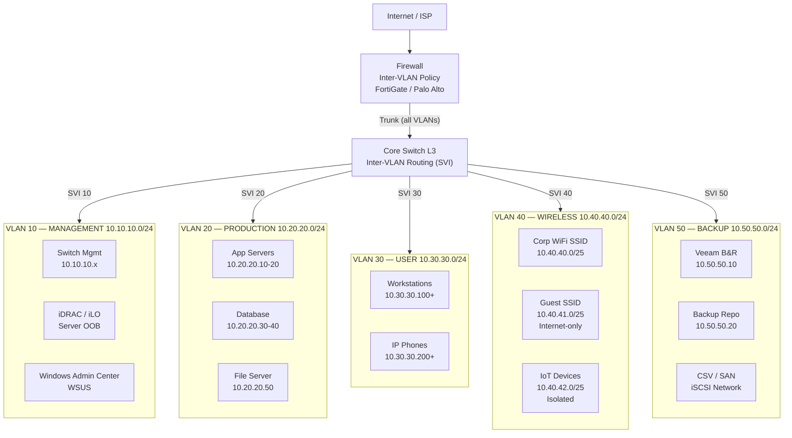

# VLAN Segmentation

> VLAN design มาตรฐานสำหรับ enterprise — แบ่ง traffic zone, security policy, inter-VLAN routing

## 📋 ใช้ตอนไหน

- ✅ ออกแบบ VLAN scheme ให้ลูกค้าใหม่
- ✅ Document VLAN ที่มีอยู่แล้ว
- ✅ ทุก project ที่มี L3 Switch หรือ Firewall
- ✅ ใช้คู่กับ 3-tier-data-center.md หรือ smb-single-site.md
- ❌ **ไม่เหมาะกับ**: Flat network ที่ไม่มี L3 routing, เครือข่ายที่ใช้ VLAN เดียว

---

## 🎨 Pragma Style Diagram (Draw.io XML)

```xml
<mxfile host="app.diagrams.net" version="24.0.0">
  <diagram name="VLAN Segmentation — Pragma Style">
    <mxGraphModel dx="1400" dy="900" grid="0" background="#1a1a2e">
      <root>
        <mxCell id="0"/><mxCell id="1" parent="0"/>
        <mxCell id="title" value="VLAN Segmentation Design" style="text;html=1;strokeColor=none;fillColor=none;align=center;fontSize=22;fontStyle=1;fontColor=#ffffff;" vertex="1" parent="1">
          <mxGeometry x="100" y="20" width="800" height="40" as="geometry"/>
        </mxCell>
        <mxCell id="inet" value="Internet / ISP" style="strokeColor=#ffffff;sketch=0;html=1;fillColor=#036897;strokeWidth=2;verticalLabelPosition=bottom;verticalAlign=top;align=center;outlineConnect=0;shape=mxgraph.cisco.routers.atm_router;fontColor=#ffffff;fontSize=11;" vertex="1" parent="1">
          <mxGeometry x="490" y="30" width="78" height="53" as="geometry"/>
        </mxCell>
        <mxCell id="fw" value="Firewall&#xa;Inter-VLAN Policy&#xa;FortiGate / Palo Alto" style="sketch=0;points=[[0.015,0.015,0],[0.985,0.015,0],[0.985,0.985,0],[0.015,0.985,0],[0.25,0,0],[0.5,0,0],[0.75,0,0],[1,0.25,0],[1,0.5,0],[1,0.75,0],[0.75,1,0],[0.5,1,0],[0.25,1,0],[0,0.75,0],[0,0.5,0],[0,0.25,0]];verticalLabelPosition=bottom;html=1;verticalAlign=top;aspect=fixed;align=center;shape=mxgraph.cisco19.rect;prIcon=firewall;fillColor=#8b3a0f;strokeColor=#ff9800;fontColor=#ffffff;fontSize=10;" vertex="1" parent="1">
          <mxGeometry x="470" y="130" width="120" height="60" as="geometry"/>
        </mxCell>
        <mxCell id="core" value="Core / L3 Switch&#xa;VLAN Trunk&#xa;Inter-VLAN Routing (SVI)" style="strokeColor=#ffffff;sketch=0;html=1;fillColor=#2e7d32;strokeWidth=2;verticalLabelPosition=bottom;verticalAlign=top;align=center;outlineConnect=0;shape=mxgraph.cisco.switches.layer_3_switch;fontColor=#ffffff;fontSize=10;" vertex="1" parent="1">
          <mxGeometry x="480" y="250" width="64" height="64" as="geometry"/>
        </mxCell>
        <mxCell id="vl10" value="VLAN 10 — MANAGEMENT     10.10.10.0/24     Network devices, Servers OOB, iDRAC/iLO, WAC" style="swimlane;startSize=30;fillColor=#1a2a4a;strokeColor=#4a90d9;fontColor=#ffffff;fontSize=11;fontStyle=1;html=1;" vertex="1" parent="1">
          <mxGeometry x="40" y="370" width="960" height="100" as="geometry"/>
        </mxCell>
        <mxCell id="vl10_sw" value="Switch Mgmt&#xa;10.10.10.x" style="rounded=1;whiteSpace=wrap;html=1;fillColor=#1a3a5c;strokeColor=#4a90d9;fontColor=#ffffff;fontSize=10;" vertex="1" parent="vl10">
          <mxGeometry x="60" y="35" width="140" height="45" as="geometry"/>
        </mxCell>
        <mxCell id="vl10_idrac" value="iDRAC / iLO&#xa;Server OOB" style="rounded=1;whiteSpace=wrap;html=1;fillColor=#1a3a5c;strokeColor=#4a90d9;fontColor=#ffffff;fontSize=10;" vertex="1" parent="vl10">
          <mxGeometry x="260" y="35" width="140" height="45" as="geometry"/>
        </mxCell>
        <mxCell id="vl10_wac" value="Windows Admin&#xa;Center / WSUS" style="rounded=1;whiteSpace=wrap;html=1;fillColor=#1a3a5c;strokeColor=#4a90d9;fontColor=#ffffff;fontSize=10;" vertex="1" parent="vl10">
          <mxGeometry x="460" y="35" width="140" height="45" as="geometry"/>
        </mxCell>
        <mxCell id="vl20" value="VLAN 20 — PRODUCTION SERVERS     10.20.20.0/24     App, DB, File servers" style="swimlane;startSize=30;fillColor=#0d2b1a;strokeColor=#2e7d32;fontColor=#ffffff;fontSize=11;fontStyle=1;html=1;" vertex="1" parent="1">
          <mxGeometry x="40" y="490" width="960" height="100" as="geometry"/>
        </mxCell>
        <mxCell id="vl20_app" value="App Servers&#xa;10.20.20.10-20" style="rounded=1;whiteSpace=wrap;html=1;fillColor=#2e7d32;strokeColor=#81c784;fontColor=#ffffff;fontSize=10;" vertex="1" parent="vl20">
          <mxGeometry x="60" y="35" width="140" height="45" as="geometry"/>
        </mxCell>
        <mxCell id="vl20_db" value="Database&#xa;10.20.20.30-40" style="rounded=1;whiteSpace=wrap;html=1;fillColor=#2e7d32;strokeColor=#81c784;fontColor=#ffffff;fontSize=10;" vertex="1" parent="vl20">
          <mxGeometry x="260" y="35" width="140" height="45" as="geometry"/>
        </mxCell>
        <mxCell id="vl20_fs" value="File Server&#xa;NFI-FS01&#xa;10.20.20.50" style="rounded=1;whiteSpace=wrap;html=1;fillColor=#2e7d32;strokeColor=#81c784;fontColor=#ffffff;fontSize=10;" vertex="1" parent="vl20">
          <mxGeometry x="460" y="35" width="140" height="45" as="geometry"/>
        </mxCell>
        <mxCell id="vl30" value="VLAN 30 — USER / WORKSTATION     10.30.30.0/24     Workstations, Laptops, IP Phones" style="swimlane;startSize=30;fillColor=#1a0d2b;strokeColor=#6a1b9a;fontColor=#ffffff;fontSize=11;fontStyle=1;html=1;" vertex="1" parent="1">
          <mxGeometry x="40" y="610" width="960" height="100" as="geometry"/>
        </mxCell>
        <mxCell id="vl30_pc" value="Workstations&#xa;10.30.30.100+" style="rounded=1;whiteSpace=wrap;html=1;fillColor=#6a1b9a;strokeColor=#ce93d8;fontColor=#ffffff;fontSize=10;" vertex="1" parent="vl30">
          <mxGeometry x="60" y="35" width="140" height="45" as="geometry"/>
        </mxCell>
        <mxCell id="vl30_voip" value="IP Phones (VoIP)&#xa;10.30.30.200+" style="rounded=1;whiteSpace=wrap;html=1;fillColor=#6a1b9a;strokeColor=#ce93d8;fontColor=#ffffff;fontSize=10;" vertex="1" parent="vl30">
          <mxGeometry x="260" y="35" width="140" height="45" as="geometry"/>
        </mxCell>
        <mxCell id="vl40" value="VLAN 40 — WIRELESS / GUEST     10.40.40.0/24     Corporate WiFi + Guest isolation" style="swimlane;startSize=30;fillColor=#0d1f2b;strokeColor=#0288d1;fontColor=#ffffff;fontSize=11;fontStyle=1;html=1;" vertex="1" parent="1">
          <mxGeometry x="40" y="730" width="960" height="100" as="geometry"/>
        </mxCell>
        <mxCell id="vl40_corp" value="Corp WiFi SSID&#xa;10.40.40.0/25" style="rounded=1;whiteSpace=wrap;html=1;fillColor=#01579b;strokeColor=#4fc3f7;fontColor=#ffffff;fontSize=10;" vertex="1" parent="vl40">
          <mxGeometry x="60" y="35" width="150" height="45" as="geometry"/>
        </mxCell>
        <mxCell id="vl40_guest" value="Guest SSID&#xa;10.40.41.0/25&#xa;Internet-only" style="rounded=1;whiteSpace=wrap;html=1;fillColor=#002a4a;strokeColor=#29b6f6;fontColor=#ffffff;fontSize=10;" vertex="1" parent="vl40">
          <mxGeometry x="270" y="35" width="150" height="45" as="geometry"/>
        </mxCell>
        <mxCell id="vl40_iot" value="IoT Devices&#xa;10.40.42.0/25&#xa;Isolated" style="rounded=1;whiteSpace=wrap;html=1;fillColor=#002a4a;strokeColor=#29b6f6;fontColor=#ffffff;fontSize=10;" vertex="1" parent="vl40">
          <mxGeometry x="480" y="35" width="150" height="45" as="geometry"/>
        </mxCell>
        <mxCell id="vl50" value="VLAN 50 — BACKUP TRAFFIC     10.50.50.0/24     Backup network — isolated from production" style="swimlane;startSize=30;fillColor=#1a1a0d;strokeColor=#f9a825;fontColor=#ffffff;fontSize=11;fontStyle=1;html=1;" vertex="1" parent="1">
          <mxGeometry x="40" y="850" width="960" height="100" as="geometry"/>
        </mxCell>
        <mxCell id="vl50_vbr" value="Veeam B&amp;R&#xa;10.50.50.10" style="rounded=1;whiteSpace=wrap;html=1;fillColor=#5d4037;strokeColor=#f9a825;fontColor=#ffffff;fontSize=10;" vertex="1" parent="vl50">
          <mxGeometry x="60" y="35" width="140" height="45" as="geometry"/>
        </mxCell>
        <mxCell id="vl50_repo" value="Backup Repo&#xa;10.50.50.20" style="rounded=1;whiteSpace=wrap;html=1;fillColor=#5d4037;strokeColor=#f9a825;fontColor=#ffffff;fontSize=10;" vertex="1" parent="vl50">
          <mxGeometry x="260" y="35" width="140" height="45" as="geometry"/>
        </mxCell>
        <mxCell id="vl50_csv" value="CSV / SAN&#xa;iSCSI Network" style="rounded=1;whiteSpace=wrap;html=1;fillColor=#5d4037;strokeColor=#ff9800;fontColor=#ffffff;fontSize=10;" vertex="1" parent="vl50">
          <mxGeometry x="460" y="35" width="140" height="45" as="geometry"/>
        </mxCell>
        <mxCell id="e1" value="" style="edgeStyle=orthogonalEdgeStyle;rounded=1;html=1;strokeColor=#4a90d9;strokeWidth=2;" edge="1" parent="1" source="inet" target="fw"><mxGeometry relative="1" as="geometry"/></mxCell>
        <mxCell id="e2" value="Trunk (all VLANs)" style="edgeStyle=orthogonalEdgeStyle;rounded=1;html=1;strokeColor=#2e7d32;strokeWidth=3;fontColor=#81c784;fontSize=10;" edge="1" parent="1" source="fw" target="core"><mxGeometry relative="1" as="geometry"/></mxCell>
        <mxCell id="e3" value="SVI 10" style="edgeStyle=orthogonalEdgeStyle;rounded=1;html=1;strokeColor=#4a90d9;strokeWidth=2;dashed=1;fontColor=#4a90d9;fontSize=9;" edge="1" parent="1" source="core" target="vl10"><mxGeometry relative="1" as="geometry"/></mxCell>
        <mxCell id="e4" value="SVI 20" style="edgeStyle=orthogonalEdgeStyle;rounded=1;html=1;strokeColor=#2e7d32;strokeWidth=2;dashed=1;fontColor=#2e7d32;fontSize=9;" edge="1" parent="1" source="core" target="vl20"><mxGeometry relative="1" as="geometry"/></mxCell>
        <mxCell id="e5" value="SVI 30" style="edgeStyle=orthogonalEdgeStyle;rounded=1;html=1;strokeColor=#6a1b9a;strokeWidth=2;dashed=1;fontColor=#6a1b9a;fontSize=9;" edge="1" parent="1" source="core" target="vl30"><mxGeometry relative="1" as="geometry"/></mxCell>
        <mxCell id="e6" value="SVI 40" style="edgeStyle=orthogonalEdgeStyle;rounded=1;html=1;strokeColor=#0288d1;strokeWidth=2;dashed=1;fontColor=#0288d1;fontSize=9;" edge="1" parent="1" source="core" target="vl40"><mxGeometry relative="1" as="geometry"/></mxCell>
        <mxCell id="e7" value="SVI 50" style="edgeStyle=orthogonalEdgeStyle;rounded=1;html=1;strokeColor=#f9a825;strokeWidth=2;dashed=1;fontColor=#f9a825;fontSize=9;" edge="1" parent="1" source="core" target="vl50"><mxGeometry relative="1" as="geometry"/></mxCell>
      </root>
    </mxGraphModel>
  </diagram>
</mxfile>
```

---

## 🌊 Mermaid Template



---

## 📊 VLAN Table (copy ใส่เอกสารได้เลย)

| VLAN ID | ชื่อ | Subnet | Gateway | จุดประสงค์ | Inter-VLAN Policy |
|---|---|---|---|---|---|
| 10 | MANAGEMENT | 10.10.10.0/24 | 10.10.10.1 | Switches, iDRAC, WAC | Restricted |
| 20 | PRODUCTION | 10.20.20.0/24 | 10.20.20.1 | App, DB, File servers | Allow to 10, 50 |
| 30 | USER | 10.30.30.0/24 | 10.30.30.1 | Workstations, Phones | Allow to 20 only |
| 40 | WIRELESS | 10.40.40.0/24 | 10.40.40.1 | Corp WiFi / Guest | Corp→20, Guest→Internet only |
| 50 | BACKUP | 10.50.50.0/24 | 10.50.50.1 | Veeam, Repo, iSCSI | Allow to 10, 20 |
| 99 | NATIVE/UNUSED | — | — | Unused ports | Deny all |

---

## 💡 Prompt ตัวอย่าง

### แบบ A: Generate VLAN scheme ใหม่
```
ใช้ template vlan-segmentation.md แบบ Pragma Style
ออกแบบ VLAN สำหรับ [ชื่อลูกค้า]:
- Users: [จำนวน]
- Departments: [รายการ]
- มี Servers: [Yes/No]
- มี WiFi: [Yes/No]
- มี VoIP: [Yes/No]
- มี Backup network: [Yes/No]
- Firewall: [model]
- Core: [model]
```

### แบบ B: Document VLAN ที่มีอยู่แล้ว
```
ใช้ template vlan-segmentation.md แบบ Pragma Style
วาด VLAN diagram จากข้อมูลนี้:
- VLAN 10: Management — 192.168.10.0/24
- VLAN 20: Server — 192.168.20.0/24
- VLAN 30: User — 192.168.30.0/24
- VLAN 40: WiFi — 192.168.40.0/24
```

---

## 🔧 Parameters ที่ปรับได้

| Parameter | Default | ทางเลือก |
|---|---|---|
| VLAN scheme | 10/20/30/40/50 | ปรับตาม convention ลูกค้า |
| IP range | 10.x.x.0/24 | 192.168.x.0/24, 172.16.x.0/24 |
| Inter-VLAN | Firewall policy | ACL บน L3 switch |
| Guest isolation | Separate subnet | Client isolation only |
| Backup VLAN | Dedicated | Shared with Mgmt |

---

## 📌 Notes สำหรับ SI

- **VLAN 1 ห้ามใช้**: Native VLAN ควรเปลี่ยนเป็น unused VLAN เพื่อ security
- **Management ควร Restrict**: ไม่ให้ User VLAN เข้าถึง switch management โดยตรง
- **Backup VLAN แยกสำคัญ**: ป้องกัน backup traffic กระทบ production
- **Guest WiFi**: ต้อง isolate — ห้าม access production VLAN ทุกกรณี
- **IoT**: แยก VLAN เสมอ — IoT มักมีช่องโหว่ security

### Related Templates
- Full network → `3-tier-data-center.md`, `smb-single-site.md`
- Backup VLAN usage → `backup-architecture.md`
- Firewall zones → `firewall-dmz-zones.md`

**อัพเดตล่าสุด**: 2026-05-07 — initial template
