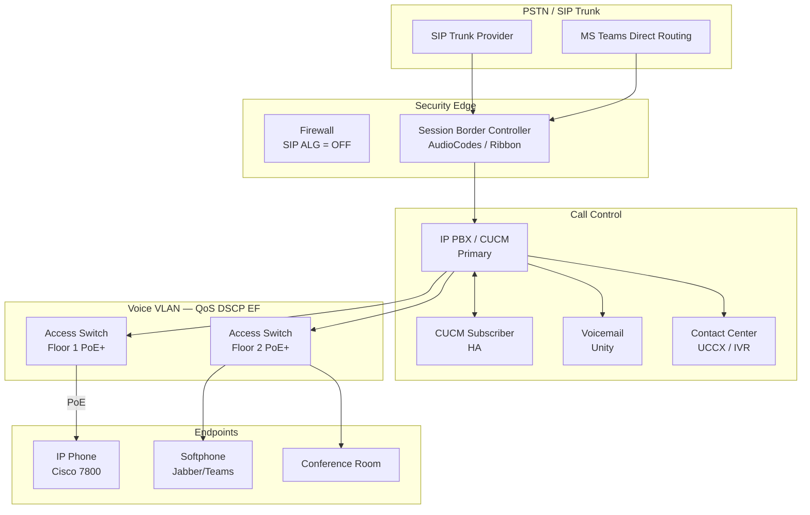

# VoIP Deployment

> Network diagram สำหรับ Enterprise VoIP / UC deployment — ครอบคลุม IP PBX, SIP Trunk, QoS, และ IP Phone distribution ทั้ง single-site และ multi-site

## 📋 ใช้ตอนไหน

- ✅ ออกแบบระบบ VoIP ใหม่ (Greenfield)
- ✅ Migrate จาก TDM/Analog ไป IP Phone
- ✅ Multi-site UC ที่ต้องการ centralized call control
- ✅ ใช้กับ Cisco CUCM, 3CX, FreePBX, Avaya, Teams Direct Routing
- ❌ **ไม่เหมาะกับ**: consumer VoIP apps (Line, Zoom), network ที่ไม่มี QoS

---

## 🎨 Pragma Style Diagram (Draw.io XML)

```xml
<mxfile host="app.diagrams.net" version="24.0.0">
  <diagram name="VoIP Deployment — Pragma Style">
    <mxGraphModel dx="1400" dy="900" grid="0" background="#1a1a2e">
      <root>
        <mxCell id="0"/><mxCell id="1" parent="0"/>

        <mxCell id="title" value="Enterprise VoIP / UC Deployment" style="text;html=1;strokeColor=none;fillColor=none;align=center;fontSize=22;fontStyle=1;fontColor=#ffffff;" vertex="1" parent="1">
          <mxGeometry x="80" y="16" width="940" height="40" as="geometry"/>
        </mxCell>

        <mxCell id="L0" value="PSTN / SIP TRUNK PROVIDER" style="swimlane;startSize=30;fillColor=#1a2a4a;strokeColor=#4a90d9;fontColor=#ffffff;fontSize=13;fontStyle=1;html=1;" vertex="1" parent="1">
          <mxGeometry x="40" y="65" width="1020" height="110" as="geometry"/>
        </mxCell>
        <mxCell id="pstn" value="PSTN&#xa;(Analog/ISDN)" style="shape=mxgraph.cisco.sites.generic_building;fillColor=#4a90d9;strokeColor=#ffffff;fontColor=#ffffff;fontSize=10;verticalLabelPosition=bottom;verticalAlign=top;html=1;" vertex="1" parent="L0">
          <mxGeometry x="120" y="15" width="70" height="65" as="geometry"/>
        </mxCell>
        <mxCell id="sip_provider" value="SIP Trunk Provider&#xa;(ITSPs)" style="sketch=0;points=[[0.015,0.015,0],[0.985,0.015,0],[0.985,0.985,0],[0.015,0.985,0],[0.25,0,0],[0.5,0,0],[0.75,0,0],[1,0.25,0],[1,0.5,0],[1,0.75,0],[0.75,1,0],[0.5,1,0],[0.25,1,0],[0,0.75,0],[0,0.5,0],[0,0.25,0]];verticalLabelPosition=bottom;html=1;verticalAlign=top;aspect=fixed;align=center;shape=mxgraph.cisco19.rect;prIcon=cloud;fillColor=#1a2a4a;strokeColor=#4a90d9;fontColor=#ffffff;fontSize=10;" vertex="1" parent="L0">
          <mxGeometry x="430" y="10" width="128" height="60" as="geometry"/>
        </mxCell>
        <mxCell id="ms_teams" value="Microsoft Teams&#xa;Direct Routing" style="sketch=0;points=[[0.015,0.015,0],[0.985,0.015,0],[0.985,0.985,0],[0.015,0.985,0],[0.25,0,0],[0.5,0,0],[0.75,0,0],[1,0.25,0],[1,0.5,0],[1,0.75,0],[0.75,1,0],[0.5,1,0],[0.25,1,0],[0,0.75,0],[0,0.5,0],[0,0.25,0]];verticalLabelPosition=bottom;html=1;verticalAlign=top;aspect=fixed;align=center;shape=mxgraph.cisco19.rect;prIcon=cloud;fillColor=#1a2a4a;strokeColor=#4a90d9;fontColor=#ffffff;fontSize=10;" vertex="1" parent="L0">
          <mxGeometry x="760" y="10" width="128" height="60" as="geometry"/>
        </mxCell>

        <mxCell id="L1" value="SECURITY EDGE — SBC / Firewall" style="swimlane;startSize=30;fillColor=#2d1a0e;strokeColor=#8b3a0f;fontColor=#ffffff;fontSize=13;fontStyle=1;html=1;" vertex="1" parent="1">
          <mxGeometry x="40" y="205" width="1020" height="140" as="geometry"/>
        </mxCell>
        <mxCell id="fw_voip" value="Firewall&#xa;(SIP ALG Off)" style="sketch=0;points=[[0.015,0.015,0],[0.985,0.015,0],[0.985,0.985,0],[0.015,0.985,0],[0.25,0,0],[0.5,0,0],[0.75,0,0],[1,0.25,0],[1,0.5,0],[1,0.75,0],[0.75,1,0],[0.5,1,0],[0.25,1,0],[0,0.75,0],[0,0.5,0],[0,0.25,0]];verticalLabelPosition=bottom;html=1;verticalAlign=top;aspect=fixed;align=center;shape=mxgraph.cisco19.rect;prIcon=firewall;fillColor=#8b3a0f;strokeColor=#ff9800;fontColor=#ffffff;fontSize=10;" vertex="1" parent="L1">
          <mxGeometry x="100" y="30" width="128" height="60" as="geometry"/>
        </mxCell>
        <mxCell id="sbc" value="Session Border&#xa;Controller (SBC)&#xa;AudioCodes / Ribbon" style="sketch=0;points=[[0.015,0.015,0],[0.985,0.015,0],[0.985,0.985,0],[0.015,0.985,0],[0.25,0,0],[0.5,0,0],[0.75,0,0],[1,0.25,0],[1,0.5,0],[1,0.75,0],[0.75,1,0],[0.5,1,0],[0.25,1,0],[0,0.75,0],[0,0.5,0],[0,0.25,0]];verticalLabelPosition=bottom;html=1;verticalAlign=top;aspect=fixed;align=center;shape=mxgraph.cisco19.rect;prIcon=generic_gateway;fillColor=#4a2800;strokeColor=#ff9800;fontColor=#ffffff;fontSize=10;" vertex="1" parent="L1">
          <mxGeometry x="430" y="30" width="128" height="60" as="geometry"/>
        </mxCell>
        <mxCell id="sbc_note" value="⚠ ปิด SIP ALG ที่ Firewall เสมอ" style="text;html=1;strokeColor=none;fillColor=none;align=left;fontSize=10;fontStyle=2;fontColor=#ff9800;" vertex="1" parent="L1">
          <mxGeometry x="700" y="50" width="260" height="20" as="geometry"/>
        </mxCell>

        <mxCell id="L2" value="CALL CONTROL — IP PBX / CUCM" style="swimlane;startSize=30;fillColor=#0d2b1a;strokeColor=#2e7d32;fontColor=#ffffff;fontSize=13;fontStyle=1;html=1;" vertex="1" parent="1">
          <mxGeometry x="40" y="375" width="1020" height="150" as="geometry"/>
        </mxCell>
        <mxCell id="cucm" value="IP PBX / CUCM&#xa;Call Manager&#xa;(Primary)" style="shape=cylinder3;whiteSpace=wrap;html=1;fillColor=#0d2b1a;strokeColor=#66bb6a;fontColor=#ffffff;fontSize=10;verticalLabelPosition=bottom;verticalAlign=top;" vertex="1" parent="L2">
          <mxGeometry x="120" y="25" width="80" height="80" as="geometry"/>
        </mxCell>
        <mxCell id="cucm2" value="CUCM&#xa;(Subscriber/HA)" style="shape=cylinder3;whiteSpace=wrap;html=1;fillColor=#0d2b1a;strokeColor=#2e7d32;fontColor=#ffffff;fontSize=10;verticalLabelPosition=bottom;verticalAlign=top;" vertex="1" parent="L2">
          <mxGeometry x="290" y="25" width="80" height="80" as="geometry"/>
        </mxCell>
        <mxCell id="unity" value="Voicemail&#xa;Unity / MWI" style="shape=cylinder3;whiteSpace=wrap;html=1;fillColor=#0d1f2b;strokeColor=#0288d1;fontColor=#ffffff;fontSize=10;verticalLabelPosition=bottom;verticalAlign=top;" vertex="1" parent="L2">
          <mxGeometry x="480" y="25" width="80" height="80" as="geometry"/>
        </mxCell>
        <mxCell id="uccx" value="Contact Center&#xa;UCCX / IVR" style="shape=cylinder3;whiteSpace=wrap;html=1;fillColor=#1a1030;strokeColor=#7c4dff;fontColor=#ffffff;fontSize=10;verticalLabelPosition=bottom;verticalAlign=top;" vertex="1" parent="L2">
          <mxGeometry x="660" y="25" width="80" height="80" as="geometry"/>
        </mxCell>
        <mxCell id="dhcp_tftp" value="DHCP + TFTP&#xa;Phone Provisioning" style="shape=cylinder3;whiteSpace=wrap;html=1;fillColor=#2d1a0e;strokeColor=#ff9800;fontColor=#ffffff;fontSize=10;verticalLabelPosition=bottom;verticalAlign=top;" vertex="1" parent="L2">
          <mxGeometry x="840" y="25" width="80" height="80" as="geometry"/>
        </mxCell>

        <mxCell id="L3" value="VOICE VLAN — QoS Enabled Access Layer" style="swimlane;startSize=30;fillColor=#1a1030;strokeColor=#7c4dff;fontColor=#ffffff;fontSize=13;fontStyle=1;html=1;" vertex="1" parent="1">
          <mxGeometry x="40" y="555" width="1020" height="130" as="geometry"/>
        </mxCell>
        <mxCell id="acc_sw1" value="Access Switch&#xa;PoE+ / Voice VLAN&#xa;Floor 1" style="strokeColor=#7c4dff;sketch=0;html=1;fillColor=#1a1030;strokeWidth=2;verticalLabelPosition=bottom;verticalAlign=top;align=center;outlineConnect=0;shape=mxgraph.cisco.switches.layer_2_remote_switch;fontColor=#ffffff;fontSize=10;" vertex="1" parent="L3">
          <mxGeometry x="100" y="30" width="101" height="50" as="geometry"/>
        </mxCell>
        <mxCell id="acc_sw2" value="Access Switch&#xa;PoE+ / Voice VLAN&#xa;Floor 2" style="strokeColor=#7c4dff;sketch=0;html=1;fillColor=#1a1030;strokeWidth=2;verticalLabelPosition=bottom;verticalAlign=top;align=center;outlineConnect=0;shape=mxgraph.cisco.switches.layer_2_remote_switch;fontColor=#ffffff;fontSize=10;" vertex="1" parent="L3">
          <mxGeometry x="400" y="30" width="101" height="50" as="geometry"/>
        </mxCell>
        <mxCell id="acc_sw3" value="Access Switch&#xa;PoE+ / Voice VLAN&#xa;Warehouse" style="strokeColor=#7c4dff;sketch=0;html=1;fillColor=#1a1030;strokeWidth=2;verticalLabelPosition=bottom;verticalAlign=top;align=center;outlineConnect=0;shape=mxgraph.cisco.switches.layer_2_remote_switch;fontColor=#ffffff;fontSize=10;" vertex="1" parent="L3">
          <mxGeometry x="700" y="30" width="101" height="50" as="geometry"/>
        </mxCell>
        <mxCell id="qos_note" value="DSCP EF (46) → Voice  |  DSCP CS3 (24) → Signaling  |  DSCP AF41 → Video" style="text;html=1;strokeColor=none;fillColor=none;align=center;fontSize=10;fontStyle=2;fontColor=#7c4dff;" vertex="1" parent="L3">
          <mxGeometry x="50" y="98" width="900" height="20" as="geometry"/>
        </mxCell>

        <mxCell id="L4" value="ENDPOINTS" style="swimlane;startSize=30;fillColor=#1a1a1a;strokeColor=#424242;fontColor=#ffffff;fontSize=13;fontStyle=1;html=1;" vertex="1" parent="1">
          <mxGeometry x="40" y="715" width="1020" height="120" as="geometry"/>
        </mxCell>
        <mxCell id="iphone" value="IP Phone&#xa;Cisco 7800/8800" style="sketch=0;html=1;fillColor=#aaaaaa;strokeColor=#ffffff;strokeWidth=2;verticalLabelPosition=bottom;verticalAlign=top;align=center;outlineConnect=0;shape=mxgraph.cisco.modems_and_phones.ip_phone;fontColor=#ffffff;fontSize=10;" vertex="1" parent="L4">
          <mxGeometry x="100" y="15" width="53" height="70" as="geometry"/>
        </mxCell>
        <mxCell id="softphone" value="Softphone&#xa;Jabber / Teams" style="shape=mxgraph.cisco.computers_and_peripherals.pc;fillColor=#aaaaaa;strokeColor=#ffffff;fontColor=#ffffff;fontSize=10;verticalLabelPosition=bottom;verticalAlign=top;html=1;" vertex="1" parent="L4">
          <mxGeometry x="320" y="15" width="66" height="55" as="geometry"/>
        </mxCell>
        <mxCell id="conf_room" value="Conference Room&#xa;Cisco Room / Poly" style="sketch=0;html=1;fillColor=#0d2b1a;strokeColor=#66bb6a;strokeWidth=2;verticalLabelPosition=bottom;verticalAlign=top;align=center;outlineConnect=0;shape=mxgraph.cisco.modems_and_phones.ip_phone;fontColor=#ffffff;fontSize=10;" vertex="1" parent="L4">
          <mxGeometry x="560" y="15" width="53" height="70" as="geometry"/>
        </mxCell>
        <mxCell id="fax" value="ATA/FAX&#xa;Analog Adapter" style="sketch=0;html=1;fillColor=#1a1a1a;strokeColor=#aaaaaa;strokeWidth=2;verticalLabelPosition=bottom;verticalAlign=top;align=center;outlineConnect=0;shape=mxgraph.cisco.modems_and_phones.fax;fontColor=#ffffff;fontSize=10;" vertex="1" parent="L4">
          <mxGeometry x="810" y="15" width="53" height="70" as="geometry"/>
        </mxCell>

        <mxCell id="ep1" value="SIP/TLS" style="edgeStyle=orthogonalEdgeStyle;rounded=1;html=1;strokeColor=#4a90d9;strokeWidth=2;fontColor=#4a90d9;fontSize=9;" edge="1" parent="1" source="sip_provider" target="sbc"><mxGeometry relative="1" as="geometry"/></mxCell>
        <mxCell id="ep2" value="" style="edgeStyle=orthogonalEdgeStyle;rounded=1;html=1;strokeColor=#4a90d9;strokeWidth=2;" edge="1" parent="1" source="ms_teams" target="sbc"><mxGeometry relative="1" as="geometry"/></mxCell>
        <mxCell id="ep3" value="PRI/E1" style="edgeStyle=orthogonalEdgeStyle;rounded=1;html=1;strokeColor=#8b3a0f;strokeWidth=2;fontColor=#ff9800;fontSize=9;" edge="1" parent="1" source="pstn" target="fw_voip"><mxGeometry relative="1" as="geometry"/></mxCell>
        <mxCell id="ep4" value="SIP" style="edgeStyle=orthogonalEdgeStyle;rounded=1;html=1;strokeColor=#ff9800;strokeWidth=2;fontColor=#ff9800;fontSize=9;" edge="1" parent="1" source="sbc" target="cucm"><mxGeometry relative="1" as="geometry"/></mxCell>
        <mxCell id="ep5" value="HA Replication" style="edgeStyle=orthogonalEdgeStyle;rounded=1;html=1;strokeColor=#2e7d32;strokeWidth=2;dashed=1;fontColor=#66bb6a;fontSize=9;" edge="1" parent="1" source="cucm" target="cucm2"><mxGeometry relative="1" as="geometry"/></mxCell>
        <mxCell id="ep6" value="" style="edgeStyle=orthogonalEdgeStyle;rounded=1;html=1;strokeColor=#2e7d32;strokeWidth=2;" edge="1" parent="1" source="cucm" target="unity"><mxGeometry relative="1" as="geometry"/></mxCell>
        <mxCell id="ep7" value="" style="edgeStyle=orthogonalEdgeStyle;rounded=1;html=1;strokeColor=#7c4dff;strokeWidth=2;" edge="1" parent="1" source="cucm" target="uccx"><mxGeometry relative="1" as="geometry"/></mxCell>
        <mxCell id="ep8" value="" style="edgeStyle=orthogonalEdgeStyle;rounded=1;html=1;strokeColor=#ff9800;strokeWidth=2;" edge="1" parent="1" source="cucm" target="dhcp_tftp"><mxGeometry relative="1" as="geometry"/></mxCell>
        <mxCell id="ep9" value="SIP / SCCP" style="edgeStyle=orthogonalEdgeStyle;rounded=1;html=1;strokeColor=#2e7d32;strokeWidth=2;fontColor=#66bb6a;fontSize=9;" edge="1" parent="1" source="cucm" target="acc_sw1"><mxGeometry relative="1" as="geometry"/></mxCell>
        <mxCell id="ep10" value="" style="edgeStyle=orthogonalEdgeStyle;rounded=1;html=1;strokeColor=#2e7d32;strokeWidth=2;" edge="1" parent="1" source="cucm" target="acc_sw2"><mxGeometry relative="1" as="geometry"/></mxCell>
        <mxCell id="ep11" value="" style="edgeStyle=orthogonalEdgeStyle;rounded=1;html=1;strokeColor=#2e7d32;strokeWidth=2;" edge="1" parent="1" source="cucm" target="acc_sw3"><mxGeometry relative="1" as="geometry"/></mxCell>
        <mxCell id="ep12" value="PoE" style="edgeStyle=orthogonalEdgeStyle;rounded=1;html=1;strokeColor=#7c4dff;strokeWidth=2;fontColor=#7c4dff;fontSize=9;" edge="1" parent="1" source="acc_sw1" target="iphone"><mxGeometry relative="1" as="geometry"/></mxCell>
        <mxCell id="ep13" value="" style="edgeStyle=orthogonalEdgeStyle;rounded=1;html=1;strokeColor=#7c4dff;strokeWidth=2;" edge="1" parent="1" source="acc_sw2" target="softphone"><mxGeometry relative="1" as="geometry"/></mxCell>
        <mxCell id="ep14" value="" style="edgeStyle=orthogonalEdgeStyle;rounded=1;html=1;strokeColor=#7c4dff;strokeWidth=2;" edge="1" parent="1" source="acc_sw2" target="conf_room"><mxGeometry relative="1" as="geometry"/></mxCell>
        <mxCell id="ep15" value="ATA" style="edgeStyle=orthogonalEdgeStyle;rounded=1;html=1;strokeColor=#424242;strokeWidth=2;fontColor=#aaaaaa;fontSize=9;" edge="1" parent="1" source="acc_sw3" target="fax"><mxGeometry relative="1" as="geometry"/></mxCell>
      </root>
    </mxGraphModel>
  </diagram>
</mxfile>
```

---

## 🌊 Mermaid Template



---

## 💡 Prompt ตัวอย่าง

### แบบ A: Cisco CUCM Full Deploy
```
ใช้ template voip-deployment.md แบบ Pragma Style
ปรับสำหรับ [ชื่อลูกค้า]:
- IP PBX: Cisco CUCM 14 (Publisher + 2 Subscriber)
- SIP Trunk: [ชื่อ ITSP] 30 concurrent calls
- Phones: 200 sets Cisco 8851
- Sites: HQ + 2 Branch (IP WAN)
- Contact Center: UCCX 12.5 (20 agents)
```

### แบบ B: 3CX / FreePBX SMB
```
ใช้ template voip-deployment.md แบบ Pragma Style
ปรับเป็น SMB 50 users:
- IP PBX: 3CX Pro (Linux VM)
- SIP Trunk: [ชื่อ ITSP] 10 concurrent calls
- Phones: Yealink T54W 50 sets
- ไม่มี Contact Center
- Remote user: 3CX WebClient
```

### แบบ C: Teams Direct Routing
```
ใช้ template voip-deployment.md แบบ Pragma Style
ทำเป็น Microsoft Teams Direct Routing:
- SBC: AudioCodes Mediant 800 (HA Pair)
- PSTN: SIP Trunk [ชื่อ ITSP]
- Teams License: E3 + Phone System Add-on
- Users: 300 Teams Phone users
- ไม่มี on-prem PBX
```

---

## 🔧 Parameters ที่ปรับได้

| Parameter | Default | ทางเลือก |
|---|---|---|
| Call Control | Cisco CUCM | 3CX, FreePBX, Avaya, Teams DR |
| SIP Trunk | 30 concurrent | ปรับตาม Erlang B ที่คำนวณได้ |
| Phone model | Cisco 8851 | Yealink, Polycom, Grandstream |
| HA | Publisher + Subscriber | Single server (SMB) |
| Voicemail | Cisco Unity | Built-in VM, Exchange UM |
| Contact Center | UCCX | Genesys, Avaya CMS, ทำเองด้วย IVR |
| Codec | G.711, G.729 | G.722 (HD), Opus (WebRTC) |

---

## 📌 Notes สำหรับ SI

- **SIP ALG ต้องปิด** ที่ Firewall เสมอ — เปิดไว้ทำให้ call drop, one-way audio
- **Voice VLAN แยกจาก Data VLAN** — ใช้ CDP/LLDP-MED ให้ phone รับ VLAN config อัตโนมัติ
- **QoS marking**: phone mark DSCP EF(46) เอง แต่ต้อง trust ที่ port หรือ re-mark ที่ switch
- **PoE budget**: Cisco 8851 = 10.5W, Conference room endpoint อาจสูงถึง 30W — ตรวจ switch budget
- **Bandwidth per call**: G.711 = 87.2 kbps, G.729 = 26.4 kbps (รวม overhead)
- **E.164 Dial Plan**: วางแผน extension, external DID, และ dial prefix ก่อน deploy

### Related Templates

- VLAN Segmentation → `vlan-segmentation.md`
- Enterprise WiFi → `enterprise-wifi-deployment.md`
- 3-Tier Data Center → `3-tier-data-center.md`
