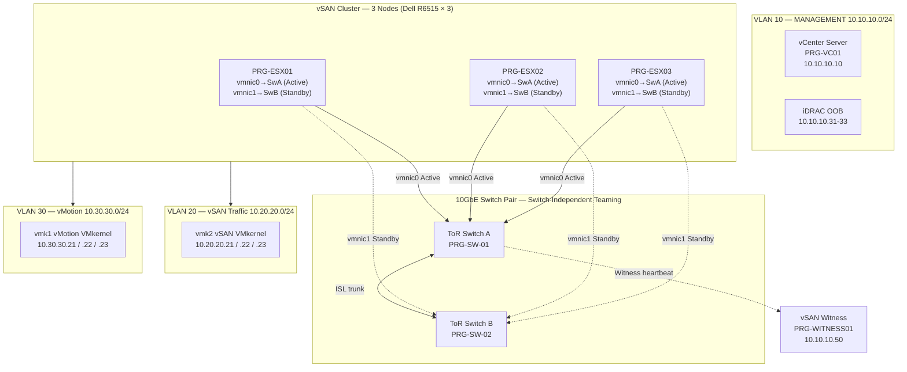

# vSAN Cluster

> VMware vSAN 3-node hyper-converged cluster — 10GbE switch pair แบบ switch-independent teaming, witness, VLAN แยก

## 📋 ใช้ตอนไหน

- ✅ ออกแบบ vSAN cluster 3-node ขึ้นไป (Dell R6515, R750xa, HPE ProLiant)
- ✅ HLD / LLD สำหรับ hyper-converged infrastructure
- ✅ Environment ที่ต้องการ HA + storage built-in โดยไม่ใช้ external SAN
- ✅ Witness อยู่บน NAS / VM แยก site หรือ vSAN Witness Appliance
- ❌ **ไม่เหมาะกับ**: Traditional SAN + VMware (ใช้ hyper-v-failover-cluster.md แทน), vSAN 2-node stretched cluster

---

## 🎨 Pragma Style Diagram (Draw.io XML)

```xml
<mxfile host="app.diagrams.net" version="24.0.0">
  <diagram name="vSAN Cluster — Pragma Style">
    <mxGraphModel dx="1400" dy="900" grid="0" background="#1a1a2e">
      <root>
        <mxCell id="0"/><mxCell id="1" parent="0"/>
        <mxCell id="title" value="VMware vSAN 3-Node Cluster — Pragma Style" style="text;html=1;strokeColor=none;fillColor=none;align=center;fontSize=22;fontStyle=1;fontColor=#ffffff;" vertex="1" parent="1">
          <mxGeometry x="100" y="20" width="900" height="40" as="geometry"/>
        </mxCell>

        <!-- MANAGEMENT VLAN -->
        <mxCell id="L_mgmt" value="VLAN 10 — MANAGEMENT     10.10.10.0/24     vCenter, ESXi Mgmt, iDRAC" style="swimlane;startSize=30;fillColor=#1a2a4a;strokeColor=#4a90d9;fontColor=#ffffff;fontSize=11;fontStyle=1;html=1;" vertex="1" parent="1">
          <mxGeometry x="40" y="80" width="1000" height="90" as="geometry"/>
        </mxCell>
        <mxCell id="vcenter" value="vCenter Server&#xa;PRG-VC01&#xa;10.10.10.10" style="rounded=1;whiteSpace=wrap;html=1;fillColor=#1a3a5c;strokeColor=#4a90d9;fontColor=#ffffff;fontSize=10;" vertex="1" parent="L_mgmt">
          <mxGeometry x="60" y="25" width="160" height="45" as="geometry"/>
        </mxCell>
        <mxCell id="esxi_mgmt1" value="ESXi Mgmt&#xa;PRG-ESX01&#xa;10.10.10.21" style="rounded=1;whiteSpace=wrap;html=1;fillColor=#1a3a5c;strokeColor=#4a90d9;fontColor=#ffffff;fontSize=10;" vertex="1" parent="L_mgmt">
          <mxGeometry x="280" y="25" width="140" height="45" as="geometry"/>
        </mxCell>
        <mxCell id="esxi_mgmt2" value="ESXi Mgmt&#xa;PRG-ESX02&#xa;10.10.10.22" style="rounded=1;whiteSpace=wrap;html=1;fillColor=#1a3a5c;strokeColor=#4a90d9;fontColor=#ffffff;fontSize=10;" vertex="1" parent="L_mgmt">
          <mxGeometry x="440" y="25" width="140" height="45" as="geometry"/>
        </mxCell>
        <mxCell id="esxi_mgmt3" value="ESXi Mgmt&#xa;PRG-ESX03&#xa;10.10.10.23" style="rounded=1;whiteSpace=wrap;html=1;fillColor=#1a3a5c;strokeColor=#4a90d9;fontColor=#ffffff;fontSize=10;" vertex="1" parent="L_mgmt">
          <mxGeometry x="600" y="25" width="140" height="45" as="geometry"/>
        </mxCell>
        <mxCell id="idrac" value="iDRAC OOB&#xa;10.10.10.31-33" style="rounded=1;whiteSpace=wrap;html=1;fillColor=#0d1a2e;strokeColor=#4a90d9;fontColor=#ffffff;fontSize=10;" vertex="1" parent="L_mgmt">
          <mxGeometry x="800" y="25" width="140" height="45" as="geometry"/>
        </mxCell>

        <!-- SWITCH PAIR -->
        <mxCell id="sw1" value="ToR Switch A&#xa;10GbE&#xa;PRG-SW-01" style="sketch=0;html=1;verticalLabelPosition=bottom;verticalAlign=top;align=center;shape=mxgraph.cisco.switches.layer_3_switch;fillColor=#2e7d32;strokeColor=#66bb6a;fontColor=#ffffff;fontSize=10;" vertex="1" parent="1">
          <mxGeometry x="330" y="220" width="64" height="64" as="geometry"/>
        </mxCell>
        <mxCell id="sw2" value="ToR Switch B&#xa;10GbE&#xa;PRG-SW-02" style="sketch=0;html=1;verticalLabelPosition=bottom;verticalAlign=top;align=center;shape=mxgraph.cisco.switches.layer_3_switch;fillColor=#2e7d32;strokeColor=#66bb6a;fontColor=#ffffff;fontSize=10;" vertex="1" parent="1">
          <mxGeometry x="700" y="220" width="64" height="64" as="geometry"/>
        </mxCell>
        <mxCell id="isl" value="ISL / uplink trunk" style="edgeStyle=orthogonalEdgeStyle;rounded=1;html=1;strokeColor=#66bb6a;strokeWidth=2;dashed=1;fontColor=#66bb6a;fontSize=9;" edge="1" parent="1" source="sw1" target="sw2">
          <mxGeometry relative="1" as="geometry"/>
        </mxCell>

        <!-- vSAN NODES -->
        <mxCell id="L_nodes" value="vSAN Cluster — 3 Nodes (Dell PowerEdge R6515 × 3)     Switch-Independent Teaming (Active/Standby per vmnic)" style="swimlane;startSize=30;fillColor=#0d2b1a;strokeColor=#2e7d32;fontColor=#ffffff;fontSize=11;fontStyle=1;html=1;" vertex="1" parent="1">
          <mxGeometry x="40" y="360" width="1000" height="220" as="geometry"/>
        </mxCell>

        <!-- Node 1 -->
        <mxCell id="n1" value="PRG-ESX01&#xa;Dell R6515&#xa;CPU: AMD EPYC 7313P&#xa;RAM: 256 GB&#xa;Cache: 400GB NVMe&#xa;Cap: 4× 3.84TB SSD" style="rounded=1;whiteSpace=wrap;html=1;fillColor=#1a4a1a;strokeColor=#66bb6a;fontColor=#ffffff;fontSize=9;" vertex="1" parent="L_nodes">
          <mxGeometry x="60" y="40" width="200" height="130" as="geometry"/>
        </mxCell>
        <mxCell id="n1_nic" value="vmnic0 → SwA (Active)&#xa;vmnic1 → SwB (Standby)" style="rounded=1;whiteSpace=wrap;html=1;fillColor=#0d2b1a;strokeColor=#4a90d9;fontColor=#aaaaff;fontSize=9;" vertex="1" parent="L_nodes">
          <mxGeometry x="60" y="175" width="200" height="35" as="geometry"/>
        </mxCell>

        <!-- Node 2 -->
        <mxCell id="n2" value="PRG-ESX02&#xa;Dell R6515&#xa;CPU: AMD EPYC 7313P&#xa;RAM: 256 GB&#xa;Cache: 400GB NVMe&#xa;Cap: 4× 3.84TB SSD" style="rounded=1;whiteSpace=wrap;html=1;fillColor=#1a4a1a;strokeColor=#66bb6a;fontColor=#ffffff;fontSize=9;" vertex="1" parent="L_nodes">
          <mxGeometry x="400" y="40" width="200" height="130" as="geometry"/>
        </mxCell>
        <mxCell id="n2_nic" value="vmnic0 → SwA (Active)&#xa;vmnic1 → SwB (Standby)" style="rounded=1;whiteSpace=wrap;html=1;fillColor=#0d2b1a;strokeColor=#4a90d9;fontColor=#aaaaff;fontSize=9;" vertex="1" parent="L_nodes">
          <mxGeometry x="400" y="175" width="200" height="35" as="geometry"/>
        </mxCell>

        <!-- Node 3 -->
        <mxCell id="n3" value="PRG-ESX03&#xa;Dell R6515&#xa;CPU: AMD EPYC 7313P&#xa;RAM: 256 GB&#xa;Cache: 400GB NVMe&#xa;Cap: 4× 3.84TB SSD" style="rounded=1;whiteSpace=wrap;html=1;fillColor=#1a4a1a;strokeColor=#66bb6a;fontColor=#ffffff;fontSize=9;" vertex="1" parent="L_nodes">
          <mxGeometry x="740" y="40" width="200" height="130" as="geometry"/>
        </mxCell>
        <mxCell id="n3_nic" value="vmnic0 → SwA (Active)&#xa;vmnic1 → SwB (Standby)" style="rounded=1;whiteSpace=wrap;html=1;fillColor=#0d2b1a;strokeColor=#4a90d9;fontColor=#aaaaff;fontSize=9;" vertex="1" parent="L_nodes">
          <mxGeometry x="740" y="175" width="200" height="35" as="geometry"/>
        </mxCell>

        <!-- VSAN + VMOTION VLAN -->
        <mxCell id="L_vsan" value="VLAN 20 — vSAN Traffic     10.20.20.0/24     vSAN datastore, resync, rebuild" style="swimlane;startSize=30;fillColor=#1a1a0d;strokeColor=#f9a825;fontColor=#ffffff;fontSize=11;fontStyle=1;html=1;" vertex="1" parent="1">
          <mxGeometry x="40" y="620" width="480" height="80" as="geometry"/>
        </mxCell>
        <mxCell id="vsan_net" value="vmk2 — vSAN VMkernel&#xa;10.20.20.21 / .22 / .23" style="rounded=1;whiteSpace=wrap;html=1;fillColor=#5d4037;strokeColor=#f9a825;fontColor=#ffffff;fontSize=10;" vertex="1" parent="L_vsan">
          <mxGeometry x="60" y="25" width="340" height="38" as="geometry"/>
        </mxCell>

        <mxCell id="L_vmot" value="VLAN 30 — vMotion     10.30.30.0/24     Live migration, no VM downtime" style="swimlane;startSize=30;fillColor=#1a0d2b;strokeColor=#6a1b9a;fontColor=#ffffff;fontSize=11;fontStyle=1;html=1;" vertex="1" parent="1">
          <mxGeometry x="560" y="620" width="480" height="80" as="geometry"/>
        </mxCell>
        <mxCell id="vmot_net" value="vmk1 — vMotion VMkernel&#xa;10.30.30.21 / .22 / .23" style="rounded=1;whiteSpace=wrap;html=1;fillColor=#4a0e8f;strokeColor=#ce93d8;fontColor=#ffffff;fontSize=10;" vertex="1" parent="L_vmot">
          <mxGeometry x="60" y="25" width="340" height="38" as="geometry"/>
        </mxCell>

        <!-- WITNESS -->
        <mxCell id="witness" value="vSAN Witness&#xa;PRG-WITNESS01&#xa;NAS / Witness Appliance&#xa;10.10.10.50" style="rounded=1;whiteSpace=wrap;html=1;fillColor=#2a2a0d;strokeColor=#cddc39;fontColor=#ffffff;fontSize=10;" vertex="1" parent="1">
          <mxGeometry x="450" y="740" width="200" height="80" as="geometry"/>
        </mxCell>

        <!-- Edges nodes → switches -->
        <mxCell id="e_n1_swa" value="vmnic0 (A)" style="edgeStyle=orthogonalEdgeStyle;rounded=1;html=1;strokeColor=#66bb6a;strokeWidth=2;fontColor=#66bb6a;fontSize=9;" edge="1" parent="1" source="n1" target="sw1"><mxGeometry relative="1" as="geometry"/></mxCell>
        <mxCell id="e_n1_swb" value="vmnic1 (B)" style="edgeStyle=orthogonalEdgeStyle;rounded=1;html=1;strokeColor=#4a90d9;strokeWidth=2;dashed=1;fontColor=#4a90d9;fontSize=9;" edge="1" parent="1" source="n1" target="sw2"><mxGeometry relative="1" as="geometry"/></mxCell>
        <mxCell id="e_n2_swa" value="vmnic0 (A)" style="edgeStyle=orthogonalEdgeStyle;rounded=1;html=1;strokeColor=#66bb6a;strokeWidth=2;fontColor=#66bb6a;fontSize=9;" edge="1" parent="1" source="n2" target="sw1"><mxGeometry relative="1" as="geometry"/></mxCell>
        <mxCell id="e_n2_swb" value="vmnic1 (B)" style="edgeStyle=orthogonalEdgeStyle;rounded=1;html=1;strokeColor=#4a90d9;strokeWidth=2;dashed=1;fontColor=#4a90d9;fontSize=9;" edge="1" parent="1" source="n2" target="sw2"><mxGeometry relative="1" as="geometry"/></mxCell>
        <mxCell id="e_n3_swa" value="vmnic0 (A)" style="edgeStyle=orthogonalEdgeStyle;rounded=1;html=1;strokeColor=#66bb6a;strokeWidth=2;fontColor=#66bb6a;fontSize=9;" edge="1" parent="1" source="n3" target="sw1"><mxGeometry relative="1" as="geometry"/></mxCell>
        <mxCell id="e_n3_swb" value="vmnic1 (B)" style="edgeStyle=orthogonalEdgeStyle;rounded=1;html=1;strokeColor=#4a90d9;strokeWidth=2;dashed=1;fontColor=#4a90d9;fontSize=9;" edge="1" parent="1" source="n3" target="sw2"><mxGeometry relative="1" as="geometry"/></mxCell>
        <mxCell id="e_witness" value="Witness heartbeat" style="edgeStyle=orthogonalEdgeStyle;rounded=1;html=1;strokeColor=#cddc39;strokeWidth=2;dashed=1;fontColor=#cddc39;fontSize=9;" edge="1" parent="1" source="sw1" target="witness"><mxGeometry relative="1" as="geometry"/></mxCell>
      </root>
    </mxGraphModel>
  </diagram>
</mxfile>
```

---

## 🌊 Mermaid Template



---

## 📊 ตารางข้อมูล Cluster (copy ใส่เอกสารได้เลย)

### Node Specification

| Node | Hostname | Model | CPU | RAM | Cache Disk | Capacity Disk |
|---|---|---|---|---|---|---|
| 1 | PRG-ESX01 | Dell R6515 | AMD EPYC 7313P | 256 GB | 400 GB NVMe | 4× 3.84 TB SSD |
| 2 | PRG-ESX02 | Dell R6515 | AMD EPYC 7313P | 256 GB | 400 GB NVMe | 4× 3.84 TB SSD |
| 3 | PRG-ESX03 | Dell R6515 | AMD EPYC 7313P | 256 GB | 400 GB NVMe | 4× 3.84 TB SSD |

### VLAN / VMkernel

| VLAN | ชื่อ | Subnet | VMkernel | จุดประสงค์ |
|---|---|---|---|---|
| 10 | MANAGEMENT | 10.10.10.0/24 | vmk0 | ESXi Mgmt, vCenter, iDRAC |
| 20 | vSAN | 10.20.20.0/24 | vmk2 | vSAN datastore traffic |
| 30 | vMotion | 10.30.30.0/24 | vmk1 | Live migration |
| 10 | Witness | 10.10.10.50 | — | vSAN Witness heartbeat |

### Network Teaming (Switch-Independent)

| vmnic | Switch | Role |
|---|---|---|
| vmnic0 | PRG-SW-01 (Switch A) | Active — ทุก traffic type |
| vmnic1 | PRG-SW-02 (Switch B) | Standby — failover เมื่อ Switch A ล้ม |

---

## 💡 Prompt ตัวอย่าง

### แบบ A: ออกแบบ vSAN cluster ใหม่
```
ใช้ template vsan-cluster.md แบบ Pragma Style
ออกแบบ vSAN cluster สำหรับ [ชื่อลูกค้า]:
- Nodes: [จำนวน] × [Model เช่น Dell R6515]
- RAM ต่อ node: [GB]
- Cache tier: [NVMe GB]
- Capacity tier: [จำนวน × TB SSD]
- Switch: [Model, 10GbE/25GbE]
- Teaming: Switch-Independent / LACP
- Witness: NAS / Appliance / Cloud
- vCenter: [hostname + IP]
```

### แบบ B: Document vSAN ที่มีอยู่แล้ว
```
ใช้ template vsan-cluster.md แบบ Pragma Style
วาด vSAN diagram จากข้อมูลที่มีอยู่:
- Nodes: [hostname list]
- Switch pair: [model A], [model B]
- VLAN Management: [subnet]
- VLAN vSAN: [subnet]
- VLAN vMotion: [subnet]
- Witness: [location/IP]
- vCenter: [IP]
```

---

## 🔧 Parameters ที่ปรับได้

| Parameter | Default | ทางเลือก |
|---|---|---|
| จำนวน node | 3 | 4-16 (เพิ่ม node cell ใน diagram) |
| Hardware | Dell R6515 | HPE ProLiant DL360, Cisco UCS |
| Network speed | 10GbE | 25GbE, dual 10GbE LACP |
| Teaming policy | Switch-Independent (Active/Standby) | LACP Active/Active (ต้องการ switch support) |
| Cache tier | NVMe | SAS SSD |
| Witness location | VM บน NAS | vSAN Witness Appliance, Cloud Witness |
| FTT (Fault Tolerance) | FTT=1 (RAID-1) | FTT=2 (RAID-6, ≥6 nodes) |
| vSAN VLAN | 20 (10.20.20.0/24) | ปรับตาม scheme ลูกค้า |

---

## 📌 Notes สำหรับ SI

- **Switch-Independent Teaming**: ไม่ต้องการ LACP configuration บน switch — ง่ายกว่า แต่ failover ใช้เวลาสักวินาที (Beacon Probing แนะนำ)
- **Witness ต้องอยู่ใน Mgmt VLAN**: Witness ใช้ vmk0 Mgmt network — ไม่ต้องมี VLAN vSAN แยก
- **vSAN VLAN Jumbo Frame**: แนะนำ MTU 9000 บน vSAN VLAN และ switch — ลด CPU overhead
- **iDRAC OOB แยก VLAN**: ควรอยู่ใน VLAN Management เดียวกัน แต่ restrict access ด้วย firewall rule
- **FTT=1 + 3 nodes**: ทน node failure ได้ 1 node — ถ้า 2 nodes fail ต้องรอ rebuild
- **vSAN Datastore Capacity**: usable ≈ raw × 0.5 (RAID-1, FTT=1) — แจ้งลูกค้าให้ชัดเจน

### Related Templates
- Hyper-V cluster → `hyper-v-failover-cluster.md`
- iSCSI SAN แบบ external → `iscsi-san-multipath.md`
- Backup จาก vSAN → `backup-architecture.md`
- VLAN design → `vlan-segmentation.md`

**อัพเดตล่าสุด**: 2026-06-27 — initial template
