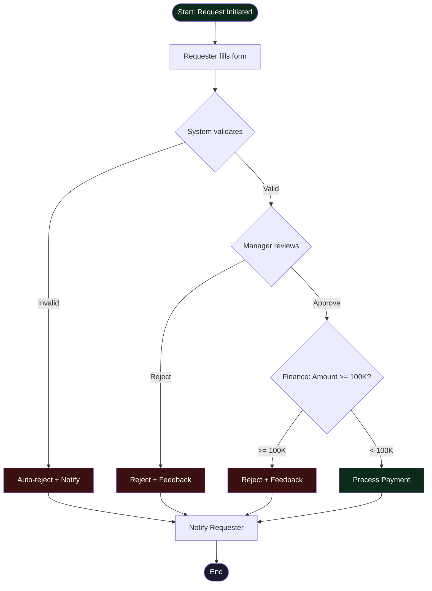

# Approval Workflow (Swimlane)

> Process flow แบบ swimlane สำหรับ approval workflow — ใช้ได้กับการอนุมัติจัดซื้อ, leave request, expense claim ฯลฯ

## 📋 ใช้ตอนไหน

- ✅ แสดง workflow ที่มีหลาย actor
- ✅ มี decision point (อนุมัติ/ปฏิเสธ)
- ✅ ใช้ในการทำ SOP / Process Documentation
- ❌ **ไม่เหมาะกับ**: technical flow (ใช้ sequence diagram แทน)

---

## 🎨 Pragma Style Diagram (Draw.io XML)

```xml
<mxfile host="app.diagrams.net" version="24.0.0">
  <diagram name="Approval Workflow — Pragma Style">
    <mxGraphModel dx="1800" dy="800" grid="0" background="#1a1a2e">
      <root>
        <mxCell id="0"/>
        <mxCell id="1" parent="0"/>

        <mxCell id="title" value="Approval Workflow" style="text;html=1;strokeColor=none;fillColor=none;align=center;fontSize=22;fontStyle=1;fontColor=#ffffff;" vertex="1" parent="1">
          <mxGeometry x="100" y="16" width="800" height="40" as="geometry"/>
        </mxCell>

        <mxCell id="lane1" value="Requester" style="swimlane;horizontal=0;startSize=110;fillColor=#1a2a4a;strokeColor=#4a90d9;fontColor=#ffffff;fontSize=13;fontStyle=1;html=1;" vertex="1" parent="1">
          <mxGeometry x="0" y="60" width="1800" height="150" as="geometry"/>
        </mxCell>
        <mxCell id="start" value="Start" style="ellipse;whiteSpace=wrap;html=1;fillColor=#0d2b1a;strokeColor=#2e7d32;fontColor=#ffffff;fontSize=11;" vertex="1" parent="lane1">
          <mxGeometry x="130" y="45" width="80" height="60" as="geometry"/>
        </mxCell>
        <mxCell id="fill_form" value="Fill Request Form" style="rounded=1;whiteSpace=wrap;html=1;fillColor=#1a2a4a;strokeColor=#4a90d9;fontColor=#ffffff;fontSize=11;" vertex="1" parent="lane1">
          <mxGeometry x="280" y="45" width="140" height="60" as="geometry"/>
        </mxCell>
        <mxCell id="notify_req" value="Receive&#xa;Notification" style="rounded=1;whiteSpace=wrap;html=1;fillColor=#1a2a4a;strokeColor=#4a90d9;fontColor=#ffffff;fontSize=11;" vertex="1" parent="lane1">
          <mxGeometry x="1540" y="45" width="140" height="60" as="geometry"/>
        </mxCell>

        <mxCell id="lane2" value="System" style="swimlane;horizontal=0;startSize=110;fillColor=#0d1f2b;strokeColor=#0288d1;fontColor=#ffffff;fontSize=13;fontStyle=1;html=1;" vertex="1" parent="1">
          <mxGeometry x="0" y="210" width="1800" height="150" as="geometry"/>
        </mxCell>
        <mxCell id="validate" value="Validate&#xa;Form?" style="rhombus;whiteSpace=wrap;html=1;fillColor=#0d1f2b;strokeColor=#0288d1;fontColor=#ffffff;fontSize=11;" vertex="1" parent="lane2">
          <mxGeometry x="490" y="30" width="140" height="90" as="geometry"/>
        </mxCell>
        <mxCell id="auto_reject" value="Auto-reject&#xa;+ Notify" style="rounded=1;whiteSpace=wrap;html=1;fillColor=#3a1010;strokeColor=#e53935;fontColor=#ffffff;fontSize=11;" vertex="1" parent="lane2">
          <mxGeometry x="690" y="45" width="140" height="60" as="geometry"/>
        </mxCell>
        <mxCell id="process" value="Process Payment" style="rounded=1;whiteSpace=wrap;html=1;fillColor=#0d2b1a;strokeColor=#2e7d32;fontColor=#ffffff;fontSize=11;" vertex="1" parent="lane2">
          <mxGeometry x="1350" y="45" width="140" height="60" as="geometry"/>
        </mxCell>

        <mxCell id="lane3" value="Manager" style="swimlane;horizontal=0;startSize=110;fillColor=#2d1a0e;strokeColor=#ff9800;fontColor=#ffffff;fontSize=13;fontStyle=1;html=1;" vertex="1" parent="1">
          <mxGeometry x="0" y="360" width="1800" height="150" as="geometry"/>
        </mxCell>
        <mxCell id="mgr_review" value="Review&#xa;Request?" style="rhombus;whiteSpace=wrap;html=1;fillColor=#2d1a0e;strokeColor=#ff9800;fontColor=#ffffff;fontSize=11;" vertex="1" parent="lane3">
          <mxGeometry x="860" y="30" width="140" height="90" as="geometry"/>
        </mxCell>
        <mxCell id="mgr_reject" value="Reject&#xa;+ Feedback" style="rounded=1;whiteSpace=wrap;html=1;fillColor=#3a1010;strokeColor=#e53935;fontColor=#ffffff;fontSize=11;" vertex="1" parent="lane3">
          <mxGeometry x="1060" y="45" width="140" height="60" as="geometry"/>
        </mxCell>

        <mxCell id="lane4" value="Finance" style="swimlane;horizontal=0;startSize=110;fillColor=#1a1030;strokeColor=#7c4dff;fontColor=#ffffff;fontSize=13;fontStyle=1;html=1;" vertex="1" parent="1">
          <mxGeometry x="0" y="510" width="1800" height="150" as="geometry"/>
        </mxCell>
        <mxCell id="fin_check" value="Amount&#xa;&gt;= 100K?" style="rhombus;whiteSpace=wrap;html=1;fillColor=#1a1030;strokeColor=#7c4dff;fontColor=#ffffff;fontSize=11;" vertex="1" parent="lane4">
          <mxGeometry x="1160" y="30" width="140" height="90" as="geometry"/>
        </mxCell>
        <mxCell id="fin_reject" value="Reject&#xa;+ Feedback" style="rounded=1;whiteSpace=wrap;html=1;fillColor=#3a1010;strokeColor=#e53935;fontColor=#ffffff;fontSize=11;" vertex="1" parent="lane4">
          <mxGeometry x="1380" y="45" width="140" height="60" as="geometry"/>
        </mxCell>

        <mxCell id="e1" style="edgeStyle=orthogonalEdgeStyle;rounded=1;html=1;strokeColor=#4a90d9;strokeWidth=2;" edge="1" parent="1" source="start" target="fill_form"><mxGeometry relative="1" as="geometry"/></mxCell>
        <mxCell id="e2" style="edgeStyle=orthogonalEdgeStyle;rounded=1;html=1;strokeColor=#4a90d9;strokeWidth=2;" edge="1" parent="1" source="fill_form" target="validate"><mxGeometry relative="1" as="geometry"/></mxCell>
        <mxCell id="e3" value="Invalid" style="edgeStyle=orthogonalEdgeStyle;rounded=1;html=1;strokeColor=#e53935;strokeWidth=2;fontColor=#e53935;fontSize=10;" edge="1" parent="1" source="validate" target="auto_reject"><mxGeometry relative="1" as="geometry"/></mxCell>
        <mxCell id="e4" value="Valid" style="edgeStyle=orthogonalEdgeStyle;rounded=1;html=1;strokeColor=#66bb6a;strokeWidth=2;fontColor=#66bb6a;fontSize=10;" edge="1" parent="1" source="validate" target="mgr_review"><mxGeometry relative="1" as="geometry"/></mxCell>
        <mxCell id="e5" value="Reject" style="edgeStyle=orthogonalEdgeStyle;rounded=1;html=1;strokeColor=#e53935;strokeWidth=2;fontColor=#e53935;fontSize=10;" edge="1" parent="1" source="mgr_review" target="mgr_reject"><mxGeometry relative="1" as="geometry"/></mxCell>
        <mxCell id="e6" value="Approve" style="edgeStyle=orthogonalEdgeStyle;rounded=1;html=1;strokeColor=#ff9800;strokeWidth=2;fontColor=#ff9800;fontSize=10;" edge="1" parent="1" source="mgr_review" target="fin_check"><mxGeometry relative="1" as="geometry"/></mxCell>
        <mxCell id="e7" value="&lt; 100K" style="edgeStyle=orthogonalEdgeStyle;rounded=1;html=1;strokeColor=#66bb6a;strokeWidth=2;fontColor=#66bb6a;fontSize=10;" edge="1" parent="1" source="fin_check" target="process"><mxGeometry relative="1" as="geometry"/></mxCell>
        <mxCell id="e8" value="&gt;= 100K" style="edgeStyle=orthogonalEdgeStyle;rounded=1;html=1;strokeColor=#e53935;strokeWidth=2;fontColor=#e53935;fontSize=10;" edge="1" parent="1" source="fin_check" target="fin_reject"><mxGeometry relative="1" as="geometry"/></mxCell>
        <mxCell id="e9" style="edgeStyle=orthogonalEdgeStyle;rounded=1;html=1;strokeColor=#e53935;strokeWidth=2;" edge="1" parent="1" source="auto_reject" target="notify_req"><mxGeometry relative="1" as="geometry"/></mxCell>
        <mxCell id="e10" style="edgeStyle=orthogonalEdgeStyle;rounded=1;html=1;strokeColor=#e53935;strokeWidth=2;" edge="1" parent="1" source="mgr_reject" target="notify_req"><mxGeometry relative="1" as="geometry"/></mxCell>
        <mxCell id="e11" style="edgeStyle=orthogonalEdgeStyle;rounded=1;html=1;strokeColor=#e53935;strokeWidth=2;" edge="1" parent="1" source="fin_reject" target="notify_req"><mxGeometry relative="1" as="geometry"/></mxCell>
        <mxCell id="e12" style="edgeStyle=orthogonalEdgeStyle;rounded=1;html=1;strokeColor=#66bb6a;strokeWidth=2;" edge="1" parent="1" source="process" target="notify_req"><mxGeometry relative="1" as="geometry"/></mxCell>
      </root>
    </mxGraphModel>
  </diagram>
</mxfile>
```

---

## 🌊 Mermaid Template



---

## 💡 Prompt ตัวอย่าง

```
ใช้ template approval-workflow.md แบบ Pragma Style
ปรับเป็น [ชื่อ workflow เช่น "Leave Request"]

Actors:
- [Employee]
- [Team Lead]
- [HR]
- [Manager]

Rules:
- Leave <= 3 วัน: แค่ Team Lead อนุมัติ
- Leave > 3 วัน: ต้อง Manager อนุมัติด้วย
- HR check quota ก่อน
```

---

## 🔧 Parameters ที่ปรับได้

| Parameter | Default | ทางเลือก |
|---|---|---|
| Actors (lanes) | 4 (Requester, System, Manager, Finance) | เพิ่ม/ลดได้ เช่น +Legal, +Security |
| Decision points | 3 จุด | เพิ่ม condition logic |
| Reject paths | ออก notify | กลับไป resubmit ได้ |
| SLA timing | ไม่มี | เพิ่ม timer ที่แต่ละ step |
| Threshold | 100K | ปรับตาม policy |

---

## 📌 Notes

- **Pragma Dark Style**: background `#1a1a2e`, swimlane แต่ละ lane มีสี theme ต่างกัน
- Lane colors: Requester=Navy `#1a2a4a`, System=Dark Blue `#0d1f2b`, Manager=Dark Orange `#2d1a0e`, Finance=Dark Purple `#1a1030`
- Reject nodes ทุกตัวใช้ `#3a1010` (dark red) สม่ำเสมอ
- Approve edges ใช้ stroke `#66bb6a` (green), reject edges ใช้ `#e53935` (red)
- สำหรับ workflow ที่มี resubmit loop ให้เพิ่ม edge ย้อนกลับ `fill_form`

### Related Templates

- CI/CD Pipeline → `cicd-pipeline.md`
- Incident Response → `incident-response.md`
