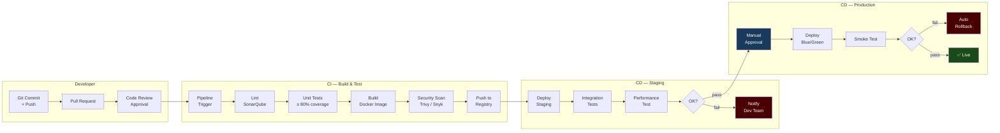

# CI/CD Pipeline

> CI/CD pipeline diagram — Build, Test, Deploy แบบ automated ตั้งแต่ commit ถึง production

## 📋 ใช้ตอนไหน

- ✅ ออกแบบ / document CI/CD pipeline ให้ลูกค้า
- ✅ DevOps project ที่ใช้ GitHub Actions / GitLab CI / Jenkins
- ✅ ประกอบ proposal งาน DevOps / cloud migration
- ❌ **ไม่เหมาะกับ**: manual deployment, waterfall process (ใช้ approval-workflow.md แทน)

---

## 🎨 Pragma Style Diagram (Draw.io XML)

```xml
<mxfile host="app.diagrams.net" version="24.0.0">
  <diagram name="CI/CD Pipeline — Pragma Style">
    <mxGraphModel dx="1600" dy="900" grid="0" background="#1a1a2e">
      <root>
        <mxCell id="0"/><mxCell id="1" parent="0"/>

        <mxCell id="title" value="CI/CD Pipeline" style="text;html=1;strokeColor=none;fillColor=none;align=center;fontSize=22;fontStyle=1;fontColor=#ffffff;" vertex="1" parent="1">
          <mxGeometry x="200" y="20" width="800" height="40" as="geometry"/>
        </mxCell>

        <!-- LANE 1: DEVELOPER -->
        <mxCell id="lane_dev" value="DEVELOPER" style="swimlane;horizontal=0;startSize=110;fillColor=#1a1a1a;strokeColor=#424242;fontColor=#ffffff;fontSize=12;fontStyle=1;html=1;" vertex="1" parent="1">
          <mxGeometry x="40" y="70" width="1200" height="120" as="geometry"/>
        </mxCell>
        <mxCell id="commit" value="Git Commit&#xa;+ Push" style="rounded=1;whiteSpace=wrap;html=1;fillColor=#2d1a4a;strokeColor=#9c27b0;fontColor=#ffffff;fontSize=10;" vertex="1" parent="lane_dev">
          <mxGeometry x="120" y="30" width="120" height="55" as="geometry"/>
        </mxCell>
        <mxCell id="pr" value="Pull Request&#xa;/ Merge Request" style="rounded=1;whiteSpace=wrap;html=1;fillColor=#2d1a4a;strokeColor=#9c27b0;fontColor=#ffffff;fontSize=10;" vertex="1" parent="lane_dev">
          <mxGeometry x="320" y="30" width="120" height="55" as="geometry"/>
        </mxCell>
        <mxCell id="code_review" value="Code Review&#xa;Approval" style="rounded=1;whiteSpace=wrap;html=1;fillColor=#2d1a4a;strokeColor=#9c27b0;fontColor=#ffffff;fontSize=10;" vertex="1" parent="lane_dev">
          <mxGeometry x="520" y="30" width="120" height="55" as="geometry"/>
        </mxCell>

        <!-- LANE 2: CI — SOURCE & BUILD -->
        <mxCell id="lane_ci" value="CI — BUILD &amp; TEST" style="swimlane;horizontal=0;startSize=110;fillColor=#0d2b1a;strokeColor=#2e7d32;fontColor=#ffffff;fontSize=12;fontStyle=1;html=1;" vertex="1" parent="1">
          <mxGeometry x="40" y="210" width="1200" height="120" as="geometry"/>
        </mxCell>
        <mxCell id="trigger" value="Pipeline&#xa;Trigger&#xa;(Webhook)" style="shape=mxgraph.flowchart.start_2;fillColor=#2e7d32;strokeColor=#81c784;fontColor=#ffffff;fontSize=10;whiteSpace=wrap;html=1;" vertex="1" parent="lane_ci">
          <mxGeometry x="120" y="30" width="80" height="60" as="geometry"/>
        </mxCell>
        <mxCell id="lint" value="Lint&#xa;Code Quality&#xa;SonarQube" style="rounded=1;whiteSpace=wrap;html=1;fillColor=#1a4a1a;strokeColor=#66bb6a;fontColor=#ffffff;fontSize=10;" vertex="1" parent="lane_ci">
          <mxGeometry x="270" y="30" width="120" height="55" as="geometry"/>
        </mxCell>
        <mxCell id="unit_test" value="Unit Tests&#xa;Coverage Check&#xa;≥ 80%" style="rounded=1;whiteSpace=wrap;html=1;fillColor=#1a4a1a;strokeColor=#66bb6a;fontColor=#ffffff;fontSize=10;" vertex="1" parent="lane_ci">
          <mxGeometry x="430" y="30" width="120" height="55" as="geometry"/>
        </mxCell>
        <mxCell id="build" value="Build&#xa;Docker Image&#xa;Tag: git SHA" style="rounded=1;whiteSpace=wrap;html=1;fillColor=#1a4a1a;strokeColor=#66bb6a;fontColor=#ffffff;fontSize=10;" vertex="1" parent="lane_ci">
          <mxGeometry x="590" y="30" width="120" height="55" as="geometry"/>
        </mxCell>
        <mxCell id="scan" value="Security Scan&#xa;Trivy / Snyk&#xa;SAST" style="rounded=1;whiteSpace=wrap;html=1;fillColor=#2d1a0e;strokeColor=#ff9800;fontColor=#ffffff;fontSize=10;" vertex="1" parent="lane_ci">
          <mxGeometry x="750" y="30" width="120" height="55" as="geometry"/>
        </mxCell>
        <mxCell id="push_reg" value="Push to&#xa;Registry&#xa;ECR / Harbor" style="rounded=1;whiteSpace=wrap;html=1;fillColor=#1a4a1a;strokeColor=#66bb6a;fontColor=#ffffff;fontSize=10;" vertex="1" parent="lane_ci">
          <mxGeometry x="920" y="30" width="120" height="55" as="geometry"/>
        </mxCell>

        <!-- LANE 3: CD — STAGING -->
        <mxCell id="lane_stg" value="CD — STAGING" style="swimlane;horizontal=0;startSize=110;fillColor=#1a0d2b;strokeColor=#6a1b9a;fontColor=#ffffff;fontSize=12;fontStyle=1;html=1;" vertex="1" parent="1">
          <mxGeometry x="40" y="350" width="1200" height="120" as="geometry"/>
        </mxCell>
        <mxCell id="deploy_stg" value="Deploy to&#xa;Staging&#xa;Auto" style="rounded=1;whiteSpace=wrap;html=1;fillColor=#6a1b9a;strokeColor=#ce93d8;fontColor=#ffffff;fontSize=10;" vertex="1" parent="lane_stg">
          <mxGeometry x="120" y="30" width="120" height="55" as="geometry"/>
        </mxCell>
        <mxCell id="int_test" value="Integration&#xa;Tests&#xa;API / E2E" style="rounded=1;whiteSpace=wrap;html=1;fillColor=#4a1a6a;strokeColor=#ce93d8;fontColor=#ffffff;fontSize=10;" vertex="1" parent="lane_stg">
          <mxGeometry x="300" y="30" width="120" height="55" as="geometry"/>
        </mxCell>
        <mxCell id="perf_test" value="Performance&#xa;Test&#xa;k6 / Locust" style="rounded=1;whiteSpace=wrap;html=1;fillColor=#4a1a6a;strokeColor=#ce93d8;fontColor=#ffffff;fontSize=10;" vertex="1" parent="lane_stg">
          <mxGeometry x="480" y="30" width="120" height="55" as="geometry"/>
        </mxCell>
        <mxCell id="stg_ok" value="Staging&#xa;OK?" style="rhombus;whiteSpace=wrap;html=1;fillColor=#1a0d2b;strokeColor=#6a1b9a;fontColor=#ffffff;fontSize=10;" vertex="1" parent="lane_stg">
          <mxGeometry x="660" y="20" width="100" height="80" as="geometry"/>
        </mxCell>
        <mxCell id="notify_fail" value="Notify&#xa;Dev Team&#xa;Slack/Teams" style="rounded=1;whiteSpace=wrap;html=1;fillColor=#4a0000;strokeColor=#cc0000;fontColor=#ffffff;fontSize=10;" vertex="1" parent="lane_stg">
          <mxGeometry x="820" y="30" width="120" height="55" as="geometry"/>
        </mxCell>

        <!-- LANE 4: CD — PRODUCTION -->
        <mxCell id="lane_prod" value="CD — PRODUCTION" style="swimlane;horizontal=0;startSize=110;fillColor=#1a2a4a;strokeColor=#4a90d9;fontColor=#ffffff;fontSize=12;fontStyle=1;html=1;" vertex="1" parent="1">
          <mxGeometry x="40" y="490" width="1200" height="130" as="geometry"/>
        </mxCell>
        <mxCell id="approval" value="Manual&#xa;Approval&#xa;Required" style="shape=mxgraph.flowchart.manual_input;whiteSpace=wrap;html=1;fillColor=#1a3a5c;strokeColor=#4a90d9;fontColor=#ffffff;fontSize=10;" vertex="1" parent="lane_prod">
          <mxGeometry x="120" y="25" width="120" height="70" as="geometry"/>
        </mxCell>
        <mxCell id="deploy_prod" value="Deploy to&#xa;Production&#xa;Blue/Green" style="rounded=1;whiteSpace=wrap;html=1;fillColor=#1a3a5c;strokeColor=#4a90d9;fontColor=#ffffff;fontSize=10;" vertex="1" parent="lane_prod">
          <mxGeometry x="310" y="35" width="120" height="55" as="geometry"/>
        </mxCell>
        <mxCell id="smoke" value="Smoke Test&#xa;Health Check&#xa;/health" style="rounded=1;whiteSpace=wrap;html=1;fillColor=#1a3a5c;strokeColor=#4a90d9;fontColor=#ffffff;fontSize=10;" vertex="1" parent="lane_prod">
          <mxGeometry x="490" y="35" width="120" height="55" as="geometry"/>
        </mxCell>
        <mxCell id="prod_ok" value="Prod&#xa;OK?" style="rhombus;whiteSpace=wrap;html=1;fillColor=#1a2a4a;strokeColor=#4a90d9;fontColor=#ffffff;fontSize=10;" vertex="1" parent="lane_prod">
          <mxGeometry x="670" y="25" width="90" height="75" as="geometry"/>
        </mxCell>
        <mxCell id="rollback" value="Auto&#xa;Rollback&#xa;Previous ver." style="rounded=1;whiteSpace=wrap;html=1;fillColor=#4a0000;strokeColor=#cc0000;fontColor=#ffffff;fontSize=10;" vertex="1" parent="lane_prod">
          <mxGeometry x="820" y="35" width="120" height="55" as="geometry"/>
        </mxCell>
        <mxCell id="done" value="✅ Live&#xa;Production" style="shape=mxgraph.flowchart.terminate;fillColor=#1a4a1a;strokeColor=#66bb6a;fontColor=#ffffff;fontSize=11;fontStyle=1;whiteSpace=wrap;html=1;" vertex="1" parent="lane_prod">
          <mxGeometry x="1010" y="35" width="120" height="55" as="geometry"/>
        </mxCell>

        <!-- LANE 5: MONITORING -->
        <mxCell id="lane_mon" value="MONITORING" style="swimlane;horizontal=0;startSize=110;fillColor=#0d1f2b;strokeColor=#0288d1;fontColor=#ffffff;fontSize=12;fontStyle=1;html=1;" vertex="1" parent="1">
          <mxGeometry x="40" y="640" width="1200" height="100" as="geometry"/>
        </mxCell>
        <mxCell id="metrics" value="Metrics&#xa;Prometheus + Grafana" style="rounded=1;whiteSpace=wrap;html=1;fillColor=#01579b;strokeColor=#4fc3f7;fontColor=#ffffff;fontSize=10;" vertex="1" parent="lane_mon">
          <mxGeometry x="120" y="20" width="160" height="55" as="geometry"/>
        </mxCell>
        <mxCell id="logs" value="Logs&#xa;ELK / Loki" style="rounded=1;whiteSpace=wrap;html=1;fillColor=#01579b;strokeColor=#4fc3f7;fontColor=#ffffff;fontSize=10;" vertex="1" parent="lane_mon">
          <mxGeometry x="340" y="20" width="160" height="55" as="geometry"/>
        </mxCell>
        <mxCell id="alerts" value="Alerts&#xa;PagerDuty / Teams" style="rounded=1;whiteSpace=wrap;html=1;fillColor=#01579b;strokeColor=#4fc3f7;fontColor=#ffffff;fontSize=10;" vertex="1" parent="lane_mon">
          <mxGeometry x="560" y="20" width="160" height="55" as="geometry"/>
        </mxCell>
        <mxCell id="tracing" value="Tracing&#xa;Jaeger / Zipkin" style="rounded=1;whiteSpace=wrap;html=1;fillColor=#01579b;strokeColor=#4fc3f7;fontColor=#ffffff;fontSize=10;" vertex="1" parent="lane_mon">
          <mxGeometry x="780" y="20" width="160" height="55" as="geometry"/>
        </mxCell>

        <!-- EDGES — Developer lane -->
        <mxCell id="e1" value="" style="edgeStyle=orthogonalEdgeStyle;rounded=1;html=1;strokeColor=#9c27b0;strokeWidth=2;" edge="1" parent="lane_dev" source="commit" target="pr"><mxGeometry relative="1" as="geometry"/></mxCell>
        <mxCell id="e2" value="" style="edgeStyle=orthogonalEdgeStyle;rounded=1;html=1;strokeColor=#9c27b0;strokeWidth=2;" edge="1" parent="lane_dev" source="pr" target="code_review"><mxGeometry relative="1" as="geometry"/></mxCell>

        <!-- EDGES — CI lane -->
        <mxCell id="e3" value="merge" style="edgeStyle=orthogonalEdgeStyle;rounded=1;html=1;strokeColor=#2e7d32;strokeWidth=2;fontColor=#66bb6a;fontSize=9;" edge="1" parent="1" source="code_review" target="trigger"><mxGeometry relative="1" as="geometry"/></mxCell>
        <mxCell id="e4" value="" style="edgeStyle=orthogonalEdgeStyle;rounded=1;html=1;strokeColor=#2e7d32;strokeWidth=2;" edge="1" parent="lane_ci" source="trigger" target="lint"><mxGeometry relative="1" as="geometry"/></mxCell>
        <mxCell id="e5" value="" style="edgeStyle=orthogonalEdgeStyle;rounded=1;html=1;strokeColor=#2e7d32;strokeWidth=2;" edge="1" parent="lane_ci" source="lint" target="unit_test"><mxGeometry relative="1" as="geometry"/></mxCell>
        <mxCell id="e6" value="" style="edgeStyle=orthogonalEdgeStyle;rounded=1;html=1;strokeColor=#2e7d32;strokeWidth=2;" edge="1" parent="lane_ci" source="unit_test" target="build"><mxGeometry relative="1" as="geometry"/></mxCell>
        <mxCell id="e7" value="" style="edgeStyle=orthogonalEdgeStyle;rounded=1;html=1;strokeColor=#2e7d32;strokeWidth=2;" edge="1" parent="lane_ci" source="build" target="scan"><mxGeometry relative="1" as="geometry"/></mxCell>
        <mxCell id="e8" value="" style="edgeStyle=orthogonalEdgeStyle;rounded=1;html=1;strokeColor=#2e7d32;strokeWidth=2;" edge="1" parent="lane_ci" source="scan" target="push_reg"><mxGeometry relative="1" as="geometry"/></mxCell>

        <!-- EDGES — Staging lane -->
        <mxCell id="e9" value="" style="edgeStyle=orthogonalEdgeStyle;rounded=1;html=1;strokeColor=#6a1b9a;strokeWidth=2;" edge="1" parent="1" source="push_reg" target="deploy_stg"><mxGeometry relative="1" as="geometry"/></mxCell>
        <mxCell id="e10" value="" style="edgeStyle=orthogonalEdgeStyle;rounded=1;html=1;strokeColor=#6a1b9a;strokeWidth=2;" edge="1" parent="lane_stg" source="deploy_stg" target="int_test"><mxGeometry relative="1" as="geometry"/></mxCell>
        <mxCell id="e11" value="" style="edgeStyle=orthogonalEdgeStyle;rounded=1;html=1;strokeColor=#6a1b9a;strokeWidth=2;" edge="1" parent="lane_stg" source="int_test" target="perf_test"><mxGeometry relative="1" as="geometry"/></mxCell>
        <mxCell id="e12" value="" style="edgeStyle=orthogonalEdgeStyle;rounded=1;html=1;strokeColor=#6a1b9a;strokeWidth=2;" edge="1" parent="lane_stg" source="perf_test" target="stg_ok"><mxGeometry relative="1" as="geometry"/></mxCell>
        <mxCell id="e13" value="fail" style="edgeStyle=orthogonalEdgeStyle;rounded=1;html=1;strokeColor=#cc0000;strokeWidth=2;fontColor=#ff5555;fontSize=9;" edge="1" parent="lane_stg" source="stg_ok" target="notify_fail"><mxGeometry relative="1" as="geometry"/></mxCell>

        <!-- EDGES — Production lane -->
        <mxCell id="e14" value="pass" style="edgeStyle=orthogonalEdgeStyle;rounded=1;html=1;strokeColor=#4a90d9;strokeWidth=2;fontColor=#90caf9;fontSize=9;" edge="1" parent="1" source="stg_ok" target="approval"><mxGeometry relative="1" as="geometry"/></mxCell>
        <mxCell id="e15" value="approved" style="edgeStyle=orthogonalEdgeStyle;rounded=1;html=1;strokeColor=#4a90d9;strokeWidth=2;fontColor=#90caf9;fontSize=9;" edge="1" parent="lane_prod" source="approval" target="deploy_prod"><mxGeometry relative="1" as="geometry"/></mxCell>
        <mxCell id="e16" value="" style="edgeStyle=orthogonalEdgeStyle;rounded=1;html=1;strokeColor=#4a90d9;strokeWidth=2;" edge="1" parent="lane_prod" source="deploy_prod" target="smoke"><mxGeometry relative="1" as="geometry"/></mxCell>
        <mxCell id="e17" value="" style="edgeStyle=orthogonalEdgeStyle;rounded=1;html=1;strokeColor=#4a90d9;strokeWidth=2;" edge="1" parent="lane_prod" source="smoke" target="prod_ok"><mxGeometry relative="1" as="geometry"/></mxCell>
        <mxCell id="e18" value="fail" style="edgeStyle=orthogonalEdgeStyle;rounded=1;html=1;strokeColor=#cc0000;strokeWidth=2;fontColor=#ff5555;fontSize=9;" edge="1" parent="lane_prod" source="prod_ok" target="rollback"><mxGeometry relative="1" as="geometry"/></mxCell>
        <mxCell id="e19" value="pass" style="edgeStyle=orthogonalEdgeStyle;rounded=1;html=1;strokeColor=#66bb6a;strokeWidth=2;fontColor=#66bb6a;fontSize=9;" edge="1" parent="lane_prod" source="prod_ok" target="done"><mxGeometry relative="1" as="geometry"/></mxCell>

      </root>
    </mxGraphModel>
  </diagram>
</mxfile>
```

---

## 🌊 Mermaid Template



---

## 💡 Prompt ตัวอย่าง

### แบบ A: GitHub Actions
```
ช่วยหา template cicd-pipeline.md จาก
github.com/nutbadbot/diagram-templates
ปรับสำหรับ [ชื่อ project]:
- Source: GitHub
- CI tool: GitHub Actions
- Build: Docker
- Registry: GitHub Container Registry / AWS ECR
- Staging: [K8s / ECS / VM]
- Production: [K8s / ECS / VM]
- Approval: [required / auto]
- Notify: [Teams / Slack / Email]
```

### แบบ B: GitLab CI
```
ช่วยหา template cicd-pipeline.md จาก
github.com/nutbadbot/diagram-templates
ปรับเป็น GitLab CI:
- Runner: [GitLab SaaS / self-hosted]
- Stages: build, test, security, package, deploy
- Environments: dev, staging, production
- Auto DevOps: [Yes/No]
```

---

## 🔧 Parameters ที่ปรับได้

| Parameter | Default | ทางเลือก |
|---|---|---|
| CI Tool | GitHub Actions | GitLab CI, Jenkins, Azure DevOps |
| Build | Docker | Maven, npm, Gradle |
| Registry | ECR / Harbor | Docker Hub, GHCR, ACR |
| Deploy | Blue/Green | Rolling, Canary, Recreate |
| Approval | Manual | Auto (สำหรับ non-prod) |
| Security Scan | Trivy + Snyk | OWASP ZAP, Checkmarx |

---

## 📌 Notes สำหรับ SI / DevOps

- **Manual Approval**: ควรมีทุก production deploy — ป้องกัน accidental deploy
- **Rollback**: ควร auto trigger เมื่อ health check fail ภายใน 5 นาที
- **Security Scan**: scan ทั้ง SAST (code) และ image scan (container)
- **Test Coverage**: กำหนด threshold ≥ 80% ก่อน build ผ่าน
- **Blue/Green**: ทำให้ rollback เร็ว — สลับ traffic กลับได้ใน seconds

### Related Templates
- Infrastructure → `3-tier-data-center.md`
- Backup / DR → `backup-architecture.md`
- Monitoring → ดู Observability layer ใน `3-tier-web-app.md`

**อัพเดตล่าสุด**: 2026-05-07 — initial template
