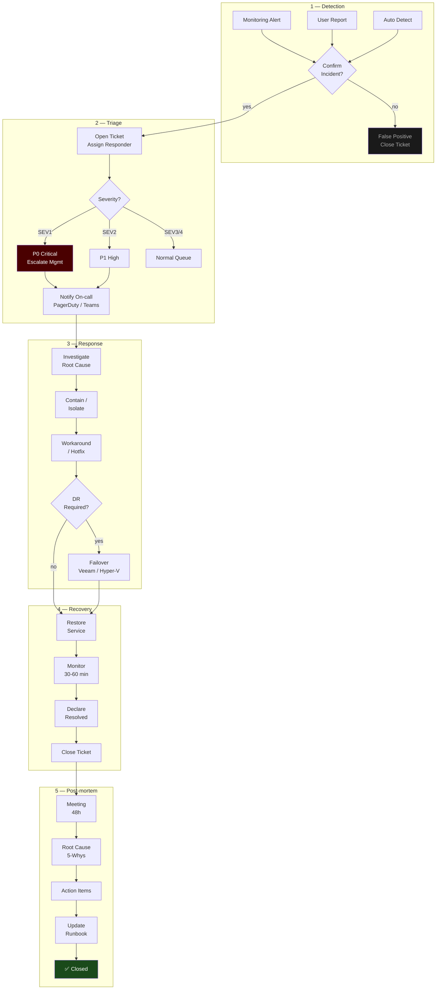

# Incident Response Process

> Incident response workflow — ตั้งแต่ detect ถึง post-mortem ใช้คู่กับ backup-architecture.md และ DR plan

## 📋 ใช้ตอนไหน

- ✅ ออกแบบ / document incident response process ให้ลูกค้า
- ✅ IT Operations ที่มี on-call rotation
- ✅ DR runbook ประกอบ backup-architecture.md
- ✅ งาน ISO 27001 / ITIL compliance
- ❌ **ไม่เหมาะกับ**: change management process (ใช้ approval-workflow.md แทน)

---

## 🎨 Pragma Style Diagram (Draw.io XML)

```xml
<mxfile host="app.diagrams.net" version="24.0.0">
  <diagram name="Incident Response — Pragma Style">
    <mxGraphModel dx="1400" dy="900" grid="0" background="#1a1a2e">
      <root>
        <mxCell id="0"/><mxCell id="1" parent="0"/>

        <mxCell id="title" value="Incident Response Process" style="text;html=1;strokeColor=none;fillColor=none;align=center;fontSize=22;fontStyle=1;fontColor=#ffffff;" vertex="1" parent="1">
          <mxGeometry x="150" y="20" width="800" height="40" as="geometry"/>
        </mxCell>

        <mxCell id="lane_det" value="1 — DETECTION" style="swimlane;horizontal=0;startSize=110;fillColor=#2d1a0e;strokeColor=#ff9800;fontColor=#ffffff;fontSize=12;fontStyle=1;html=1;" vertex="1" parent="1">
          <mxGeometry x="40" y="70" width="1100" height="110" as="geometry"/>
        </mxCell>
        <mxCell id="mon_alert" value="Monitoring Alert&#xa;Prometheus / Zabbix&#xa;Veeam ONE" style="rounded=1;whiteSpace=wrap;html=1;fillColor=#4a2700;strokeColor=#ff9800;fontColor=#ffffff;fontSize=10;" vertex="1" parent="lane_det">
          <mxGeometry x="40" y="25" width="140" height="60" as="geometry"/>
        </mxCell>
        <mxCell id="user_report" value="User Report&#xa;Helpdesk Ticket&#xa;Phone / Chat" style="rounded=1;whiteSpace=wrap;html=1;fillColor=#4a2700;strokeColor=#ff9800;fontColor=#ffffff;fontSize=10;" vertex="1" parent="lane_det">
          <mxGeometry x="230" y="25" width="140" height="60" as="geometry"/>
        </mxCell>
        <mxCell id="auto_detect" value="Auto Detection&#xa;IDS / SIEM&#xa;Log Anomaly" style="rounded=1;whiteSpace=wrap;html=1;fillColor=#4a2700;strokeColor=#ff9800;fontColor=#ffffff;fontSize=10;" vertex="1" parent="lane_det">
          <mxGeometry x="420" y="25" width="140" height="60" as="geometry"/>
        </mxCell>
        <mxCell id="detect_confirm" value="Confirm&#xa;Incident?" style="rhombus;whiteSpace=wrap;html=1;fillColor=#2d1a0e;strokeColor=#ff9800;fontColor=#ffffff;fontSize=10;" vertex="1" parent="lane_det">
          <mxGeometry x="620" y="15" width="110" height="80" as="geometry"/>
        </mxCell>
        <mxCell id="false_positive" value="False Positive&#xa;→ Close Ticket&#xa;Update Threshold" style="rounded=1;whiteSpace=wrap;html=1;fillColor=#1a1a1a;strokeColor=#424242;fontColor=#aaaaaa;fontSize=10;" vertex="1" parent="lane_det">
          <mxGeometry x="800" y="25" width="180" height="60" as="geometry"/>
        </mxCell>

        <mxCell id="lane_tri" value="2 — TRIAGE &amp; CLASSIFY" style="swimlane;horizontal=0;startSize=110;fillColor=#1a0d2b;strokeColor=#6a1b9a;fontColor=#ffffff;fontSize=12;fontStyle=1;html=1;" vertex="1" parent="1">
          <mxGeometry x="40" y="200" width="1100" height="110" as="geometry"/>
        </mxCell>
        <mxCell id="open_ticket" value="Open Incident&#xa;Ticket / War Room&#xa;Assign Responder" style="rounded=1;whiteSpace=wrap;html=1;fillColor=#4a1a6a;strokeColor=#ce93d8;fontColor=#ffffff;fontSize=10;" vertex="1" parent="lane_tri">
          <mxGeometry x="40" y="25" width="140" height="60" as="geometry"/>
        </mxCell>
        <mxCell id="severity" value="Assess&#xa;Severity" style="rhombus;whiteSpace=wrap;html=1;fillColor=#1a0d2b;strokeColor=#6a1b9a;fontColor=#ffffff;fontSize=10;" vertex="1" parent="lane_tri">
          <mxGeometry x="240" y="15" width="120" height="80" as="geometry"/>
        </mxCell>
        <mxCell id="sev1" value="SEV 1 — Critical&#xa;Production Down&#xa;→ P0 Response" style="rounded=1;whiteSpace=wrap;html=1;fillColor=#4a0000;strokeColor=#cc0000;fontColor=#ffffff;fontSize=10;" vertex="1" parent="lane_tri">
          <mxGeometry x="420" y="10" width="150" height="40" as="geometry"/>
        </mxCell>
        <mxCell id="sev2" value="SEV 2 — High&#xa;Major Feature Down&#xa;→ P1 Response" style="rounded=1;whiteSpace=wrap;html=1;fillColor=#4a2000;strokeColor=#ff6600;fontColor=#ffffff;fontSize=10;" vertex="1" parent="lane_tri">
          <mxGeometry x="420" y="55" width="150" height="40" as="geometry"/>
        </mxCell>
        <mxCell id="sev3" value="SEV 3/4 — Low&#xa;Degraded / Minor&#xa;→ Normal Queue" style="rounded=1;whiteSpace=wrap;html=1;fillColor=#1a2a1a;strokeColor=#388e3c;fontColor=#aaaaaa;fontSize=10;" vertex="1" parent="lane_tri">
          <mxGeometry x="420" y="67" width="150" height="30" as="geometry"/>
        </mxCell>
        <mxCell id="notify_team" value="Notify&#xa;On-call Team&#xa;PagerDuty / Teams" style="rounded=1;whiteSpace=wrap;html=1;fillColor=#01579b;strokeColor=#4fc3f7;fontColor=#ffffff;fontSize=10;" vertex="1" parent="lane_tri">
          <mxGeometry x="640" y="25" width="150" height="60" as="geometry"/>
        </mxCell>
        <mxCell id="escalate" value="Escalate&#xa;to Management&#xa;(SEV1 only)" style="rounded=1;whiteSpace=wrap;html=1;fillColor=#4a0000;strokeColor=#cc0000;fontColor=#ffffff;fontSize=10;" vertex="1" parent="lane_tri">
          <mxGeometry x="860" y="25" width="150" height="60" as="geometry"/>
        </mxCell>

        <mxCell id="lane_res" value="3 — RESPONSE &amp; MITIGATION" style="swimlane;horizontal=0;startSize=110;fillColor=#0d2b1a;strokeColor=#2e7d32;fontColor=#ffffff;fontSize=12;fontStyle=1;html=1;" vertex="1" parent="1">
          <mxGeometry x="40" y="330" width="1100" height="130" as="geometry"/>
        </mxCell>
        <mxCell id="investigate" value="Investigate&#xa;Root Cause&#xa;Logs / Metrics" style="rounded=1;whiteSpace=wrap;html=1;fillColor=#1a4a1a;strokeColor=#66bb6a;fontColor=#ffffff;fontSize=10;" vertex="1" parent="lane_res">
          <mxGeometry x="40" y="30" width="140" height="60" as="geometry"/>
        </mxCell>
        <mxCell id="isolate" value="Contain&#xa;Isolate Affected&#xa;System / VLAN" style="rounded=1;whiteSpace=wrap;html=1;fillColor=#1a4a1a;strokeColor=#66bb6a;fontColor=#ffffff;fontSize=10;" vertex="1" parent="lane_res">
          <mxGeometry x="230" y="30" width="140" height="60" as="geometry"/>
        </mxCell>
        <mxCell id="workaround" value="Apply&#xa;Workaround&#xa;/ Hotfix" style="rounded=1;whiteSpace=wrap;html=1;fillColor=#1a4a1a;strokeColor=#66bb6a;fontColor=#ffffff;fontSize=10;" vertex="1" parent="lane_res">
          <mxGeometry x="420" y="30" width="140" height="60" as="geometry"/>
        </mxCell>
        <mxCell id="dr_needed" value="DR&#xa;Required?" style="rhombus;whiteSpace=wrap;html=1;fillColor=#0d2b1a;strokeColor=#2e7d32;fontColor=#ffffff;fontSize=10;" vertex="1" parent="lane_res">
          <mxGeometry x="615" y="20" width="110" height="85" as="geometry"/>
        </mxCell>
        <mxCell id="failover" value="Initiate Failover&#xa;Veeam Restore&#xa;/ Hyper-V Failover" style="rounded=1;whiteSpace=wrap;html=1;fillColor=#1a1a0d;strokeColor=#f9a825;fontColor=#ffffff;fontSize=10;" vertex="1" parent="lane_res">
          <mxGeometry x="790" y="30" width="180" height="60" as="geometry"/>
        </mxCell>

        <mxCell id="lane_rec" value="4 — RECOVERY &amp; VERIFY" style="swimlane;horizontal=0;startSize=110;fillColor=#1a2a4a;strokeColor=#4a90d9;fontColor=#ffffff;fontSize=12;fontStyle=1;html=1;" vertex="1" parent="1">
          <mxGeometry x="40" y="480" width="1100" height="110" as="geometry"/>
        </mxCell>
        <mxCell id="restore" value="Restore Service&#xa;Verify Function&#xa;Health Check" style="rounded=1;whiteSpace=wrap;html=1;fillColor=#1a3a5c;strokeColor=#4a90d9;fontColor=#ffffff;fontSize=10;" vertex="1" parent="lane_rec">
          <mxGeometry x="40" y="25" width="150" height="60" as="geometry"/>
        </mxCell>
        <mxCell id="monitor_rec" value="Monitor&#xa;30-60 min&#xa;Stability Check" style="rounded=1;whiteSpace=wrap;html=1;fillColor=#1a3a5c;strokeColor=#4a90d9;fontColor=#ffffff;fontSize=10;" vertex="1" parent="lane_rec">
          <mxGeometry x="250" y="25" width="150" height="60" as="geometry"/>
        </mxCell>
        <mxCell id="resolved" value="Declare&#xa;Resolved&#xa;Notify Users" style="rounded=1;whiteSpace=wrap;html=1;fillColor=#1a4a1a;strokeColor=#66bb6a;fontColor=#ffffff;fontSize=10;" vertex="1" parent="lane_rec">
          <mxGeometry x="460" y="25" width="150" height="60" as="geometry"/>
        </mxCell>
        <mxCell id="close_ticket" value="Close Ticket&#xa;Record RTO/RPO&#xa;Timeline" style="rounded=1;whiteSpace=wrap;html=1;fillColor=#1a3a5c;strokeColor=#4a90d9;fontColor=#ffffff;fontSize=10;" vertex="1" parent="lane_rec">
          <mxGeometry x="670" y="25" width="150" height="60" as="geometry"/>
        </mxCell>

        <mxCell id="lane_pm" value="5 — POST-MORTEM" style="swimlane;horizontal=0;startSize=110;fillColor=#0d1f2b;strokeColor=#0288d1;fontColor=#ffffff;fontSize=12;fontStyle=1;html=1;" vertex="1" parent="1">
          <mxGeometry x="40" y="610" width="1100" height="110" as="geometry"/>
        </mxCell>
        <mxCell id="pm_meeting" value="Post-mortem&#xa;Meeting&#xa;Within 48h" style="rounded=1;whiteSpace=wrap;html=1;fillColor=#01579b;strokeColor=#4fc3f7;fontColor=#ffffff;fontSize=10;" vertex="1" parent="lane_pm">
          <mxGeometry x="40" y="25" width="150" height="60" as="geometry"/>
        </mxCell>
        <mxCell id="root_cause" value="Document&#xa;Root Cause&#xa;5-Whys" style="rounded=1;whiteSpace=wrap;html=1;fillColor=#01579b;strokeColor=#4fc3f7;fontColor=#ffffff;fontSize=10;" vertex="1" parent="lane_pm">
          <mxGeometry x="250" y="25" width="150" height="60" as="geometry"/>
        </mxCell>
        <mxCell id="action_items" value="Action Items&#xa;Prevent Recurrence&#xa;Owner + Deadline" style="rounded=1;whiteSpace=wrap;html=1;fillColor=#01579b;strokeColor=#4fc3f7;fontColor=#ffffff;fontSize=10;" vertex="1" parent="lane_pm">
          <mxGeometry x="460" y="25" width="150" height="60" as="geometry"/>
        </mxCell>
        <mxCell id="update_runbook" value="Update&#xa;Runbook / Docs&#xa;KB Article" style="rounded=1;whiteSpace=wrap;html=1;fillColor=#01579b;strokeColor=#4fc3f7;fontColor=#ffffff;fontSize=10;" vertex="1" parent="lane_pm">
          <mxGeometry x="670" y="25" width="150" height="60" as="geometry"/>
        </mxCell>
        <mxCell id="pm_done" value="✅ Closed" style="shape=mxgraph.flowchart.terminate;fillColor=#1a4a1a;strokeColor=#66bb6a;fontColor=#ffffff;fontSize=11;fontStyle=1;whiteSpace=wrap;html=1;" vertex="1" parent="lane_pm">
          <mxGeometry x="890" y="30" width="120" height="50" as="geometry"/>
        </mxCell>

        <mxCell id="e1" value="" style="edgeStyle=orthogonalEdgeStyle;rounded=1;html=1;strokeColor=#ff9800;strokeWidth=2;" edge="1" parent="lane_det" source="mon_alert" target="detect_confirm"><mxGeometry relative="1" as="geometry"/></mxCell>
        <mxCell id="e2" value="" style="edgeStyle=orthogonalEdgeStyle;rounded=1;html=1;strokeColor=#ff9800;strokeWidth=2;" edge="1" parent="lane_det" source="user_report" target="detect_confirm"><mxGeometry relative="1" as="geometry"/></mxCell>
        <mxCell id="e3" value="" style="edgeStyle=orthogonalEdgeStyle;rounded=1;html=1;strokeColor=#ff9800;strokeWidth=2;" edge="1" parent="lane_det" source="auto_detect" target="detect_confirm"><mxGeometry relative="1" as="geometry"/></mxCell>
        <mxCell id="e4" value="no" style="edgeStyle=orthogonalEdgeStyle;rounded=1;html=1;strokeColor=#aaaaaa;strokeWidth=2;fontColor=#aaaaaa;fontSize=9;" edge="1" parent="lane_det" source="detect_confirm" target="false_positive"><mxGeometry relative="1" as="geometry"/></mxCell>
        <mxCell id="e5" value="yes" style="edgeStyle=orthogonalEdgeStyle;rounded=1;html=1;strokeColor=#6a1b9a;strokeWidth=2;fontColor=#ce93d8;fontSize=9;" edge="1" parent="1" source="detect_confirm" target="open_ticket"><mxGeometry relative="1" as="geometry"/></mxCell>
        <mxCell id="e6" value="" style="edgeStyle=orthogonalEdgeStyle;rounded=1;html=1;strokeColor=#6a1b9a;strokeWidth=2;" edge="1" parent="lane_tri" source="open_ticket" target="severity"><mxGeometry relative="1" as="geometry"/></mxCell>
        <mxCell id="e7" value="" style="edgeStyle=orthogonalEdgeStyle;rounded=1;html=1;strokeColor=#6a1b9a;strokeWidth=2;" edge="1" parent="lane_tri" source="severity" target="notify_team"><mxGeometry relative="1" as="geometry"/></mxCell>
        <mxCell id="e8" value="SEV1" style="edgeStyle=orthogonalEdgeStyle;rounded=1;html=1;strokeColor=#cc0000;strokeWidth=2;fontColor=#ff5555;fontSize=9;" edge="1" parent="lane_tri" source="notify_team" target="escalate"><mxGeometry relative="1" as="geometry"/></mxCell>
        <mxCell id="e9" value="" style="edgeStyle=orthogonalEdgeStyle;rounded=1;html=1;strokeColor=#2e7d32;strokeWidth=2;" edge="1" parent="1" source="notify_team" target="investigate"><mxGeometry relative="1" as="geometry"/></mxCell>
        <mxCell id="e10" value="" style="edgeStyle=orthogonalEdgeStyle;rounded=1;html=1;strokeColor=#2e7d32;strokeWidth=2;" edge="1" parent="lane_res" source="investigate" target="isolate"><mxGeometry relative="1" as="geometry"/></mxCell>
        <mxCell id="e11" value="" style="edgeStyle=orthogonalEdgeStyle;rounded=1;html=1;strokeColor=#2e7d32;strokeWidth=2;" edge="1" parent="lane_res" source="isolate" target="workaround"><mxGeometry relative="1" as="geometry"/></mxCell>
        <mxCell id="e12" value="" style="edgeStyle=orthogonalEdgeStyle;rounded=1;html=1;strokeColor=#2e7d32;strokeWidth=2;" edge="1" parent="lane_res" source="workaround" target="dr_needed"><mxGeometry relative="1" as="geometry"/></mxCell>
        <mxCell id="e13" value="yes" style="edgeStyle=orthogonalEdgeStyle;rounded=1;html=1;strokeColor=#f9a825;strokeWidth=2;fontColor=#f9a825;fontSize=9;" edge="1" parent="lane_res" source="dr_needed" target="failover"><mxGeometry relative="1" as="geometry"/></mxCell>
        <mxCell id="e14" value="no" style="edgeStyle=orthogonalEdgeStyle;rounded=1;html=1;strokeColor=#4a90d9;strokeWidth=2;fontColor=#90caf9;fontSize=9;" edge="1" parent="1" source="dr_needed" target="restore"><mxGeometry relative="1" as="geometry"/></mxCell>
        <mxCell id="e15" value="" style="edgeStyle=orthogonalEdgeStyle;rounded=1;html=1;strokeColor=#4a90d9;strokeWidth=2;" edge="1" parent="1" source="failover" target="restore"><mxGeometry relative="1" as="geometry"/></mxCell>
        <mxCell id="e16" value="" style="edgeStyle=orthogonalEdgeStyle;rounded=1;html=1;strokeColor=#4a90d9;strokeWidth=2;" edge="1" parent="lane_rec" source="restore" target="monitor_rec"><mxGeometry relative="1" as="geometry"/></mxCell>
        <mxCell id="e17" value="" style="edgeStyle=orthogonalEdgeStyle;rounded=1;html=1;strokeColor=#4a90d9;strokeWidth=2;" edge="1" parent="lane_rec" source="monitor_rec" target="resolved"><mxGeometry relative="1" as="geometry"/></mxCell>
        <mxCell id="e18" value="" style="edgeStyle=orthogonalEdgeStyle;rounded=1;html=1;strokeColor=#4a90d9;strokeWidth=2;" edge="1" parent="lane_rec" source="resolved" target="close_ticket"><mxGeometry relative="1" as="geometry"/></mxCell>
        <mxCell id="e19" value="" style="edgeStyle=orthogonalEdgeStyle;rounded=1;html=1;strokeColor=#0288d1;strokeWidth=2;" edge="1" parent="1" source="close_ticket" target="pm_meeting"><mxGeometry relative="1" as="geometry"/></mxCell>
        <mxCell id="e20" value="" style="edgeStyle=orthogonalEdgeStyle;rounded=1;html=1;strokeColor=#0288d1;strokeWidth=2;" edge="1" parent="lane_pm" source="pm_meeting" target="root_cause"><mxGeometry relative="1" as="geometry"/></mxCell>
        <mxCell id="e21" value="" style="edgeStyle=orthogonalEdgeStyle;rounded=1;html=1;strokeColor=#0288d1;strokeWidth=2;" edge="1" parent="lane_pm" source="root_cause" target="action_items"><mxGeometry relative="1" as="geometry"/></mxCell>
        <mxCell id="e22" value="" style="edgeStyle=orthogonalEdgeStyle;rounded=1;html=1;strokeColor=#0288d1;strokeWidth=2;" edge="1" parent="lane_pm" source="action_items" target="update_runbook"><mxGeometry relative="1" as="geometry"/></mxCell>
        <mxCell id="e23" value="" style="edgeStyle=orthogonalEdgeStyle;rounded=1;html=1;strokeColor=#66bb6a;strokeWidth=2;" edge="1" parent="lane_pm" source="update_runbook" target="pm_done"><mxGeometry relative="1" as="geometry"/></mxCell>

      </root>
    </mxGraphModel>
  </diagram>
</mxfile>
```

---

## 🌊 Mermaid Template



---

## 💡 Prompt ตัวอย่าง

### แบบ A: IT Operations มาตรฐาน
```
ช่วยหา template incident-response.md จาก
github.com/nutbadbot/diagram-templates
ปรับสำหรับ [ชื่อองค์กร]:
- Monitoring: [Zabbix / Prometheus / Veeam ONE]
- Ticketing: [ServiceNow / Jira / Freshdesk]
- Alert channel: [Teams / Slack / PagerDuty]
- On-call team: [รายชื่อ / shift]
- SLA: SEV1=[X]min, SEV2=[Y]min
- DR tool: [Veeam / Hyper-V Failover]
```

### แบบ B: NFI DR Scenario
```
ช่วยหา template incident-response.md จาก
github.com/nutbadbot/diagram-templates
ปรับสำหรับ NFI:
- Detection: Veeam ONE + Teams alert
- Severity: SEV1 = File server down, SEV2 = Backup fail
- DR: Hyper-V Failover Cluster (NFI-HVC01/02)
- Restore: Veeam B&R จาก MD3820
- Notify: Teams channel "CRI Commvault backup Phase 2"
- RTO target: 4 ชั่วโมง
- RPO target: 24 ชั่วโมง
```

---

## 🔧 Parameters ที่ปรับได้

| Parameter | Default | ทางเลือก |
|---|---|---|
| Severity levels | SEV1-4 | P0-P4, Critical/High/Medium/Low |
| Ticketing | ServiceNow | Jira, Freshdesk, Zendesk |
| Alert | PagerDuty | Teams, Slack, OpsGenie |
| DR tool | Veeam + Hyper-V | VMware SRM, Zerto |
| Post-mortem | 48h | 24h (SEV1), 1 week (SEV3/4) |

---

## 📌 Notes สำหรับ SI / Admin

- **RTO/RPO**: กำหนดให้ชัดก่อน — ส่งผลต่อ DR tool และ backup frequency ที่ต้องการ
- **War Room**: SEV1 ควรมี dedicated channel (Teams/Slack) ทันที ไม่ใช้ email
- **Post-mortem**: ไม่ใช่การหาคนผิด — เป้าหมายคือป้องกันซ้ำ
- **Runbook**: เชื่อมโยงกับ backup-architecture.md และ hyper-v-failover-cluster.md
- **5-Whys**: ถามทำไมซ้ำ 5 ครั้งจาก symptom → root cause จริง

### Related Templates
- Backup & DR → `backup-architecture.md`
- Hyper-V Failover → `hyper-v-failover-cluster.md`
- VLAN isolation → `vlan-segmentation.md`

**อัพเดตล่าสุด**: 2026-05-07 — initial template
