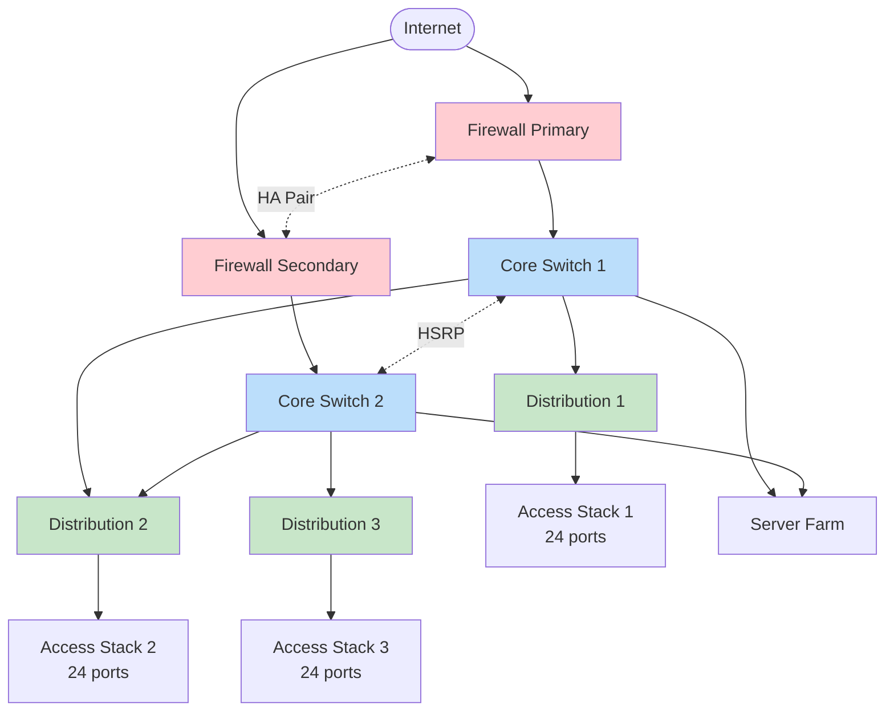

# 3-Tier Data Center Network

> Network topology มาตรฐานสำหรับ Data Center แบบ 3-tier (Core / Distribution / Access)

## 📋 ใช้ตอนไหน

- ✅ Enterprise data center 100-1000 users
- ✅ ต้องการ HA (redundant)
- ✅ ใช้กับ Cisco Catalyst หรือ Nexus series
- ❌ **ไม่เหมาะกับ**: SMB < 50 users (overkill), Spine-Leaf architecture

---

## 🖼️ Preview

```
         Internet
            │
      [Firewall HA Pair]
            │
    ┌───────┴───────┐
    │ Core Switch 1 │─┐
    └───────┬───────┘ │
            │         │  (HSRP/VRRP)
    ┌───────┴───────┐ │
    │ Core Switch 2 │─┘
    └───────┬───────┘
            │
   ┌────────┼────────┐
   │        │        │
 [Dist1] [Dist2] [Dist3]
   │        │        │
  [Acc1]  [Acc2]  [Acc3]
```

---

## 🌊 Mermaid Template



---

## 📝 Draw.io XML Template

```xml
<mxfile host="app.diagrams.net" modified="2026-04-24T00:00:00.000Z" version="24.0.0">
  <diagram name="3-Tier DC" id="three-tier">
    <mxGraphModel dx="1200" dy="800" grid="1" gridSize="10" guides="1" tooltips="1" connect="1" arrows="1" fold="1" page="1" pageScale="1" pageWidth="1200" pageHeight="900">
      <root>
        <mxCell id="0" />
        <mxCell id="1" parent="0" />
        <mxCell id="internet" value="Internet" style="ellipse;whiteSpace=wrap;html=1;fillColor=#dae8fc;strokeColor=#6c8ebf;" vertex="1" parent="1">
          <mxGeometry x="540" y="40" width="120" height="60" as="geometry" />
        </mxCell>
        <mxCell id="fw1" value="Firewall&#10;(Primary)" style="shape=mscae/Firewall;html=1;fillColor=#f8cecc;strokeColor=#b85450;whiteSpace=wrap;" vertex="1" parent="1">
          <mxGeometry x="440" y="160" width="120" height="60" as="geometry" />
        </mxCell>
        <mxCell id="fw2" value="Firewall&#10;(Secondary)" style="shape=mscae/Firewall;html=1;fillColor=#f8cecc;strokeColor=#b85450;whiteSpace=wrap;" vertex="1" parent="1">
          <mxGeometry x="640" y="160" width="120" height="60" as="geometry" />
        </mxCell>
        <mxCell id="core1" value="Core Switch 1&#10;(Cisco Nexus 9500)" style="rounded=1;whiteSpace=wrap;html=1;fillColor=#dae8fc;strokeColor=#6c8ebf;" vertex="1" parent="1">
          <mxGeometry x="440" y="280" width="140" height="60" as="geometry" />
        </mxCell>
        <mxCell id="core2" value="Core Switch 2&#10;(Cisco Nexus 9500)" style="rounded=1;whiteSpace=wrap;html=1;fillColor=#dae8fc;strokeColor=#6c8ebf;" vertex="1" parent="1">
          <mxGeometry x="640" y="280" width="140" height="60" as="geometry" />
        </mxCell>
        <mxCell id="dist1" value="Distribution 1&#10;(Cisco Catalyst 9500)" style="rounded=1;whiteSpace=wrap;html=1;fillColor=#d5e8d4;strokeColor=#82b366;" vertex="1" parent="1">
          <mxGeometry x="240" y="420" width="140" height="60" as="geometry" />
        </mxCell>
        <mxCell id="dist2" value="Distribution 2&#10;(Cisco Catalyst 9500)" style="rounded=1;whiteSpace=wrap;html=1;fillColor=#d5e8d4;strokeColor=#82b366;" vertex="1" parent="1">
          <mxGeometry x="540" y="420" width="140" height="60" as="geometry" />
        </mxCell>
        <mxCell id="dist3" value="Distribution 3&#10;(Cisco Catalyst 9500)" style="rounded=1;whiteSpace=wrap;html=1;fillColor=#d5e8d4;strokeColor=#82b366;" vertex="1" parent="1">
          <mxGeometry x="840" y="420" width="140" height="60" as="geometry" />
        </mxCell>
        <mxCell id="acc1" value="Access Stack 1&#10;Floor 1 - 24 ports" style="rounded=1;whiteSpace=wrap;html=1;fillColor=#fff2cc;strokeColor=#d6b656;" vertex="1" parent="1">
          <mxGeometry x="240" y="560" width="140" height="60" as="geometry" />
        </mxCell>
        <mxCell id="acc2" value="Access Stack 2&#10;Floor 2 - 24 ports" style="rounded=1;whiteSpace=wrap;html=1;fillColor=#fff2cc;strokeColor=#d6b656;" vertex="1" parent="1">
          <mxGeometry x="540" y="560" width="140" height="60" as="geometry" />
        </mxCell>
        <mxCell id="acc3" value="Access Stack 3&#10;Floor 3 - 24 ports" style="rounded=1;whiteSpace=wrap;html=1;fillColor=#fff2cc;strokeColor=#d6b656;" vertex="1" parent="1">
          <mxGeometry x="840" y="560" width="140" height="60" as="geometry" />
        </mxCell>
        <mxCell id="e1" style="edgeStyle=orthogonalEdgeStyle;rounded=1;html=1;" edge="1" parent="1" source="internet" target="fw1">
          <mxGeometry relative="1" as="geometry" />
        </mxCell>
        <mxCell id="e2" style="edgeStyle=orthogonalEdgeStyle;rounded=1;html=1;" edge="1" parent="1" source="internet" target="fw2">
          <mxGeometry relative="1" as="geometry" />
        </mxCell>
        <mxCell id="e3" value="HA" style="edgeStyle=orthogonalEdgeStyle;rounded=1;html=1;dashed=1;" edge="1" parent="1" source="fw1" target="fw2">
          <mxGeometry relative="1" as="geometry" />
        </mxCell>
        <mxCell id="e4" style="edgeStyle=orthogonalEdgeStyle;rounded=1;html=1;" edge="1" parent="1" source="fw1" target="core1">
          <mxGeometry relative="1" as="geometry" />
        </mxCell>
        <mxCell id="e5" style="edgeStyle=orthogonalEdgeStyle;rounded=1;html=1;" edge="1" parent="1" source="fw2" target="core2">
          <mxGeometry relative="1" as="geometry" />
        </mxCell>
        <mxCell id="e6" value="HSRP" style="edgeStyle=orthogonalEdgeStyle;rounded=1;html=1;dashed=1;" edge="1" parent="1" source="core1" target="core2">
          <mxGeometry relative="1" as="geometry" />
        </mxCell>
        <mxCell id="e7" style="edgeStyle=orthogonalEdgeStyle;rounded=1;html=1;" edge="1" parent="1" source="core1" target="dist1">
          <mxGeometry relative="1" as="geometry" />
        </mxCell>
        <mxCell id="e8" style="edgeStyle=orthogonalEdgeStyle;rounded=1;html=1;" edge="1" parent="1" source="core1" target="dist2">
          <mxGeometry relative="1" as="geometry" />
        </mxCell>
        <mxCell id="e9" style="edgeStyle=orthogonalEdgeStyle;rounded=1;html=1;" edge="1" parent="1" source="core2" target="dist2">
          <mxGeometry relative="1" as="geometry" />
        </mxCell>
        <mxCell id="e10" style="edgeStyle=orthogonalEdgeStyle;rounded=1;html=1;" edge="1" parent="1" source="core2" target="dist3">
          <mxGeometry relative="1" as="geometry" />
        </mxCell>
        <mxCell id="e11" style="edgeStyle=orthogonalEdgeStyle;rounded=1;html=1;" edge="1" parent="1" source="dist1" target="acc1">
          <mxGeometry relative="1" as="geometry" />
        </mxCell>
        <mxCell id="e12" style="edgeStyle=orthogonalEdgeStyle;rounded=1;html=1;" edge="1" parent="1" source="dist2" target="acc2">
          <mxGeometry relative="1" as="geometry" />
        </mxCell>
        <mxCell id="e13" style="edgeStyle=orthogonalEdgeStyle;rounded=1;html=1;" edge="1" parent="1" source="dist3" target="acc3">
          <mxGeometry relative="1" as="geometry" />
        </mxCell>
      </root>
    </mxGraphModel>
  </diagram>
</mxfile>
```

---

## 💡 Prompt ตัวอย่าง

### แบบ A: สร้างจาก template

```
ใช้ template 3-tier-data-center.md ของทีม
ช่วยปรับให้เป็น network ของลูกค้า [ชื่อลูกค้า]:
- สถานที่: [ที่ตั้ง]
- ขนาด: [จำนวน users/ports]
- Vendor: [Cisco/Juniper/HP]
- Redundancy: [full HA / partial / none]
- พิเศษ: [requirements อื่นๆ]
```

### แบบ B: Scale up

```
ขยาย template 3-tier นี้ให้เป็น:
- เพิ่ม Distribution layer เป็น 6 ตัว
- Access layer 18 ตัว (6 ต่อ Distribution)
- เพิ่ม Server Farm แยก 2 zones (Production / DMZ)
- ใส่ OOB management network
```

### แบบ C: Simplify

```
ลด template 3-tier นี้เป็น 2-tier (Collapsed Core):
- รวม Core กับ Distribution เป็น layer เดียว
- คง Access layer เดิม
- คง redundancy
```

---

## 🔧 Parameters ที่ควรปรับ

| Parameter | Default ใน template | ทางเลือก |
|---|---|---|
| Firewall vendor | Cisco Firepower | Fortinet, Palo Alto, Check Point |
| Core switches | 2 (HA) | 2-4 |
| Distribution | 3 | ขยายได้ตาม floors/zones |
| Access stack | 24 ports | 48 ports |
| Uplink | ไม่ระบุ | 10G / 25G / 40G / 100G |

---

## 📌 Notes

- Template นี้เน้น **physical topology** — ไม่รวม VLAN design
- สำหรับ VLAN design ใช้ template `vlan-segmentation.md` เพิ่ม
- ถ้าต้องการ Spine-Leaf (modern DC) ใช้ template `spine-leaf-fabric.md` แทน
- ตรวจสอบว่า core switches รองรับ [vPC](https://www.cisco.com/) หรือ MC-LAG
