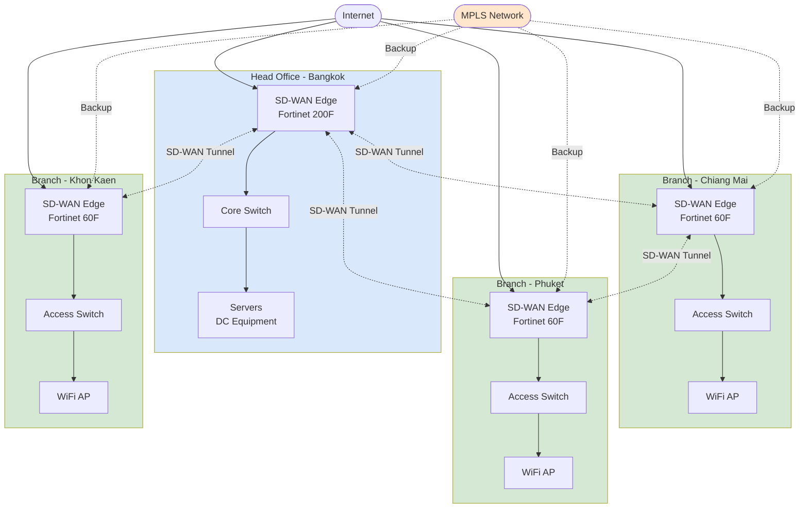

# SD-WAN Multi-Site Network

> SD-WAN topology สำหรับองค์กรที่มีหลาย site — HQ + Branches เชื่อมด้วย SD-WAN + MPLS backup

## 📋 ใช้ตอนไหน

- ✅ องค์กรที่มี 2+ sites (HQ + branches)
- ✅ ต้องการ internet breakout ที่แต่ละ site
- ✅ ต้องการ MPLS เป็น backup/secondary link
- ✅ ต้องการ centralized management
- ✅ Vendor: Cisco Viptela, Fortinet SD-WAN, VMware VeloCloud, Silver Peak
- ❌ **ไม่เหมาะกับ**: Single site, งบไม่มี (ใช้ VPN over Internet แทน)

---

## 🖼️ Preview

```
         [Internet]
             │
    ┌────────┼────────┐
    │        │        │
  [HQ]   [Branch1] [Branch2]
    │        │        │
    └────[MPLS]───────┘
```

---

## 🌊 Mermaid Template



---

## 📝 Draw.io XML Template

```xml
<mxfile host="app.diagrams.net" modified="2026-04-24T00:00:00.000Z" version="24.0.0">
  <diagram name="SD-WAN Multi-Site" id="sdwan-multisite">
    <mxGraphModel dx="1400" dy="900" grid="1" gridSize="10" guides="1" tooltips="1" connect="1" arrows="1" fold="1" page="1" pageScale="1" pageWidth="1600" pageHeight="1000">
      <root>
        <mxCell id="0" />
        <mxCell id="1" parent="0" />
        
        <mxCell id="inet" value="Internet" style="ellipse;whiteSpace=wrap;html=1;fillColor=#dae8fc;strokeColor=#6c8ebf;" vertex="1" parent="1">
          <mxGeometry x="720" y="40" width="160" height="80" as="geometry" />
        </mxCell>
        
        <mxCell id="mpls" value="MPLS Network&#10;(Backup)" style="ellipse;whiteSpace=wrap;html=1;fillColor=#ffe6cc;strokeColor=#d79b00;dashed=1;" vertex="1" parent="1">
          <mxGeometry x="720" y="800" width="160" height="80" as="geometry" />
        </mxCell>
        
        <mxCell id="hq_container" value="HQ - Bangkok" style="swimlane;startSize=30;fillColor=#dae8fc;strokeColor=#6c8ebf;html=1;" vertex="1" parent="1">
          <mxGeometry x="40" y="180" width="280" height="280" as="geometry" />
        </mxCell>
        <mxCell id="hq_fw" value="SD-WAN Edge&#10;Fortinet 200F" style="rounded=1;whiteSpace=wrap;html=1;fillColor=#f8cecc;strokeColor=#b85450;" vertex="1" parent="hq_container">
          <mxGeometry x="70" y="50" width="140" height="60" as="geometry" />
        </mxCell>
        <mxCell id="hq_core" value="Core Switch" style="rounded=1;whiteSpace=wrap;html=1;" vertex="1" parent="hq_container">
          <mxGeometry x="70" y="140" width="140" height="60" as="geometry" />
        </mxCell>
        <mxCell id="hq_srv" value="Servers&#10;DC Equipment" style="shape=cylinder3;whiteSpace=wrap;html=1;fillColor=#fff2cc;strokeColor=#d6b656;" vertex="1" parent="hq_container">
          <mxGeometry x="70" y="220" width="140" height="50" as="geometry" />
        </mxCell>
        
        <mxCell id="br1_container" value="Branch - Chiang Mai" style="swimlane;startSize=30;fillColor=#d5e8d4;strokeColor=#82b366;html=1;" vertex="1" parent="1">
          <mxGeometry x="400" y="180" width="280" height="240" as="geometry" />
        </mxCell>
        <mxCell id="br1_fw" value="SD-WAN Edge&#10;Fortinet 60F" style="rounded=1;whiteSpace=wrap;html=1;fillColor=#f8cecc;strokeColor=#b85450;" vertex="1" parent="br1_container">
          <mxGeometry x="70" y="50" width="140" height="60" as="geometry" />
        </mxCell>
        <mxCell id="br1_sw" value="Access Switch" style="rounded=1;whiteSpace=wrap;html=1;" vertex="1" parent="br1_container">
          <mxGeometry x="70" y="140" width="140" height="60" as="geometry" />
        </mxCell>
        
        <mxCell id="br2_container" value="Branch - Phuket" style="swimlane;startSize=30;fillColor=#d5e8d4;strokeColor=#82b366;html=1;" vertex="1" parent="1">
          <mxGeometry x="760" y="180" width="280" height="240" as="geometry" />
        </mxCell>
        <mxCell id="br2_fw" value="SD-WAN Edge&#10;Fortinet 60F" style="rounded=1;whiteSpace=wrap;html=1;fillColor=#f8cecc;strokeColor=#b85450;" vertex="1" parent="br2_container">
          <mxGeometry x="70" y="50" width="140" height="60" as="geometry" />
        </mxCell>
        <mxCell id="br2_sw" value="Access Switch" style="rounded=1;whiteSpace=wrap;html=1;" vertex="1" parent="br2_container">
          <mxGeometry x="70" y="140" width="140" height="60" as="geometry" />
        </mxCell>
        
        <mxCell id="br3_container" value="Branch - Khon Kaen" style="swimlane;startSize=30;fillColor=#d5e8d4;strokeColor=#82b366;html=1;" vertex="1" parent="1">
          <mxGeometry x="1120" y="180" width="280" height="240" as="geometry" />
        </mxCell>
        <mxCell id="br3_fw" value="SD-WAN Edge&#10;Fortinet 60F" style="rounded=1;whiteSpace=wrap;html=1;fillColor=#f8cecc;strokeColor=#b85450;" vertex="1" parent="br3_container">
          <mxGeometry x="70" y="50" width="140" height="60" as="geometry" />
        </mxCell>
        <mxCell id="br3_sw" value="Access Switch" style="rounded=1;whiteSpace=wrap;html=1;" vertex="1" parent="br3_container">
          <mxGeometry x="70" y="140" width="140" height="60" as="geometry" />
        </mxCell>
        
        <mxCell id="e_inet_hq" style="edgeStyle=orthogonalEdgeStyle;rounded=1;html=1;" edge="1" parent="1" source="inet" target="hq_fw">
          <mxGeometry relative="1" as="geometry" />
        </mxCell>
        <mxCell id="e_inet_br1" style="edgeStyle=orthogonalEdgeStyle;rounded=1;html=1;" edge="1" parent="1" source="inet" target="br1_fw">
          <mxGeometry relative="1" as="geometry" />
        </mxCell>
        <mxCell id="e_inet_br2" style="edgeStyle=orthogonalEdgeStyle;rounded=1;html=1;" edge="1" parent="1" source="inet" target="br2_fw">
          <mxGeometry relative="1" as="geometry" />
        </mxCell>
        <mxCell id="e_inet_br3" style="edgeStyle=orthogonalEdgeStyle;rounded=1;html=1;" edge="1" parent="1" source="inet" target="br3_fw">
          <mxGeometry relative="1" as="geometry" />
        </mxCell>
        
        <mxCell id="e_mpls_hq" value="Backup" style="edgeStyle=orthogonalEdgeStyle;rounded=1;html=1;dashed=1;" edge="1" parent="1" source="mpls" target="hq_fw">
          <mxGeometry relative="1" as="geometry" />
        </mxCell>
        <mxCell id="e_mpls_br1" value="Backup" style="edgeStyle=orthogonalEdgeStyle;rounded=1;html=1;dashed=1;" edge="1" parent="1" source="mpls" target="br1_fw">
          <mxGeometry relative="1" as="geometry" />
        </mxCell>
        <mxCell id="e_mpls_br2" value="Backup" style="edgeStyle=orthogonalEdgeStyle;rounded=1;html=1;dashed=1;" edge="1" parent="1" source="mpls" target="br2_fw">
          <mxGeometry relative="1" as="geometry" />
        </mxCell>
        <mxCell id="e_mpls_br3" value="Backup" style="edgeStyle=orthogonalEdgeStyle;rounded=1;html=1;dashed=1;" edge="1" parent="1" source="mpls" target="br3_fw">
          <mxGeometry relative="1" as="geometry" />
        </mxCell>
        
        <mxCell id="e_hq_core" style="edgeStyle=orthogonalEdgeStyle;rounded=1;html=1;" edge="1" parent="1" source="hq_fw" target="hq_core">
          <mxGeometry relative="1" as="geometry" />
        </mxCell>
        <mxCell id="e_core_srv" style="edgeStyle=orthogonalEdgeStyle;rounded=1;html=1;" edge="1" parent="1" source="hq_core" target="hq_srv">
          <mxGeometry relative="1" as="geometry" />
        </mxCell>
        
        <mxCell id="e_br1_sw" style="edgeStyle=orthogonalEdgeStyle;rounded=1;html=1;" edge="1" parent="1" source="br1_fw" target="br1_sw">
          <mxGeometry relative="1" as="geometry" />
        </mxCell>
        <mxCell id="e_br2_sw" style="edgeStyle=orthogonalEdgeStyle;rounded=1;html=1;" edge="1" parent="1" source="br2_fw" target="br2_sw">
          <mxGeometry relative="1" as="geometry" />
        </mxCell>
        <mxCell id="e_br3_sw" style="edgeStyle=orthogonalEdgeStyle;rounded=1;html=1;" edge="1" parent="1" source="br3_fw" target="br3_sw">
          <mxGeometry relative="1" as="geometry" />
        </mxCell>
        
        <mxCell id="e_tunnel_hq_br1" value="SD-WAN Tunnel" style="edgeStyle=orthogonalEdgeStyle;rounded=1;html=1;dashed=1;strokeColor=#0000ff;" edge="1" parent="1" source="hq_fw" target="br1_fw">
          <mxGeometry relative="1" as="geometry" />
        </mxCell>
        <mxCell id="e_tunnel_hq_br2" value="SD-WAN Tunnel" style="edgeStyle=orthogonalEdgeStyle;rounded=1;html=1;dashed=1;strokeColor=#0000ff;" edge="1" parent="1" source="hq_fw" target="br2_fw">
          <mxGeometry relative="1" as="geometry" />
        </mxCell>
        <mxCell id="e_tunnel_hq_br3" value="SD-WAN Tunnel" style="edgeStyle=orthogonalEdgeStyle;rounded=1;html=1;dashed=1;strokeColor=#0000ff;" edge="1" parent="1" source="hq_fw" target="br3_fw">
          <mxGeometry relative="1" as="geometry" />
        </mxCell>
      </root>
    </mxGraphModel>
  </diagram>
</mxfile>
```

---

## 💡 Prompt ตัวอย่าง

### แบบ A: ใช้ template นี้เป็นพื้นฐาน

```
ใช้ template sd-wan-multi-site.md
ปรับเป็น network ของบริษัท [ชื่อบริษัท]:
- HQ: [ที่ตั้ง]
- Branches: [จำนวน + ที่ตั้ง]
- SD-WAN Vendor: [Cisco/Fortinet/VMware/Silver Peak]
- MPLS Provider: [ผู้ให้บริการ]
- Internet bandwidth: HQ [xxx Mbps], Branches [xxx Mbps]
- ต้องการ: [traffic steering rules / application optimization / ...]
```

### แบบ B: เพิ่ม/ลด sites

```
ใช้ template sd-wan-multi-site.md
แต่เพิ่ม branches เป็น 8 sites
แบ่งเป็น:
- Region 1: 3 branches
- Region 2: 3 branches  
- Region 3: 2 branches
แสดง regional hub ด้วย
```

### แบบ C: เพิ่ม security zones

```
ใช้ template sd-wan-multi-site.md
เพิ่ม security zones ที่แต่ละ site:
- Guest WiFi zone (isolated)
- IoT/CCTV zone
- Corporate zone
แสดง VLAN segmentation
```

---

## 🔧 Parameters ที่ควรปรับ

| Parameter | Default ใน template | ทางเลือก |
|---|---|---|
| จำนวน sites | 4 (HQ + 3 branches) | 2-50+ |
| SD-WAN vendor | Fortinet | Cisco Viptela, VMware VeloCloud, Silver Peak, Versa |
| Primary link | Internet | Dedicated line, Fiber |
| Secondary link | MPLS | 4G/5G LTE, Secondary ISP |
| Traffic steering | Basic | Application-aware, QoS policies |
| Hub topology | Single hub (HQ) | Dual hub, Regional hubs, Full mesh |

---

## 📌 Notes

### ข้อดีของ SD-WAN
- **Flexibility**: ใช้ internet ธรรมดาได้ (ถูกกว่า MPLS)
- **Performance**: Application-aware routing
- **Redundancy**: Multiple links failover อัตโนมัติ
- **Centralized management**: จัดการจากจุดเดียว

### ข้อควรพิจารณา
- **Security**: ต้องมี encryption (IPsec/GRE over Internet)
- **QoS**: ต้อง config traffic prioritization (VoIP, critical apps)
- **Bandwidth**: วางแผน capacity ของแต่ละ link
- **Vendor lock-in**: ทุก site ต้องใช้ vendor เดียวกัน

### เทียบกับ Traditional MPLS
| | SD-WAN | Traditional MPLS |
|---|---|---|
| ราคา | ถูกกว่า 50-70% | แพง |
| Deployment time | เร็ว (1-2 สัปดาห์) | ช้า (1-3 เดือน) |
| Flexibility | สูง | ต่ำ |
| Management | Centralized GUI | Site-by-site CLI |

### สำหรับ SI
- ถ้าลูกค้ามี MPLS อยู่แล้ว → SD-WAN overlay บน MPLS
- ถ้าลูกค้าเริ่มใหม่ → SD-WAN + Dual ISP (ไม่ต้อง MPLS)
- ถ้าลูกค้ามีงบจำกัด → Single ISP + 4G backup ก็พอ

### Related Templates
- สำหรับ single site → ใช้ `smb-single-site.md`
- สำหรับ data center failover → ดู `3-tier-data-center.md`
- สำหรับ firewall zones → ดู `firewall-dmz-zones.md`
