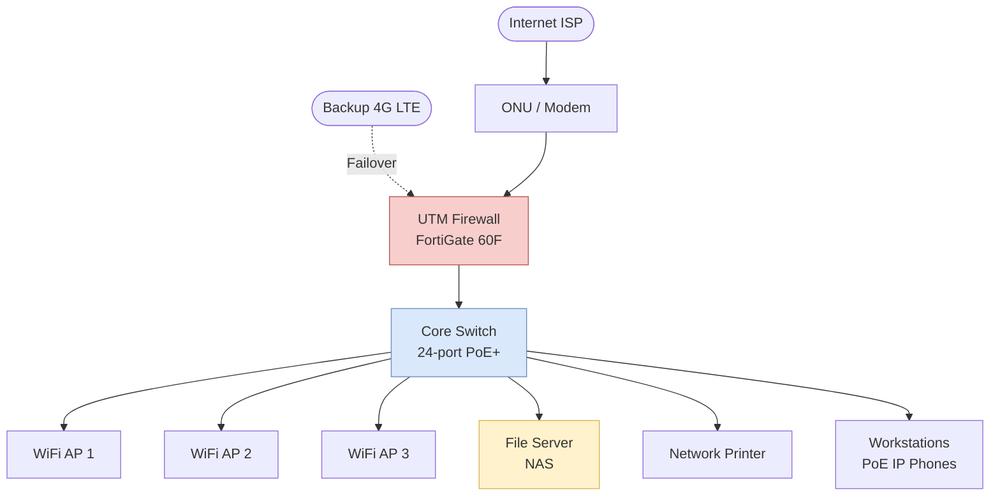

# SMB Single-Site Network

> Network topology สำหรับ SMB (Small-Medium Business) ขนาด 20-100 users สำนักงานเดียว

## 📋 ใช้ตอนไหน

- ✅ บริษัทเล็ก-กลาง สำนักงานเดียว
- ✅ 20-100 users
- ✅ งบจำกัด ไม่ต้องการ full HA
- ✅ Single ISP + optional backup
- ❌ **ไม่เหมาะกับ**: Multi-site, mission-critical

---

## 🌊 Mermaid Template



---

## 📝 Draw.io XML Template

```xml
<mxfile host="app.diagrams.net" modified="2026-04-24T00:00:00.000Z" version="24.0.0">
  <diagram name="SMB Network" id="smb-single-site">
    <mxGraphModel dx="1000" dy="700" grid="1" gridSize="10" guides="1" tooltips="1" connect="1" arrows="1" fold="1" page="1" pageScale="1" pageWidth="1000" pageHeight="800">
      <root>
        <mxCell id="0" />
        <mxCell id="1" parent="0" />
        <mxCell id="inet" value="Internet&#10;(ISP 100 Mbps)" style="ellipse;whiteSpace=wrap;html=1;fillColor=#dae8fc;strokeColor=#6c8ebf;" vertex="1" parent="1">
          <mxGeometry x="240" y="40" width="140" height="60" as="geometry" />
        </mxCell>
        <mxCell id="inet2" value="4G LTE Backup" style="ellipse;whiteSpace=wrap;html=1;fillColor=#e1d5e7;strokeColor=#9673a6;dashed=1;" vertex="1" parent="1">
          <mxGeometry x="540" y="40" width="140" height="60" as="geometry" />
        </mxCell>
        <mxCell id="modem" value="ONU / Modem" style="rounded=1;whiteSpace=wrap;html=1;" vertex="1" parent="1">
          <mxGeometry x="240" y="160" width="140" height="60" as="geometry" />
        </mxCell>
        <mxCell id="fw" value="UTM Firewall&#10;FortiGate 60F" style="rounded=1;whiteSpace=wrap;html=1;fillColor=#f8cecc;strokeColor=#b85450;" vertex="1" parent="1">
          <mxGeometry x="390" y="260" width="140" height="60" as="geometry" />
        </mxCell>
        <mxCell id="core" value="Core Switch&#10;24-port PoE+" style="rounded=1;whiteSpace=wrap;html=1;fillColor=#dae8fc;strokeColor=#6c8ebf;" vertex="1" parent="1">
          <mxGeometry x="390" y="380" width="140" height="60" as="geometry" />
        </mxCell>
        <mxCell id="ap1" value="WiFi AP 1&#10;(Reception)" style="ellipse;whiteSpace=wrap;html=1;fillColor=#d5e8d4;strokeColor=#82b366;" vertex="1" parent="1">
          <mxGeometry x="40" y="500" width="120" height="60" as="geometry" />
        </mxCell>
        <mxCell id="ap2" value="WiFi AP 2&#10;(Office)" style="ellipse;whiteSpace=wrap;html=1;fillColor=#d5e8d4;strokeColor=#82b366;" vertex="1" parent="1">
          <mxGeometry x="180" y="500" width="120" height="60" as="geometry" />
        </mxCell>
        <mxCell id="ap3" value="WiFi AP 3&#10;(Meeting Room)" style="ellipse;whiteSpace=wrap;html=1;fillColor=#d5e8d4;strokeColor=#82b366;" vertex="1" parent="1">
          <mxGeometry x="320" y="500" width="120" height="60" as="geometry" />
        </mxCell>
        <mxCell id="srv" value="NAS / File Server&#10;Synology RS1221+" style="shape=cylinder3;whiteSpace=wrap;html=1;fillColor=#fff2cc;strokeColor=#d6b656;" vertex="1" parent="1">
          <mxGeometry x="460" y="500" width="120" height="70" as="geometry" />
        </mxCell>
        <mxCell id="prt" value="Network Printer" style="rounded=1;whiteSpace=wrap;html=1;" vertex="1" parent="1">
          <mxGeometry x="600" y="500" width="120" height="60" as="geometry" />
        </mxCell>
        <mxCell id="pc" value="Workstations (30)&#10;+ IP Phones" style="rounded=1;whiteSpace=wrap;html=1;" vertex="1" parent="1">
          <mxGeometry x="740" y="500" width="140" height="60" as="geometry" />
        </mxCell>
        <mxCell id="e1" style="edgeStyle=orthogonalEdgeStyle;rounded=1;html=1;" edge="1" parent="1" source="inet" target="modem">
          <mxGeometry relative="1" as="geometry" />
        </mxCell>
        <mxCell id="e2" value="Failover" style="edgeStyle=orthogonalEdgeStyle;rounded=1;html=1;dashed=1;" edge="1" parent="1" source="inet2" target="fw">
          <mxGeometry relative="1" as="geometry" />
        </mxCell>
        <mxCell id="e3" style="edgeStyle=orthogonalEdgeStyle;rounded=1;html=1;" edge="1" parent="1" source="modem" target="fw">
          <mxGeometry relative="1" as="geometry" />
        </mxCell>
        <mxCell id="e4" style="edgeStyle=orthogonalEdgeStyle;rounded=1;html=1;" edge="1" parent="1" source="fw" target="core">
          <mxGeometry relative="1" as="geometry" />
        </mxCell>
        <mxCell id="e5" style="edgeStyle=orthogonalEdgeStyle;rounded=1;html=1;" edge="1" parent="1" source="core" target="ap1">
          <mxGeometry relative="1" as="geometry" />
        </mxCell>
        <mxCell id="e6" style="edgeStyle=orthogonalEdgeStyle;rounded=1;html=1;" edge="1" parent="1" source="core" target="ap2">
          <mxGeometry relative="1" as="geometry" />
        </mxCell>
        <mxCell id="e7" style="edgeStyle=orthogonalEdgeStyle;rounded=1;html=1;" edge="1" parent="1" source="core" target="ap3">
          <mxGeometry relative="1" as="geometry" />
        </mxCell>
        <mxCell id="e8" style="edgeStyle=orthogonalEdgeStyle;rounded=1;html=1;" edge="1" parent="1" source="core" target="srv">
          <mxGeometry relative="1" as="geometry" />
        </mxCell>
        <mxCell id="e9" style="edgeStyle=orthogonalEdgeStyle;rounded=1;html=1;" edge="1" parent="1" source="core" target="prt">
          <mxGeometry relative="1" as="geometry" />
        </mxCell>
        <mxCell id="e10" style="edgeStyle=orthogonalEdgeStyle;rounded=1;html=1;" edge="1" parent="1" source="core" target="pc">
          <mxGeometry relative="1" as="geometry" />
        </mxCell>
      </root>
    </mxGraphModel>
  </diagram>
</mxfile>
```

---

## 💡 Prompt ตัวอย่าง

```
ใช้ template smb-single-site.md
ปรับเป็น network สำหรับ [ชื่อบริษัท] ที่:
- Users: [จำนวน]
- Floors: [จำนวน]
- ต้องการ: [Guest WiFi แยก / VoIP / CCTV / อื่นๆ]
- Budget: [มี/ไม่มี] สำหรับ redundancy
```

---

## 🔧 Parameters

| Parameter | Default | ปรับได้เป็น |
|---|---|---|
| Firewall | FortiGate 60F | Sophos, Palo Alto 220, Cisco Meraki |
| Core switch | 24-port PoE+ | 48-port, managed L3 |
| APs | 3 | 2-10 ตามพื้นที่ |
| NAS | Synology RS1221+ | QNAP, TrueNAS, Windows Server |
