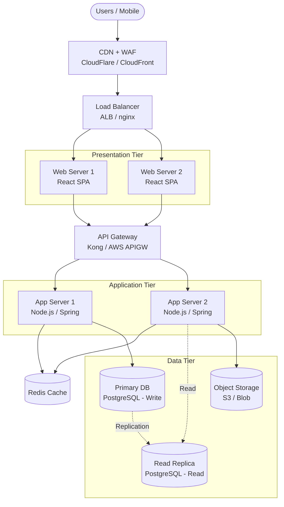

# 3-Tier Web Application Architecture

> Architecture มาตรฐานสำหรับ web application — Presentation / Application / Data

## 📋 ใช้ตอนไหน

- ✅ Web/mobile application ทั่วไป
- ✅ Traditional enterprise app
- ✅ ระบบที่มี UI + business logic + database แยกชั้นชัดเจน
- ❌ **ไม่เหมาะกับ**: Microservices, serverless

---

## 🎨 Pragma Style Diagram (Draw.io XML)

```xml
<mxfile host="app.diagrams.net" version="24.0.0">
  <diagram name="3-Tier Web App — Pragma Style">
    <mxGraphModel dx="1400" dy="900" grid="0" background="#1a1a2e">
      <root>
        <mxCell id="0"/><mxCell id="1" parent="0"/>
        <mxCell id="title" value="3-Tier Web Application Architecture" style="text;html=1;strokeColor=none;fillColor=none;align=center;fontSize=22;fontStyle=1;fontColor=#ffffff;" vertex="1" parent="1">
          <mxGeometry x="100" y="20" width="800" height="40" as="geometry"/>
        </mxCell>
        <mxCell id="L0" value="CLIENT" style="swimlane;startSize=30;fillColor=#1a1a1a;strokeColor=#424242;fontColor=#ffffff;fontSize=13;fontStyle=1;html=1;" vertex="1" parent="1">
          <mxGeometry x="40" y="70" width="920" height="110" as="geometry"/>
        </mxCell>
        <mxCell id="browser" value="Web Browser&#xa;Users" style="shape=mxgraph.cisco.computers_and_peripherals.pc;strokeColor=#ffffff;fillColor=#aaaaaa;fontColor=#ffffff;fontSize=10;verticalLabelPosition=bottom;verticalAlign=top;html=1;" vertex="1" parent="L0">
          <mxGeometry x="200" y="20" width="60" height="55" as="geometry"/>
        </mxCell>
        <mxCell id="mobile" value="Mobile App&#xa;iOS / Android" style="shape=mxgraph.cisco.computers_and_peripherals.handheld_device;strokeColor=#ffffff;fillColor=#aaaaaa;fontColor=#ffffff;fontSize=10;verticalLabelPosition=bottom;verticalAlign=top;html=1;" vertex="1" parent="L0">
          <mxGeometry x="620" y="20" width="40" height="60" as="geometry"/>
        </mxCell>
        <mxCell id="L1" value="EDGE &amp; DELIVERY" style="swimlane;startSize=30;fillColor=#1a2a4a;strokeColor=#4a90d9;fontColor=#ffffff;fontSize=13;fontStyle=1;html=1;" vertex="1" parent="1">
          <mxGeometry x="40" y="210" width="920" height="120" as="geometry"/>
        </mxCell>
        <mxCell id="cdn" value="CDN&#xa;CloudFlare / CloudFront&#xa;Edge Cache" style="rounded=1;whiteSpace=wrap;html=1;fillColor=#1a3a5c;strokeColor=#4a90d9;fontColor=#ffffff;fontSize=10;" vertex="1" parent="L1">
          <mxGeometry x="180" y="25" width="180" height="60" as="geometry"/>
        </mxCell>
        <mxCell id="waf" value="WAF&#xa;Web Application Firewall" style="sketch=0;points=[[0.015,0.015,0],[0.985,0.015,0],[0.985,0.985,0],[0.015,0.985,0],[0.25,0,0],[0.5,0,0],[0.75,0,0],[1,0.25,0],[1,0.5,0],[1,0.75,0],[0.75,1,0],[0.5,1,0],[0.25,1,0],[0,0.75,0],[0,0.5,0],[0,0.25,0]];verticalLabelPosition=bottom;html=1;verticalAlign=top;aspect=fixed;align=center;shape=mxgraph.cisco19.rect;prIcon=firewall;fillColor=#2d1a0e;strokeColor=#ff9800;fontColor=#ffffff;fontSize=10;" vertex="1" parent="L1">
          <mxGeometry x="530" y="20" width="100" height="50" as="geometry"/>
        </mxCell>
        <mxCell id="L2" value="PRESENTATION TIER — Web / Frontend" style="swimlane;startSize=30;fillColor=#0d2b1a;strokeColor=#2e7d32;fontColor=#ffffff;fontSize=13;fontStyle=1;html=1;" vertex="1" parent="1">
          <mxGeometry x="40" y="360" width="920" height="140" as="geometry"/>
        </mxCell>
        <mxCell id="lb" value="Load Balancer&#xa;ALB / nginx&#xa;SSL Termination" style="rounded=1;whiteSpace=wrap;html=1;fillColor=#0d2b1a;strokeColor=#2e7d32;fontColor=#ffffff;fontSize=10;" vertex="1" parent="L2">
          <mxGeometry x="386" y="30" width="148" height="60" as="geometry"/>
        </mxCell>
        <mxCell id="web1" value="Web Server 1&#xa;React SPA + nginx" style="rounded=1;whiteSpace=wrap;html=1;fillColor=#2e7d32;strokeColor=#81c784;fontColor=#ffffff;fontSize=10;" vertex="1" parent="L2">
          <mxGeometry x="180" y="30" width="160" height="60" as="geometry"/>
        </mxCell>
        <mxCell id="web2" value="Web Server 2&#xa;React SPA + nginx" style="rounded=1;whiteSpace=wrap;html=1;fillColor=#2e7d32;strokeColor=#81c784;fontColor=#ffffff;fontSize=10;" vertex="1" parent="L2">
          <mxGeometry x="580" y="30" width="160" height="60" as="geometry"/>
        </mxCell>
        <mxCell id="L3" value="APPLICATION TIER — Business Logic" style="swimlane;startSize=30;fillColor=#1a0d2b;strokeColor=#6a1b9a;fontColor=#ffffff;fontSize=13;fontStyle=1;html=1;" vertex="1" parent="1">
          <mxGeometry x="40" y="530" width="920" height="160" as="geometry"/>
        </mxCell>
        <mxCell id="apigw" value="API Gateway&#xa;Rate Limit / Auth&#xa;Kong / AWS APIGW" style="rounded=1;whiteSpace=wrap;html=1;fillColor=#1a0d2b;strokeColor=#6a1b9a;fontColor=#ffffff;fontSize=10;" vertex="1" parent="L3">
          <mxGeometry x="386" y="20" width="148" height="60" as="geometry"/>
        </mxCell>
        <mxCell id="app1" value="App Server 1&#xa;Node.js / Spring Boot" style="rounded=1;whiteSpace=wrap;html=1;fillColor=#6a1b9a;strokeColor=#ce93d8;fontColor=#ffffff;fontSize=10;" vertex="1" parent="L3">
          <mxGeometry x="100" y="20" width="200" height="60" as="geometry"/>
        </mxCell>
        <mxCell id="app2" value="App Server 2&#xa;Node.js / Spring Boot" style="rounded=1;whiteSpace=wrap;html=1;fillColor=#6a1b9a;strokeColor=#ce93d8;fontColor=#ffffff;fontSize=10;" vertex="1" parent="L3">
          <mxGeometry x="620" y="20" width="200" height="60" as="geometry"/>
        </mxCell>
        <mxCell id="cache" value="Redis Cache&#xa;Session / Hot Data" style="shape=cylinder3;whiteSpace=wrap;html=1;fillColor=#4a2700;strokeColor=#ff9800;fontColor=#ffffff;fontSize=10;verticalLabelPosition=bottom;verticalAlign=top;" vertex="1" parent="L3">
          <mxGeometry x="390" y="95" width="140" height="55" as="geometry"/>
        </mxCell>
        <mxCell id="L4" value="DATA TIER — Storage &amp; Persistence" style="swimlane;startSize=30;fillColor=#1a1a0d;strokeColor=#f9a825;fontColor=#ffffff;fontSize=13;fontStyle=1;html=1;" vertex="1" parent="1">
          <mxGeometry x="40" y="720" width="920" height="150" as="geometry"/>
        </mxCell>
        <mxCell id="db_pri" value="Primary DB&#xa;PostgreSQL&#xa;Write" style="shape=cylinder3;whiteSpace=wrap;html=1;fillColor=#5d4037;strokeColor=#f9a825;fontColor=#ffffff;fontSize=10;verticalLabelPosition=bottom;verticalAlign=top;" vertex="1" parent="L4">
          <mxGeometry x="150" y="25" width="140" height="80" as="geometry"/>
        </mxCell>
        <mxCell id="db_rep" value="Read Replica&#xa;PostgreSQL&#xa;Read-only" style="shape=cylinder3;whiteSpace=wrap;html=1;fillColor=#4e342e;strokeColor=#f9a825;fontColor=#ffffff;fontSize=10;verticalLabelPosition=bottom;verticalAlign=top;" vertex="1" parent="L4">
          <mxGeometry x="390" y="25" width="140" height="80" as="geometry"/>
        </mxCell>
        <mxCell id="storage" value="Object Storage&#xa;S3 / Blob&#xa;Files / Media" style="shape=cylinder3;whiteSpace=wrap;html=1;fillColor=#33691e;strokeColor=#8bc34a;fontColor=#ffffff;fontSize=10;verticalLabelPosition=bottom;verticalAlign=top;" vertex="1" parent="L4">
          <mxGeometry x="630" y="25" width="140" height="80" as="geometry"/>
        </mxCell>
        <mxCell id="obs" value="OBSERVABILITY" style="swimlane;startSize=30;fillColor=#0d1f2b;strokeColor=#0288d1;fontColor=#ffffff;fontSize=11;fontStyle=1;html=1;" vertex="1" parent="1">
          <mxGeometry x="980" y="360" width="180" height="320" as="geometry"/>
        </mxCell>
        <mxCell id="log" value="Logging&#xa;ELK / Loki" style="rounded=1;whiteSpace=wrap;html=1;fillColor=#01579b;strokeColor=#4fc3f7;fontColor=#ffffff;fontSize=10;" vertex="1" parent="obs">
          <mxGeometry x="15" y="40" width="150" height="50" as="geometry"/>
        </mxCell>
        <mxCell id="metric" value="Metrics&#xa;Prometheus + Grafana" style="rounded=1;whiteSpace=wrap;html=1;fillColor=#01579b;strokeColor=#4fc3f7;fontColor=#ffffff;fontSize=10;" vertex="1" parent="obs">
          <mxGeometry x="15" y="110" width="150" height="50" as="geometry"/>
        </mxCell>
        <mxCell id="trace" value="Tracing&#xa;Jaeger / Zipkin" style="rounded=1;whiteSpace=wrap;html=1;fillColor=#01579b;strokeColor=#4fc3f7;fontColor=#ffffff;fontSize=10;" vertex="1" parent="obs">
          <mxGeometry x="15" y="180" width="150" height="50" as="geometry"/>
        </mxCell>
        <mxCell id="e1" value="" style="edgeStyle=orthogonalEdgeStyle;rounded=1;html=1;strokeColor=#4a90d9;strokeWidth=2;" edge="1" parent="1" source="browser" target="cdn"><mxGeometry relative="1" as="geometry"/></mxCell>
        <mxCell id="e2" value="" style="edgeStyle=orthogonalEdgeStyle;rounded=1;html=1;strokeColor=#4a90d9;strokeWidth=2;" edge="1" parent="1" source="mobile" target="waf"><mxGeometry relative="1" as="geometry"/></mxCell>
        <mxCell id="e3" value="HTTPS" style="edgeStyle=orthogonalEdgeStyle;rounded=1;html=1;strokeColor=#2e7d32;strokeWidth=2;fontColor=#81c784;fontSize=10;" edge="1" parent="1" source="cdn" target="lb"><mxGeometry relative="1" as="geometry"/></mxCell>
        <mxCell id="e4" value="" style="edgeStyle=orthogonalEdgeStyle;rounded=1;html=1;strokeColor=#2e7d32;strokeWidth=2;" edge="1" parent="1" source="waf" target="lb"><mxGeometry relative="1" as="geometry"/></mxCell>
        <mxCell id="e5" value="" style="edgeStyle=orthogonalEdgeStyle;rounded=1;html=1;strokeColor=#2e7d32;strokeWidth=2;" edge="1" parent="1" source="lb" target="web1"><mxGeometry relative="1" as="geometry"/></mxCell>
        <mxCell id="e6" value="" style="edgeStyle=orthogonalEdgeStyle;rounded=1;html=1;strokeColor=#2e7d32;strokeWidth=2;" edge="1" parent="1" source="lb" target="web2"><mxGeometry relative="1" as="geometry"/></mxCell>
        <mxCell id="e7" value="REST/GraphQL" style="edgeStyle=orthogonalEdgeStyle;rounded=1;html=1;strokeColor=#6a1b9a;strokeWidth=2;fontColor=#ce93d8;fontSize=10;" edge="1" parent="1" source="web1" target="apigw"><mxGeometry relative="1" as="geometry"/></mxCell>
        <mxCell id="e8" value="" style="edgeStyle=orthogonalEdgeStyle;rounded=1;html=1;strokeColor=#6a1b9a;strokeWidth=2;" edge="1" parent="1" source="web2" target="apigw"><mxGeometry relative="1" as="geometry"/></mxCell>
        <mxCell id="e9" value="" style="edgeStyle=orthogonalEdgeStyle;rounded=1;html=1;strokeColor=#6a1b9a;strokeWidth=2;" edge="1" parent="1" source="apigw" target="app1"><mxGeometry relative="1" as="geometry"/></mxCell>
        <mxCell id="e10" value="" style="edgeStyle=orthogonalEdgeStyle;rounded=1;html=1;strokeColor=#6a1b9a;strokeWidth=2;" edge="1" parent="1" source="apigw" target="app2"><mxGeometry relative="1" as="geometry"/></mxCell>
        <mxCell id="e11" value="Cache" style="edgeStyle=orthogonalEdgeStyle;rounded=1;html=1;strokeColor=#ff9800;strokeWidth=2;dashed=1;fontColor=#ff9800;fontSize=10;" edge="1" parent="1" source="app1" target="cache"><mxGeometry relative="1" as="geometry"/></mxCell>
        <mxCell id="e12" value="Write" style="edgeStyle=orthogonalEdgeStyle;rounded=1;html=1;strokeColor=#f9a825;strokeWidth=2;fontColor=#f9a825;fontSize=10;" edge="1" parent="1" source="app1" target="db_pri"><mxGeometry relative="1" as="geometry"/></mxCell>
        <mxCell id="e13" value="Read" style="edgeStyle=orthogonalEdgeStyle;rounded=1;html=1;strokeColor=#f9a825;strokeWidth=2;dashed=1;fontColor=#f9a825;fontSize=10;" edge="1" parent="1" source="app2" target="db_rep"><mxGeometry relative="1" as="geometry"/></mxCell>
        <mxCell id="e14" value="Replication" style="edgeStyle=orthogonalEdgeStyle;rounded=1;html=1;strokeColor=#00bcd4;strokeWidth=2;dashed=1;fontColor=#00bcd4;fontSize=10;" edge="1" parent="1" source="db_pri" target="db_rep"><mxGeometry relative="1" as="geometry"/></mxCell>
        <mxCell id="e15" value="" style="edgeStyle=orthogonalEdgeStyle;rounded=1;html=1;strokeColor=#8bc34a;strokeWidth=2;" edge="1" parent="1" source="app2" target="storage"><mxGeometry relative="1" as="geometry"/></mxCell>
      </root>
    </mxGraphModel>
  </diagram>
</mxfile>
```

---

## 🌊 Mermaid Template



---

## 💡 Prompt ตัวอย่าง

### แบบ A: Standard Web App
```
ใช้ template 3-tier-web-app.md แบบ Pragma Style
ปรับสำหรับระบบ [ชื่อระบบ]:
- Frontend: [React/Angular/Vue]
- Backend: [Node.js/Java/Python]
- Database: [PostgreSQL/MySQL/MongoDB]
- Deploy: [AWS/Azure/On-premise]
- HA: [Yes/No]
```

### แบบ B: Cloud-native AWS
```
ใช้ template 3-tier-web-app.md แบบ Pragma Style ปรับเป็น AWS:
- CloudFront + WAF → ALB → EC2 Auto Scaling
- API Gateway → Lambda (serverless)
- RDS Aurora Multi-AZ + ElastiCache Redis
- S3 static hosting
```

---

## 🔧 Parameters ที่ปรับได้

| Parameter | Default | ทางเลือก |
|---|---|---|
| Frontend | React SPA | Angular, Vue, Next.js |
| Backend | Node.js / Spring | FastAPI, .NET, Go |
| Database | PostgreSQL | MySQL, MSSQL, MongoDB |
| Cache | Redis | Memcached |
| CDN | CloudFront | CloudFlare, Azure CDN |
| Deploy | Cloud | AWS, Azure, GCP, On-premise |

---

## 📌 Notes
- **WAF**: ควรมีทุก production — FortiWeb, AWS WAF, CloudFlare
- **API Gateway**: จัดการ auth/rate-limit ที่นี่
- **Read Replica**: เพิ่ม read performance โดยไม่ต้อง scale write DB

### Related Templates
- Network layer → `3-tier-data-center.md`
- Hyper-V → `hyper-v-failover-cluster.md`

**อัพเดตล่าสุด**: 2026-05-07 — เพิ่ม Pragma Dark Style XML, WAF, Observability layer
