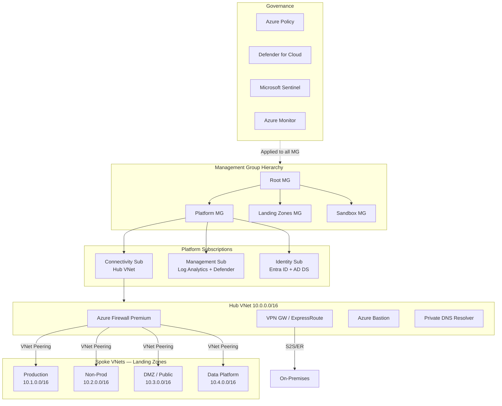

# Azure Landing Zone

> Architecture diagram สำหรับ Azure Landing Zone ตาม Microsoft Cloud Adoption Framework (CAF) — Management Group hierarchy, Hub-Spoke VNet, Azure Policy, Defender, และ Connectivity layer

## 📋 ใช้ตอนไหน

- ✅ ออกแบบ Azure foundation สำหรับ Enterprise ใหม่
- ✅ Migrate on-prem workload ขึ้น Azure พร้อม governance
- ✅ Multi-subscription, multi-team environment
- ✅ ต้องการ compliance (ISO27001, SOC2, PDPA)
- ❌ **ไม่เหมาะกับ**: single dev subscription, POC ที่ไม่มีแผน production

---

## 🎨 Pragma Style Diagram (Draw.io XML)

```xml
<mxfile host="app.diagrams.net" version="24.0.0">
  <diagram name="Azure Landing Zone — Pragma Style">
    <mxGraphModel dx="1500" dy="1100" grid="0" background="#1a1a2e">
      <root>
        <mxCell id="0"/><mxCell id="1" parent="0"/>

        <mxCell id="title" value="Azure Landing Zone (CAF — Hub-Spoke)" style="text;html=1;strokeColor=none;fillColor=none;align=center;fontSize=22;fontStyle=1;fontColor=#ffffff;" vertex="1" parent="1">
          <mxGeometry x="80" y="14" width="1000" height="40" as="geometry"/>
        </mxCell>

        <!-- MANAGEMENT GROUP HIERARCHY -->
        <mxCell id="L_mg" value="MANAGEMENT GROUP HIERARCHY" style="swimlane;startSize=30;fillColor=#1a1030;strokeColor=#7c4dff;fontColor=#ffffff;fontSize=13;fontStyle=1;html=1;" vertex="1" parent="1">
          <mxGeometry x="40" y="64" width="1160" height="180" as="geometry"/>
        </mxCell>
        <mxCell id="mg_root" value="Root&#xa;Management Group" style="rounded=1;whiteSpace=wrap;html=1;fillColor=#1a1030;strokeColor=#7c4dff;fontColor=#ffffff;fontSize=11;" vertex="1" parent="L_mg">
          <mxGeometry x="490" y="25" width="160" height="50" as="geometry"/>
        </mxCell>
        <mxCell id="mg_platform" value="Platform MG&#xa;(IT Central)" style="rounded=1;whiteSpace=wrap;html=1;fillColor=#1a1030;strokeColor=#7c4dff;fontColor=#ffffff;fontSize=11;" vertex="1" parent="L_mg">
          <mxGeometry x="180" y="100" width="160" height="50" as="geometry"/>
        </mxCell>
        <mxCell id="mg_landing" value="Landing Zones MG&#xa;(Workloads)" style="rounded=1;whiteSpace=wrap;html=1;fillColor=#1a1030;strokeColor=#7c4dff;fontColor=#ffffff;fontSize=11;" vertex="1" parent="L_mg">
          <mxGeometry x="490" y="100" width="160" height="50" as="geometry"/>
        </mxCell>
        <mxCell id="mg_sandbox" value="Sandbox MG&#xa;(Dev/POC)" style="rounded=1;whiteSpace=wrap;html=1;fillColor=#2d1a0e;strokeColor=#ff9800;fontColor=#ffffff;fontSize=11;" vertex="1" parent="L_mg">
          <mxGeometry x="810" y="100" width="160" height="50" as="geometry"/>
        </mxCell>
        <mxCell id="mg_e1" style="edgeStyle=orthogonalEdgeStyle;rounded=1;html=1;strokeColor=#7c4dff;strokeWidth=2;" edge="1" parent="L_mg" source="mg_root" target="mg_platform"><mxGeometry relative="1" as="geometry"/></mxCell>
        <mxCell id="mg_e2" style="edgeStyle=orthogonalEdgeStyle;rounded=1;html=1;strokeColor=#7c4dff;strokeWidth=2;" edge="1" parent="L_mg" source="mg_root" target="mg_landing"><mxGeometry relative="1" as="geometry"/></mxCell>
        <mxCell id="mg_e3" style="edgeStyle=orthogonalEdgeStyle;rounded=1;html=1;strokeColor=#ff9800;strokeWidth=2;" edge="1" parent="L_mg" source="mg_root" target="mg_sandbox"><mxGeometry relative="1" as="geometry"/></mxCell>

        <!-- PLATFORM SUBSCRIPTIONS -->
        <mxCell id="L_plat" value="PLATFORM SUBSCRIPTIONS" style="swimlane;startSize=30;fillColor=#0d1f2b;strokeColor=#0288d1;fontColor=#ffffff;fontSize=13;fontStyle=1;html=1;" vertex="1" parent="1">
          <mxGeometry x="40" y="274" width="1160" height="160" as="geometry"/>
        </mxCell>
        <mxCell id="sub_conn" value="Connectivity Sub&#xa;(Hub VNet)" style="rounded=1;whiteSpace=wrap;html=1;fillColor=#0d1f2b;strokeColor=#0288d1;fontColor=#ffffff;fontSize=11;" vertex="1" parent="L_plat">
          <mxGeometry x="80" y="35" width="160" height="90" as="geometry"/>
        </mxCell>
        <mxCell id="conn_er" value="ExpressRoute / VPN GW" style="text;html=1;strokeColor=none;fillColor=none;align=center;fontSize=10;fontStyle=2;fontColor=#4a90d9;" vertex="1" parent="L_plat">
          <mxGeometry x="80" y="115" width="160" height="20" as="geometry"/>
        </mxCell>
        <mxCell id="sub_mgmt" value="Management Sub&#xa;(Log Analytics, Defender, Monitor)" style="rounded=1;whiteSpace=wrap;html=1;fillColor=#0d1f2b;strokeColor=#0288d1;fontColor=#ffffff;fontSize=11;" vertex="1" parent="L_plat">
          <mxGeometry x="430" y="35" width="200" height="90" as="geometry"/>
        </mxCell>
        <mxCell id="sub_id" value="Identity Sub&#xa;(AD DS, Entra ID Connect)" style="rounded=1;whiteSpace=wrap;html=1;fillColor=#0d1f2b;strokeColor=#0288d1;fontColor=#ffffff;fontSize=11;" vertex="1" parent="L_plat">
          <mxGeometry x="820" y="35" width="200" height="90" as="geometry"/>
        </mxCell>

        <!-- HUB VNET -->
        <mxCell id="L_hub" value="HUB VNet (10.0.0.0/16) — Connectivity Subscription" style="swimlane;startSize=30;fillColor=#1a2a4a;strokeColor=#4a90d9;fontColor=#ffffff;fontSize=13;fontStyle=1;html=1;" vertex="1" parent="1">
          <mxGeometry x="40" y="464" width="1160" height="160" as="geometry"/>
        </mxCell>
        <mxCell id="hub_fw" value="Azure Firewall Premium&#xa;10.0.1.0/26" style="sketch=0;points=[[0.015,0.015,0],[0.985,0.015,0],[0.985,0.985,0],[0.015,0.985,0],[0.25,0,0],[0.5,0,0],[0.75,0,0],[1,0.25,0],[1,0.5,0],[1,0.75,0],[0.75,1,0],[0.5,1,0],[0.25,1,0],[0,0.75,0],[0,0.5,0],[0,0.25,0]];verticalLabelPosition=bottom;html=1;verticalAlign=top;aspect=fixed;align=center;shape=mxgraph.cisco19.rect;prIcon=firewall;fillColor=#8b3a0f;strokeColor=#ff9800;fontColor=#ffffff;fontSize=10;" vertex="1" parent="L_hub">
          <mxGeometry x="80" y="35" width="128" height="60" as="geometry"/>
        </mxCell>
        <mxCell id="hub_vpn" value="VPN Gateway&#xa;/ ExpressRoute&#xa;10.0.2.0/27" style="sketch=0;points=[[0.015,0.015,0],[0.985,0.015,0],[0.985,0.985,0],[0.015,0.985,0],[0.25,0,0],[0.5,0,0],[0.75,0,0],[1,0.25,0],[1,0.5,0],[1,0.75,0],[0.75,1,0],[0.5,1,0],[0.25,1,0],[0,0.75,0],[0,0.5,0],[0,0.25,0]];verticalLabelPosition=bottom;html=1;verticalAlign=top;aspect=fixed;align=center;shape=mxgraph.cisco19.rect;prIcon=generic_gateway;fillColor=#1a2a4a;strokeColor=#4a90d9;fontColor=#ffffff;fontSize=10;" vertex="1" parent="L_hub">
          <mxGeometry x="330" y="35" width="128" height="60" as="geometry"/>
        </mxCell>
        <mxCell id="hub_bastion" value="Azure Bastion&#xa;10.0.3.0/27" style="sketch=0;points=[[0.015,0.015,0],[0.985,0.015,0],[0.985,0.985,0],[0.015,0.985,0],[0.25,0,0],[0.5,0,0],[0.75,0,0],[1,0.25,0],[1,0.5,0],[1,0.75,0],[0.75,1,0],[0.5,1,0],[0.25,1,0],[0,0.75,0],[0,0.5,0],[0,0.25,0]];verticalLabelPosition=bottom;html=1;verticalAlign=top;aspect=fixed;align=center;shape=mxgraph.cisco19.rect;prIcon=generic_server;fillColor=#1a2a4a;strokeColor=#4a90d9;fontColor=#ffffff;fontSize=10;" vertex="1" parent="L_hub">
          <mxGeometry x="580" y="35" width="128" height="60" as="geometry"/>
        </mxCell>
        <mxCell id="hub_dns" value="Private DNS Resolver&#xa;+ DNS Zone" style="sketch=0;points=[[0.015,0.015,0],[0.985,0.015,0],[0.985,0.985,0],[0.015,0.985,0],[0.25,0,0],[0.5,0,0],[0.75,0,0],[1,0.25,0],[1,0.5,0],[1,0.75,0],[0.75,1,0],[0.5,1,0],[0.25,1,0],[0,0.75,0],[0,0.5,0],[0,0.25,0]];verticalLabelPosition=bottom;html=1;verticalAlign=top;aspect=fixed;align=center;shape=mxgraph.cisco19.rect;prIcon=generic_server;fillColor=#1a2a4a;strokeColor=#4a90d9;fontColor=#ffffff;fontSize=10;" vertex="1" parent="L_hub">
          <mxGeometry x="830" y="35" width="128" height="60" as="geometry"/>
        </mxCell>
        <mxCell id="hub_onprem" value="On-Premises&#xa;(NFI DC)" style="sketch=0;points=[[0.015,0.015,0],[0.985,0.015,0],[0.985,0.985,0],[0.015,0.985,0],[0.25,0,0],[0.5,0,0],[0.75,0,0],[1,0.25,0],[1,0.5,0],[1,0.75,0],[0.75,1,0],[0.5,1,0],[0.25,1,0],[0,0.75,0],[0,0.5,0],[0,0.25,0]];verticalLabelPosition=bottom;html=1;verticalAlign=top;aspect=fixed;align=center;shape=mxgraph.cisco19.rect;prIcon=router;fillColor=#2d1a0e;strokeColor=#ff9800;fontColor=#ffffff;fontSize=10;" vertex="1" parent="L_hub">
          <mxGeometry x="980" y="35" width="128" height="60" as="geometry"/>
        </mxCell>

        <!-- SPOKE VNETS -->
        <mxCell id="L_spoke" value="SPOKE VNets — Landing Zone Subscriptions" style="swimlane;startSize=30;fillColor=#0d2b1a;strokeColor=#2e7d32;fontColor=#ffffff;fontSize=13;fontStyle=1;html=1;" vertex="1" parent="1">
          <mxGeometry x="40" y="654" width="1160" height="180" as="geometry"/>
        </mxCell>
        <mxCell id="spoke_prod" value="Production Spoke&#xa;10.1.0.0/16&#xa;&#xa;AKS / App Service&#xa;SQL / Storage" style="rounded=1;whiteSpace=wrap;html=1;fillColor=#0d2b1a;strokeColor=#66bb6a;fontColor=#ffffff;fontSize=11;" vertex="1" parent="L_spoke">
          <mxGeometry x="60" y="35" width="200" height="120" as="geometry"/>
        </mxCell>
        <mxCell id="spoke_nonprod" value="Non-Prod Spoke&#xa;10.2.0.0/16&#xa;&#xa;Dev / Test / Staging&#xa;App Service, AKS" style="rounded=1;whiteSpace=wrap;html=1;fillColor=#0d2b1a;strokeColor=#2e7d32;fontColor=#ffffff;fontSize=11;" vertex="1" parent="L_spoke">
          <mxGeometry x="320" y="35" width="200" height="120" as="geometry"/>
        </mxCell>
        <mxCell id="spoke_dmz" value="DMZ Spoke&#xa;10.3.0.0/16&#xa;&#xa;App GW + WAF&#xa;Public-facing API" style="rounded=1;whiteSpace=wrap;html=1;fillColor=#2d1a0e;strokeColor=#ff9800;fontColor=#ffffff;fontSize=11;" vertex="1" parent="L_spoke">
          <mxGeometry x="580" y="35" width="200" height="120" as="geometry"/>
        </mxCell>
        <mxCell id="spoke_data" value="Data Platform Spoke&#xa;10.4.0.0/16&#xa;&#xa;Synapse / Data Lake&#xa;Databricks" style="rounded=1;whiteSpace=wrap;html=1;fillColor=#0d1f2b;strokeColor=#0288d1;fontColor=#ffffff;fontSize=11;" vertex="1" parent="L_spoke">
          <mxGeometry x="840" y="35" width="200" height="120" as="geometry"/>
        </mxCell>

        <!-- GOVERNANCE -->
        <mxCell id="L_gov" value="GOVERNANCE — Azure Policy + Defender + Monitor" style="swimlane;startSize=30;fillColor=#1a1a1a;strokeColor=#424242;fontColor=#ffffff;fontSize=13;fontStyle=1;html=1;" vertex="1" parent="1">
          <mxGeometry x="40" y="864" width="1160" height="110" as="geometry"/>
        </mxCell>
        <mxCell id="policy" value="Azure Policy&#xa;(Auto-Remediation)" style="rounded=1;whiteSpace=wrap;html=1;fillColor=#1a1a1a;strokeColor=#aaaaaa;fontColor=#ffffff;fontSize=11;" vertex="1" parent="L_gov">
          <mxGeometry x="60" y="30" width="180" height="55" as="geometry"/>
        </mxCell>
        <mxCell id="defender" value="Defender for Cloud&#xa;(CSPM + CWPP)" style="rounded=1;whiteSpace=wrap;html=1;fillColor=#3a1010;strokeColor=#e53935;fontColor=#ffffff;fontSize=11;" vertex="1" parent="L_gov">
          <mxGeometry x="310" y="30" width="180" height="55" as="geometry"/>
        </mxCell>
        <mxCell id="monitor" value="Azure Monitor&#xa;+ Log Analytics" style="rounded=1;whiteSpace=wrap;html=1;fillColor=#1a1a1a;strokeColor=#aaaaaa;fontColor=#ffffff;fontSize=11;" vertex="1" parent="L_gov">
          <mxGeometry x="560" y="30" width="180" height="55" as="geometry"/>
        </mxCell>
        <mxCell id="sentinel" value="Microsoft Sentinel&#xa;(SIEM / SOAR)" style="rounded=1;whiteSpace=wrap;html=1;fillColor=#1a1030;strokeColor=#7c4dff;fontColor=#ffffff;fontSize=11;" vertex="1" parent="L_gov">
          <mxGeometry x="810" y="30" width="180" height="55" as="geometry"/>
        </mxCell>
        <mxCell id="cost" value="Cost Management&#xa;+ Budget Alerts" style="rounded=1;whiteSpace=wrap;html=1;fillColor=#2d1a0e;strokeColor=#ff9800;fontColor=#ffffff;fontSize=11;" vertex="1" parent="L_gov">
          <mxGeometry x="1000" y="30" width="100" height="55" as="geometry"/>
        </mxCell>

        <!-- Hub–Spoke Peering -->
        <mxCell id="pe1" value="VNet Peering" style="edgeStyle=orthogonalEdgeStyle;rounded=1;html=1;strokeColor=#2e7d32;strokeWidth=2;fontColor=#66bb6a;fontSize=9;" edge="1" parent="1" source="hub_fw" target="spoke_prod"><mxGeometry relative="1" as="geometry"/></mxCell>
        <mxCell id="pe2" value="" style="edgeStyle=orthogonalEdgeStyle;rounded=1;html=1;strokeColor=#2e7d32;strokeWidth=2;" edge="1" parent="1" source="hub_fw" target="spoke_nonprod"><mxGeometry relative="1" as="geometry"/></mxCell>
        <mxCell id="pe3" value="" style="edgeStyle=orthogonalEdgeStyle;rounded=1;html=1;strokeColor=#ff9800;strokeWidth=2;" edge="1" parent="1" source="hub_fw" target="spoke_dmz"><mxGeometry relative="1" as="geometry"/></mxCell>
        <mxCell id="pe4" value="" style="edgeStyle=orthogonalEdgeStyle;rounded=1;html=1;strokeColor=#0288d1;strokeWidth=2;" edge="1" parent="1" source="hub_fw" target="spoke_data"><mxGeometry relative="1" as="geometry"/></mxCell>
        <mxCell id="pe5" value="S2S VPN /&#xa;ER" style="edgeStyle=orthogonalEdgeStyle;rounded=1;html=1;strokeColor=#ff9800;strokeWidth=2;fontColor=#ff9800;fontSize=9;" edge="1" parent="1" source="hub_vpn" target="hub_onprem"><mxGeometry relative="1" as="geometry"/></mxCell>
      </root>
    </mxGraphModel>
  </diagram>
</mxfile>
```

---

## 🌊 Mermaid Template



---

## 💡 Prompt ตัวอย่าง

### แบบ A: Enterprise CAF Full Deploy
```
ใช้ template azure-landing-zone.md แบบ Pragma Style
ปรับสำหรับ [ชื่อลูกค้า]:
- Region: Southeast Asia (Primary) + East Asia (DR)
- Connectivity: ExpressRoute 1Gbps + VPN Backup
- Workloads: 3 Production apps (AKS), Data Platform (Synapse)
- Compliance: ISO27001, PDPA
- Identity: Hybrid (AD DS on-prem + Entra ID Connect)
```

### แบบ B: SMB Simplified Landing Zone
```
ใช้ template azure-landing-zone.md แบบ Pragma Style
ทำแบบ Simplified (ไม่มี Management Group):
- 2 subscriptions: Production, Non-Prod
- Hub VNet: Azure Firewall Standard + VPN Gateway
- Spoke: 1 Production (App Service + SQL), 1 Dev
- ไม่มี ExpressRoute — ใช้ Site-to-Site VPN แทน
```

### แบบ C: เพิ่ม DevSecOps Pipeline
```
ใช้ template azure-landing-zone.md แบบ Pragma Style
เพิ่ม DevSecOps layer:
- Azure DevOps / GitHub Actions → ACR → AKS
- Defender for DevOps (container scanning)
- Key Vault สำหรับ secrets ทุก environment
- Private Endpoint สำหรับ PaaS services
```

---

## 🔧 Parameters ที่ปรับได้

| Parameter | Default | ทางเลือก |
|---|---|---|
| Connectivity | VPN Gateway + ER | VPN only, ER only, Wan-as-a-Service |
| Firewall | Azure Firewall Premium | Standard, NVA (Palo Alto, Fortinet) |
| Identity | Entra ID + AD DS | Entra ID only (cloud-native) |
| Spoke count | 4 (Prod, NonProd, DMZ, Data) | ปรับตาม workload |
| VNet ranges | 10.x.0.0/16 | ปรับตาม IP plan ของ org |
| SIEM | Microsoft Sentinel | Splunk, QRadar |
| Container | AKS | App Service, Container Apps |

---

## 📌 Notes สำหรับ SI / Architect

- **Hub-Spoke คือ default CAF pattern** — Spoke VNets ไม่เชื่อมหากัน ทุก traffic ผ่าน Hub Firewall
- **Private Endpoint**: PaaS services (Storage, SQL, KeyVault) ควรใช้ Private Endpoint ใน Production
- **UDR (User Defined Route)**: บังคับ default route 0.0.0.0/0 → Azure Firewall ใน spoke subnets
- **Azure Policy**: ใช้ built-in initiative "Azure Security Benchmark" เป็น baseline ก่อน custom
- **Cost estimate**: Azure Firewall Premium ≈ $1.5/hr, ExpressRoute ≈ ขึ้นกับ circuit speed
- **Naming convention**: ใช้ `[resource]-[workload]-[env]-[region]-[instance]` เช่น `rg-appname-prod-sea-001`

### Related Templates

- Microservices on AWS → `microservices-aws.md`
- Firewall DMZ Zones → `firewall-dmz-zones.md`
- 3-Tier Web App → `3-tier-web-app.md`
