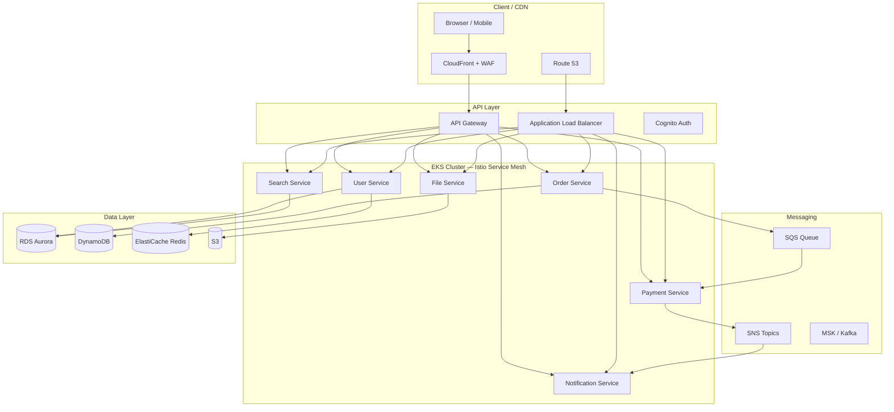

# Microservices on AWS

> Architecture diagram สำหรับ Microservices บน AWS — ครอบคลุม API Gateway, EKS/ECS, Service Mesh, RDS, ElastiCache, และ CI/CD pipeline ตาม AWS Well-Architected Framework

## 📋 ใช้ตอนไหน

- ✅ Deploy microservices app บน AWS (EKS หรือ ECS Fargate)
- ✅ ต้องการ loosely-coupled services พร้อม independent deploy
- ✅ Presentation ให้ลูกค้าเรื่อง cloud-native architecture
- ✅ เหมาะสำหรับ 10+ services, ทีม 5+ คน
- ❌ **ไม่เหมาะกับ**: monolith apps ที่ยังไม่พร้อม decompose, startup < 3 dev

---

## 🎨 Pragma Style Diagram (Draw.io XML)

```xml
<mxfile host="app.diagrams.net" version="24.0.0">
  <diagram name="Microservices on AWS — Pragma Style">
    <mxGraphModel dx="1600" dy="1000" grid="0" background="#1a1a2e">
      <root>
        <mxCell id="0"/><mxCell id="1" parent="0"/>

        <mxCell id="title" value="Microservices Architecture on AWS" style="text;html=1;strokeColor=none;fillColor=none;align=center;fontSize=22;fontStyle=1;fontColor=#ffffff;" vertex="1" parent="1">
          <mxGeometry x="80" y="14" width="1000" height="40" as="geometry"/>
        </mxCell>

        <!-- CLIENT / CDN -->
        <mxCell id="L0" value="CLIENT / CDN" style="swimlane;startSize=30;fillColor=#1a2a4a;strokeColor=#4a90d9;fontColor=#ffffff;fontSize=13;fontStyle=1;html=1;" vertex="1" parent="1">
          <mxGeometry x="40" y="64" width="1160" height="110" as="geometry"/>
        </mxCell>
        <mxCell id="browser" value="Web Browser&#xa;/ Mobile App" style="shape=mxgraph.cisco.computers_and_peripherals.pc;fillColor=#4a90d9;strokeColor=#ffffff;fontColor=#ffffff;fontSize=10;verticalLabelPosition=bottom;verticalAlign=top;html=1;" vertex="1" parent="L0">
          <mxGeometry x="80" y="15" width="66" height="55" as="geometry"/>
        </mxCell>
        <mxCell id="cf" value="CloudFront CDN&#xa;+ WAF" style="sketch=0;points=[[0.015,0.015,0],[0.985,0.015,0],[0.985,0.985,0],[0.015,0.985,0],[0.25,0,0],[0.5,0,0],[0.75,0,0],[1,0.25,0],[1,0.5,0],[1,0.75,0],[0.75,1,0],[0.5,1,0],[0.25,1,0],[0,0.75,0],[0,0.5,0],[0,0.25,0]];verticalLabelPosition=bottom;html=1;verticalAlign=top;aspect=fixed;align=center;shape=mxgraph.cisco19.rect;prIcon=cloud;fillColor=#1a2a4a;strokeColor=#4a90d9;fontColor=#ffffff;fontSize=10;" vertex="1" parent="L0">
          <mxGeometry x="320" y="10" width="128" height="60" as="geometry"/>
        </mxCell>
        <mxCell id="r53" value="Route 53&#xa;DNS" style="sketch=0;points=[[0.015,0.015,0],[0.985,0.015,0],[0.985,0.985,0],[0.015,0.985,0],[0.25,0,0],[0.5,0,0],[0.75,0,0],[1,0.25,0],[1,0.5,0],[1,0.75,0],[0.75,1,0],[0.5,1,0],[0.25,1,0],[0,0.75,0],[0,0.5,0],[0,0.25,0]];verticalLabelPosition=bottom;html=1;verticalAlign=top;aspect=fixed;align=center;shape=mxgraph.cisco19.rect;prIcon=cloud;fillColor=#1a2a4a;strokeColor=#4a90d9;fontColor=#ffffff;fontSize=10;" vertex="1" parent="L0">
          <mxGeometry x="700" y="10" width="128" height="60" as="geometry"/>
        </mxCell>

        <!-- API GATEWAY / INGRESS -->
        <mxCell id="L1" value="API LAYER — Gateway + Load Balancer" style="swimlane;startSize=30;fillColor=#2d1a0e;strokeColor=#ff9800;fontColor=#ffffff;fontSize=13;fontStyle=1;html=1;" vertex="1" parent="1">
          <mxGeometry x="40" y="204" width="1160" height="130" as="geometry"/>
        </mxCell>
        <mxCell id="apigw" value="API Gateway&#xa;(REST / GraphQL)" style="sketch=0;points=[[0.015,0.015,0],[0.985,0.015,0],[0.985,0.985,0],[0.015,0.985,0],[0.25,0,0],[0.5,0,0],[0.75,0,0],[1,0.25,0],[1,0.5,0],[1,0.75,0],[0.75,1,0],[0.5,1,0],[0.25,1,0],[0,0.75,0],[0,0.5,0],[0,0.25,0]];verticalLabelPosition=bottom;html=1;verticalAlign=top;aspect=fixed;align=center;shape=mxgraph.cisco19.rect;prIcon=generic_gateway;fillColor=#4a2800;strokeColor=#ff9800;fontColor=#ffffff;fontSize=10;" vertex="1" parent="L1">
          <mxGeometry x="240" y="25" width="128" height="70" as="geometry"/>
        </mxCell>
        <mxCell id="alb" value="ALB&#xa;Application Load Balancer" style="sketch=0;points=[[0.015,0.015,0],[0.985,0.015,0],[0.985,0.985,0],[0.015,0.985,0],[0.25,0,0],[0.5,0,0],[0.75,0,0],[1,0.25,0],[1,0.5,0],[1,0.75,0],[0.75,1,0],[0.5,1,0],[0.25,1,0],[0,0.75,0],[0,0.5,0],[0,0.25,0]];verticalLabelPosition=bottom;html=1;verticalAlign=top;aspect=fixed;align=center;shape=mxgraph.cisco19.rect;prIcon=generic_gateway;fillColor=#4a2800;strokeColor=#ff9800;fontColor=#ffffff;fontSize=10;" vertex="1" parent="L1">
          <mxGeometry x="760" y="25" width="128" height="70" as="geometry"/>
        </mxCell>
        <mxCell id="auth" value="Cognito&#xa;Auth / JWT" style="shape=cylinder3;whiteSpace=wrap;html=1;fillColor=#1a1030;strokeColor=#7c4dff;fontColor=#ffffff;fontSize=10;verticalLabelPosition=bottom;verticalAlign=top;" vertex="1" parent="L1">
          <mxGeometry x="980" y="20" width="70" height="70" as="geometry"/>
        </mxCell>

        <!-- EKS CLUSTER -->
        <mxCell id="L2" value="EKS CLUSTER — us-east-1 (Multi-AZ)" style="swimlane;startSize=30;fillColor=#0d2b1a;strokeColor=#2e7d32;fontColor=#ffffff;fontSize=13;fontStyle=1;html=1;" vertex="1" parent="1">
          <mxGeometry x="40" y="364" width="1160" height="200" as="geometry"/>
        </mxCell>
        <mxCell id="svc_user" value="User Service&#xa;(Node.js)" style="rounded=1;whiteSpace=wrap;html=1;fillColor=#0d2b1a;strokeColor=#66bb6a;fontColor=#ffffff;fontSize=10;" vertex="1" parent="L2">
          <mxGeometry x="60" y="50" width="130" height="60" as="geometry"/>
        </mxCell>
        <mxCell id="svc_order" value="Order Service&#xa;(Go)" style="rounded=1;whiteSpace=wrap;html=1;fillColor=#0d2b1a;strokeColor=#66bb6a;fontColor=#ffffff;fontSize=10;" vertex="1" parent="L2">
          <mxGeometry x="240" y="50" width="130" height="60" as="geometry"/>
        </mxCell>
        <mxCell id="svc_payment" value="Payment Service&#xa;(Java/Spring)" style="rounded=1;whiteSpace=wrap;html=1;fillColor=#0d2b1a;strokeColor=#66bb6a;fontColor=#ffffff;fontSize=10;" vertex="1" parent="L2">
          <mxGeometry x="420" y="50" width="130" height="60" as="geometry"/>
        </mxCell>
        <mxCell id="svc_notify" value="Notification&#xa;Service (Python)" style="rounded=1;whiteSpace=wrap;html=1;fillColor=#0d2b1a;strokeColor=#66bb6a;fontColor=#ffffff;fontSize=10;" vertex="1" parent="L2">
          <mxGeometry x="600" y="50" width="130" height="60" as="geometry"/>
        </mxCell>
        <mxCell id="svc_search" value="Search Service&#xa;(Elasticsearch)" style="rounded=1;whiteSpace=wrap;html=1;fillColor=#0d2b1a;strokeColor=#66bb6a;fontColor=#ffffff;fontSize=10;" vertex="1" parent="L2">
          <mxGeometry x="780" y="50" width="130" height="60" as="geometry"/>
        </mxCell>
        <mxCell id="svc_file" value="File Service&#xa;(Go / S3)" style="rounded=1;whiteSpace=wrap;html=1;fillColor=#0d2b1a;strokeColor=#66bb6a;fontColor=#ffffff;fontSize=10;" vertex="1" parent="L2">
          <mxGeometry x="960" y="50" width="130" height="60" as="geometry"/>
        </mxCell>
        <mxCell id="mesh" value="◄─ Istio Service Mesh (mTLS, Traffic Management, Observability) ─►" style="text;html=1;strokeColor=none;fillColor=none;align=center;fontSize=10;fontStyle=2;fontColor=#66bb6a;" vertex="1" parent="L2">
          <mxGeometry x="60" y="148" width="1060" height="20" as="geometry"/>
        </mxCell>

        <!-- MESSAGING -->
        <mxCell id="L3" value="MESSAGING — Async Event Bus" style="swimlane;startSize=30;fillColor=#1a1030;strokeColor=#7c4dff;fontColor=#ffffff;fontSize=13;fontStyle=1;html=1;" vertex="1" parent="1">
          <mxGeometry x="40" y="594" width="1160" height="110" as="geometry"/>
        </mxCell>
        <mxCell id="sqs" value="SQS&#xa;Task Queue" style="shape=cylinder3;whiteSpace=wrap;html=1;fillColor=#1a1030;strokeColor=#7c4dff;fontColor=#ffffff;fontSize=10;verticalLabelPosition=bottom;verticalAlign=top;" vertex="1" parent="L3">
          <mxGeometry x="200" y="15" width="70" height="65" as="geometry"/>
        </mxCell>
        <mxCell id="sns" value="SNS&#xa;Pub/Sub" style="shape=cylinder3;whiteSpace=wrap;html=1;fillColor=#1a1030;strokeColor=#7c4dff;fontColor=#ffffff;fontSize=10;verticalLabelPosition=bottom;verticalAlign=top;" vertex="1" parent="L3">
          <mxGeometry x="520" y="15" width="70" height="65" as="geometry"/>
        </mxCell>
        <mxCell id="msk" value="MSK / Kafka&#xa;Event Stream" style="shape=cylinder3;whiteSpace=wrap;html=1;fillColor=#2d1a0e;strokeColor=#ff9800;fontColor=#ffffff;fontSize=10;verticalLabelPosition=bottom;verticalAlign=top;" vertex="1" parent="L3">
          <mxGeometry x="840" y="15" width="70" height="65" as="geometry"/>
        </mxCell>

        <!-- DATA LAYER -->
        <mxCell id="L4" value="DATA LAYER — Polyglot Persistence" style="swimlane;startSize=30;fillColor=#0d1f2b;strokeColor=#0288d1;fontColor=#ffffff;fontSize=13;fontStyle=1;html=1;" vertex="1" parent="1">
          <mxGeometry x="40" y="734" width="1160" height="140" as="geometry"/>
        </mxCell>
        <mxCell id="rds" value="RDS Aurora&#xa;PostgreSQL&#xa;(Multi-AZ)" style="shape=cylinder3;whiteSpace=wrap;html=1;fillColor=#0d1f2b;strokeColor=#0288d1;fontColor=#ffffff;fontSize=10;verticalLabelPosition=bottom;verticalAlign=top;" vertex="1" parent="L4">
          <mxGeometry x="80" y="20" width="70" height="80" as="geometry"/>
        </mxCell>
        <mxCell id="dynamo" value="DynamoDB&#xa;(Session/Cart)" style="shape=cylinder3;whiteSpace=wrap;html=1;fillColor=#0d1f2b;strokeColor=#0288d1;fontColor=#ffffff;fontSize=10;verticalLabelPosition=bottom;verticalAlign=top;" vertex="1" parent="L4">
          <mxGeometry x="280" y="20" width="70" height="80" as="geometry"/>
        </mxCell>
        <mxCell id="redis" value="ElastiCache&#xa;Redis&#xa;(Cache/Session)" style="shape=cylinder3;whiteSpace=wrap;html=1;fillColor=#3a1010;strokeColor=#e53935;fontColor=#ffffff;fontSize=10;verticalLabelPosition=bottom;verticalAlign=top;" vertex="1" parent="L4">
          <mxGeometry x="480" y="20" width="70" height="80" as="geometry"/>
        </mxCell>
        <mxCell id="es" value="OpenSearch&#xa;(Full-text Search)" style="shape=cylinder3;whiteSpace=wrap;html=1;fillColor=#0d1f2b;strokeColor=#0288d1;fontColor=#ffffff;fontSize=10;verticalLabelPosition=bottom;verticalAlign=top;" vertex="1" parent="L4">
          <mxGeometry x="680" y="20" width="70" height="80" as="geometry"/>
        </mxCell>
        <mxCell id="s3" value="S3&#xa;Object Storage" style="shape=cylinder3;whiteSpace=wrap;html=1;fillColor=#0d1f2b;strokeColor=#0288d1;fontColor=#ffffff;fontSize=10;verticalLabelPosition=bottom;verticalAlign=top;" vertex="1" parent="L4">
          <mxGeometry x="880" y="20" width="70" height="80" as="geometry"/>
        </mxCell>
        <mxCell id="secret" value="Secrets Manager&#xa;/ Parameter Store" style="shape=cylinder3;whiteSpace=wrap;html=1;fillColor=#1a1030;strokeColor=#7c4dff;fontColor=#ffffff;fontSize=10;verticalLabelPosition=bottom;verticalAlign=top;" vertex="1" parent="L4">
          <mxGeometry x="1060" y="20" width="70" height="80" as="geometry"/>
        </mxCell>

        <!-- Edges: Client → API -->
        <mxCell id="ec1" value="HTTPS" style="edgeStyle=orthogonalEdgeStyle;rounded=1;html=1;strokeColor=#4a90d9;strokeWidth=2;fontColor=#4a90d9;fontSize=9;" edge="1" parent="1" source="browser" target="cf"><mxGeometry relative="1" as="geometry"/></mxCell>
        <mxCell id="ec2" value="" style="edgeStyle=orthogonalEdgeStyle;rounded=1;html=1;strokeColor=#4a90d9;strokeWidth=2;" edge="1" parent="1" source="cf" target="apigw"><mxGeometry relative="1" as="geometry"/></mxCell>
        <mxCell id="ec3" value="" style="edgeStyle=orthogonalEdgeStyle;rounded=1;html=1;strokeColor=#4a90d9;strokeWidth=2;" edge="1" parent="1" source="r53" target="alb"><mxGeometry relative="1" as="geometry"/></mxCell>
        <mxCell id="ec4" value="JWT Verify" style="edgeStyle=orthogonalEdgeStyle;rounded=1;html=1;strokeColor=#7c4dff;strokeWidth=2;dashed=1;fontColor=#7c4dff;fontSize=9;" edge="1" parent="1" source="apigw" target="auth"><mxGeometry relative="1" as="geometry"/></mxCell>

        <!-- API → Services -->
        <mxCell id="es1" value="" style="edgeStyle=orthogonalEdgeStyle;rounded=1;html=1;strokeColor=#ff9800;strokeWidth=2;" edge="1" parent="1" source="apigw" target="svc_user"><mxGeometry relative="1" as="geometry"/></mxCell>
        <mxCell id="es2" value="" style="edgeStyle=orthogonalEdgeStyle;rounded=1;html=1;strokeColor=#ff9800;strokeWidth=2;" edge="1" parent="1" source="alb" target="svc_order"><mxGeometry relative="1" as="geometry"/></mxCell>
        <mxCell id="es3" value="" style="edgeStyle=orthogonalEdgeStyle;rounded=1;html=1;strokeColor=#ff9800;strokeWidth=2;" edge="1" parent="1" source="alb" target="svc_search"><mxGeometry relative="1" as="geometry"/></mxCell>

        <!-- Services → Messaging -->
        <mxCell id="em1" value="Async" style="edgeStyle=orthogonalEdgeStyle;rounded=1;html=1;strokeColor=#7c4dff;strokeWidth=2;fontColor=#7c4dff;fontSize=9;" edge="1" parent="1" source="svc_order" target="sqs"><mxGeometry relative="1" as="geometry"/></mxCell>
        <mxCell id="em2" value="" style="edgeStyle=orthogonalEdgeStyle;rounded=1;html=1;strokeColor=#7c4dff;strokeWidth=2;" edge="1" parent="1" source="svc_payment" target="sns"><mxGeometry relative="1" as="geometry"/></mxCell>
        <mxCell id="em3" value="" style="edgeStyle=orthogonalEdgeStyle;rounded=1;html=1;strokeColor=#7c4dff;strokeWidth=2;" edge="1" parent="1" source="sqs" target="svc_payment"><mxGeometry relative="1" as="geometry"/></mxCell>
        <mxCell id="em4" value="" style="edgeStyle=orthogonalEdgeStyle;rounded=1;html=1;strokeColor=#7c4dff;strokeWidth=2;" edge="1" parent="1" source="sns" target="svc_notify"><mxGeometry relative="1" as="geometry"/></mxCell>

        <!-- Services → Data -->
        <mxCell id="ed1" value="" style="edgeStyle=orthogonalEdgeStyle;rounded=1;html=1;strokeColor=#0288d1;strokeWidth=2;" edge="1" parent="1" source="svc_user" target="rds"><mxGeometry relative="1" as="geometry"/></mxCell>
        <mxCell id="ed2" value="" style="edgeStyle=orthogonalEdgeStyle;rounded=1;html=1;strokeColor=#0288d1;strokeWidth=2;" edge="1" parent="1" source="svc_order" target="dynamo"><mxGeometry relative="1" as="geometry"/></mxCell>
        <mxCell id="ed3" value="" style="edgeStyle=orthogonalEdgeStyle;rounded=1;html=1;strokeColor=#e53935;strokeWidth=2;" edge="1" parent="1" source="svc_user" target="redis"><mxGeometry relative="1" as="geometry"/></mxCell>
        <mxCell id="ed4" value="" style="edgeStyle=orthogonalEdgeStyle;rounded=1;html=1;strokeColor=#0288d1;strokeWidth=2;" edge="1" parent="1" source="svc_search" target="es"><mxGeometry relative="1" as="geometry"/></mxCell>
        <mxCell id="ed5" value="" style="edgeStyle=orthogonalEdgeStyle;rounded=1;html=1;strokeColor=#0288d1;strokeWidth=2;" edge="1" parent="1" source="svc_file" target="s3"><mxGeometry relative="1" as="geometry"/></mxCell>
      </root>
    </mxGraphModel>
  </diagram>
</mxfile>
```

---

## 🌊 Mermaid Template



---

## 💡 Prompt ตัวอย่าง

### แบบ A: E-commerce Platform
```
ใช้ template microservices-aws.md แบบ Pragma Style
ปรับสำหรับ E-commerce:
- Services: User, Product Catalog, Cart, Order, Payment, Notification, Search
- EKS: 3 AZ, t3.medium nodes, HPA enabled
- DB: RDS Aurora (orders/users), DynamoDB (cart/session), ElastiCache Redis
- Messaging: SQS FIFO (order), SNS (notification fan-out)
- CI/CD: GitHub Actions + ECR + ArgoCD
```

### แบบ B: SaaS Multi-tenant
```
ใช้ template microservices-aws.md แบบ Pragma Style
ปรับเป็น SaaS Multi-tenant:
- เพิ่ม Tenant Isolation layer
- DB: RDS per-tenant (large), Schema-per-tenant (medium), Shared (small)
- Auth: Cognito + Custom authorizer
- Rate Limiting: API Gateway Usage Plan
```

---

## 🔧 Parameters ที่ปรับได้

| Parameter | Default | ทางเลือก |
|---|---|---|
| Container Platform | EKS | ECS Fargate, App Runner, Lambda |
| Service Mesh | Istio | AWS App Mesh, Linkerd, ไม่มี |
| API Gateway | AWS API GW | Kong, Ambassador, NGINX Ingress |
| Auth | Cognito | Auth0, Keycloak, Custom JWT |
| Message Queue | SQS + SNS | EventBridge, Kafka (MSK) |
| Primary DB | RDS Aurora | DynamoDB-only, MongoDB Atlas |
| Cache | ElastiCache Redis | DAX, Memcached |
| Observability | CloudWatch | Datadog, Grafana + Prometheus |

---

## 📌 Notes สำหรับ SI / Architect

- **12-Factor App**: แต่ละ service ต้อง stateless, config via env vars, log to stdout
- **Database per Service**: ห้าม share DB ข้าม service — ใช้ API call หรือ event แทน
- **Circuit Breaker**: ใช้ Istio หรือ Resilience4j ป้องกัน cascade failure
- **Secret Management**: ไม่เก็บ credentials ใน code — ใช้ Secrets Manager + IRSA
- **Observability**: ต้องมี Distributed Tracing (X-Ray หรือ Jaeger) จาก day 1
- **Cost**: EKS Control Plane = $0.10/hr, คิด Reserved Instance สำหรับ node ที่รู้ขนาด

### Related Templates

- Azure Landing Zone → `azure-landing-zone.md`
- 3-Tier Web App → `3-tier-web-app.md`
- CI/CD Pipeline → `cicd-pipeline.md`
