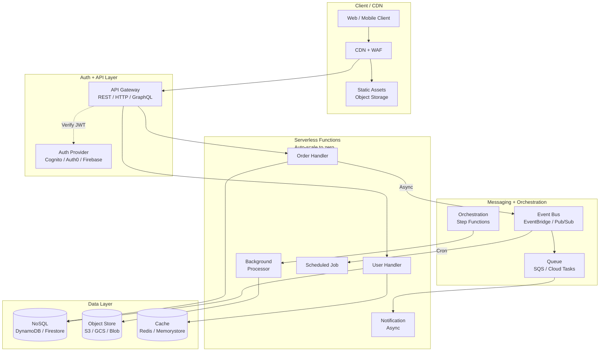

# Serverless Architecture on AWS

> Architecture diagram สำหรับ Serverless application บน AWS — ครอบคลุม API Gateway, Lambda, DynamoDB, S3, EventBridge, SQS และ Cognito ตาม AWS Serverless Application Lens

## 📋 ใช้ตอนไหน

- ✅ Event-driven workload ที่ traffic ไม่สม่ำเสมอ (burst traffic)
- ✅ ต้องการ scale-to-zero และลด operational overhead
- ✅ MVP หรือ product ที่ยังไม่รู้ load จริง
- ✅ Background job, webhook handler, data pipeline
- ❌ **ไม่เหมาะกับ**: workload ที่ต้องการ execution > 15 นาที, WebSocket realtime สูง, legacy app ที่ต้องการ filesystem

---

## 🎨 Pragma Style Diagram (Draw.io XML)

```xml
<mxfile host="app.diagrams.net" version="24.0.0">
  <diagram name="Serverless on AWS — Pragma Style">
    <mxGraphModel dx="1500" dy="950" grid="0" background="#1a1a2e">
      <root>
        <mxCell id="0"/><mxCell id="1" parent="0"/>

        <mxCell id="title" value="Serverless Architecture on AWS" style="text;html=1;strokeColor=none;fillColor=none;align=center;fontSize=22;fontStyle=1;fontColor=#ffffff;" vertex="1" parent="1">
          <mxGeometry x="80" y="14" width="960" height="40" as="geometry"/>
        </mxCell>

        <mxCell id="L0" value="CLIENT / CDN" style="swimlane;startSize=30;fillColor=#1a2a4a;strokeColor=#4a90d9;fontColor=#ffffff;fontSize=13;fontStyle=1;html=1;" vertex="1" parent="1">
          <mxGeometry x="40" y="64" width="1100" height="110" as="geometry"/>
        </mxCell>
        <mxCell id="browser" value="Web / Mobile&#xa;Client" style="rounded=1;whiteSpace=wrap;html=1;fillColor=#1a2a4a;strokeColor=#4a90d9;fontColor=#ffffff;fontSize=11;" vertex="1" parent="L0">
          <mxGeometry x="80" y="30" width="130" height="50" as="geometry"/>
        </mxCell>
        <mxCell id="cdn" value="CDN&#xa;(CloudFront + WAF)" style="rounded=1;whiteSpace=wrap;html=1;fillColor=#1a2a4a;strokeColor=#4a90d9;fontColor=#ffffff;fontSize=11;" vertex="1" parent="L0">
          <mxGeometry x="320" y="30" width="160" height="50" as="geometry"/>
        </mxCell>
        <mxCell id="s3_static" value="Static Assets&#xa;(S3 + Hosting)" style="rounded=1;whiteSpace=wrap;html=1;fillColor=#0d1f2b;strokeColor=#0288d1;fontColor=#ffffff;fontSize=11;" vertex="1" parent="L0">
          <mxGeometry x="600" y="30" width="160" height="50" as="geometry"/>
        </mxCell>

        <mxCell id="L1" value="AUTH + API LAYER" style="swimlane;startSize=30;fillColor=#2d1a0e;strokeColor=#ff9800;fontColor=#ffffff;fontSize=13;fontStyle=1;html=1;" vertex="1" parent="1">
          <mxGeometry x="40" y="204" width="1100" height="130" as="geometry"/>
        </mxCell>
        <mxCell id="auth" value="Auth Provider&#xa;(Cognito / Auth0 / Firebase)" style="rounded=1;whiteSpace=wrap;html=1;fillColor=#2d1a0e;strokeColor=#ff9800;fontColor=#ffffff;fontSize=11;" vertex="1" parent="L1">
          <mxGeometry x="80" y="35" width="200" height="60" as="geometry"/>
        </mxCell>
        <mxCell id="apigw" value="API Gateway&#xa;(REST / HTTP / GraphQL)" style="rounded=1;whiteSpace=wrap;html=1;fillColor=#2d1a0e;strokeColor=#ff9800;fontColor=#ffffff;fontSize=11;" vertex="1" parent="L1">
          <mxGeometry x="420" y="35" width="200" height="60" as="geometry"/>
        </mxCell>
        <mxCell id="waf" value="WAF&#xa;(Rate Limit / IP Block)" style="rounded=1;whiteSpace=wrap;html=1;fillColor=#3a1010;strokeColor=#e53935;fontColor=#ffffff;fontSize=11;" vertex="1" parent="L1">
          <mxGeometry x="760" y="35" width="200" height="60" as="geometry"/>
        </mxCell>

        <mxCell id="L2" value="COMPUTE — Serverless Functions (Lambda / Cloud Functions / Azure Functions)" style="swimlane;startSize=30;fillColor=#0d2b1a;strokeColor=#2e7d32;fontColor=#ffffff;fontSize=13;fontStyle=1;html=1;" vertex="1" parent="1">
          <mxGeometry x="40" y="364" width="1100" height="170" as="geometry"/>
        </mxCell>
        <mxCell id="fn_user" value="User Handler&#xa;GET/POST /users" style="rounded=1;whiteSpace=wrap;html=1;fillColor=#0d2b1a;strokeColor=#66bb6a;fontColor=#ffffff;fontSize=11;" vertex="1" parent="L2">
          <mxGeometry x="50" y="45" width="150" height="60" as="geometry"/>
        </mxCell>
        <mxCell id="fn_order" value="Order Handler&#xa;POST /orders" style="rounded=1;whiteSpace=wrap;html=1;fillColor=#0d2b1a;strokeColor=#66bb6a;fontColor=#ffffff;fontSize=11;" vertex="1" parent="L2">
          <mxGeometry x="240" y="45" width="150" height="60" as="geometry"/>
        </mxCell>
        <mxCell id="fn_notify" value="Notification&#xa;Handler (Async)" style="rounded=1;whiteSpace=wrap;html=1;fillColor=#0d2b1a;strokeColor=#66bb6a;fontColor=#ffffff;fontSize=11;" vertex="1" parent="L2">
          <mxGeometry x="430" y="45" width="150" height="60" as="geometry"/>
        </mxCell>
        <mxCell id="fn_process" value="Background&#xa;Processor" style="rounded=1;whiteSpace=wrap;html=1;fillColor=#0d2b1a;strokeColor=#66bb6a;fontColor=#ffffff;fontSize=11;" vertex="1" parent="L2">
          <mxGeometry x="620" y="45" width="150" height="60" as="geometry"/>
        </mxCell>
        <mxCell id="fn_scheduler" value="Scheduled Job&#xa;(Cron / EventBridge)" style="rounded=1;whiteSpace=wrap;html=1;fillColor=#0d2b1a;strokeColor=#66bb6a;fontColor=#ffffff;fontSize=11;" vertex="1" parent="L2">
          <mxGeometry x="810" y="45" width="160" height="60" as="geometry"/>
        </mxCell>
        <mxCell id="fn_note" value="⚡ Auto-scale to zero  |  Max execution 15 min  |  Stateless  |  Cold start ~100–500ms (provisioned concurrency ลดได้)" style="text;html=1;strokeColor=none;fillColor=none;align=center;fontSize=10;fontStyle=2;fontColor=#66bb6a;" vertex="1" parent="L2">
          <mxGeometry x="50" y="128" width="980" height="20" as="geometry"/>
        </mxCell>

        <mxCell id="L3" value="MESSAGING + ORCHESTRATION" style="swimlane;startSize=30;fillColor=#1a1030;strokeColor=#7c4dff;fontColor=#ffffff;fontSize=13;fontStyle=1;html=1;" vertex="1" parent="1">
          <mxGeometry x="40" y="564" width="1100" height="120" as="geometry"/>
        </mxCell>
        <mxCell id="eventbridge" value="Event Bus&#xa;(EventBridge / Pub/Sub)" style="rounded=1;whiteSpace=wrap;html=1;fillColor=#1a1030;strokeColor=#7c4dff;fontColor=#ffffff;fontSize=11;" vertex="1" parent="L3">
          <mxGeometry x="80" y="30" width="190" height="60" as="geometry"/>
        </mxCell>
        <mxCell id="sqs" value="Queue&#xa;(SQS / Cloud Tasks)" style="rounded=1;whiteSpace=wrap;html=1;fillColor=#1a1030;strokeColor=#7c4dff;fontColor=#ffffff;fontSize=11;" vertex="1" parent="L3">
          <mxGeometry x="370" y="30" width="190" height="60" as="geometry"/>
        </mxCell>
        <mxCell id="stepfn" value="Orchestration&#xa;(Step Functions / Workflows)" style="rounded=1;whiteSpace=wrap;html=1;fillColor=#1a1030;strokeColor=#7c4dff;fontColor=#ffffff;fontSize=11;" vertex="1" parent="L3">
          <mxGeometry x="660" y="30" width="190" height="60" as="geometry"/>
        </mxCell>

        <mxCell id="L4" value="DATA LAYER" style="swimlane;startSize=30;fillColor=#0d1f2b;strokeColor=#0288d1;fontColor=#ffffff;fontSize=13;fontStyle=1;html=1;" vertex="1" parent="1">
          <mxGeometry x="40" y="714" width="1100" height="140" as="geometry"/>
        </mxCell>
        <mxCell id="nosql" value="NoSQL&#xa;(DynamoDB / Firestore&#xa;/ Cosmos DB)" style="shape=cylinder3;whiteSpace=wrap;html=1;fillColor=#0d1f2b;strokeColor=#0288d1;fontColor=#ffffff;fontSize=10;verticalLabelPosition=bottom;verticalAlign=top;" vertex="1" parent="L4">
          <mxGeometry x="80" y="20" width="80" height="80" as="geometry"/>
        </mxCell>
        <mxCell id="s3_data" value="Object Store&#xa;(S3 / GCS&#xa;/ Blob Storage)" style="shape=cylinder3;whiteSpace=wrap;html=1;fillColor=#0d1f2b;strokeColor=#0288d1;fontColor=#ffffff;fontSize=10;verticalLabelPosition=bottom;verticalAlign=top;" vertex="1" parent="L4">
          <mxGeometry x="290" y="20" width="80" height="80" as="geometry"/>
        </mxCell>
        <mxCell id="cache" value="Cache&#xa;(ElastiCache /&#xa;Memorystore)" style="shape=cylinder3;whiteSpace=wrap;html=1;fillColor=#3a1010;strokeColor=#e53935;fontColor=#ffffff;fontSize=10;verticalLabelPosition=bottom;verticalAlign=top;" vertex="1" parent="L4">
          <mxGeometry x="500" y="20" width="80" height="80" as="geometry"/>
        </mxCell>
        <mxCell id="rds_proxy" value="RDS / SQL&#xa;(via RDS Proxy&#xa;สำหรับ Lambda)" style="shape=cylinder3;whiteSpace=wrap;html=1;fillColor=#0d1f2b;strokeColor=#0288d1;fontColor=#ffffff;fontSize=10;verticalLabelPosition=bottom;verticalAlign=top;" vertex="1" parent="L4">
          <mxGeometry x="710" y="20" width="80" height="80" as="geometry"/>
        </mxCell>
        <mxCell id="secret" value="Secrets&#xa;(Secrets Manager&#xa;/ Vault)" style="shape=cylinder3;whiteSpace=wrap;html=1;fillColor=#1a1030;strokeColor=#7c4dff;fontColor=#ffffff;fontSize=10;verticalLabelPosition=bottom;verticalAlign=top;" vertex="1" parent="L4">
          <mxGeometry x="920" y="20" width="80" height="80" as="geometry"/>
        </mxCell>

        <mxCell id="e1" value="HTTPS" style="edgeStyle=orthogonalEdgeStyle;rounded=1;html=1;strokeColor=#4a90d9;strokeWidth=2;fontColor=#4a90d9;fontSize=9;" edge="1" parent="1" source="browser" target="cdn"><mxGeometry relative="1" as="geometry"/></mxCell>
        <mxCell id="e2" style="edgeStyle=orthogonalEdgeStyle;rounded=1;html=1;strokeColor=#4a90d9;strokeWidth=2;" edge="1" parent="1" source="cdn" target="s3_static"><mxGeometry relative="1" as="geometry"/></mxCell>
        <mxCell id="e3" value="JWT" style="edgeStyle=orthogonalEdgeStyle;rounded=1;html=1;strokeColor=#ff9800;strokeWidth=2;fontColor=#ff9800;fontSize=9;" edge="1" parent="1" source="cdn" target="apigw"><mxGeometry relative="1" as="geometry"/></mxCell>
        <mxCell id="e4" value="Verify" style="edgeStyle=orthogonalEdgeStyle;rounded=1;html=1;strokeColor=#ff9800;strokeWidth=2;dashed=1;fontColor=#ff9800;fontSize=9;" edge="1" parent="1" source="apigw" target="auth"><mxGeometry relative="1" as="geometry"/></mxCell>
        <mxCell id="e5" style="edgeStyle=orthogonalEdgeStyle;rounded=1;html=1;strokeColor=#ff9800;strokeWidth=2;" edge="1" parent="1" source="apigw" target="fn_user"><mxGeometry relative="1" as="geometry"/></mxCell>
        <mxCell id="e6" style="edgeStyle=orthogonalEdgeStyle;rounded=1;html=1;strokeColor=#ff9800;strokeWidth=2;" edge="1" parent="1" source="apigw" target="fn_order"><mxGeometry relative="1" as="geometry"/></mxCell>
        <mxCell id="e7" value="Async" style="edgeStyle=orthogonalEdgeStyle;rounded=1;html=1;strokeColor=#7c4dff;strokeWidth=2;fontColor=#7c4dff;fontSize=9;" edge="1" parent="1" source="fn_order" target="eventbridge"><mxGeometry relative="1" as="geometry"/></mxCell>
        <mxCell id="e8" style="edgeStyle=orthogonalEdgeStyle;rounded=1;html=1;strokeColor=#7c4dff;strokeWidth=2;" edge="1" parent="1" source="eventbridge" target="sqs"><mxGeometry relative="1" as="geometry"/></mxCell>
        <mxCell id="e9" style="edgeStyle=orthogonalEdgeStyle;rounded=1;html=1;strokeColor=#7c4dff;strokeWidth=2;" edge="1" parent="1" source="sqs" target="fn_notify"><mxGeometry relative="1" as="geometry"/></mxCell>
        <mxCell id="e10" style="edgeStyle=orthogonalEdgeStyle;rounded=1;html=1;strokeColor=#7c4dff;strokeWidth=2;" edge="1" parent="1" source="stepfn" target="fn_process"><mxGeometry relative="1" as="geometry"/></mxCell>
        <mxCell id="e11" style="edgeStyle=orthogonalEdgeStyle;rounded=1;html=1;strokeColor=#66bb6a;strokeWidth=2;" edge="1" parent="1" source="fn_user" target="nosql"><mxGeometry relative="1" as="geometry"/></mxCell>
        <mxCell id="e12" style="edgeStyle=orthogonalEdgeStyle;rounded=1;html=1;strokeColor=#66bb6a;strokeWidth=2;" edge="1" parent="1" source="fn_order" target="nosql"><mxGeometry relative="1" as="geometry"/></mxCell>
        <mxCell id="e13" style="edgeStyle=orthogonalEdgeStyle;rounded=1;html=1;strokeColor=#66bb6a;strokeWidth=2;" edge="1" parent="1" source="fn_process" target="s3_data"><mxGeometry relative="1" as="geometry"/></mxCell>
        <mxCell id="e14" style="edgeStyle=orthogonalEdgeStyle;rounded=1;html=1;strokeColor=#e53935;strokeWidth=2;" edge="1" parent="1" source="fn_user" target="cache"><mxGeometry relative="1" as="geometry"/></mxCell>
        <mxCell id="e15" value="Cron" style="edgeStyle=orthogonalEdgeStyle;rounded=1;html=1;strokeColor=#66bb6a;strokeWidth=2;fontColor=#66bb6a;fontSize=9;" edge="1" parent="1" source="eventbridge" target="fn_scheduler"><mxGeometry relative="1" as="geometry"/></mxCell>
      </root>
    </mxGraphModel>
  </diagram>
</mxfile>
```

---

## 🌊 Mermaid Template



---

## 💡 Prompt ตัวอย่าง

### แบบ A: E-commerce Serverless (AWS)
```
ใช้ template serverless-aws.md แบบ Pragma Style
ปรับสำหรับ E-commerce:
- Functions: Product Browse, Cart, Checkout, Payment Webhook, Order Status
- Auth: Cognito User Pool
- DB: DynamoDB (orders/cart), Aurora Serverless v2 (product catalog)
- Queue: SQS FIFO สำหรับ order processing
- Scheduler: EventBridge Cron สำหรับ daily inventory sync
```

### แบบ B: Webhook Processor (Cloud-agnostic)
```
ใช้ template serverless-aws.md แบบ Pragma Style
ปรับเป็น Webhook Processor ทั่วไป:
- รับ webhook จาก third-party (Stripe, Line, etc.)
- Queue รับงาน → Function process → เก็บ NoSQL
- Dead Letter Queue สำหรับ retry
- Alerting เมื่อ error rate สูง
```

### แบบ C: Data Pipeline Serverless
```
ใช้ template serverless-aws.md แบบ Pragma Style
ปรับเป็น Data Pipeline:
- Trigger: S3 PutObject event
- ETL Function: อ่าน CSV → transform → เขียน Parquet
- Orchestration: Step Functions ควบคุม multi-step ETL
- Output: Data Lake (S3) + ส่ง notification เมื่อเสร็จ
```

---

## 🔧 Parameters ที่ปรับได้

| Parameter | AWS | GCP | Azure |
|---|---|---|---|
| Functions | Lambda | Cloud Functions | Azure Functions |
| API Gateway | API Gateway (HTTP/REST) | Cloud Endpoints / API GW | API Management |
| Auth | Cognito | Firebase Auth / IAP | Entra ID B2C |
| Event Bus | EventBridge | Pub/Sub | Event Grid |
| Queue | SQS | Cloud Tasks | Service Bus |
| Orchestration | Step Functions | Workflows | Logic Apps / Durable Functions |
| NoSQL | DynamoDB | Firestore | Cosmos DB |
| Object Store | S3 | GCS | Blob Storage |
| Cache | ElastiCache Redis | Memorystore | Azure Cache for Redis |
| Secrets | Secrets Manager | Secret Manager | Key Vault |

---

## 📌 Notes

- **Cold Start**: ลดด้วย Provisioned Concurrency (AWS) หรือ minimum instances — เหมาะสำหรับ latency-sensitive endpoints
- **Connection pooling**: Lambda ต่อ RDS โดยตรงทำให้ connection หมด — ใช้ **RDS Proxy** หรือ **Aurora Serverless** แทน
- **Stateless**: ห้ามเก็บ state ใน function — ใช้ DB/Cache/S3 ทั้งหมด
- **Dead Letter Queue**: ทุก Queue-triggered function ควรมี DLQ สำหรับ message ที่ fail ซ้ำ
- **Cost model**: จ่ายตาม invocation + duration — เหมาะกับ traffic ไม่สม่ำเสมอ, ไม่เหมาะถ้า always-on + high RPS
- **Timeout**: Lambda max 15 นาที — งานที่นานกว่าใช้ Step Functions + chia task ย่อย

### Related Templates

- Microservices on AWS → `microservices-aws.md`
- Azure Landing Zone → `azure-landing-zone.md`
- CI/CD Pipeline → `cicd-pipeline.md`
