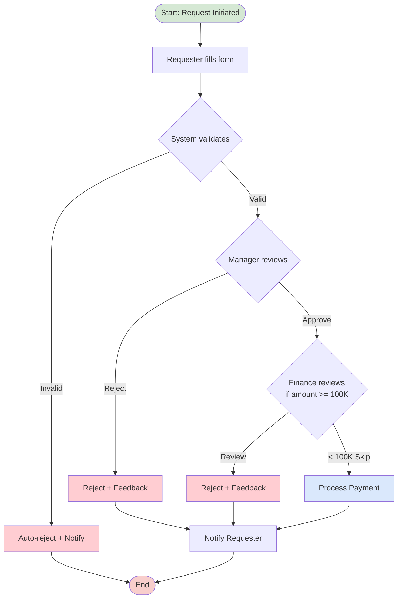

# Approval Workflow (Swimlane)

> Process flow แบบ swimlane สำหรับ approval workflow — ใช้ได้กับการอนุมัติจัดซื้อ, leave request, expense claim ฯลฯ

## 📋 ใช้ตอนไหน

- ✅ แสดง workflow ที่มีหลาย actor
- ✅ มี decision point (อนุมัติ/ปฏิเสธ)
- ✅ ใช้ในการทำ SOP / Process Documentation
- ❌ **ไม่เหมาะกับ**: technical flow (ใช้ sequence diagram แทน)

---

## 🌊 Mermaid Template



---

## 📝 Draw.io XML (Swimlane)

```xml
<mxfile host="app.diagrams.net" modified="2026-04-24T00:00:00.000Z" version="24.0.0">
  <diagram name="Approval Workflow" id="approval-wf">
    <mxGraphModel dx="1600" dy="800" grid="1" gridSize="10" guides="1" tooltips="1" connect="1" arrows="1" fold="1" page="1" pageScale="1" pageWidth="1800" pageHeight="700">
      <root>
        <mxCell id="0" />
        <mxCell id="1" parent="0" />
        <mxCell id="lane1" value="Requester" style="swimlane;horizontal=0;startSize=110;fillColor=#f5f5f5;html=1;" vertex="1" parent="1">
          <mxGeometry x="0" y="0" width="1800" height="150" as="geometry" />
        </mxCell>
        <mxCell id="start" value="Start" style="ellipse;whiteSpace=wrap;html=1;fillColor=#d5e8d4;strokeColor=#82b366;" vertex="1" parent="lane1">
          <mxGeometry x="140" y="45" width="80" height="60" as="geometry" />
        </mxCell>
        <mxCell id="fill_form" value="Fill Request Form" style="rounded=1;whiteSpace=wrap;html=1;" vertex="1" parent="lane1">
          <mxGeometry x="260" y="45" width="140" height="60" as="geometry" />
        </mxCell>
        <mxCell id="notify_req" value="Receive&#10;Notification" style="rounded=1;whiteSpace=wrap;html=1;" vertex="1" parent="lane1">
          <mxGeometry x="1540" y="45" width="140" height="60" as="geometry" />
        </mxCell>
        <mxCell id="lane2" value="System" style="swimlane;horizontal=0;startSize=110;fillColor=#e8f4f8;html=1;" vertex="1" parent="1">
          <mxGeometry x="0" y="150" width="1800" height="150" as="geometry" />
        </mxCell>
        <mxCell id="validate" value="Validate Form" style="rhombus;whiteSpace=wrap;html=1;" vertex="1" parent="lane2">
          <mxGeometry x="440" y="35" width="140" height="80" as="geometry" />
        </mxCell>
        <mxCell id="auto_reject" value="Auto-reject&#10;+ Notify" style="rounded=1;whiteSpace=wrap;html=1;fillColor=#ffcdd2;strokeColor=#b85450;" vertex="1" parent="lane2">
          <mxGeometry x="620" y="45" width="140" height="60" as="geometry" />
        </mxCell>
        <mxCell id="process" value="Process Payment" style="rounded=1;whiteSpace=wrap;html=1;fillColor=#dae8fc;strokeColor=#6c8ebf;" vertex="1" parent="lane2">
          <mxGeometry x="1340" y="45" width="140" height="60" as="geometry" />
        </mxCell>
        <mxCell id="lane3" value="Manager" style="swimlane;horizontal=0;startSize=110;fillColor=#fff0e6;html=1;" vertex="1" parent="1">
          <mxGeometry x="0" y="300" width="1800" height="150" as="geometry" />
        </mxCell>
        <mxCell id="mgr_review" value="Review Request" style="rhombus;whiteSpace=wrap;html=1;" vertex="1" parent="lane3">
          <mxGeometry x="800" y="35" width="140" height="80" as="geometry" />
        </mxCell>
        <mxCell id="mgr_reject" value="Reject&#10;+ Feedback" style="rounded=1;whiteSpace=wrap;html=1;fillColor=#ffcdd2;strokeColor=#b85450;" vertex="1" parent="lane3">
          <mxGeometry x="1000" y="45" width="140" height="60" as="geometry" />
        </mxCell>
        <mxCell id="lane4" value="Finance" style="swimlane;horizontal=0;startSize=110;fillColor=#e8f5e9;html=1;" vertex="1" parent="1">
          <mxGeometry x="0" y="450" width="1800" height="150" as="geometry" />
        </mxCell>
        <mxCell id="fin_check" value="Amount&#10;>= 100K?" style="rhombus;whiteSpace=wrap;html=1;" vertex="1" parent="lane4">
          <mxGeometry x="1160" y="35" width="140" height="80" as="geometry" />
        </mxCell>
        <mxCell id="e1" style="edgeStyle=orthogonalEdgeStyle;rounded=1;html=1;" edge="1" parent="1" source="start" target="fill_form">
          <mxGeometry relative="1" as="geometry" />
        </mxCell>
        <mxCell id="e2" style="edgeStyle=orthogonalEdgeStyle;rounded=1;html=1;" edge="1" parent="1" source="fill_form" target="validate">
          <mxGeometry relative="1" as="geometry" />
        </mxCell>
        <mxCell id="e3" value="Invalid" style="edgeStyle=orthogonalEdgeStyle;rounded=1;html=1;" edge="1" parent="1" source="validate" target="auto_reject">
          <mxGeometry relative="1" as="geometry" />
        </mxCell>
        <mxCell id="e4" value="Valid" style="edgeStyle=orthogonalEdgeStyle;rounded=1;html=1;" edge="1" parent="1" source="validate" target="mgr_review">
          <mxGeometry relative="1" as="geometry" />
        </mxCell>
        <mxCell id="e5" value="Reject" style="edgeStyle=orthogonalEdgeStyle;rounded=1;html=1;" edge="1" parent="1" source="mgr_review" target="mgr_reject">
          <mxGeometry relative="1" as="geometry" />
        </mxCell>
        <mxCell id="e6" value="Approve" style="edgeStyle=orthogonalEdgeStyle;rounded=1;html=1;" edge="1" parent="1" source="mgr_review" target="fin_check">
          <mxGeometry relative="1" as="geometry" />
        </mxCell>
        <mxCell id="e7" value="OK" style="edgeStyle=orthogonalEdgeStyle;rounded=1;html=1;" edge="1" parent="1" source="fin_check" target="process">
          <mxGeometry relative="1" as="geometry" />
        </mxCell>
        <mxCell id="e8" style="edgeStyle=orthogonalEdgeStyle;rounded=1;html=1;" edge="1" parent="1" source="auto_reject" target="notify_req">
          <mxGeometry relative="1" as="geometry" />
        </mxCell>
        <mxCell id="e9" style="edgeStyle=orthogonalEdgeStyle;rounded=1;html=1;" edge="1" parent="1" source="mgr_reject" target="notify_req">
          <mxGeometry relative="1" as="geometry" />
        </mxCell>
        <mxCell id="e10" style="edgeStyle=orthogonalEdgeStyle;rounded=1;html=1;" edge="1" parent="1" source="process" target="notify_req">
          <mxGeometry relative="1" as="geometry" />
        </mxCell>
      </root>
    </mxGraphModel>
  </diagram>
</mxfile>
```

---

## 💡 Prompt ตัวอย่าง

```
ใช้ template approval-workflow.md
ปรับเป็น [ชื่อ workflow เช่น "Leave Request"]

Actors:
- [Employee]
- [Team Lead]
- [HR]
- [Manager]

Rules:
- Leave <= 3 วัน: แค่ Team Lead อนุมัติ
- Leave > 3 วัน: ต้อง Manager อนุมัติด้วย
- HR check quota ก่อน
```

---

## 🔧 Parameters

| Parameter | ปรับได้ |
|---|---|
| Actors (lanes) | เพิ่ม/ลดได้ เช่น +Legal, +Security |
| Decision points | เพิ่ม condition logic |
| Reject paths | กลับไป resubmit ได้ |
| SLA timing | เพิ่ม timer ที่แต่ละ step |
