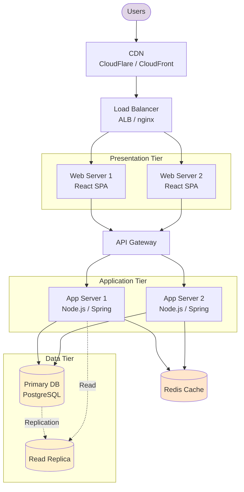

# 3-Tier Web Application Architecture

> Architecture มาตรฐานสำหรับ web application — Presentation / Application / Data

## 📋 ใช้ตอนไหน

- ✅ Web/mobile application ทั่วไป
- ✅ Traditional enterprise app
- ✅ ระบบที่มี UI + business logic + database แยกชั้นชัดเจน
- ❌ **ไม่เหมาะกับ**: Microservices (ใช้ microservices-basic.md แทน), serverless

---

## 🌊 Mermaid Template



---

## 📝 Draw.io XML Template

```xml
<mxfile host="app.diagrams.net" modified="2026-04-24T00:00:00.000Z" version="24.0.0">
  <diagram name="3-Tier Web App" id="three-tier-web">
    <mxGraphModel dx="1200" dy="900" grid="1" gridSize="10" guides="1" tooltips="1" connect="1" arrows="1" fold="1" page="1" pageScale="1" pageWidth="1200" pageHeight="1000">
      <root>
        <mxCell id="0" />
        <mxCell id="1" parent="0" />
        <mxCell id="usr" value="Users" style="shape=umlActor;verticalLabelPosition=bottom;labelBackgroundColor=#ffffff;verticalAlign=top;html=1;" vertex="1" parent="1">
          <mxGeometry x="560" y="40" width="40" height="60" as="geometry" />
        </mxCell>
        <mxCell id="cdn" value="CDN&#10;(CloudFront)" style="rounded=1;whiteSpace=wrap;html=1;fillColor=#e1d5e7;strokeColor=#9673a6;" vertex="1" parent="1">
          <mxGeometry x="510" y="140" width="140" height="60" as="geometry" />
        </mxCell>
        <mxCell id="lb" value="Load Balancer&#10;(ALB)" style="rounded=1;whiteSpace=wrap;html=1;fillColor=#dae8fc;strokeColor=#6c8ebf;" vertex="1" parent="1">
          <mxGeometry x="510" y="240" width="140" height="60" as="geometry" />
        </mxCell>
        <mxCell id="pres_tier" value="Presentation Tier" style="rounded=0;whiteSpace=wrap;html=1;verticalAlign=top;fillColor=#f5f5f5;strokeColor=#666666;fontStyle=1;" vertex="1" parent="1">
          <mxGeometry x="320" y="340" width="520" height="120" as="geometry" />
        </mxCell>
        <mxCell id="web1" value="Web Server 1&#10;React SPA + nginx" style="rounded=1;whiteSpace=wrap;html=1;fillColor=#d5e8d4;strokeColor=#82b366;" vertex="1" parent="pres_tier">
          <mxGeometry x="40" y="40" width="180" height="60" as="geometry" />
        </mxCell>
        <mxCell id="web2" value="Web Server 2&#10;React SPA + nginx" style="rounded=1;whiteSpace=wrap;html=1;fillColor=#d5e8d4;strokeColor=#82b366;" vertex="1" parent="pres_tier">
          <mxGeometry x="300" y="40" width="180" height="60" as="geometry" />
        </mxCell>
        <mxCell id="apigw" value="API Gateway" style="rounded=1;whiteSpace=wrap;html=1;fillColor=#dae8fc;strokeColor=#6c8ebf;" vertex="1" parent="1">
          <mxGeometry x="510" y="500" width="140" height="60" as="geometry" />
        </mxCell>
        <mxCell id="app_tier" value="Application Tier" style="rounded=0;whiteSpace=wrap;html=1;verticalAlign=top;fillColor=#f5f5f5;strokeColor=#666666;fontStyle=1;" vertex="1" parent="1">
          <mxGeometry x="320" y="600" width="520" height="120" as="geometry" />
        </mxCell>
        <mxCell id="app1" value="App Server 1&#10;Node.js / Spring" style="rounded=1;whiteSpace=wrap;html=1;fillColor=#d5e8d4;strokeColor=#82b366;" vertex="1" parent="app_tier">
          <mxGeometry x="40" y="40" width="180" height="60" as="geometry" />
        </mxCell>
        <mxCell id="app2" value="App Server 2&#10;Node.js / Spring" style="rounded=1;whiteSpace=wrap;html=1;fillColor=#d5e8d4;strokeColor=#82b366;" vertex="1" parent="app_tier">
          <mxGeometry x="300" y="40" width="180" height="60" as="geometry" />
        </mxCell>
        <mxCell id="cache" value="Redis Cache" style="shape=cylinder3;whiteSpace=wrap;html=1;fillColor=#ffe6cc;strokeColor=#d79b00;" vertex="1" parent="1">
          <mxGeometry x="880" y="620" width="120" height="80" as="geometry" />
        </mxCell>
        <mxCell id="data_tier" value="Data Tier" style="rounded=0;whiteSpace=wrap;html=1;verticalAlign=top;fillColor=#f5f5f5;strokeColor=#666666;fontStyle=1;" vertex="1" parent="1">
          <mxGeometry x="320" y="760" width="520" height="140" as="geometry" />
        </mxCell>
        <mxCell id="db_pri" value="Primary DB&#10;PostgreSQL" style="shape=cylinder3;whiteSpace=wrap;html=1;fillColor=#fff2cc;strokeColor=#d6b656;" vertex="1" parent="data_tier">
          <mxGeometry x="40" y="40" width="180" height="80" as="geometry" />
        </mxCell>
        <mxCell id="db_rep" value="Read Replica&#10;PostgreSQL" style="shape=cylinder3;whiteSpace=wrap;html=1;fillColor=#fff2cc;strokeColor=#d6b656;" vertex="1" parent="data_tier">
          <mxGeometry x="300" y="40" width="180" height="80" as="geometry" />
        </mxCell>
        <mxCell id="e_usr_cdn" style="edgeStyle=orthogonalEdgeStyle;rounded=1;html=1;" edge="1" parent="1" source="usr" target="cdn">
          <mxGeometry relative="1" as="geometry" />
        </mxCell>
        <mxCell id="e_cdn_lb" style="edgeStyle=orthogonalEdgeStyle;rounded=1;html=1;" edge="1" parent="1" source="cdn" target="lb">
          <mxGeometry relative="1" as="geometry" />
        </mxCell>
        <mxCell id="e_lb_web1" style="edgeStyle=orthogonalEdgeStyle;rounded=1;html=1;" edge="1" parent="1" source="lb" target="web1">
          <mxGeometry relative="1" as="geometry" />
        </mxCell>
        <mxCell id="e_lb_web2" style="edgeStyle=orthogonalEdgeStyle;rounded=1;html=1;" edge="1" parent="1" source="lb" target="web2">
          <mxGeometry relative="1" as="geometry" />
        </mxCell>
        <mxCell id="e_web1_apigw" style="edgeStyle=orthogonalEdgeStyle;rounded=1;html=1;" edge="1" parent="1" source="web1" target="apigw">
          <mxGeometry relative="1" as="geometry" />
        </mxCell>
        <mxCell id="e_web2_apigw" style="edgeStyle=orthogonalEdgeStyle;rounded=1;html=1;" edge="1" parent="1" source="web2" target="apigw">
          <mxGeometry relative="1" as="geometry" />
        </mxCell>
        <mxCell id="e_apigw_app1" style="edgeStyle=orthogonalEdgeStyle;rounded=1;html=1;" edge="1" parent="1" source="apigw" target="app1">
          <mxGeometry relative="1" as="geometry" />
        </mxCell>
        <mxCell id="e_apigw_app2" style="edgeStyle=orthogonalEdgeStyle;rounded=1;html=1;" edge="1" parent="1" source="apigw" target="app2">
          <mxGeometry relative="1" as="geometry" />
        </mxCell>
        <mxCell id="e_app_cache" style="edgeStyle=orthogonalEdgeStyle;rounded=1;html=1;" edge="1" parent="1" source="app2" target="cache">
          <mxGeometry relative="1" as="geometry" />
        </mxCell>
        <mxCell id="e_app1_db" style="edgeStyle=orthogonalEdgeStyle;rounded=1;html=1;" edge="1" parent="1" source="app1" target="db_pri">
          <mxGeometry relative="1" as="geometry" />
        </mxCell>
        <mxCell id="e_app2_db" style="edgeStyle=orthogonalEdgeStyle;rounded=1;html=1;" edge="1" parent="1" source="app2" target="db_pri">
          <mxGeometry relative="1" as="geometry" />
        </mxCell>
        <mxCell id="e_db_rep" value="Replication" style="edgeStyle=orthogonalEdgeStyle;rounded=1;html=1;dashed=1;" edge="1" parent="1" source="db_pri" target="db_rep">
          <mxGeometry relative="1" as="geometry" />
        </mxCell>
      </root>
    </mxGraphModel>
  </diagram>
</mxfile>
```

---

## 💡 Prompt ตัวอย่าง

```
ใช้ template 3-tier-web-app.md
ปรับเป็น architecture ของระบบ [ชื่อระบบ]:
- Frontend: [React/Angular/Vue]
- Backend: [Node.js/Java/Python]
- Database: [PostgreSQL/MySQL/MongoDB]
- Deploy ที่: [AWS/Azure/On-premise]
- Expected load: [req/sec]
- HA required: [Yes/No]
```

---

## 📌 Notes

- ถ้าลูกค้าใช้ AWS → swap ด้วย AWS icons (ALB, EC2, RDS, ElastiCache)
- ถ้าลูกค้าใช้ Azure → App Service, Azure SQL, Redis Cache
- สำหรับ deploy จริง ควรเพิ่ม: monitoring, logging, backup strategy
